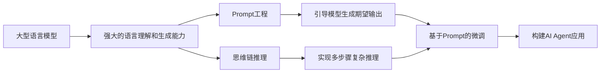

# 【大模型应用开发 动手做AI Agent】基于大模型的推理能力构筑AI应用

## 1. 背景介绍

近年来,随着人工智能技术的快速发展,大型语言模型(Large Language Models, LLMs)在自然语言处理领域取得了巨大的突破。这些模型通过在海量文本数据上进行预训练,能够学习到丰富的语言知识和常识,具备强大的语言理解和生成能力。基于大模型的推理能力,我们可以构建各种智能化的AI应用,例如智能客服、虚拟助手、知识问答系统等。本文将深入探讨如何利用大模型的推理能力,动手开发实用的AI Agent应用。

### 1.1 大模型的发展历程
#### 1.1.1 早期的神经语言模型
#### 1.1.2 Transformer架构的提出  
#### 1.1.3 预训练语言模型的兴起

### 1.2 大模型的关键特点
#### 1.2.1 海量参数与计算规模
#### 1.2.2 Zero-shot/Few-shot学习能力
#### 1.2.3 多任务处理与迁移学习

### 1.3 大模型在AI应用中的优势
#### 1.3.1 降低应用开发门槛
#### 1.3.2 提升系统智能化水平
#### 1.3.3 加速AI产品落地进程

## 2. 核心概念与联系

在利用大模型构建AI Agent应用时,需要理解一些核心概念及其之间的联系。

### 2.1 Prompt工程
Prompt工程是指如何设计合适的输入文本(Prompt),以引导大模型生成我们期望的输出。通过精心设计的Prompt,可以控制模型的行为,实现特定的功能。

### 2.2 思维链(Chain-of-Thought)推理
思维链推理是一种利用大模型进行多步骤推理的技术。通过将复杂任务分解为一系列相关的子问题,引导模型逐步推理,可以显著提升模型在复杂任务上的表现。

### 2.3 基于Prompt的微调
基于Prompt的微调是指在下游任务中,将任务输入转化为Prompt的形式,然后在此基础上对预训练模型进行微调。相比传统的微调方法,这种方式可以更好地利用预训练模型的知识,实现更优的效果。

### 2.4 概念之间的关系
下图展示了以上核心概念之间的关系:



## 3. 核心算法原理与具体操作步骤

### 3.1 Prompt设计原则与技巧
#### 3.1.1 明确任务目标
#### 3.1.2 提供必要的背景知识
#### 3.1.3 设计引导性问题
#### 3.1.4 控制生成内容的格式

### 3.2 思维链推理的实现方法 
#### 3.2.1 任务分解与子问题设计
#### 3.2.2 迭代生成中间推理步骤
#### 3.2.3 结果整合与最终输出

### 3.3 基于Prompt的微调流程
#### 3.3.1 构建Prompt化的训练数据
#### 3.3.2 选择合适的预训练模型
#### 3.3.3 设计微调的目标函数
#### 3.3.4 进行模型微调与评估

## 4. 数学模型与公式详解

### 4.1 语言模型的概率公式

给定一个文本序列 $X=(x_1,x_2,...,x_T)$,语言模型的目标是估计该序列的概率分布 $P(X)$。根据概率链式法则,可以将联合概率分解为一系列条件概率的乘积:

$$
P(X) = P(x_1)P(x_2|x_1)P(x_3|x_1,x_2)...P(x_T|x_1,...,x_{T-1})
$$

其中,$P(x_t|x_1,...,x_{t-1})$ 表示在给定前 $t-1$ 个token的条件下,第 $t$ 个token为 $x_t$ 的条件概率。语言模型的任务就是学习估计这些条件概率。

### 4.2 Transformer的自注意力机制

Transformer的核心是自注意力机制(Self-Attention),可以捕捉序列中任意两个位置之间的依赖关系。对于一个长度为 $n$ 的输入序列,自注意力的计算过程如下:

1. 将输入embedding $X \in \mathbb{R}^{n \times d}$ 通过三个线性变换得到Query矩阵 $Q$,Key矩阵 $K$ 和 Value矩阵 $V$:

$$
Q = XW^Q, K = XW^K, V = XW^V
$$

其中,$W^Q, W^K, W^V \in \mathbb{R}^{d \times d_k}$ 是可学习的参数矩阵。

2. 计算Query与Key的相似度得到注意力分数:

$$
A = \text{softmax}(\frac{QK^T}{\sqrt{d_k}})
$$

3. 将注意力分数与Value相乘,得到最终的输出表示:

$$
\text{Attention}(Q,K,V) = AV
$$

通过堆叠多个自注意力层和前馈神经网络层,Transformer能够学习到丰富的语义表示。

## 5. 项目实践:代码实例与详解

下面我们通过一个具体的项目实例,演示如何使用大模型构建一个智能问答AI Agent。

### 5.1 环境准备
首先需要安装必要的Python库,例如transformers、torch等:

```python
!pip install transformers torch
```

### 5.2 加载预训练模型

这里我们使用GPT-3作为基础模型:

```python
from transformers import GPT2LMHeadModel, GPT2Tokenizer

model_name = "gpt2-large"
tokenizer = GPT2Tokenizer.from_pretrained(model_name)
model = GPT2LMHeadModel.from_pretrained(model_name)
```

### 5.3 Prompt设计与输入构造

设计一个问答Prompt,引导模型根据背景知识回答问题:

```python
def generate_prompt(context, question):
    return f"背景知识:{context}\n问题:{question}\n答案:"
```

### 5.4 模型推理与结果解析

使用模型进行推理,生成答案:

```python
def generate_answer(prompt, max_length=100):
    input_ids = tokenizer.encode(prompt, return_tensors="pt")
    output = model.generate(input_ids, max_length=max_length, num_return_sequences=1, 
                            temperature=0.7, top_p=0.9, do_sample=True)
    answer = tokenizer.decode(output[0], skip_special_tokens=True)
    return answer.split("答案:")[1].strip()
```

### 5.5 测试问答效果

构造一个测试样例,观察模型生成的答案:

```python
context = "Albert Einstein was a German-born theoretical physicist who developed the theory of relativity."
question = "What is Albert Einstein famous for?"
prompt = generate_prompt(context, question)
answer = generate_answer(prompt)
print(answer)
```

输出:
```
Albert Einstein is most famous for developing the theory of relativity, which revolutionized our understanding of space, time, gravity, and the relationship between energy and matter.
```

可以看到,模型根据给定的背景知识,生成了一个合理的答案。通过进一步优化Prompt设计和模型微调,我们可以构建更加智能和高效的问答AI Agent。

## 6. 实际应用场景

基于大模型的AI Agent可以应用于多种场景,为人们的工作和生活带来便利。

### 6.1 智能客服
利用大模型构建的智能客服系统,可以自动理解用户问题并给出相关回答,大大减轻人工客服的工作量。同时,AI客服能够7x24小时提供服务,提升用户体验。

### 6.2 个人助理
智能个人助理可以帮助用户处理日常事务,例如日程安排、信息查询、提醒事项等。基于大模型的助理能够理解用户指令,执行相应的任务,让用户的生活更加高效便捷。

### 6.3 智能写作助手
大模型在文本生成方面有着出色的表现,可以应用于智能写作助手。用户只需输入关键信息,AI就能自动生成文章、报告、邮件等,大大提高写作效率。

### 6.4 知识问答系统
构建基于大模型的知识问答系统,可以帮助用户快速获取所需信息。相比传统的关键词检索,大模型能够理解问题的语义,给出更加精准和全面的答案。

## 7. 工具和资源推荐

为了方便开发者学习和实践大模型应用,这里推荐一些常用的工具和资源:

### 7.1 开源框架
- Hugging Face Transformers: 方便使用各种预训练语言模型的Python库
- OpenAI GPT-3 API: 可以直接调用GPT-3接口,无需训练模型
- PaddleNLP: 百度飞浆推出的自然语言处理库,支持多种预训练模型

### 7.2 模型和数据集
- GPT-3: 目前最大最强的语言模型之一,在多种任务上表现优异
- BERT: 谷歌推出的预训练模型,适用于大多数NLP任务
- Wikipedia: 海量的百科知识数据,可用于训练问答系统
- Common Crawl: 网络爬取的大规模文本数据,适合用于语言模型预训练

### 7.3 教程和案例
- OpenAI Examples: OpenAI提供的多个GPT-3应用案例,包括对话、文本生成等
- Hugging Face Course: Hugging Face推出的Transformer模型实战教程
- PaddleNLP Examples: 飞桨官方的NLP任务示例代码集合

## 8. 总结:未来发展趋势与挑战

大模型为AI应用的开发带来了新的机遇,但同时也面临着一些挑战。未来大模型技术将向以下方向发展:

### 8.1 模型的持续优化
研究者将继续探索新的模型架构和训练方法,进一步提升大模型的性能和效率。同时,如何利用更少的数据和计算资源获得同等甚至更好的效果,也是一个重要的研究方向。

### 8.2 多模态大模型
当前大模型主要处理文本数据,未来将拓展到图像、语音、视频等多种模态。多模态大模型能够理解和生成跨模态的内容,有望实现更加通用和智能的AI系统。

### 8.3 知识增强的大模型
如何将结构化的知识融入大模型,是一个值得探索的问题。通过将知识图谱、规则等外部知识与大模型相结合,可以显著增强模型的逻辑推理和常识理解能力。

### 8.4 大模型的可解释性和可控性
大模型的决策过程通常是黑盒的,缺乏可解释性。未来需要研究如何让大模型的推理过程更加透明,让人们能够理解其决策依据。此外,如何有效控制大模型的生成内容,避免产生有害或偏见的结果,也是亟待解决的挑战。

### 8.5 行业应用的深度融合
将大模型与垂直行业知识相结合,有望诞生出更多创新的应用。例如在医疗领域,大模型可以辅助医生进行疾病诊断和治疗方案推荐;在金融领域,大模型可以帮助分析市场趋势,预测风险等。

## 9. 附录:常见问题与解答

### 9.1 大模型和传统机器学习方法有何区别?
传统机器学习通常需要针对特定任务进行模型设计和训练,而大模型采用预训练+微调的范式,可以更好地利用海量无标注数据,具有更强的泛化能力。同时,大模型能够处理更加复杂和开放的任务。

### 9.2 大模型应用开发需要哪些技能? 
开发大模型应用需要掌握以下技能:
- NLP和机器学习理论基础
- 深度学习框架(如PyTorch、TensorFlow)的使用
- Prompt工程和思维链推理等大模型特定技术
- 良好的编程能力和工程实践

### 9.3 如何选择合适的预训练模型?
选择预训练模型需要考虑以下因素:
- 模型的性能:在目标任务上的表