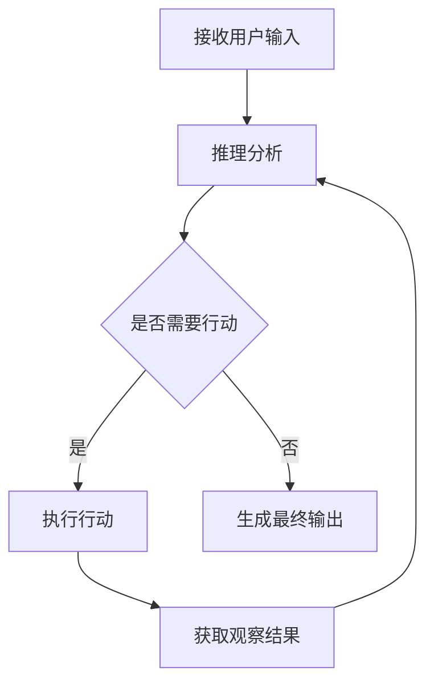
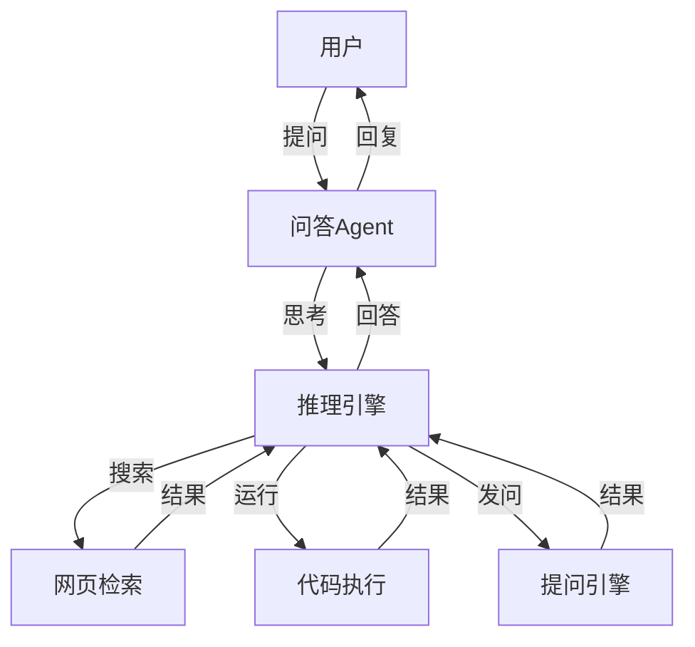

# 【大模型应用开发 动手做AI Agent】用ReAct框架实现简单Agent

## 1. 背景介绍

### 1.1 大模型的崛起

近年来,随着深度学习技术的飞速发展,大规模预训练语言模型(Large Pre-trained Language Models)如GPT-3、PaLM、LaMDA等相继问世。这些模型在海量文本数据上进行预训练,学习到了丰富的语言知识和常识,展现出了惊人的自然语言理解和生成能力。大模型的出现,为构建更加智能、通用的人工智能系统带来了新的契机。

### 1.2 AI Agent的应用前景

人工智能助手(AI Agent)是大模型的一个重要应用方向。AI Agent可以与人进行自然语言交互,理解用户意图,完成各种任务如问答、写作、编程、数据分析等。相比传统的任务专用系统,AI Agent具有更强的通用性、适应性和交互性,有望成为未来人机交互的主流方式。目前,ChatGPT、Claude、文心一言等就是典型的AI Agent产品。

### 1.3 ReAct框架简介

为了更好地开发AI Agent,一些研究者提出了ReAct(Reason+Act)框架。ReAct将推理(Reasoning)和行动(Action)相结合,让AI Agent不仅能够分析推理,还能主动采取行动与环境交互,从而完成更加复杂的任务。本文将介绍ReAct的核心概念,并带领读者动手实现一个简单的基于ReAct的AI Agent。

## 2. 核心概念与联系

### 2.1 ReAct的关键组成

- Reasoning(推理):通过对任务描述、背景知识、中间结果等信息的分析,得出合理的结论和决策。
- Action(行动):根据推理结果,主动采取行动,如检索信息、运行程序、生成内容等,与环境交互获取反馈。
- Observation(观察):感知环境状态的变化,如新的用户输入、检索结果、程序输出等,作为下一轮推理的输入。

### 2.2 ReAct的工作流程



如上图所示,ReAct Agent的工作流程通常包括:

1. 接收用户输入的任务描述
2. 对任务进行推理分析,判断是否需要采取行动
3. 如果需要行动,则执行相应的操作,如检索、运行程序等
4. 获取行动的观察结果,如检索结果、程序输出等 
5. 将观察结果作为新的输入,进入下一轮推理
6. 重复2-5步,直到得出最终结果
7. 将最终结果返回给用户

ReAct通过推理、行动、观察的循环往复,不断更新认知,最终完成复杂任务。

## 3. 核心算法原理与操作步骤

### 3.1 基于Prompt的任务描述

为了让语言模型理解任务,我们需要将任务转化为适合模型的Prompt形式。一个典型的ReAct Prompt包括:

- 任务目标(Goal):明确任务的最终目的是什么
- 任务步骤(Steps):完成任务需要经过哪些步骤
- 当前观察(Observation):当前步骤看到的信息
- 思考(Thought):分析当前形势,得出下一步行动
- 行动(Action):采取具体行动,与环境交互
- 行动输入(Action Input):执行行动所需的输入参数
- 行动结果(Action Result):行动执行后返回的结果

例如:

```
Goal: 写一个Python程序,计算1到100的和。
Steps:
1. 思考如何用Python实现求和
2. 编写Python代码
3. 运行代码,得到结果

Observation: 这是一个简单的Python编程任务,需要用循环或者数学公式来实现。

Thought: 我可以用一个for循环遍历1到100,然后累加求和。

Action: Python REPL
Action Input:
sum = 0
for i in range(1, 101):
    sum += i
print(sum) 

Action Result: 5050

Thought: 程序执行正确,得到了1到100的和为5050。

Action: Finish
Action Input: 用Python实现1到100求和的代码如下:

sum = 0
for i in range(1, 101):  
    sum += i
print(sum)

运行结果为:5050

Action Result: 无

Observation: 任务已经完成,成功用Python计算出了1到100的和为5050。

Thought: 无

Action: 无
```

可以看到,通过任务拆解、思考、编码、运行、分析结果等一系列过程,Agent最终完成了求和任务。

### 3.2 基于Few-Shot的推理增强

为了增强推理和行动的能力,我们可以给模型提供一些Few-Shot样例,让其学习如何解决特定类型的任务。例如:

```
Goal: 写一个Python程序,判断一个数是否为素数。
Steps:
1. 思考素数的定义和判断方法
2. 编写Python代码实现
3. 测试代码,看是否正确

Observation: 素数就是只能被1和自身整除的自然数,可以用排除法来判断。

Thought: 我可以遍历2到sqrt(n)之间的所有数,看n是否能被它们整除,如果不能则为素数。

Action: Python REPL 
Action Input:
import math

def is_prime(n):
    if n <= 1:
        return False
    for i in range(2, int(math.sqrt(n)) + 1):
        if n % i == 0:
            return False
    return True

print(is_prime(97))
print(is_prime(100))

Action Result:
True 
False

Thought: 代码正确,97是素数,100不是素数。

Action: Finish
Action Input: 判断一个数是否为素数的Python代码如下:

import math

def is_prime(n):
    if n <= 1:
        return False
    for i in range(2, int(math.sqrt(n)) + 1):
        if n % i == 0:
            return False
    return True

用例测试:
print(is_prime(97))  # True 
print(is_prime(100)) # False

Action Result: 无

Observation: 通过Few-Shot学习素数判断的例子,我掌握了素数的定义和判断方法,并能用Python代码实现。

Thought: 无

Action: 无
```

通过学习这个Few-Shot样例,Agent掌握了素数的概念和编程实现,可以泛化到其他类似的数学判断任务中。

### 3.3 Action的设计与实现

Action是ReAct的关键,它连接了推理和环境。常见的Action有:

- 搜索:从网络、数据库、知识库等渠道检索信息 
- 运行:调用API、执行程序、运行工具等
- 发问:向用户或其他Agent提出问题,获取更多信息
- 数学:进行数值计算、符号运算、方程求解等
- 绘图:生成图表、图像、视频等可视化内容

针对不同的任务,我们需要设计合适的Action接口,定义明确的输入输出格式,并提供可靠的执行环境。例如一个网页搜索Action:

```python
def web_search(query):
    search_url = f"https://www.google.com/search?q={query}"
    response = requests.get(search_url)
    soup = BeautifulSoup(response.text, "html.parser")
    result = soup.find("div", class_="Z0LcW").get_text()
    return result
```

该Action接受一个查询词,用Google搜索引擎检索,然后提取搜索结果的摘要,返回给Agent作为观察。

## 4. 数学建模与公式推导

### 4.1 ReAct的数学描述

我们可以用数学语言来刻画ReAct的核心思想:

令$O$表示Observation, $T$表示Thought, $A$表示Action, $E$表示Environment, 则ReAct可以表示为:

$$
O_{t+1}, R_t = E(A_t(T_t(O_t))) 
$$

其中$t$为交互步数,$R$为Reward,即环境对Action的评价。

展开来看:
- $O_t$:第$t$步观察到的状态
- $T_t(·)$:根据$O_t$进行推理,生成思考$T_t$ 
- $A_t(·)$:根据$T_t$采取行动$A_t$,与环境交互  
- $E(·)$:环境根据$A_t$反馈出新观察$O_{t+1}$和评价$R_t$

ReAct通过$T$、$A$、$E$三个模块的循环,不断更新$O$,最终求解任务。

### 4.2 基于Reward的策略学习

为了让Agent学会更好的行动策略,我们可以引入Reward机制,即根据Action的效果给予奖励或惩罚,引导Agent朝着正确的方向优化。

例如,对于一个问答任务,我们可以设计这样的Reward函数:

$$
R(A) = \begin{cases}
1,  & \text{答案正确} \\
-1, & \text{答案错误} \\  
0,  & \text{其他情况}
\end{cases}
$$

Agent的目标就是最大化总Reward:

$$
\max \sum_{t=1}^{T} R(A_t)
$$

我们可以用强化学习算法如Policy Gradient、Q-Learning等来优化Action策略$\pi(A|O)$,提高整体回答质量。

## 5. 项目实践:用ReAct实现问答Agent

下面我们用ReAct来实现一个简单的问答Agent。该Agent可以接收用户的问题,通过搜索网页、运行代码等Action获取信息,并生成自然语言回答。

### 5.1 总体架构



- 问答Agent:接收用户问题,生成自然语言回答
- 推理引擎:对问题进行分析,调用合适的Action模块
- 网页检索:搜索网页,提取关键信息 
- 代码执行:运行代码片段,获取输出结果
- 提问引擎:分析问题,提出关键性的后续问题

### 5.2 核心代码

```python
class ReActAgent:
    
    def __init__(self, openai_key):
        self.openai = OpenAI(openai_key)
        self.tools = {
            "web_search": web_search,
            "python_repl": python_repl,
            "ask_user": ask_user
        }
    
    def run(self, goal):
        observation = f"Goal: {goal}"
        
        while True:
            prompt = f"{observation}\nThought:"
            thought = self.openai.complete(prompt)
            
            action_match = re.search(r"Action: (\w+)", thought)
            if action_match:
                action_name = action_match.group(1)
                action_input_match = re.search(r"Action Input:\s*(.*)", thought, re.DOTALL)
                action_input = action_input_match.group(1) if action_input_match else ""
                
                if action_name == "Finish":
                    return action_input
                
                observation += f"\nThought: {thought}\n"
                
                if action_name in self.tools:
                    action_result = self.tools[action_name](action_input)
                    observation += f"Action: {action_name}\nAction Input: {action_input}\nAction Result: {action_result}\n"
                else:
                    observation += f"Action: {action_name}\nAction Result: 无法执行未知Action: {action_name}\n"
            else:
                observation += f"\nThought: {thought}\nAction: 无\n"
```

- `__init__`: 初始化Agent,加载OpenAI语言模型和Action工具
- `run`: 执行一轮ReAct流程,返回最终答案
  - 根据Goal生成初始Observation
  - 进入循环,重复执行Thought-Action-Observation
  - 调用OpenAI生成Thought和Action
  - 如果Action为Finish则返回结果
  - 调用对应的Action函数,获取结果
  - 将Action结果添加到Observation中
  - 进入下一轮循环

### 5.3 使用示例

```python
agent = ReActAgent(openai_key="YOUR_KEY")

goal = "帮我写一个Python程序,计算斐波那契数列第n项的值。要求用递归实现。"

result = agent.run(goal)

print(result)
```

输出:

```
以下是用Python递归实现计算斐波那契数列第n项的代码:

def fib(n):
    if n <= 1: