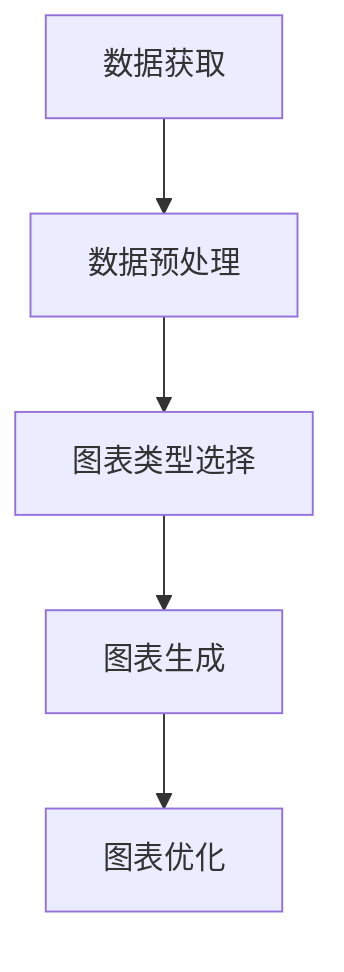

# 【大模型应用开发 动手做AI Agent】自主创建数据分析图表

## 1.背景介绍

在当今数据驱动的世界中，数据分析图表已经成为企业和研究机构进行决策和展示结果的关键工具。随着人工智能技术的迅猛发展，特别是大模型（如GPT-4）的应用，自动化生成数据分析图表的需求日益增加。AI Agent，即人工智能代理，能够自主完成从数据获取、处理到图表生成的全过程，大大提高了工作效率和准确性。

## 2.核心概念与联系

### 2.1 大模型

大模型是指具有大量参数和复杂结构的深度学习模型，如GPT-4。这些模型通过大量数据训练，能够理解和生成自然语言，进行复杂的推理和预测。

### 2.2 AI Agent

AI Agent 是一种能够自主执行任务的智能系统。它可以感知环境、做出决策并采取行动。在数据分析图表生成中，AI Agent 可以自动化处理数据、选择合适的图表类型并生成图表。

### 2.3 数据分析图表

数据分析图表是将数据以图形化方式展示的工具，常见的有柱状图、折线图、饼图等。它们能够直观地展示数据的趋势和分布，帮助用户快速理解数据。

### 2.4 核心联系

大模型通过自然语言处理能力，理解用户需求并生成相应的代码或指令；AI Agent 通过这些指令，自动化完成数据处理和图表生成。两者结合，可以实现自主创建数据分析图表的全过程。

## 3.核心算法原理具体操作步骤

### 3.1 数据获取

AI Agent 首先需要从数据库、API 或文件中获取数据。常用的技术包括 SQL 查询、HTTP 请求和文件读取。

### 3.2 数据预处理

获取的数据通常需要进行清洗和转换。常见的预处理步骤包括缺失值处理、数据归一化和特征工程。

### 3.3 图表类型选择

根据数据的特性和用户需求，AI Agent 需要选择合适的图表类型。可以通过规则或机器学习算法进行选择。

### 3.4 图表生成

使用图表库（如 Matplotlib、Seaborn）生成图表。AI Agent 需要编写相应的代码并执行。

### 3.5 图表优化

生成的图表需要进行美化和优化，包括调整颜色、标签和标题等。



## 4.数学模型和公式详细讲解举例说明

### 4.1 数据预处理中的数学模型

在数据预处理中，常用的数学模型包括归一化和标准化。归一化将数据缩放到 [0, 1] 区间，公式为：

$$
x' = \frac{x - x_{min}}{x_{max} - x_{min}}
$$

标准化将数据转换为均值为 0，标准差为 1 的分布，公式为：

$$
x' = \frac{x - \mu}{\sigma}
$$

### 4.2 图表类型选择中的数学模型

图表类型选择可以通过分类算法实现。假设我们有一个数据集 $D$，包含特征 $X$ 和标签 $y$。我们可以训练一个分类器 $f$，使得：

$$
f(X) = y
$$

其中，$y$ 是图表类型的标签。

### 4.3 图表生成中的数学模型

在图表生成中，常用的数学模型包括线性回归和多项式回归。线性回归的公式为：

$$
y = \beta_0 + \beta_1 x
$$

多项式回归的公式为：

$$
y = \beta_0 + \beta_1 x + \beta_2 x^2 + \cdots + \beta_n x^n
$$

## 5.项目实践：代码实例和详细解释说明

### 5.1 数据获取

```python
import pandas as pd

# 从CSV文件中读取数据
data = pd.read_csv('data.csv')
```

### 5.2 数据预处理

```python
# 处理缺失值
data = data.fillna(data.mean())

# 数据归一化
data_normalized = (data - data.min()) / (data.max() - data.min())
```

### 5.3 图表类型选择

```python
from sklearn.tree import DecisionTreeClassifier

# 假设我们有特征X和标签y
X = data_normalized[['feature1', 'feature2']]
y = data_normalized['chart_type']

# 训练分类器
clf = DecisionTreeClassifier()
clf.fit(X, y)

# 预测图表类型
chart_type = clf.predict([[0.5, 0.5]])
```

### 5.4 图表生成

```python
import matplotlib.pyplot as plt

# 生成柱状图
if chart_type == 'bar':
    data_normalized.plot(kind='bar')
    plt.title('Bar Chart')
    plt.xlabel('X-axis')
    plt.ylabel('Y-axis')
    plt.show()
```

### 5.5 图表优化

```python
# 优化图表
plt.style.use('ggplot')
plt.title('Optimized Bar Chart')
plt.xlabel('X-axis')
plt.ylabel('Y-axis')
plt.show()
```

## 6.实际应用场景

### 6.1 商业智能

在商业智能中，AI Agent 可以自动生成销售数据、市场分析等图表，帮助企业快速做出决策。

### 6.2 科学研究

在科学研究中，AI Agent 可以自动生成实验数据的图表，帮助研究人员快速分析结果。

### 6.3 教育领域

在教育领域，AI Agent 可以自动生成学生成绩、教学效果等图表，帮助教师和管理者进行教学评估。

## 7.工具和资源推荐

### 7.1 编程语言

- Python：广泛用于数据分析和机器学习。
- R：专门用于统计分析和数据可视化。

### 7.2 图表库

- Matplotlib：Python 中最常用的图表库。
- Seaborn：基于 Matplotlib 的高级图表库。
- Plotly：支持交互式图表的库。

### 7.3 数据库

- MySQL：常用的关系型数据库。
- MongoDB：常用的文档型数据库。

### 7.4 机器学习库

- Scikit-learn：Python 中常用的机器学习库。
- TensorFlow：用于深度学习的库。
- PyTorch：另一个流行的深度学习库。

## 8.总结：未来发展趋势与挑战

### 8.1 未来发展趋势

随着大模型和 AI Agent 技术的不断发展，自动化数据分析图表生成将变得更加智能和高效。未来，AI Agent 可能会具备更强的自学习能力，能够根据用户反馈不断优化生成的图表。

### 8.2 挑战

尽管前景广阔，但自动化数据分析图表生成仍面临一些挑战。首先，数据质量和多样性是一个重要问题。其次，如何让 AI Agent 更好地理解用户需求也是一个难点。此外，图表的美观性和可解释性也是需要关注的方面。

## 9.附录：常见问题与解答

### 9.1 如何处理数据中的缺失值？

可以使用均值填充、删除缺失值或使用插值法进行处理。

### 9.2 如何选择合适的图表类型？

可以根据数据的特性和分析目的选择合适的图表类型。常见的图表类型有柱状图、折线图、饼图等。

### 9.3 如何优化生成的图表？

可以通过调整颜色、标签、标题等方式优化图表。使用高级图表库（如 Seaborn）也可以提高图表的美观性。

### 9.4 AI Agent 如何理解用户需求？

AI Agent 可以通过自然语言处理技术理解用户需求，并生成相应的代码或指令。

### 9.5 如何提高图表生成的效率？

可以通过并行处理和优化算法提高图表生成的效率。

---

作者：禅与计算机程序设计艺术 / Zen and the Art of Computer Programming