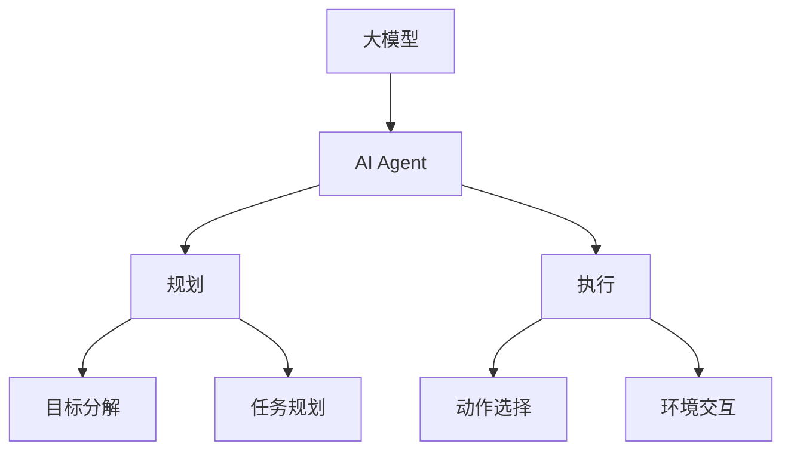

# 【大模型应用开发 动手做AI Agent】计划与执行

## 1. 背景介绍
### 1.1 人工智能发展现状
#### 1.1.1 人工智能技术的快速发展
#### 1.1.2 大模型的出现和应用
#### 1.1.3 AI Agent的兴起
### 1.2 AI Agent的定义和特点  
#### 1.2.1 AI Agent的定义
#### 1.2.2 AI Agent的特点和优势
#### 1.2.3 AI Agent的应用前景
### 1.3 动手做AI Agent的意义
#### 1.3.1 提升个人AI开发能力
#### 1.3.2 探索AI Agent的实现原理
#### 1.3.3 为AI应用开发提供参考

## 2. 核心概念与联系
### 2.1 大模型
#### 2.1.1 大模型的定义
#### 2.1.2 大模型的特点和优势
#### 2.1.3 主流大模型介绍
### 2.2 AI Agent
#### 2.2.1 AI Agent的组成部分
#### 2.2.2 AI Agent的工作原理
#### 2.2.3 AI Agent的分类
### 2.3 大模型与AI Agent的关系
#### 2.3.1 大模型在AI Agent中的作用
#### 2.3.2 大模型如何赋能AI Agent
#### 2.3.3 基于大模型构建AI Agent的优势

## 3. 核心算法原理具体操作步骤
### 3.1 基于大模型的自然语言理解
#### 3.1.1 文本预处理
#### 3.1.2 特征提取
#### 3.1.3 意图识别和槽位填充
### 3.2 基于大模型的对话管理
#### 3.2.1 对话状态跟踪
#### 3.2.2 对话策略学习
#### 3.2.3 回复生成
### 3.3 基于大模型的任务规划
#### 3.3.1 目标分解
#### 3.3.2 动作序列生成
#### 3.3.3 计划优化
### 3.4 基于大模型的执行控制
#### 3.4.1 环境感知
#### 3.4.2 动作选择
#### 3.4.3 环境交互

## 4. 数学模型和公式详细讲解举例说明
### 4.1 Transformer模型
#### 4.1.1 自注意力机制
$Attention(Q,K,V) = softmax(\frac{QK^T}{\sqrt{d_k}})V$
#### 4.1.2 多头注意力
$$MultiHead(Q,K,V) = Concat(head_1,...,head_h)W^O$$
$$head_i = Attention(QW_i^Q, KW_i^K, VW_i^V)$$
#### 4.1.3 前馈神经网络
$FFN(x) = max(0, xW_1 + b_1)W_2 + b_2$
### 4.2 强化学习模型  
#### 4.2.1 马尔可夫决策过程
$$S \times A \rightarrow P(S)$$
$$S \times A \times S \rightarrow R$$
#### 4.2.2 Q-learning算法
$$Q(s_t,a_t) \leftarrow Q(s_t,a_t) + \alpha[r_{t+1} + \gamma max_aQ(s_{t+1},a) - Q(s_t,a_t)]$$
#### 4.2.3 策略梯度算法
$$\nabla_\theta J(\theta) = E_{\tau \sim p_\theta(\tau)}[\sum_{t=0}^T \nabla_\theta log \pi_\theta(a_t|s_t)Q^\pi(s_t,a_t)]$$

## 5. 项目实践：代码实例和详细解释说明
### 5.1 基于GPT-3的AI Agent实现
#### 5.1.1 环境搭建和依赖安装
#### 5.1.2 GPT-3模型调用
#### 5.1.3 对话管理模块实现
### 5.2 基于BERT的任务规划模块实现  
#### 5.2.1 BERT模型微调
#### 5.2.2 目标分解和动作序列生成
#### 5.2.3 计划优化算法实现
### 5.3 基于深度强化学习的执行控制模块实现
#### 5.3.1 环境感知和状态表示
#### 5.3.2 DQN算法实现
#### 5.3.3 环境交互和探索策略

## 6. 实际应用场景
### 6.1 智能客服
#### 6.1.1 客户意图理解
#### 6.1.2 个性化回复生成
#### 6.1.3 多轮对话管理
### 6.2 智能助手
#### 6.2.1 任务分解和规划
#### 6.2.2 信息检索和知识问答
#### 6.2.3 任务执行和反馈
### 6.3 自动编程
#### 6.3.1 需求理解和分析
#### 6.3.2 代码生成和优化
#### 6.3.3 程序调试和测试

## 7. 工具和资源推荐
### 7.1 大模型训练平台
#### 7.1.1 OpenAI API
#### 7.1.2 HuggingFace Transformers
#### 7.1.3 Google BERT
### 7.2 对话系统开发框架
#### 7.2.1 Rasa
#### 7.2.2 DeepPavlov
#### 7.2.3 ParlAI
### 7.3 强化学习环境和算法库  
#### 7.3.1 OpenAI Gym
#### 7.3.2 Stable Baselines
#### 7.3.3 RLlib

## 8. 总结：未来发展趋势与挑战
### 8.1 AI Agent的发展趋势
#### 8.1.1 多模态AI Agent
#### 8.1.2 个性化和情感化AI Agent 
#### 8.1.3 自主学习和进化的AI Agent
### 8.2 AI Agent面临的挑战
#### 8.2.1 数据和知识的获取
#### 8.2.2 推理和决策的解释性
#### 8.2.3 安全和伦理问题
### 8.3 AI Agent的未来展望
#### 8.3.1 人机协作和共生
#### 8.3.2 通用人工智能的实现
#### 8.3.3 AI Agent在各领域的应用前景

## 9. 附录：常见问题与解答
### 9.1 如何选择合适的大模型进行AI Agent开发？
### 9.2 AI Agent开发过程中需要注意哪些问题？
### 9.3 如何评估AI Agent的性能和效果？
### 9.4 AI Agent的部署和维护有哪些最佳实践？
### 9.5 如何平衡AI Agent的功能和伦理要求？

作者：禅与计算机程序设计艺术 / Zen and the Art of Computer Programming