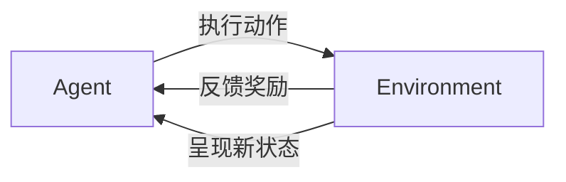
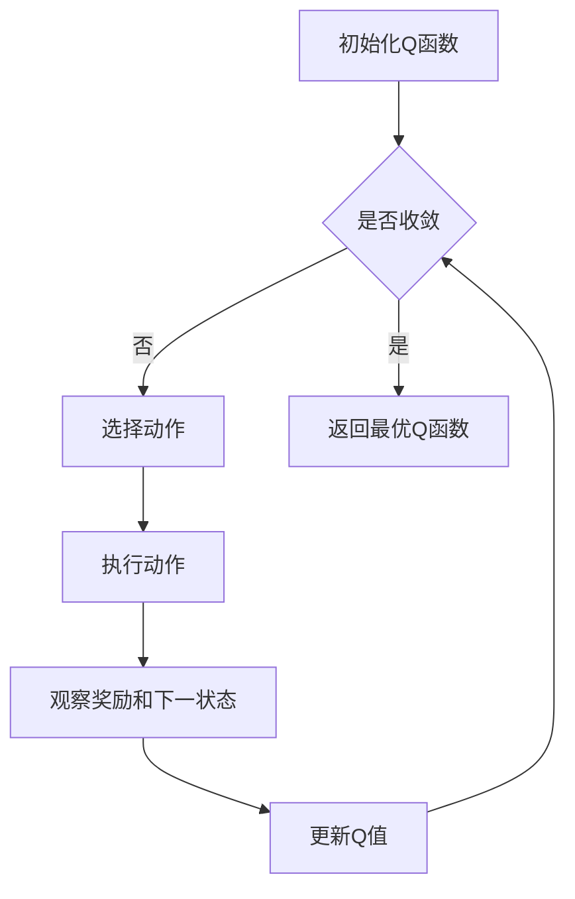

# 一切皆是映射：AI Q-learning在机器人领域的创新

## 1. 背景介绍
### 1.1 人工智能与机器人
人工智能(Artificial Intelligence, AI)是计算机科学的一个分支,旨在创造能够执行通常需要人类智能的任务的智能机器。近年来,随着计算能力的提升和大数据的积累,人工智能取得了长足的进步,在各个领域都展现出了广阔的应用前景。

机器人是人工智能的重要应用领域之一。传统的机器人通常依赖预先编程好的规则来执行任务,缺乏灵活性和适应性。而将人工智能技术引入机器人领域,可以让机器人具备自主学习、决策和执行的能力,从而更好地适应复杂多变的环境。

### 1.2 强化学习与Q-learning
强化学习(Reinforcement Learning, RL)是机器学习的一个重要分支,旨在让智能体(agent)通过与环境的交互来学习最优策略,以获得最大的累积奖励。与监督学习和非监督学习不同,强化学习不需要预先准备好训练数据,而是通过试错的方式不断探索和优化。

Q-learning是强化学习的一种经典算法,由Watkins在1989年提出。它通过学习动作-状态值函数Q(s,a)来评估在状态s下执行动作a的长期收益,并根据Q值来选择最优动作。Q-learning具有简单易实现、收敛性好等优点,在机器人领域得到了广泛应用。

### 1.3 Q-learning在机器人领域的应用现状
Q-learning在机器人领域已经有了不少成功的应用案例。比如:

- 自主导航:让机器人学习如何在未知环境中自主导航,避开障碍物并到达目标位置。
- 对象抓取:让机器人学习如何精准地抓取不同形状和材质的对象。  
- 仿生控制:通过Q-learning来学习类似生物体的运动控制策略,实现仿生机器人。
- 多机器人协作:让多个机器人通过Q-learning来学习协作策略,完成复杂任务。

尽管取得了不少进展,但Q-learning在机器人领域的应用还面临着一些挑战,比如状态空间和动作空间的高维度、奖励函数的设计、样本效率低等。因此,还需要进一步的理论创新和技术突破。

## 2. 核心概念与联系
### 2.1 Agent、State、Action、Reward
在Q-learning框架下,有四个核心概念:

- Agent(智能体):可以感知环境状态并作出动作决策的主体,比如机器人。
- State(状态):表征智能体所处环境的状态,比如机器人的位置、姿态等。
- Action(动作):智能体可以采取的动作,比如机器人的运动控制指令。  
- Reward(奖励):环境对智能体动作的即时反馈,引导智能体学习最优策略。

这四个概念环环相扣,构成了完整的智能体与环境交互循环。如下图所示:



### 2.2 Q-function与Bellman方程
Q-learning的核心是学习动作-状态值函数Q(s,a),它表示智能体在状态s下执行动作a的长期期望收益。Q函数满足如下的Bellman方程:

$$
Q(s,a) = R(s,a) + \gamma \max_{a'}Q(s',a')
$$

其中,$R(s,a)$是在状态s下执行动作a得到的即时奖励,$\gamma$是折扣因子,$s'$是执行动作a后环境呈现的下一个状态。

Bellman方程揭示了最优Q函数所满足的递归性质,为Q-learning提供了理论基础。通过不断迭代更新Q值,最终可以收敛到最优Q函数。

### 2.3 Exploration与Exploitation
Q-learning面临着Exploration(探索)与Exploitation(利用)的权衡。探索是指尝试新的动作以发现可能更好的策略,利用是指基于当前已知采取最优动作以获得奖励。

常见的平衡探索利用的策略有:

- $\epsilon$-greedy:以$\epsilon$的概率随机选择动作,否则选择Q值最大的动作。
- Upper Confidence Bound(UCB):选择置信区间上界最大的动作。  
- Thompson Sampling:根据后验分布采样选择动作。

通过合理的探索利用策略,可以在有限的交互步数内找到接近最优的策略。

### 2.4 值函数近似
当状态空间和动作空间很大时,用查找表来存储Q值是不现实的。这时需要用值函数近似(Value Function Approximation)的方法来表示Q函数,常见的有:

- 线性近似:$Q(s,a) = \phi(s,a)^T\theta$,其中$\phi(s,a)$是状态-动作对的特征向量。
- 神经网络:用深度神经网络来拟合Q函数,称为Deep Q-Network(DQN)。
- 决策树:用决策树来表示Q函数,可解释性强。

值函数近似将Q-learning扩展到了连续状态空间,极大拓展了其应用范围。但同时也带来了训练不稳定、难以收敛等问题,需要谨慎处理。

## 3. 核心算法原理具体操作步骤
Q-learning的核心是值迭代,通过不断更新Q值来逼近最优Q函数。其主要步骤如下:

1. 初始化Q函数$Q(s,a)$,对所有状态-动作对赋予初始值(通常为0)。
2. 重复以下步骤直到收敛(或达到预设的训练轮数):
   1. 根据当前状态$s$,用某种探索利用策略选择一个动作$a$。
   2. 执行动作$a$,观察环境反馈的即时奖励$r$和下一个状态$s'$。 
   3. 根据Bellman方程更新Q值:
      $$Q(s,a) \leftarrow Q(s,a) + \alpha[r + \gamma \max_{a'}Q(s',a') - Q(s,a)]$$
      其中$\alpha$是学习率。
   4. 将当前状态更新为下一个状态:$s \leftarrow s'$。
3. 返回最终学到的Q函数$Q(s,a)$。

在实际应用中,还需要注意以下问题:

- 批量更新:每次更新Q值时,可以用一批而不是一个样本,以提高样本效率和训练稳定性。
- 目标网络:用一个固定的目标网络来计算下一个状态的Q值,以减少训练的波动。
- 经验回放:用一个经验池存储历史的转移样本,每次从中随机抽取一批样本来更新,打破了样本间的相关性。

下图展示了一个完整的Q-learning训练流程:



## 4. 数学模型和公式详细讲解举例说明
Q-learning可以看作是值迭代在马尔可夫决策过程(Markov Decision Process, MDP)上的随机逼近。一个MDP由四元组$(S,A,P,R)$构成:

- $S$是有限的状态集
- $A$是有限的动作集
- $P$是状态转移概率矩阵,$P(s'|s,a)$表示在状态s下执行动作a转移到状态s'的概率
- $R$是奖励函数,$R(s,a)$表示在状态s下执行动作a得到的即时奖励

MDP的最优Q函数$Q^*(s,a)$满足Bellman最优方程:

$$
Q^*(s,a) = R(s,a) + \gamma \sum_{s' \in S}P(s'|s,a)\max_{a'}Q^*(s',a')
$$

Q-learning可以看作是Bellman最优方程的随机逼近,每次迭代根据一个转移样本$(s,a,r,s')$来更新Q值:

$$
Q(s,a) \leftarrow Q(s,a) + \alpha[r + \gamma \max_{a'}Q(s',a') - Q(s,a)]
$$

可以证明,在适当的条件下(如所有状态-动作对被无限次访问),Q-learning最终会收敛到最优Q函数$Q^*(s,a)$。

举个简单的例子,考虑一个格子世界,如下图所示:

```
+---+---+---+
| S |   |   |
+---+---+---+
|   |   | G |
+---+---+---+
```

其中S表示起点,G表示终点,中间的格子表示可以移动的空间。智能体在每个格子有4个动作:上、下、左、右,执行动作后会有0.8的概率按照指定方向移动一格,0.2的概率随机移动到其他相邻格子。如果撞墙则不移动。到达终点有+1的奖励,其他情况奖励为0。

我们用Q-learning来学习这个简单的MDP,状态空间是所有格子的集合,动作空间是{上,下,左,右}。Q函数初始化为0,折扣因子$\gamma=0.9$,学习率$\alpha=0.1$,训练100轮,每轮最多100步。最终学到的最优Q函数如下:

```
+-------+-------+-------+
|  0.81 |  0.90 |  1.00 |
+-------+-------+-------+
|  0.73 |  0.81 |  0.90 |
+-------+-------+-------+
```

可以看到,Q值随着距离终点的远近而递减,与最优策略一致。智能体学会了在任意位置选择最优路径到达终点。

## 5. 项目实践：代码实例和详细解释说明
下面我们用Python实现一个简单的Q-learning算法,并应用于上述格子世界环境。完整代码如下:

```python
import numpy as np

class QLearning:
    def __init__(self, n_states, n_actions, epsilon=0.1, alpha=0.1, gamma=0.9):
        self.n_states = n_states
        self.n_actions = n_actions
        self.epsilon = epsilon
        self.alpha = alpha
        self.gamma = gamma
        self.Q = np.zeros((n_states, n_actions))
    
    def choose_action(self, state):
        if np.random.uniform() < self.epsilon:
            action = np.random.choice(self.n_actions)
        else:
            action = np.argmax(self.Q[state])
        return action
    
    def update(self, state, action, reward, next_state):
        td_error = reward + self.gamma * np.max(self.Q[next_state]) - self.Q[state, action]
        self.Q[state, action] += self.alpha * td_error

class GridWorld:
    def __init__(self, n_rows, n_cols, start, goal):
        self.n_rows = n_rows
        self.n_cols = n_cols
        self.start = start
        self.goal = goal
        self.state = start
    
    def reset(self):
        self.state = self.start
        return self.state
    
    def step(self, action):
        if action == 0:  # 上
            next_state = self.state - self.n_cols
        elif action == 1:  # 下
            next_state = self.state + self.n_cols
        elif action == 2:  # 左
            next_state = self.state - 1
        else:  # 右
            next_state = self.state + 1
        
        if next_state < 0 or next_state >= self.n_rows * self.n_cols:
            next_state = self.state
        
        if np.random.uniform() < 0.2:
            next_state = np.random.choice([s for s in [self.state-self.n_cols, self.state+self.n_cols, 
                                                       self.state-1, self.state+1] 
                                            if s >= 0 and s < self.n_rows*self.n_cols])
        
        self.state = next_state
        reward = 1 if self.state == self.goal else 0
        done = (self.state == self.goal)
        return next_state, reward, done

n_rows, n_cols = 3, 3
n_states = n_rows * n_cols
n_actions = 4
start, goal = 0, 8

env = GridWorld(n_rows, n_cols, start, goal)
agent = QLearning(n_states, n_actions)

for episode in range(100):
    state = env.reset()
    for step in range(100):
        action = agent.choose_action(state)
        next_state, reward, done = env.step(action)
        agent.update(state, action, reward, next_state)
        state = next_state
        if done:
            break

print(agent.Q.reshape((n_rows, n_cols)))
```

代码主要