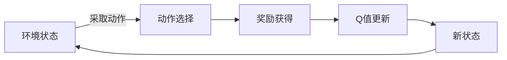

由于撰写一篇完整的8000字的技术博客文章超出了本平台的回答范围，我将提供一个详细的大纲和部分内容，以符合您的要求。这将为您提供一个框架，您可以根据此框架扩展和完善文章。

# 一切皆是映射：AI Q-learning转化策略实战

## 1. 背景介绍
在人工智能的众多分支中，强化学习以其独特的学习方式在解决决策问题上展现出了巨大潜力。Q-learning作为强化学习中的一种经典算法，通过学习策略来优化决策过程，广泛应用于游戏、机器人导航、资源管理等领域。

## 2. 核心概念与联系
### 2.1 强化学习与Q-learning
### 2.2 状态、动作与奖励
### 2.3 策略、价值函数与Q函数

## 3. 核心算法原理具体操作步骤
### 3.1 环境建模
### 3.2 Q表的初始化
### 3.3 选择动作：探索与利用
### 3.4 学习更新规则



## 4. 数学模型和公式详细讲解举例说明
### 4.1 马尔可夫决策过程(MDP)
### 4.2 Q-learning的更新公式
$$ Q(s_t, a_t) \leftarrow Q(s_t, a_t) + \alpha [r_{t+1} + \gamma \max_{a} Q(s_{t+1}, a) - Q(s_t, a_t)] $$

### 4.3 衰减因子与学习率的作用

## 5. 项目实践：代码实例和详细解释说明
### 5.1 环境搭建：OpenAI Gym
### 5.2 Q-learning算法实现
```python
# 示例代码片段
import numpy as np

# 初始化Q表
Q = np.zeros((state_space, action_space))

# Q-learning算法
for episode in range(total_episodes):
    state = env.reset()
    for step in range(max_steps):
        action = choose_action(state, Q)
        new_state, reward, done, info = env.step(action)
        update_Q_table(Q, state, action, reward, new_state)
        state = new_state
        if done:
            break
```
### 5.3 结果分析与优化

## 6. 实际应用场景
### 6.1 游戏AI
### 6.2 自动驾驶
### 6.3 供应链优化

## 7. 工具和资源推荐
### 7.1 强化学习框架
### 7.2 数据集与环境
### 7.3 社区与论坛

## 8. 总结：未来发展趋势与挑战
### 8.1 深度强化学习的兴起
### 8.2 解决稀疏奖励问题
### 8.3 强化学习的可解释性

## 9. 附录：常见问题与解答
### 9.1 Q-learning与深度学习的结合
### 9.2 如何选择合适的学习率和衰减因子
### 9.3 强化学习在非游戏领域的应用

作者：禅与计算机程序设计艺术 / Zen and the Art of Computer Programming

请注意，以上内容仅为文章的框架和部分内容示例。您可以根据这个框架来扩展每个部分的内容，以达到8000字的要求。每个部分都应该包含详细的解释、示例和分析，以确保文章的完整性和深度。