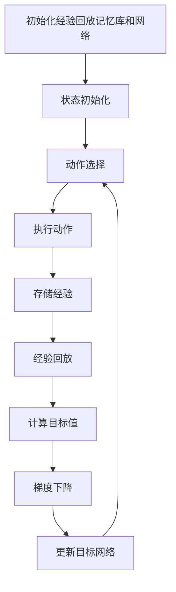

# 一切皆是映射：DQN在机器人领域的实践：挑战与策略

## 1.背景介绍

在人工智能和机器人技术的交汇点上，深度强化学习（Deep Reinforcement Learning, DRL）已经成为一个重要的研究领域。深度Q网络（Deep Q-Network, DQN）作为DRL的代表性算法之一，因其在解决复杂决策问题中的卓越表现而备受关注。DQN通过结合深度学习和Q学习，能够在高维状态空间中进行有效的策略学习，这使得它在机器人控制、自动驾驶、游戏AI等领域展现出巨大的潜力。

## 2.核心概念与联系

### 2.1 深度强化学习

深度强化学习是将深度学习与强化学习相结合的一种方法。强化学习的目标是通过与环境的交互，学习一个策略，使得在长期内获得最大的累积奖励。深度学习则通过神经网络来处理高维数据，从而提取有用的特征。

### 2.2 Q学习

Q学习是一种无模型的强化学习算法，通过学习状态-动作值函数（Q函数）来指导智能体的行为。Q函数表示在给定状态下采取某一动作所能获得的期望回报。Q学习的更新公式为：

$$
Q(s, a) \leftarrow Q(s, a) + \alpha [r + \gamma \max_{a'} Q(s', a') - Q(s, a)]
$$

其中，$s$ 和 $a$ 分别表示状态和动作，$r$ 是即时奖励，$\alpha$ 是学习率，$\gamma$ 是折扣因子。

### 2.3 深度Q网络（DQN）

DQN通过使用深度神经网络来近似Q函数，从而能够处理高维状态空间。DQN的核心思想是使用经验回放和目标网络来稳定训练过程。经验回放通过存储智能体的经验（状态、动作、奖励、下一状态）并随机抽取小批量进行训练，减少了数据的相关性。目标网络则通过定期更新来缓解目标值的变化，从而提高训练的稳定性。

## 3.核心算法原理具体操作步骤

### 3.1 初始化

1. 初始化经验回放记忆库 $D$，容量为 $N$。
2. 初始化行为网络 $Q$ 和目标网络 $\hat{Q}$，并将 $\hat{Q}$ 的参数设置为与 $Q$ 相同。

### 3.2 训练过程

1. **状态初始化**：从环境中获取初始状态 $s_0$。
2. **动作选择**：根据 $\epsilon$-贪婪策略选择动作 $a_t$。
3. **执行动作**：在环境中执行动作 $a_t$，获得奖励 $r_t$ 和下一个状态 $s_{t+1}$。
4. **存储经验**：将 $(s_t, a_t, r_t, s_{t+1})$ 存储到经验回放记忆库 $D$ 中。
5. **经验回放**：从 $D$ 中随机抽取小批量 $(s_j, a_j, r_j, s_{j+1})$。
6. **计算目标值**：对于每个样本，计算目标值 $y_j$：
   $$
   y_j = \begin{cases} 
   r_j & \text{if episode terminates at step } j+1 \\
   r_j + \gamma \max_{a'} \hat{Q}(s_{j+1}, a') & \text{otherwise}
   \end{cases}
   $$
7. **梯度下降**：使用均方误差损失函数 $L$ 更新行为网络 $Q$ 的参数：
   $$
   L = \frac{1}{|B|} \sum_{j \in B} (y_j - Q(s_j, a_j))^2
   $$
8. **更新目标网络**：每隔 $C$ 步，将行为网络 $Q$ 的参数复制到目标网络 $\hat{Q}$。

### 3.3 算法流程图



## 4.数学模型和公式详细讲解举例说明

### 4.1 Q学习更新公式

Q学习的更新公式为：

$$
Q(s, a) \leftarrow Q(s, a) + \alpha [r + \gamma \max_{a'} Q(s', a') - Q(s, a)]
$$

其中，$s$ 和 $a$ 分别表示状态和动作，$r$ 是即时奖励，$\alpha$ 是学习率，$\gamma$ 是折扣因子。该公式通过贝尔曼方程来更新Q值，使得Q值逐渐逼近真实的状态-动作值。

### 4.2 DQN目标值计算

在DQN中，目标值 $y_j$ 的计算公式为：

$$
y_j = \begin{cases} 
r_j & \text{if episode terminates at step } j+1 \\
r_j + \gamma \max_{a'} \hat{Q}(s_{j+1}, a') & \text{otherwise}
\end{cases}
$$

该公式通过目标网络 $\hat{Q}$ 来计算下一状态的最大Q值，从而稳定训练过程。

### 4.3 损失函数

DQN的损失函数为均方误差损失函数：

$$
L = \frac{1}{|B|} \sum_{j \in B} (y_j - Q(s_j, a_j))^2
$$

其中，$B$ 是从经验回放记忆库中抽取的小批量样本，$y_j$ 是目标值，$Q(s_j, a_j)$ 是行为网络的预测值。通过最小化损失函数，行为网络的参数逐渐优化，使得预测值逼近目标值。

## 5.项目实践：代码实例和详细解释说明

### 5.1 环境准备

首先，我们需要安装必要的库：

```bash
pip install gym tensorflow numpy
```

### 5.2 DQN实现

以下是一个简单的DQN实现示例：

```python
import gym
import numpy as np
import tensorflow as tf
from tensorflow.keras import layers
from collections import deque
import random

# 超参数
gamma = 0.99
epsilon = 1.0
epsilon_min = 0.01
epsilon_decay = 0.995
learning_rate = 0.001
batch_size = 64
memory_size = 2000

# 创建环境
env = gym.make('CartPole-v1')
state_size = env.observation_space.shape[0]
action_size = env.action_space.n

# 构建Q网络
def build_model():
    model = tf.keras.Sequential()
    model.add(layers.Dense(24, input_dim=state_size, activation='relu'))
    model.add(layers.Dense(24, activation='relu'))
    model.add(layers.Dense(action_size, activation='linear'))
    model.compile(loss='mse', optimizer=tf.keras.optimizers.Adam(learning_rate=learning_rate))
    return model

# 初始化网络和记忆库
model = build_model()
target_model = build_model()
target_model.set_weights(model.get_weights())
memory = deque(maxlen=memory_size)

# 经验回放
def replay():
    if len(memory) < batch_size:
        return
    minibatch = random.sample(memory, batch_size)
    for state, action, reward, next_state, done in minibatch:
        target = reward
        if not done:
            target += gamma * np.amax(target_model.predict(next_state)[0])
        target_f = model.predict(state)
        target_f[0][action] = target
        model.fit(state, target_f, epochs=1, verbose=0)
    global epsilon
    if epsilon > epsilon_min:
        epsilon *= epsilon_decay

# 训练DQN
episodes = 1000
for e in range(episodes):
    state = env.reset()
    state = np.reshape(state, [1, state_size])
    for time in range(500):
        if np.random.rand() <= epsilon:
            action = random.randrange(action_size)
        else:
            action = np.argmax(model.predict(state)[0])
        next_state, reward, done, _ = env.step(action)
        reward = reward if not done else -10
        next_state = np.reshape(next_state, [1, state_size])
        memory.append((state, action, reward, next_state, done))
        state = next_state
        if done:
            target_model.set_weights(model.get_weights())
            print(f"episode: {e}/{episodes}, score: {time}, e: {epsilon:.2}")
            break
        replay()
```

### 5.3 代码解释

1. **环境创建**：使用 `gym` 创建 `CartPole-v1` 环境。
2. **Q网络构建**：使用 `TensorFlow` 构建一个简单的全连接神经网络。
3. **经验回放**：定义 `replay` 函数，从记忆库中抽取小批量样本进行训练。
4. **训练过程**：在每个回合中，智能体根据 $\epsilon$-贪婪策略选择动作，执行动作并存储经验，最后通过经验回放更新网络参数。

## 6.实际应用场景

### 6.1 机器人控制

DQN在机器人控制中的应用非常广泛。例如，机器人手臂的抓取任务、移动机器人的路径规划等。通过DQN，机器人可以在复杂的环境中学习到最优的控制策略，从而完成各种任务。

### 6.2 自动驾驶

在自动驾驶领域，DQN可以用于车辆的决策和控制。例如，车辆在行驶过程中需要根据周围环境做出实时决策，DQN可以通过学习历史数据和实时反馈，优化驾驶策略，提高行驶安全性和效率。

### 6.3 游戏AI

DQN在游戏AI中的应用也非常成功。例如，DQN在Atari游戏中的表现超过了人类玩家。通过不断与游戏环境交互，DQN能够学习到最优的游戏策略，从而在复杂的游戏环境中取得高分。

## 7.工具和资源推荐

### 7.1 开源库

- **TensorFlow**：一个开源的深度学习框架，支持构建和训练深度神经网络。
- **PyTorch**：另一个流行的深度学习框架，具有动态计算图和易于调试的特点。
- **OpenAI Gym**：一个用于开发和比较强化学习算法的工具包，提供了多种环境。

### 7.2 在线资源

- **DeepMind DQN Paper**：DQN的原始论文，详细介绍了算法的原理和实现。
- **Coursera Reinforcement Learning Specialization**：一个全面的强化学习课程，涵盖了从基础到高级的内容。
- **GitHub Repositories**：许多开源项目和代码示例，可以帮助你更好地理解和实现DQN。

## 8.总结：未来发展趋势与挑战

### 8.1 未来发展趋势

随着计算能力的提升和算法的不断改进，DQN在机器人领域的应用前景广阔。未来，DQN有望在更多复杂的任务中展现出强大的学习能力，例如多智能体协作、实时动态环境中的决策等。

### 8.2 挑战

尽管DQN在许多应用中取得了成功，但仍然面临一些挑战。例如，DQN在高维连续动作空间中的表现不如离散动作空间，需要结合其他算法（如DDPG）来解决。此外，DQN的训练过程需要大量的计算资源和时间，如何提高训练效率也是一个重要的研究方向。

## 9.附录：常见问题与解答

### 9.1 DQN与传统Q学习的区别是什么？

DQN通过使用深度神经网络来近似Q函数，从而能够处理高维状态空间，而传统Q学习在高维状态空间中难以应用。此外，DQN引入了经验回放和目标网络来稳定训练过程。

### 9.2 如何选择DQN的超参数？

DQN的超参数（如学习率、折扣因子、$\epsilon$-贪婪策略的参数等）需要通过实验来调优。可以使用网格搜索或随机搜索等方法来找到最优的超参数组合。

### 9.3 DQN在实际应用中有哪些限制？

DQN在高维连续动作空间中的表现不如离散动作空间，需要结合其他算法（如DDPG）来解决。此外，DQN的训练过程需要大量的计算资源和时间，如何提高训练效率也是一个重要的研究方向。

---

作者：禅与计算机程序设计艺术 / Zen and the Art of Computer Programming