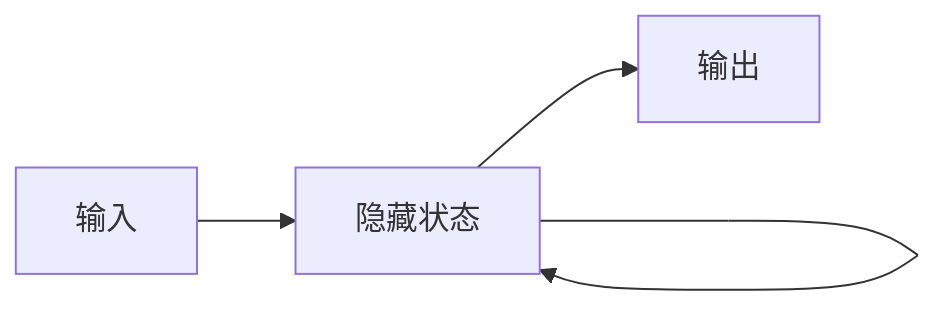

# 一切皆是映射：从零开始构建深度学习架构

## 1. 背景介绍

### 1.1 深度学习的兴起

深度学习作为人工智能领域的一个分支,在近年来取得了巨大的突破和进展。从计算机视觉到自然语言处理,再到强化学习,深度学习模型在各个领域都展现出了惊人的性能。这些成就的背后,是深度学习模型强大的表示学习和特征提取能力。

### 1.2 深度学习的本质

深度学习的本质可以用一个词来概括,那就是"映射"(Mapping)。无论是卷积神经网络(CNN)、循环神经网络(RNN)还是生成对抗网络(GAN),它们的核心都是通过一系列的非线性变换,将输入数据映射到一个更加抽象和富有语义的特征空间。在这个过程中,模型自动学习并提取了数据中蕴含的本质特征和规律。

### 1.3 构建深度学习架构的意义

尽管深度学习已经取得了巨大成功,但对于很多初学者和非专业人士来说,深度学习仍然是一个神秘的黑盒子。了解深度学习的内部原理和架构,不仅有助于我们更好地理解和应用现有的模型,也为我们设计和优化自己的模型提供了重要的思路。因此,本文将从零开始,一步步构建起一个完整的深度学习架构,并详细阐述其中的核心概念和原理。

## 2. 核心概念与联系

### 2.1 人工神经元

人工神经元(Artificial Neuron)是构建神经网络的基本单元。它接收一组输入信号,通过加权求和和非线性变换产生输出。这种结构模仿了生物神经元的信息处理过程。一个典型的人工神经元可以用下面的数学公式表示:

$$
y = f(\sum_{i=1}^{n} w_i x_i + b)
$$

其中,$x_i$是第$i$个输入信号,$w_i$是对应的权重,$b$是偏置项,$f$是激活函数,如sigmoid、tanh、ReLU等。

### 2.2 前馈神经网络

前馈神经网络(Feedforward Neural Network)是最基础的神经网络结构。它由多层人工神经元组成,每一层的神经元接收前一层的输出作为输入,并将自己的输出传递给下一层,信息沿着一个方向流动。下图是一个简单的三层前馈神经网络:

前馈神经网络可以看作是一个复合函数,将输入通过层层映射转化为输出。假设一个$L$层的网络,第$l$层的第$i$个神经元的激活值为$a_i^{(l)}$,则有:

$$
a_i^{(l)} = f(\sum_{j=1}^{n_{l-1}} w_{ij}^{(l)} a_j^{(l-1)} + b_i^{(l)})
$$

其中,$n_{l-1}$是第$l-1$层的神经元数量。

### 2.3 反向传播算法

反向传播算法(Backpropagation)是训练神经网络的核心算法。它通过计算损失函数对每个权重的梯度,并使用梯度下降法更新权重,使得网络的预测结果与真实值之间的误差最小化。反向传播的过程可以分为以下几步:

1. 前向传播:将输入数据通过网络计算输出。
2. 计算损失:比较网络输出与真实值,计算损失函数值。
3. 反向传播:从输出层开始,逐层计算损失函数对每个权重的梯度。
4. 更新权重:使用梯度下降法,根据梯度更新每个权重。

反向传播算法利用了链式法则,使得梯度的计算可以高效地在网络中传递。对于第$l$层第$i$个神经元的加权输入$z_i^{(l)}$,有:

$$
\frac{\partial C}{\partial w_{ij}^{(l)}} = \frac{\partial C}{\partial z_i^{(l)}} \frac{\partial z_i^{(l)}}{\partial w_{ij}^{(l)}} = \delta_i^{(l)} a_j^{(l-1)}
$$

其中,$C$是损失函数,$\delta_i^{(l)}$是第$l$层第$i$个神经元的误差项,可以递归计算:

$$
\delta_i^{(l)} = \frac{\partial C}{\partial z_i^{(l)}} = \sum_{k=1}^{n_{l+1}} \delta_k^{(l+1)} w_{ki}^{(l+1)} f'(z_i^{(l)})
$$

### 2.4 卷积神经网络

卷积神经网络(Convolutional Neural Network, CNN)是一种专门用于处理网格拓扑结构数据(如图像)的神经网络。它通过引入卷积层和池化层,可以自动学习局部特征和空间层次结构。一个典型的CNN结构如下:

卷积层使用一组可学习的卷积核在输入特征图上滑动,提取局部特征。第$l$层第$k$个特征图的第$i,j$个元素可以表示为:

$$
a_{ij}^{(l,k)} = f(\sum_{m=1}^{M_{l-1}} \sum_{p=1}^{F_l} \sum_{q=1}^{F_l} w_{pq}^{(l,k,m)} a_{(i+p)(j+q)}^{(l-1,m)} + b^{(l,k)})
$$

其中,$M_{l-1}$是第$l-1$层的特征图数量,$F_l$是卷积核大小。

池化层对卷积层的输出进行下采样,减小特征图的尺寸并引入平移不变性。常见的池化操作有最大池化和平均池化。

### 2.5 循环神经网络

循环神经网络(Recurrent Neural Network, RNN)是一种适用于处理序列数据的神经网络。它引入了循环连接,使得网络可以利用之前的状态信息。一个简单的RNN结构如下:

在时间步$t$,隐藏状态$h_t$的更新公式为:

$$
h_t = f(W_{xh} x_t + W_{hh} h_{t-1} + b_h)
$$

其中,$x_t$是$t$时刻的输入,$W_{xh}$和$W_{hh}$分别是输入到隐藏层和隐藏层到隐藏层的权重矩阵。

常见的RNN变体有LSTM和GRU,它们引入了门控机制来缓解梯度消失问题,提高了RNN处理长序列的能力。

## 3. 核心算法原理具体操作步骤

本节将详细介绍几个深度学习的核心算法,包括梯度下降法、反向传播算法和BatchNorm。

### 3.1 梯度下降法

梯度下降法是一种通用的优化算法,用于最小化目标函数。在深度学习中,我们通常使用梯度下降法来最小化损失函数,更新网络权重。梯度下降法的基本步骤如下:

1. 初始化权重参数。
2. 重复以下步骤直到收敛:
   a. 计算损失函数对每个权重的梯度。
   b. 沿着梯度的反方向更新权重,更新步长为学习率。

对于第$i$个权重$w_i$,更新公式为:

$$
w_i \leftarrow w_i - \eta \frac{\partial C}{\partial w_i}
$$

其中,$\eta$是学习率。

常见的梯度下降变体有随机梯度下降(SGD)、小批量梯度下降(Mini-batch GD)和Adam。它们在更新频率、更新方向和学习率调整方面有所不同,可以加速收敛并避免局部最优。

### 3.2 反向传播算法

反向传播算法是训练神经网络的核心算法。它利用链式法则,高效地计算损失函数对每个权重的梯度。反向传播算法的具体步骤如下:

1. 前向传播:将输入数据通过网络,计算每一层的激活值,直到输出层。
2. 计算输出层的误差项:
   
   $$
   \delta_i^{(L)} = \frac{\partial C}{\partial z_i^{(L)}} = \frac{\partial C}{\partial a_i^{(L)}} f'(z_i^{(L)})
   $$
   
3. 反向传播误差项:从倒数第二层开始,逐层计算每个神经元的误差项,直到第二层。
   
   $$
   \delta_i^{(l)} = \sum_{k=1}^{n_{l+1}} \delta_k^{(l+1)} w_{ki}^{(l+1)} f'(z_i^{(l)})
   $$
   
4. 计算每个权重的梯度:
   
   $$
   \frac{\partial C}{\partial w_{ij}^{(l)}} = \delta_i^{(l)} a_j^{(l-1)}
   $$
   
5. 使用梯度下降法更新权重。

反向传播算法的关键在于误差项的递归计算和梯度的传递。通过反向传播,我们可以高效地计算出损失函数对每个权重的梯度,从而实现网络的训练。

### 3.3 BatchNorm

BatchNorm是一种用于加速网络训练和提高泛化性能的技术。它通过对每一层的激活值进行归一化,减少了内部协变量偏移的影响。BatchNorm的具体步骤如下:

1. 对每个小批量的激活值计算均值和方差:
   
   $$
   \mu_B = \frac{1}{m} \sum_{i=1}^m x_i
   $$
   
   $$
   \sigma_B^2 = \frac{1}{m} \sum_{i=1}^m (x_i - \mu_B)^2
   $$
   
2. 对激活值进行归一化:
   
   $$
   \hat{x}_i = \frac{x_i - \mu_B}{\sqrt{\sigma_B^2 + \epsilon}}
   $$
   
3. 引入可学习的缩放和偏移参数:
   
   $$
   y_i = \gamma \hat{x}_i + \beta
   $$
   
其中,$\gamma$和$\beta$是可学习的参数,$\epsilon$是一个小常数,用于数值稳定性。

BatchNorm可以加速网络收敛,提高泛化性能,并允许使用更高的学习率。它已经成为深度学习模型的标准组件之一。

## 4. 数学模型和公式详细讲解举例说明

本节将详细讲解几个重要的深度学习数学模型和公式,并给出具体的例子。

### 4.1 交叉熵损失函数

交叉熵损失函数是分类任务中常用的损失函数。它衡量了网络预测分布与真实分布之间的差异。对于一个$C$类分类问题,交叉熵损失定义为:

$$
L = -\sum_{i=1}^C y_i \log(\hat{y}_i)
$$

其中,$y_i$是真实标签的one-hot编码,$\hat{y}_i$是网络预测的第$i$类的概率。

举例来说,假设一个3类分类问题,真实标签为[0, 1, 0],网络预测概率为[0.2, 0.6, 0.2],则交叉熵损失为:

$$
L = -[0 \cdot \log(0.2) + 1 \cdot \log(0.6) + 0 \cdot \log(0.2)] \approx 0.511
$$

交叉熵损失函数鼓励网络的预测概率分布与真实分布尽可能接近。它是分类任务中的首选损失函数。

### 4.2 L1和L2正则化

L1和L2正则化是两种常用的正则化技术,用于防止过拟合并提高模型的泛化性能。它们通过在损失函数中加入权重的L1范数或L2范数,鼓励模型学习更加简单和平滑的权重分布。

L1正则化在损失函数中加入权重的绝对值之和:

$$
L_{L1} = L + \lambda \sum_{i=1}^n |w_i|
$$

其中,$L$是原始损失函数,$\lambda$是正则化强度。L1正则化鼓励稀疏的权重,使得很多权重变为0。

L2