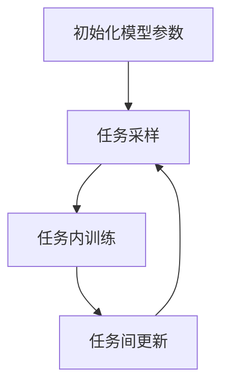
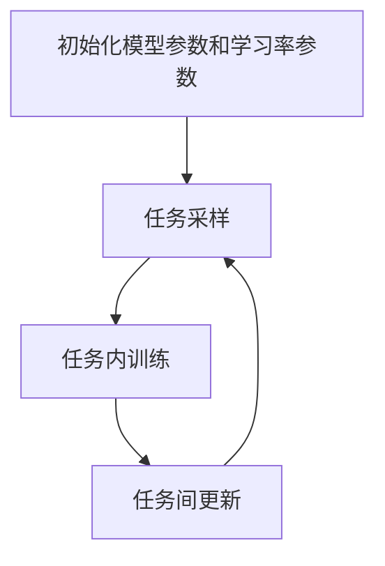
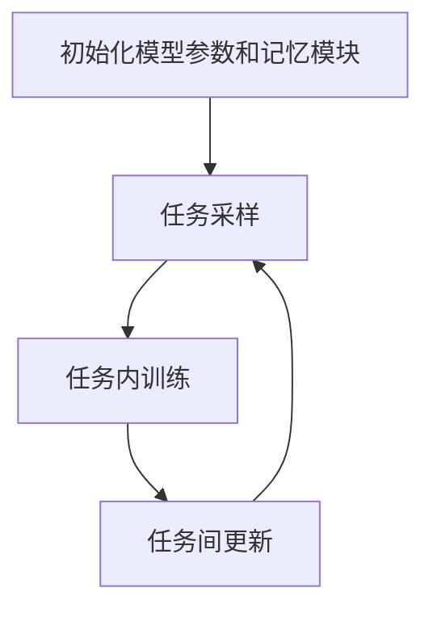

# 一切皆是映射：元学习在异常检测中的应用策略

## 1.背景介绍

在现代数据驱动的世界中，异常检测已经成为许多领域的关键任务，包括金融欺诈检测、网络安全、医疗诊断和工业设备监控等。传统的异常检测方法通常依赖于预定义的规则或统计模型，这些方法在处理复杂和动态变化的数据时往往显得力不从心。元学习（Meta-Learning）作为一种新兴的机器学习方法，提供了一种通过学习如何学习来提高模型泛化能力的策略。本文将探讨元学习在异常检测中的应用策略，旨在为读者提供深入的理解和实用的指导。

## 2.核心概念与联系

### 2.1 异常检测

异常检测是指识别数据集中与正常模式显著不同的数据点的过程。这些异常数据点可能代表错误、欺诈行为、设备故障或其他感兴趣的事件。常见的异常检测方法包括基于统计的检测、基于距离的检测、基于密度的检测和基于机器学习的检测。

### 2.2 元学习

元学习，也称为“学习如何学习”，是一种通过训练模型来提高其在新任务上的学习效率和效果的方法。元学习的核心思想是利用先前任务的经验来加速新任务的学习过程。元学习方法主要包括基于模型的元学习、基于优化的元学习和基于记忆的元学习。

### 2.3 元学习与异常检测的联系

元学习在异常检测中的应用主要体现在以下几个方面：
- **快速适应新环境**：元学习可以帮助异常检测模型快速适应新的数据分布和环境变化。
- **提高检测精度**：通过利用先前任务的经验，元学习可以提高异常检测模型的精度和鲁棒性。
- **减少标注数据需求**：元学习可以在少量标注数据的情况下，显著提升模型的性能。

## 3.核心算法原理具体操作步骤

### 3.1 基于模型的元学习

基于模型的元学习方法通过设计一个能够快速适应新任务的模型架构来实现。常见的方法包括MAML（Model-Agnostic Meta-Learning）和Meta-SGD。

#### 3.1.1 MAML

MAML是一种通用的元学习算法，其核心思想是通过优化初始参数，使得模型在少量梯度更新后能够在新任务上表现良好。具体步骤如下：

1. **初始化模型参数** $\theta$。
2. **任务采样**：从任务分布中采样一批任务 $\mathcal{T}_i$。
3. **任务内训练**：对于每个任务 $\mathcal{T}_i$，使用当前参数 $\theta$ 进行少量梯度更新，得到更新后的参数 $\theta_i'$。
4. **任务间更新**：使用所有任务的更新结果，计算元损失并更新初始参数 $\theta$。



### 3.2 基于优化的元学习

基于优化的元学习方法通过设计一个能够快速优化的学习算法来实现。常见的方法包括Meta-SGD和Reptile。

#### 3.2.1 Meta-SGD

Meta-SGD通过学习优化器的学习率和方向来实现快速适应新任务。具体步骤如下：

1. **初始化模型参数** $\theta$ 和学习率参数 $\alpha$。
2. **任务采样**：从任务分布中采样一批任务 $\mathcal{T}_i$。
3. **任务内训练**：对于每个任务 $\mathcal{T}_i$，使用当前参数 $\theta$ 和学习率 $\alpha$ 进行少量梯度更新，得到更新后的参数 $\theta_i'$。
4. **任务间更新**：使用所有任务的更新结果，计算元损失并更新初始参数 $\theta$ 和学习率参数 $\alpha$。



### 3.3 基于记忆的元学习

基于记忆的元学习方法通过设计一个能够存储和检索任务经验的记忆模块来实现。常见的方法包括MetaNet和SNAIL。

#### 3.3.1 MetaNet

MetaNet通过一个记忆网络来存储和检索任务经验，从而实现快速适应新任务。具体步骤如下：

1. **初始化模型参数** $\theta$ 和记忆模块 $M$。
2. **任务采样**：从任务分布中采样一批任务 $\mathcal{T}_i$。
3. **任务内训练**：对于每个任务 $\mathcal{T}_i$，使用当前参数 $\theta$ 和记忆模块 $M$ 进行训练，更新记忆模块 $M$。
4. **任务间更新**：使用所有任务的更新结果，计算元损失并更新初始参数 $\theta$ 和记忆模块 $M$。



## 4.数学模型和公式详细讲解举例说明

### 4.1 MAML的数学模型

MAML的目标是找到一个初始参数 $\theta$，使得模型在少量梯度更新后能够在新任务上表现良好。其优化目标可以表示为：

$$
\min_{\theta} \sum_{\mathcal{T}_i \sim p(\mathcal{T})} \mathcal{L}_{\mathcal{T}_i} (f_{\theta_i'})
$$

其中，$\theta_i'$ 是在任务 $\mathcal{T}_i$ 上经过少量梯度更新后的参数，计算公式为：

$$
\theta_i' = \theta - \alpha \nabla_{\theta} \mathcal{L}_{\mathcal{T}_i} (f_{\theta})
$$

### 4.2 Meta-SGD的数学模型

Meta-SGD通过学习优化器的学习率和方向来实现快速适应新任务。其优化目标可以表示为：

$$
\min_{\theta, \alpha} \sum_{\mathcal{T}_i \sim p(\mathcal{T})} \mathcal{L}_{\mathcal{T}_i} (f_{\theta_i'})
$$

其中，$\theta_i'$ 是在任务 $\mathcal{T}_i$ 上经过少量梯度更新后的参数，计算公式为：

$$
\theta_i' = \theta - \alpha \odot \nabla_{\theta} \mathcal{L}_{\mathcal{T}_i} (f_{\theta})
$$

### 4.3 MetaNet的数学模型

MetaNet通过一个记忆网络来存储和检索任务经验，从而实现快速适应新任务。其优化目标可以表示为：

$$
\min_{\theta, M} \sum_{\mathcal{T}_i \sim p(\mathcal{T})} \mathcal{L}_{\mathcal{T}_i} (f_{\theta, M})
$$

其中，$M$ 是记忆模块，$f_{\theta, M}$ 是包含记忆模块的模型。

## 5.项目实践：代码实例和详细解释说明

### 5.1 MAML代码实例

以下是一个使用PyTorch实现MAML的代码示例：

```python
import torch
import torch.nn as nn
import torch.optim as optim

class MAMLModel(nn.Module):
    def __init__(self):
        super(MAMLModel, self).__init__()
        self.fc1 = nn.Linear(1, 40)
        self.fc2 = nn.Linear(40, 40)
        self.fc3 = nn.Linear(40, 1)

    def forward(self, x):
        x = torch.relu(self.fc1(x))
        x = torch.relu(self.fc2(x))
        x = self.fc3(x)
        return x

def train_maml(model, tasks, meta_lr, inner_lr, inner_steps):
    meta_optimizer = optim.Adam(model.parameters(), lr=meta_lr)

    for task in tasks:
        # Clone model for inner loop
        task_model = MAMLModel()
        task_model.load_state_dict(model.state_dict())
        inner_optimizer = optim.SGD(task_model.parameters(), lr=inner_lr)

        # Inner loop
        for _ in range(inner_steps):
            loss = task_model(task['x']).mean()
            inner_optimizer.zero_grad()
            loss.backward()
            inner_optimizer.step()

        # Meta update
        meta_optimizer.zero_grad()
        loss = task_model(task['x']).mean()
        loss.backward()
        meta_optimizer.step()

# Example usage
model = MAMLModel()
tasks = [{'x': torch.randn(10, 1)} for _ in range(5)]
train_maml(model, tasks, meta_lr=0.001, inner_lr=0.01, inner_steps=5)
```

### 5.2 Meta-SGD代码实例

以下是一个使用PyTorch实现Meta-SGD的代码示例：

```python
import torch
import torch.nn as nn
import torch.optim as optim

class MetaSGDModel(nn.Module):
    def __init__(self):
        super(MetaSGDModel, self).__init__()
        self.fc1 = nn.Linear(1, 40)
        self.fc2 = nn.Linear(40, 40)
        self.fc3 = nn.Linear(40, 1)

    def forward(self, x):
        x = torch.relu(self.fc1(x))
        x = torch.relu(self.fc2(x))
        x = self.fc3(x)
        return x

def train_meta_sgd(model, tasks, meta_lr, inner_lr, inner_steps):
    meta_optimizer = optim.Adam(model.parameters(), lr=meta_lr)

    for task in tasks:
        # Clone model for inner loop
        task_model = MetaSGDModel()
        task_model.load_state_dict(model.state_dict())
        inner_optimizer = optim.SGD(task_model.parameters(), lr=inner_lr)

        # Inner loop
        for _ in range(inner_steps):
            loss = task_model(task['x']).mean()
            inner_optimizer.zero_grad()
            loss.backward()
            inner_optimizer.step()

        # Meta update
        meta_optimizer.zero_grad()
        loss = task_model(task['x']).mean()
        loss.backward()
        meta_optimizer.step()

# Example usage
model = MetaSGDModel()
tasks = [{'x': torch.randn(10, 1)} for _ in range(5)]
train_meta_sgd(model, tasks, meta_lr=0.001, inner_lr=0.01, inner_steps=5)
```

### 5.3 MetaNet代码实例

以下是一个使用PyTorch实现MetaNet的代码示例：

```python
import torch
import torch.nn as nn
import torch.optim as optim

class MetaNetModel(nn.Module):
    def __init__(self):
        super(MetaNetModel, self).__init__()
        self.fc1 = nn.Linear(1, 40)
        self.fc2 = nn.Linear(40, 40)
        self.fc3 = nn.Linear(40, 1)
        self.memory = nn.Parameter(torch.randn(10, 40))

    def forward(self, x):
        x = torch.relu(self.fc1(x))
        x = torch.relu(self.fc2(x))
        x = self.fc3(x)
        return x

def train_meta_net(model, tasks, meta_lr, inner_lr, inner_steps):
    meta_optimizer = optim.Adam(model.parameters(), lr=meta_lr)

    for task in tasks:
        # Clone model for inner loop
        task_model = MetaNetModel()
        task_model.load_state_dict(model.state_dict())
        inner_optimizer = optim.SGD(task_model.parameters(), lr=inner_lr)

        # Inner loop
        for _ in range(inner_steps):
            loss = task_model(task['x']).mean()
            inner_optimizer.zero_grad()
            loss.backward()
            inner_optimizer.step()

        # Meta update
        meta_optimizer.zero_grad()
        loss = task_model(task['x']).mean()
        loss.backward()
        meta_optimizer.step()

# Example usage
model = MetaNetModel()
tasks = [{'x': torch.randn(10, 1)} for _ in range(5)]
train_meta_net(model, tasks, meta_lr=0.001, inner_lr=0.01, inner_steps=5)
```

## 6.实际应用场景

### 6.1 金融欺诈检测

在金融领域，异常检测主要用于识别欺诈交易。元学习可以通过快速适应新的欺诈模式，提高检测的准确性和及时性。例如，使用MAML训练的模型可以在少量新的欺诈样本下快速调整参数，从而提高检测效果。

### 6.2 网络安全

在网络安全中，异常检测用于识别网络攻击和入侵行为。元学习可以帮助模型快速适应新的攻击模式和策略，提高检测的鲁棒性和响应速度。例如，使用Meta-SGD训练的模型可以在面对新的攻击样本时快速调整学习率和参数，从而提高检测效果。

### 6.3 医疗诊断

在医疗领域，异常检测用于识别异常的医疗图像或病理数据。元学习可以通过快速适应新的病理模式，提高诊断的准确性和效率。例如，使用MetaNet训练的模型可以在少量新的病理样本下快速调整记忆模块，从而提高诊断效果。

### 6.4 工业设备监控

在工业领域，异常检测用于监控设备的运行状态，识别故障和异常行为。元学习可以通过快速适应新的设备状态和故障模式，提高监控的准确性和及时性。例如，使用MAML训练的模型可以在少量新的故障样本下快速调整参数，从而提高监控效果。

## 7.工具和资源推荐

### 7.1 工具

- **PyTorch**：一个开源的深度学习框架，支持动态计算图和自动微分，适合实现和训练元学习模型。
- **TensorFlow**：一个开源的机器学习框架，支持静态计算图和自动微分，适合实现和训练元学习模型。
- **Scikit-learn**：一个开源的机器学习库，提供了丰富的机器学习算法和工具，适合数据预处理和模型评估。

### 7.2 资源

- **Meta-Learning Literature Survey**：一篇详细的元学习文献综述，涵盖了元学习的基本概念、方法和应用。
- **Meta-Learning in PyTorch**：一个开源的PyTorch实现的元学习库，提供了多种元学习算法的实现和示例。
- **Meta-Learning in TensorFlow**：一个开源的TensorFlow实现的元学习库，提供了多种元学习算法的实现和示例。

## 8.总结：未来发展趋势与挑战

元学习在异常检测中的应用展示了其强大的适应能力和泛化能力。然而，元学习在实际应用中仍面临一些挑战，包括：

- **数据稀缺性**：在某些领域，获取足够的标注数据仍然是一个挑战。
- **计算复杂度**：元学习模型的训练通常需要大量的计算资源和时间。
- **模型解释性**：元学习模型的复杂性增加了其解释难度，如何提高模型的可解释性仍是一个重要的研究方向。

未来，随着数据获取和计算资源的不断发展，元学习在异常检测中的应用将会更加广泛和深入。我们期待更多的研究和实践能够推动这一领域的发展，为各行各业提供更加智能和高效的异常检测解决方案。

## 9.附录：常见问题与解答

### 9.1 什么是元学习？

元学习是一种通过训练模型来提高其在新任务上的学习效率和效果的方法，核心思想是利用先前任务的经验来加速新任务的学习过程。

### 9.2 元学习在异常检测中的优势是什么？

元学习在异常检测中的优势包括快速适应新环境、提高检测精度和减少标注数据需求。

### 9.3 常见的元学习方法有哪些？

常见的元学习方法包括基于模型的元学习（如MAML）、基于优化的元学习（如Meta-SGD）和基于记忆的元学习（如MetaNet）。

### 9.4 如何选择适合的元学习方法？

选择适合的元学习方法需要考虑具体的应用场景和数据特点。基于模型的元学习适合需要快速适应新任务的场景，基于优化的元学习适合需要快速调整学习率和参数的场景，基于记忆的元学习适合需要存储和检索任务经验的场景。

### 9.5 元学习在实际应用中面临哪些挑战？

元学习在实际应用中面临的数据稀缺性、计算复杂度和模型解释性等挑战。

---

作者：禅与计算机程序设计艺术 / Zen and the Art of Computer Programming