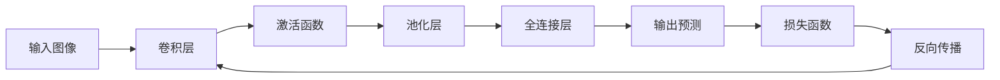

# 一切皆是映射：卷积神经网络(CNN)解密

## 1. 背景介绍
### 1.1 人工智能与深度学习的崛起
近年来,人工智能(AI)和深度学习(DL)技术取得了突飞猛进的发展。从图像识别、语音识别到自然语言处理等领域,AI和DL展现出了令人瞩目的性能,甚至在某些任务上已经超越了人类的表现。这一切都得益于深度神经网络模型的出现和发展。

### 1.2 卷积神经网络(CNN)的重要地位
在众多深度学习模型中,卷积神经网络(Convolutional Neural Network, CNN)尤其引人注目。CNN在图像识别、目标检测、语义分割等计算机视觉任务中取得了state-of-the-art的结果,成为当前图像领域最为成功和广泛应用的模型之一。从经典的LeNet、AlexNet到更加深入复杂的VGGNet、GoogLeNet、ResNet等,CNN架构的创新和改进推动了整个计算机视觉领域的快速发展。

### 1.3 理解CNN内在机制的重要性
尽管CNN在实践中取得了巨大成功,但对其内在工作机制的理解却常常被忽视。很多从业者把CNN当做一个"黑盒子",只关注如何调参优化模型性能,而忽略了探究其内在原理。事实上,深入理解CNN的核心概念、数学原理和内在机制,不仅有助于我们更好地应用CNN解决实际问题,也为进一步的理论创新和算法改进提供了重要基础。

## 2. 核心概念与联系
### 2.1 卷积(Convolution)
卷积是CNN的核心操作,借鉴了生物视觉系统的启发。卷积操作通过滑动窗口(卷积核)对输入图像进行局部特征提取,通过加权求和生成新的特征图。这种局部连接和权值共享的设计使得CNN能够高效地学习到图像的空间不变性特征。

### 2.2 池化(Pooling)  
池化是CNN中常用的下采样操作,目的是降低特征图的空间维度,减少计算量和参数数量,同时保持重要的特征信息。常见的池化操作包括最大池化(Max Pooling)和平均池化(Average Pooling)。池化具有平移不变性,使得CNN对小的空间偏移具有鲁棒性。

### 2.3 激活函数(Activation Function)
激活函数为CNN引入了非线性变换能力。常用的激活函数包括ReLU、Sigmoid、Tanh等。其中ReLU (Rectified Linear Unit)因其简单高效而被广泛使用。激活函数的非线性特性使得CNN能够逼近任意复杂的函数映射。

### 2.4 全连接层(Fully Connected Layer) 
全连接层通常位于CNN的末端,对卷积和池化提取到的特征进行非线性组合,生成最终的预测输出。全连接层将特征图"压平"成一维向量,并通过权重矩阵进行线性变换和非线性激活。

### 2.5 反向传播(Backpropagation)
CNN的训练依赖于反向传播算法。通过比较网络预测输出与真实标签之间的损失,反向传播算法利用链式法则递归计算每个参数的梯度,并使用梯度下降等优化算法更新网络权重,最小化损失函数。反向传播使得CNN能够端到端地学习特征提取和分类任务。

### 2.6 层级结构(Hierarchical Structure)
CNN的层级结构是其强大表示能力的关键。浅层卷积提取低级局部特征如边缘、纹理等,深层卷积组合低级特征形成高级抽象特征如物体部件、场景等。这种层级抽象使得CNN能够表示复杂的视觉概念。

下面是这些核心概念之间关系的 Mermaid 流程图:



## 3. 核心算法原理与具体操作步骤
### 3.1 卷积操作
卷积操作是通过卷积核(滤波器)在输入特征图上滑动,对局部区域进行加权求和,生成新的特征图。具体步骤如下:

1. 选择合适大小的卷积核(如3x3、5x5)
2. 将卷积核在输入特征图上按照指定步长(stride)滑动
3. 在每个位置,将卷积核与对应的输入局部区域进行逐元素相乘并求和
4. 将结果作为输出特征图上对应位置的值
5. 重复步骤2-4,直到遍历完整个输入特征图

卷积操作的数学表达为:

$$O(i,j) = \sum_{m}\sum_{n} I(i+m, j+n) \cdot K(m,n)$$

其中$I$为输入特征图,$K$为卷积核,$O$为输出特征图。

### 3.2 池化操作
池化操作用于减少特征图的空间维度,具体步骤如下:

1. 选择合适大小的池化窗口(如2x2)和步长
2. 将池化窗口在输入特征图上按照指定步长滑动
3. 在每个窗口内,选取最大值(最大池化)或平均值(平均池化)作为输出
4. 重复步骤2-3,直到遍历完整个输入特征图

以最大池化为例,其数学表达为:

$$O(i,j) = \max_{m,n} I(i \cdot s + m, j \cdot s + n)$$

其中$s$为池化步长。

### 3.3 前向传播
前向传播是将输入图像通过卷积、池化、激活等操作逐层映射到输出预测的过程。具体步骤如下:

1. 输入图像通过卷积层提取特征,生成多个特征图
2. 对特征图应用激活函数(如ReLU),引入非线性变换
3. 对激活后的特征图进行池化操作,减小空间维度
4. 重复步骤1-3,直到获得高级抽象特征图
5. 将最后一层特征图"压平"成一维向量
6. 通过全连接层将特征向量映射到输出类别预测

### 3.4 反向传播
反向传播用于计算损失函数对每个参数的梯度,并更新网络权重。具体步骤如下:

1. 前向传播计算出输出预测和损失函数值
2. 计算损失函数对输出层的梯度
3. 逐层反向传播梯度:
   - 计算当前层损失函数对权重、偏置的梯度
   - 计算损失函数对上一层输入的梯度
   - 传递梯度到上一层,重复步骤3
4. 使用梯度下降等优化算法更新每层权重
5. 重复步骤1-4,直到网络收敛或达到预设的迭代次数

## 4. 数学模型与公式详解
### 4.1 卷积的数学表示
假设输入特征图为$I$,卷积核为$K$,卷积步长为$s$,输出特征图为$O$,则卷积操作可表示为:

$$O(i,j) = \sum_{m}\sum_{n} I(s \cdot i+m, s \cdot j+n) \cdot K(m,n)$$

其中,$(i,j)$为输出特征图上的位置坐标,$(m,n)$为卷积核内的相对坐标。

例如,对于一个3x3的卷积核$K$和步长为1的卷积操作,输出特征图上位置$(i,j)$的值为:

$$O(i,j) = \sum_{m=0}^{2}\sum_{n=0}^{2} I(i+m, j+n) \cdot K(m,n)$$

### 4.2 池化的数学表示
假设输入特征图为$I$,池化窗口大小为$k \times k$,池化步长为$s$,输出特征图为$O$,则池化操作可表示为:

- 最大池化:
$$O(i,j) = \max_{0 \leq m,n < k} I(s \cdot i+m, s \cdot j+n)$$

- 平均池化:  
$$O(i,j) = \frac{1}{k^2} \sum_{m=0}^{k-1}\sum_{n=0}^{k-1} I(s \cdot i+m, s \cdot j+n)$$

例如,对于2x2最大池化,步长为2,输出特征图上位置$(i,j)$的值为输入特征图上对应2x2窗口内的最大值:

$$O(i,j) = \max\begin{pmatrix} 
I(2i,2j) & I(2i,2j+1) \\
I(2i+1,2j) & I(2i+1,2j+1)
\end{pmatrix}$$

### 4.3 激活函数
常见的激活函数包括:

- ReLU: $f(x) = \max(0,x)$
- Sigmoid: $f(x) = \frac{1}{1+e^{-x}}$  
- Tanh: $f(x) = \frac{e^x - e^{-x}}{e^x + e^{-x}}$

激活函数为网络引入非线性变换,提升了网络的表示能力。以ReLU为例,其数学表达为:

$$f(x) = \begin{cases}
x, & x > 0 \\
0, & x \leq 0
\end{cases}$$

ReLU函数对正值保持不变,对负值输出0,具有稀疏激活的特点。

### 4.4 损失函数
CNN的训练目标是最小化损失函数。对于分类任务,常用的损失函数是交叉熵损失(Cross-entropy Loss):

$$L = -\sum_{i=1}^{N} y_i \log(\hat{y}_i)$$

其中,$y_i$为真实标签(one-hot编码),$\hat{y}_i$为网络预测概率。

例如,对于一个3分类问题,真实标签为$[0,1,0]$(第2类),网络预测概率为$[0.1,0.7,0.2]$,则交叉熵损失为:

$$L = -[0 \cdot \log(0.1) + 1 \cdot \log(0.7) + 0 \cdot \log(0.2)] = 0.357$$

网络训练的目标就是通过调整权重参数,最小化整个训练集上的平均交叉熵损失。

## 5. 项目实践：代码实例与详解
下面以PyTorch为例,展示如何实现一个简单的CNN分类模型:

```python
import torch
import torch.nn as nn
import torch.optim as optim

# 定义CNN模型
class CNN(nn.Module):
    def __init__(self):
        super(CNN, self).__init__()
        self.conv1 = nn.Conv2d(1, 16, kernel_size=3, stride=1, padding=1)
        self.relu1 = nn.ReLU()
        self.pool1 = nn.MaxPool2d(kernel_size=2)
        self.conv2 = nn.Conv2d(16, 32, kernel_size=3, stride=1, padding=1)
        self.relu2 = nn.ReLU()
        self.pool2 = nn.MaxPool2d(kernel_size=2)
        self.fc = nn.Linear(32 * 7 * 7, 10)
        
    def forward(self, x):
        x = self.conv1(x)
        x = self.relu1(x)
        x = self.pool1(x)
        x = self.conv2(x)
        x = self.relu2(x)
        x = self.pool2(x)
        x = x.view(x.size(0), -1)
        x = self.fc(x)
        return x

# 实例化模型
model = CNN()

# 定义损失函数和优化器
criterion = nn.CrossEntropyLoss()
optimizer = optim.Adam(model.parameters(), lr=0.001)

# 训练模型
num_epochs = 10
for epoch in range(num_epochs):
    for images, labels in train_loader:
        # 前向传播
        outputs = model(images)
        loss = criterion(outputs, labels)
        
        # 反向传播和优化
        optimizer.zero_grad()
        loss.backward()
        optimizer.step()
        
    print(f'Epoch [{epoch+1}/{num_epochs}], Loss: {loss.item():.4f}')

# 测试模型
with torch.no_grad():
    correct = 0
    total = 0
    for images, labels in test_loader:
        outputs = model(images)
        _, predicted = torch.max(outputs.data, 1)
        total += labels.size(0)
        correct += (predicted == labels).sum().item()
    
    print(f'Accuracy of the model on the test images: {100 * correct / total:.2f}%')
```

代码解释:

1. 定