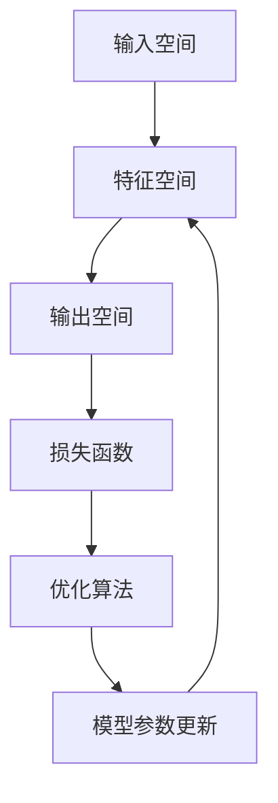

# 一切皆是映射：损失函数深度剖析

## 1. 背景介绍
### 1.1 机器学习中的优化问题
#### 1.1.1 有监督学习的本质
#### 1.1.2 无监督学习的优化目标
#### 1.1.3 强化学习中的奖励函数
### 1.2 损失函数的重要性
#### 1.2.1 损失函数定义模型优化方向  
#### 1.2.2 损失函数影响模型泛化能力
#### 1.2.3 损失函数是算法设计的核心

## 2. 核心概念与联系
### 2.1 映射的数学定义
#### 2.1.1 映射的概念与符号表示
#### 2.1.2 域、陪域和对应法则
#### 2.1.3 映射的分类：单射、满射、双射
### 2.2 机器学习中的映射 
#### 2.2.1 输入空间到特征空间的映射
#### 2.2.2 特征空间到输出空间的映射
#### 2.2.3 损失函数：输出空间到实数集的映射
### 2.3 损失函数与优化目标的关系
#### 2.3.1 经验风险最小化
#### 2.3.2 结构风险最小化
#### 2.3.3 最大间隔原则

## 3. 核心算法原理具体操作步骤
### 3.1 梯度下降法
#### 3.1.1 梯度的概念与计算
#### 3.1.2 学习率的选择
#### 3.1.3 批量梯度下降、随机梯度下降、小批量梯度下降
### 3.2 牛顿法与拟牛顿法
#### 3.2.1 牛顿法的原理 
#### 3.2.2 拟牛顿法：BFGS和L-BFGS
#### 3.2.3 牛顿法和拟牛顿法的比较
### 3.3 自适应学习率优化算法
#### 3.3.1 AdaGrad算法
#### 3.3.2 RMSProp算法 
#### 3.3.3 Adam算法

## 4. 数学模型和公式详细讲解举例说明
### 4.1 回归问题中的损失函数
#### 4.1.1 平方损失函数（L2损失）
$$L(y, \hat{y}) = \frac{1}{2}(y-\hat{y})^2$$
#### 4.1.2 绝对值损失函数（L1损失）  
$$L(y, \hat{y}) = |y-\hat{y}|$$ 
#### 4.1.3 Huber损失函数
$$L_{\delta}(y, \hat{y})=\left\{\begin{array}{ll}
\frac{1}{2}(y-\hat{y})^{2} & \text { for }|y-\hat{y}| \leq \delta \\
\delta\left(|y-\hat{y}|-\frac{1}{2} \delta\right) & \text { otherwise }
\end{array}\right.$$
### 4.2 分类问题中的损失函数
#### 4.2.1 0-1损失函数
$$L(y, \hat{y})=\left\{\begin{array}{ll}
0 & \text { if } y=\hat{y} \\
1 & \text { if } y \neq \hat{y}
\end{array}\right.$$
#### 4.2.2 对数损失函数（交叉熵损失）
对于二分类问题：$L(y, p)=-y \log p-(1-y) \log (1-p)$
对于多分类问题：$L(y, \mathbf{p})=-\sum_{i=1}^{C} y_{i} \log p_{i}$
#### 4.2.3 合页损失函数（Hinge Loss）
$$L(y, \hat{y})=\max (0,1-y \hat{y})$$
### 4.3 正则化项的作用与常见形式
#### 4.3.1 L1正则化（Lasso回归）
$$R(\mathbf{w})=\lambda\|\mathbf{w}\|_{1}=\lambda \sum_{i=1}^{d}\left|w_{i}\right|$$
#### 4.3.2 L2正则化（Ridge回归）
$$R(\mathbf{w})=\lambda\|\mathbf{w}\|_{2}^{2}=\lambda \sum_{i=1}^{d} w_{i}^{2}$$
#### 4.3.3 弹性网络（Elastic Net）正则化
$$R(\mathbf{w})=\lambda_{1}\|\mathbf{w}\|_{1}+\lambda_{2}\|\mathbf{w}\|_{2}^{2}$$

## 5. 项目实践：代码实例和详细解释说明
### 5.1 使用PyTorch实现线性回归
#### 5.1.1 生成随机数据集
#### 5.1.2 定义模型和损失函数
#### 5.1.3 训练模型并可视化结果
### 5.2 使用TensorFlow实现逻辑回归
#### 5.2.1 加载MNIST数据集
#### 5.2.2 定义模型架构和损失函数
#### 5.2.3 训练模型并评估性能
### 5.3 使用Keras实现多层感知机
#### 5.3.1 准备Fashion-MNIST数据集
#### 5.3.2 构建多层感知机模型
#### 5.3.3 选择损失函数和优化器
#### 5.3.4 训练模型并绘制学习曲线

## 6. 实际应用场景
### 6.1 计算机视觉中的损失函数
#### 6.1.1 图像分类任务的损失函数选择
#### 6.1.2 目标检测中的损失函数设计
#### 6.1.3 语义分割中的损失函数改进
### 6.2 自然语言处理中的损失函数
#### 6.2.1 语言模型的困惑度（Perplexity）
#### 6.2.2 机器翻译中的BLEU评价指标
#### 6.2.3 文本分类中的交叉熵损失
### 6.3 推荐系统中的损失函数
#### 6.3.1 矩阵分解中的平方损失
#### 6.3.2 排序学习中的成对损失
#### 6.3.3 点击率预估中的交叉熵损失

## 7. 工具和资源推荐
### 7.1 深度学习框架
#### 7.1.1 TensorFlow
#### 7.1.2 PyTorch
#### 7.1.3 Keras
### 7.2 可视化工具
#### 7.2.1 TensorBoard
#### 7.2.2 Matplotlib
#### 7.2.3 Seaborn
### 7.3 学习资源
#### 7.3.1 在线课程平台
#### 7.3.2 经典书籍推荐
#### 7.3.3 学术论文与会议

## 8. 总结：未来发展趋势与挑战
### 8.1 自动机器学习（AutoML）中的损失函数设计
#### 8.1.1 神经网络架构搜索（NAS）中的损失函数
#### 8.1.2 超参数优化中的损失函数选择
#### 8.1.3 自动特征工程中的损失函数设计
### 8.2 多任务学习与迁移学习中的损失函数权衡
#### 8.2.1 多任务学习中的任务权重调节
#### 8.2.2 迁移学习中的域适应损失函数
#### 8.2.3 终身学习中的遗忘与记忆权衡
### 8.3 面向隐私保护和公平性的损失函数设计
#### 8.3.1 差分隐私中的损失函数改进
#### 8.3.2 算法公平性约束下的损失函数优化
#### 8.3.3 联邦学习中的损失函数聚合

## 9. 附录：常见问题与解答
### 9.1 如何选择合适的损失函数？
### 9.2 损失函数不收敛的原因有哪些？
### 9.3 如何处理损失函数的梯度消失和梯度爆炸问题？
### 9.4 正则化项的系数如何选择？
### 9.5 如何平衡多个损失函数之间的权重？

在机器学习的建模过程中，一切都可以看作是一个个映射。从原始输入数据到提取的特征，再到模型的输出，以及评估模型性能的损失函数，每一步都在完成一个映射。而损失函数作为链接输出空间和优化目标的桥梁，在整个学习过程中扮演着至关重要的角色。

通过对不同类型损失函数的深入剖析，我们可以发现它们在回归、分类等任务中的异同。合适的损失函数选择需要考虑数据的特点、模型的假设以及优化的难易程度等因素。而为了进一步提升模型的泛化性能，我们还需要在损失函数中引入正则化项，以对模型复杂度进行约束。

随着深度学习的发展，越来越多的应用场景对损失函数提出了新的要求。在计算机视觉、自然语言处理、推荐系统等领域，研究者们不断探索更加精巧、更加符合任务特点的损失函数设计。同时，自动机器学习、多任务学习、隐私保护等新兴方向也给损失函数的设计带来了新的挑战和机遇。

展望未来，损失函数的研究将继续深化我们对机器学习本质的认识，并为构建更加智能、更加鲁棒、更加安全的人工智能系统提供重要支撑。让我们一起拥抱这个"一切皆是映射"的时代，探索损失函数的无限可能。

作者：禅与计算机程序设计艺术 / Zen and the Art of Computer Programming