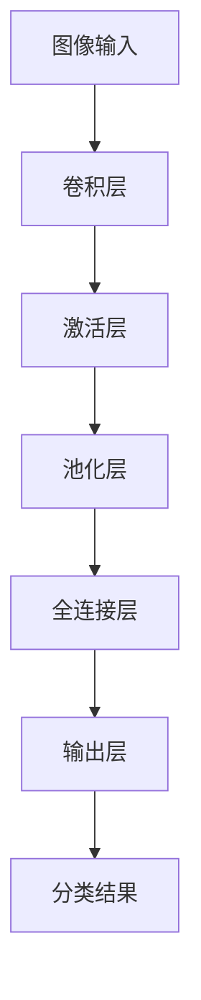

# 一切皆是映射：机器视觉与神经网络的结合应用

## 1. 背景介绍

### 1.1 机器视觉的发展历程
#### 1.1.1 早期的机器视觉系统
#### 1.1.2 基于特征工程的机器视觉方法
#### 1.1.3 深度学习时代的机器视觉革命

### 1.2 神经网络的兴起
#### 1.2.1 人工神经网络的起源
#### 1.2.2 深度学习的突破
#### 1.2.3 神经网络在各领域的应用

### 1.3 机器视觉与神经网络的结合
#### 1.3.1 CNN在图像识别中的成功应用
#### 1.3.2 语义分割、目标检测等任务的进展
#### 1.3.3 生成对抗网络在图像生成中的应用

## 2. 核心概念与联系

### 2.1 机器视觉的基本概念
#### 2.1.1 图像表示与特征提取
#### 2.1.2 图像分类、目标检测与分割
#### 2.1.3 3D视觉与场景理解

### 2.2 神经网络的核心原理
#### 2.2.1 神经元模型与激活函数
#### 2.2.2 前向传播与反向传播算法
#### 2.2.3 损失函数与优化方法

### 2.3 机器视觉与神经网络的内在联系
#### 2.3.1 卷积神经网络对视觉特征的提取
#### 2.3.2 端到端学习范式的优势
#### 2.3.3 神经网络在视觉任务中的表现

## 3. 核心算法原理具体操作步骤

### 3.1 卷积神经网络(CNN)
#### 3.1.1 卷积层与池化层
#### 3.1.2 经典CNN网络结构：AlexNet、VGGNet、GoogLeNet
#### 3.1.3 残差网络(ResNet)与更深的网络

### 3.2 目标检测算法
#### 3.2.1 两阶段检测器：R-CNN系列算法
#### 3.2.2 单阶段检测器：YOLO、SSD
#### 3.2.3 anchor-free检测算法

### 3.3 语义分割算法 
#### 3.3.1 全卷积网络(FCN)
#### 3.3.2 编码器-解码器结构：SegNet、U-Net
#### 3.3.3 多尺度特征融合：PSPNet、DeepLab系列

## 4. 数学模型和公式详细讲解举例说明

### 4.1 卷积操作的数学表示
#### 4.1.1 二维卷积的定义与计算
#### 4.1.2 多通道卷积与高维卷积
#### 4.1.3 转置卷积(反卷积)

### 4.2 反向传播算法的推导
#### 4.2.1 链式法则与梯度计算
#### 4.2.2 均方误差损失函数的梯度推导
#### 4.2.3 交叉熵损失函数的梯度推导

### 4.3 优化算法详解
#### 4.3.1 梯度下降法及其变种
#### 4.3.2 自适应学习率方法：Adagrad、RMSprop
#### 4.3.3 动量法与Adam优化器

## 5. 项目实践：代码实例和详细解释说明

### 5.1 图像分类任务
#### 5.1.1 数据集准备与数据增强
#### 5.1.2 搭建CNN网络结构
#### 5.1.3 训练与测试过程

### 5.2 目标检测任务
#### 5.2.1 标注格式与数据准备
#### 5.2.2 基于Faster R-CNN的目标检测
#### 5.2.3 基于YOLOv3的实时目标检测

### 5.3 语义分割任务
#### 5.3.1 图像标注与数据增强
#### 5.3.2 基于FCN的语义分割
#### 5.3.3 U-Net在医学图像分割中的应用

## 6. 实际应用场景

### 6.1 智慧城市
#### 6.1.1 交通场景下的车辆与行人检测
#### 6.1.2 城市环境监测与异常行为分析
#### 6.1.3 智能安防与人脸识别

### 6.2 医疗影像分析
#### 6.2.1 医学图像的分类与检索
#### 6.2.2 病灶区域的自动分割
#### 6.2.3 辅助诊断与疾病预测

### 6.3 工业视觉检测
#### 6.3.1 工业产品的缺陷检测
#### 6.3.2 生产线上的目标定位与跟踪
#### 6.3.3 机器人视觉导航与抓取

## 7. 工具和资源推荐

### 7.1 深度学习框架
#### 7.1.1 TensorFlow
#### 7.1.2 PyTorch
#### 7.1.3 Keras

### 7.2 开源数据集
#### 7.2.1 ImageNet
#### 7.2.2 COCO
#### 7.2.3 PASCAL VOC

### 7.3 预训练模型与迁移学习
#### 7.3.1 模型库：TensorFlow Hub、PyTorch Hub
#### 7.3.2 迁移学习的优势与应用
#### 7.3.3 模型压缩与加速技术

## 8. 总结：未来发展趋势与挑战

### 8.1 机器视觉的未来方向
#### 8.1.1 弱监督与无监督学习
#### 8.1.2 视觉-语言多模态理解
#### 8.1.3 三维视觉与AR/VR应用

### 8.2 神经网络的发展趋势
#### 8.2.1 图神经网络与关系推理
#### 8.2.2 神经架构搜索与自动机器学习
#### 8.2.3 神经符号推理与可解释性

### 8.3 机器视觉与神经网络面临的挑战
#### 8.3.1 数据标注的成本与难度
#### 8.3.2 模型的泛化能力与鲁棒性
#### 8.3.3 隐私保护与公平性问题

## 9. 附录：常见问题与解答

### 9.1 如何选择合适的CNN网络结构？
### 9.2 目标检测算法的性能指标有哪些？
### 9.3 语义分割任务中如何处理类别不平衡问题？
### 9.4 如何进行数据增强以提高模型的泛化能力？
### 9.5 模型训练过程中出现过拟合怎么办？
### 9.6 如何加速模型的推理速度？

以上是一个典型的卷积神经网络(CNN)的处理流程。首先将图像输入到网络中，经过一系列卷积层提取特征，每个卷积层后通常跟随一个激活层(如ReLU)增加非线性。接着使用池化层对特征图进行下采样，减小特征图的尺寸。经过多次卷积、激活和池化后，将特征图展平并输入到全连接层中进行分类或回归任务。最后通过输出层给出预测结果。

机器视觉与神经网络的结合，特别是卷积神经网络的应用，极大地推动了计算机视觉领域的发展。CNN通过局部连接和权重共享，能够有效地提取图像中的空间特征，并具有一定的平移不变性。从最初的LeNet到AlexNet、VGGNet、GoogLeNet、ResNet等经典网络结构，CNN的性能不断提升，在图像分类、目标检测、语义分割等任务上取得了巨大成功。

然而，机器视觉与神经网络的结合仍然面临许多挑战。其一是大规模标注数据的获取成本高昂，因此亟需研究弱监督学习、无监督学习等方法，充分利用未标注数据。其二是现有模型的泛化能力和鲁棒性有待提高，特别是在面对对抗样本、噪声干扰等情况时。此外，模型的可解释性也是一个重要问题，需要研究如何让神经网络的决策过程更加透明和可理解。

未来，机器视觉与神经网络的结合将向着多模态、三维化、自适应的方向发展。视觉信息与语言信息的融合，将使机器能够更全面地理解场景。三维视觉技术的进步，将促进AR/VR等沉浸式应用的落地。神经架构搜索、元学习等自动化机器学习技术，将极大地提升模型设计和训练的效率。同时，图神经网络、神经符号推理等新兴方法，有望突破当前深度学习范式的局限，实现更强大的关系推理和逻辑推理能力。

总之，机器视觉与神经网络的结合，为人工智能的发展开辟了广阔的前景。从理论研究到工程实践，从算法创新到应用落地，这一领域正在不断突破边界、创造奇迹。让我们携手并进，共同探索这一充满想象力和创造力的未知领域，用智能视觉技术造福人类社会。

作者：禅与计算机程序设计艺术 / Zen and the Art of Computer Programming