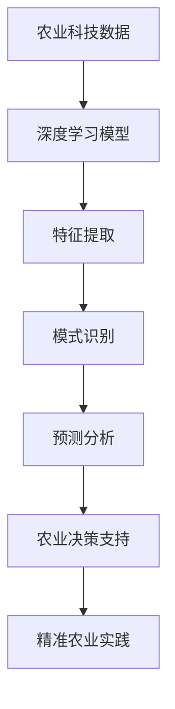

# 一切皆是映射：深度学习在农业科技中的实践

## 1. 背景介绍

### 1.1 农业科技的发展历程
#### 1.1.1 传统农业时代
#### 1.1.2 现代农业革命
#### 1.1.3 智慧农业的兴起

### 1.2 深度学习技术概述  
#### 1.2.1 人工智能与机器学习
#### 1.2.2 深度学习的崛起
#### 1.2.3 深度学习的优势与应用领域

### 1.3 深度学习在农业科技中的应用前景
#### 1.3.1 提高农业生产效率
#### 1.3.2 优化农业资源配置 
#### 1.3.3 促进农业可持续发展

## 2. 核心概念与联系

### 2.1 映射的概念与数学表示
#### 2.1.1 映射的定义
#### 2.1.2 映射的数学符号与性质
#### 2.1.3 映射在深度学习中的应用

### 2.2 深度学习中的关键概念
#### 2.2.1 人工神经网络
#### 2.2.2 前馈神经网络与反向传播算法
#### 2.2.3 卷积神经网络与循环神经网络

### 2.3 农业科技中的关键概念
#### 2.3.1 精准农业
#### 2.3.2 作物生长模型
#### 2.3.3 农业遥感与物联网

### 2.4 深度学习与农业科技的联系
#### 2.4.1 深度学习在农业数据分析中的应用
#### 2.4.2 深度学习在作物生长模拟中的应用
#### 2.4.3 深度学习在农业决策支持中的应用



## 3. 核心算法原理具体操作步骤

### 3.1 卷积神经网络（CNN）
#### 3.1.1 卷积层与池化层
#### 3.1.2 激活函数与损失函数
#### 3.1.3 CNN在农业图像识别中的应用

### 3.2 循环神经网络（RNN）
#### 3.2.1 RNN的基本结构
#### 3.2.2 长短期记忆网络（LSTM）
#### 3.2.3 RNN在农业时间序列预测中的应用

### 3.3 生成对抗网络（GAN）
#### 3.3.1 GAN的基本原理
#### 3.3.2 条件生成对抗网络（CGAN）
#### 3.3.3 GAN在农业数据增强中的应用

## 4. 数学模型和公式详细讲解举例说明

### 4.1 前馈神经网络的数学模型
#### 4.1.1 神经元的数学表示
$$ y = f(\sum_{i=1}^{n} w_i x_i + b) $$
其中，$y$为神经元的输出，$f$为激活函数，$w_i$为权重，$x_i$为输入，$b$为偏置。

#### 4.1.2 前馈神经网络的前向传播
$$ h_j = f(\sum_{i=1}^{n} w_{ij} x_i + b_j) $$
$$ y_k = g(\sum_{j=1}^{m} v_{jk} h_j + c_k) $$
其中，$h_j$为隐藏层神经元的输出，$y_k$为输出层神经元的输出，$f$和$g$分别为隐藏层和输出层的激活函数。

#### 4.1.3 反向传播算法的数学推导
$$ \frac{\partial E}{\partial w_{ij}} = \frac{\partial E}{\partial y_k} \frac{\partial y_k}{\partial h_j} \frac{\partial h_j}{\partial w_{ij}} $$
$$ \Delta w_{ij} = -\eta \frac{\partial E}{\partial w_{ij}} $$
其中，$E$为损失函数，$\eta$为学习率。

### 4.2 卷积神经网络的数学模型
#### 4.2.1 卷积操作的数学表示
$$ (f * g)(i,j) = \sum_{m} \sum_{n} f(m,n) g(i-m,j-n) $$
其中，$f$为输入，$g$为卷积核。

#### 4.2.2 池化操作的数学表示
$$ y_{i,j} = \max_{m,n \in R_{ij}} x_{m,n} $$
其中，$R_{ij}$为池化窗口，$x_{m,n}$为输入。

### 4.3 作物生长模型的数学表示
#### 4.3.1 作物生长的数学模型
$$ \frac{dW}{dt} = \mu W \left(1 - \frac{W}{K}\right) $$
其中，$W$为作物生物量，$\mu$为生长率，$K$为环境容量。

#### 4.3.2 环境因素对作物生长的影响
$$ \mu = \mu_0 f(T) g(I) h(W) $$
其中，$\mu_0$为最大生长率，$f(T)$、$g(I)$、$h(W)$分别为温度、光照、水分对生长率的影响函数。

## 5. 项目实践：代码实例和详细解释说明

### 5.1 使用CNN进行作物病虫害识别
#### 5.1.1 数据集准备与预处理
#### 5.1.2 CNN模型构建与训练
#### 5.1.3 模型评估与优化

```python
import tensorflow as tf

model = tf.keras.models.Sequential([
    tf.keras.layers.Conv2D(32, (3,3), activation='relu', input_shape=(64,64,3)),
    tf.keras.layers.MaxPooling2D((2,2)),
    tf.keras.layers.Conv2D(64, (3,3), activation='relu'),
    tf.keras.layers.MaxPooling2D((2,2)),
    tf.keras.layers.Conv2D(64, (3,3), activation='relu'),
    tf.keras.layers.Flatten(),
    tf.keras.layers.Dense(64, activation='relu'),
    tf.keras.layers.Dense(10)
])

model.compile(optimizer='adam',
              loss=tf.keras.losses.SparseCategoricalCrossentropy(from_logits=True),
              metrics=['accuracy'])

history = model.fit(train_images, train_labels, epochs=10, 
                    validation_data=(test_images, test_labels))
```

### 5.2 使用RNN进行作物产量预测
#### 5.2.1 时间序列数据准备与预处理
#### 5.2.2 LSTM模型构建与训练
#### 5.2.3 模型评估与优化

```python
import tensorflow as tf

model = tf.keras.models.Sequential([
    tf.keras.layers.LSTM(64, input_shape=(10,1)),
    tf.keras.layers.Dense(1)
])

model.compile(optimizer='adam', loss='mse')

history = model.fit(train_data, train_labels, epochs=50, 
                    validation_data=(test_data, test_labels))
```

### 5.3 使用GAN生成农业数据
#### 5.3.1 农业数据准备与预处理
#### 5.3.2 GAN模型构建与训练
#### 5.3.3 生成数据的评估与应用

```python
import tensorflow as tf

generator = tf.keras.Sequential([
    tf.keras.layers.Dense(256, input_shape=(100,)),
    tf.keras.layers.LeakyReLU(0.2),
    tf.keras.layers.Dense(512),
    tf.keras.layers.LeakyReLU(0.2), 
    tf.keras.layers.Dense(1024),
    tf.keras.layers.LeakyReLU(0.2),
    tf.keras.layers.Dense(28*28, activation='tanh'),
    tf.keras.layers.Reshape((28,28))
])

discriminator = tf.keras.Sequential([
    tf.keras.layers.Flatten(input_shape=(28,28)),
    tf.keras.layers.Dense(512),
    tf.keras.layers.LeakyReLU(0.2),
    tf.keras.layers.Dense(256),
    tf.keras.layers.LeakyReLU(0.2),
    tf.keras.layers.Dense(1, activation='sigmoid')
])

cross_entropy = tf.keras.losses.BinaryCrossentropy(from_logits=True)

def discriminator_loss(real_output, fake_output):
    real_loss = cross_entropy(tf.ones_like(real_output), real_output)
    fake_loss = cross_entropy(tf.zeros_like(fake_output), fake_output)
    total_loss = real_loss + fake_loss
    return total_loss

def generator_loss(fake_output):
    return cross_entropy(tf.ones_like(fake_output), fake_output)

generator_optimizer = tf.keras.optimizers.Adam(1e-4)
discriminator_optimizer = tf.keras.optimizers.Adam(1e-4)

@tf.function
def train_step(images):
    noise = tf.random.normal([BATCH_SIZE, 100])

    with tf.GradientTape() as gen_tape, tf.GradientTape() as disc_tape:
        generated_images = generator(noise, training=True)

        real_output = discriminator(images, training=True)
        fake_output = discriminator(generated_images, training=True)

        gen_loss = generator_loss(fake_output)
        disc_loss = discriminator_loss(real_output, fake_output)

    gradients_of_generator = gen_tape.gradient(gen_loss, generator.trainable_variables)
    gradients_of_discriminator = disc_tape.gradient(disc_loss, discriminator.trainable_variables)

    generator_optimizer.apply_gradients(zip(gradients_of_generator, generator.trainable_variables))
    discriminator_optimizer.apply_gradients(zip(gradients_of_discriminator, discriminator.trainable_variables))

def train(dataset, epochs):
    for epoch in range(epochs):
        for image_batch in dataset:
            train_step(image_batch)
```

## 6. 实际应用场景

### 6.1 智能灌溉系统
#### 6.1.1 基于深度学习的土壤水分预测
#### 6.1.2 智能灌溉决策支持系统

### 6.2 农作物病虫害防治
#### 6.2.1 基于深度学习的病虫害识别
#### 6.2.2 病虫害预警与防治决策系统

### 6.3 农产品质量分级
#### 6.3.1 基于深度学习的农产品质量评估
#### 6.3.2 农产品质量分级与追溯系统

## 7. 工具和资源推荐

### 7.1 深度学习框架
#### 7.1.1 TensorFlow
#### 7.1.2 PyTorch
#### 7.1.3 Keras

### 7.2 农业数据集
#### 7.2.1 PlantVillage数据集
#### 7.2.2 AgriVision数据集
#### 7.2.3 CWFID数据集

### 7.3 农业科技平台
#### 7.3.1 农业物联网平台
#### 7.3.2 农业大数据分析平台
#### 7.3.3 农业智能决策支持系统

## 8. 总结：未来发展趋势与挑战

### 8.1 深度学习在农业科技中的发展趋势
#### 8.1.1 多模态数据融合
#### 8.1.2 模型轻量化与移动端部署
#### 8.1.3 强化学习在农业决策中的应用

### 8.2 深度学习在农业科技中面临的挑战
#### 8.2.1 农业数据的采集与标注
#### 8.2.2 模型的可解释性与可信度
#### 8.2.3 跨区域与跨作物的泛化能力

### 8.3 展望未来
#### 8.3.1 深度学习与农业科技的深度融合
#### 8.3.2 智慧农业的全面发展
#### 8.3.3 农业科技助力全球粮食安全

## 9. 附录：常见问题与解答

### 9.1 深度学习在农业科技中应用的局限性
### 9.2 如何选择适合的深度学习模型
### 9.3 农业数据采集与预处理的注意事项
### 9.4 深度学习模型的训练与优化技巧
### 9.5 农业科技项目落地的难点与对策

深度学习作为人工智能的核心技术之一，正在为农业科技的发展注入新的活力。通过将深度学习与农业领域的专业知识相结合，我们可以开发出更加智能、高效、可持续的农业生产模式。从作物生长模拟到病虫害识别，从智能灌溉到农产品质量分级，深度学习在农业的各个环节都得到了广泛应用。

然而，将深度学习应用于农业科技也面临着诸多挑战。农业数据的采集与标注成本高、模型的可解释性与可信度有待提高、跨区域与跨作物的泛化能力仍需加强。未来，深度学习与农业科技的深度融合将推动智慧农业的全面发展，为全球粮食安全提供有力保障。

一切皆是映射，深度学习在农业科技中的实践正是对这一哲学思想的最佳诠释