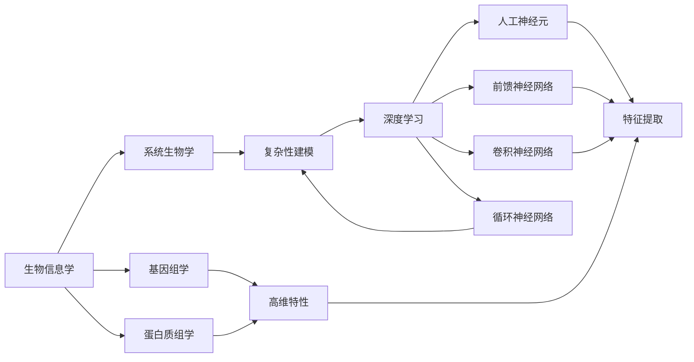

# 一切皆是映射：深度学习在生物信息学中的应用前景

## 1. 背景介绍
### 1.1 生物信息学的兴起
#### 1.1.1 生物学与信息技术的交叉融合
#### 1.1.2 海量生物数据的挑战与机遇
#### 1.1.3 传统生物信息学方法的局限性

### 1.2 深度学习技术的崛起 
#### 1.2.1 人工神经网络的发展历程
#### 1.2.2 深度学习的核心思想与优势
#### 1.2.3 深度学习在各领域的成功应用

### 1.3 深度学习与生物信息学的结合
#### 1.3.1 深度学习为生物信息学带来的变革
#### 1.3.2 深度学习在生物信息学中的应用现状
#### 1.3.3 深度学习在生物信息学中的应用前景

## 2. 核心概念与联系
### 2.1 生物信息学中的关键概念
#### 2.1.1 基因组学与测序技术
#### 2.1.2 蛋白质组学与结构生物学
#### 2.1.3 系统生物学与生物网络

### 2.2 深度学习中的核心概念
#### 2.2.1 人工神经元与激活函数 
#### 2.2.2 前馈神经网络与反向传播算法
#### 2.2.3 卷积神经网络与循环神经网络

### 2.3 生物信息学与深度学习的联系
#### 2.3.1 生物数据的高维特性与深度学习的特征提取能力
#### 2.3.2 生物过程的复杂性与深度学习的建模优势 
#### 2.3.3 生物信息学问题与深度学习任务的对应关系



## 3. 核心算法原理与具体操作步骤
### 3.1 卷积神经网络（CNN）
#### 3.1.1 卷积层与池化层
#### 3.1.2 CNN在生物序列分析中的应用
#### 3.1.3 CNN在生物图像处理中的应用

### 3.2 循环神经网络（RNN）
#### 3.2.1 RNN的基本结构与变种
#### 3.2.2 RNN在生物序列分析中的应用
#### 3.2.3 RNN在生物网络分析中的应用

### 3.3 生成对抗网络（GAN）
#### 3.3.1 GAN的基本原理与训练过程
#### 3.3.2 GAN在药物设计中的应用
#### 3.3.3 GAN在生物图像合成中的应用

### 3.4 图神经网络（GNN）
#### 3.4.1 图的基本概念与表示方法
#### 3.4.2 GNN的基本架构与传播机制
#### 3.4.3 GNN在生物网络分析中的应用

## 4. 数学模型和公式详细讲解举例说明
### 4.1 前馈神经网络的数学表示
#### 4.1.1 神经元的数学模型
$$ y = f(\sum_{i=1}^{n} w_i x_i + b) $$
其中，$x_i$ 为输入特征，$w_i$ 为权重，$b$ 为偏置，$f$ 为激活函数。

#### 4.1.2 网络的前向传播过程
$$ \mathbf{h}^{(l)} = f^{(l)}(\mathbf{W}^{(l)} \mathbf{h}^{(l-1)} + \mathbf{b}^{(l)}) $$
其中，$\mathbf{h}^{(l)}$ 为第 $l$ 层的隐藏状态，$\mathbf{W}^{(l)}$ 和 $\mathbf{b}^{(l)}$ 分别为第 $l$ 层的权重矩阵和偏置向量，$f^{(l)}$ 为第 $l$ 层的激活函数。

#### 4.1.3 损失函数与优化算法
常见的损失函数包括均方误差（MSE）和交叉熵（Cross-entropy）等。优化算法主要有梯度下降法及其变种，如随机梯度下降（SGD）、Adam 等。

### 4.2 卷积神经网络的数学表示
#### 4.2.1 卷积操作的数学定义
二维卷积操作可表示为：
$$ (f * g)(i,j) = \sum_{m} \sum_{n} f(m,n) g(i-m, j-n) $$
其中，$f$ 为输入特征图，$g$ 为卷积核。

#### 4.2.2 池化操作的数学定义
最大池化操作可表示为：
$$ y_{i,j} = \max_{(m,n) \in R_{i,j}} x_{m,n} $$
其中，$R_{i,j}$ 为池化窗口，$x_{m,n}$ 为输入特征图中的元素。

#### 4.2.3 CNN的前向传播过程
卷积层的前向传播过程为：
$$ \mathbf{H}^{(l)} = f^{(l)}(\mathbf{W}^{(l)} * \mathbf{H}^{(l-1)} + \mathbf{b}^{(l)}) $$
其中，$\mathbf{H}^{(l)}$ 为第 $l$ 层的特征图，$\mathbf{W}^{(l)}$ 和 $\mathbf{b}^{(l)}$ 分别为第 $l$ 层的卷积核和偏置，$f^{(l)}$ 为第 $l$ 层的激活函数，$*$ 为卷积操作。

### 4.3 循环神经网络的数学表示
#### 4.3.1 RNN的基本数学模型
$$ \mathbf{h}_t = f(\mathbf{W}_{hh} \mathbf{h}_{t-1} + \mathbf{W}_{xh} \mathbf{x}_t + \mathbf{b}_h) $$
$$ \mathbf{y}_t = g(\mathbf{W}_{hy} \mathbf{h}_t + \mathbf{b}_y) $$
其中，$\mathbf{h}_t$ 为 $t$ 时刻的隐藏状态，$\mathbf{x}_t$ 为 $t$ 时刻的输入，$\mathbf{y}_t$ 为 $t$ 时刻的输出，$\mathbf{W}$ 和 $\mathbf{b}$ 为权重矩阵和偏置向量，$f$ 和 $g$ 为激活函数。

#### 4.3.2 LSTM的门控机制
遗忘门：
$$ \mathbf{f}_t = \sigma(\mathbf{W}_f \cdot [\mathbf{h}_{t-1}, \mathbf{x}_t] + \mathbf{b}_f) $$
输入门：
$$ \mathbf{i}_t = \sigma(\mathbf{W}_i \cdot [\mathbf{h}_{t-1}, \mathbf{x}_t] + \mathbf{b}_i) $$
输出门：
$$ \mathbf{o}_t = \sigma(\mathbf{W}_o \cdot [\mathbf{h}_{t-1}, \mathbf{x}_t] + \mathbf{b}_o) $$
其中，$\mathbf{f}_t$、$\mathbf{i}_t$ 和 $\mathbf{o}_t$ 分别为遗忘门、输入门和输出门，$\sigma$ 为 sigmoid 函数。

#### 4.3.3 GRU的门控机制
更新门：
$$ \mathbf{z}_t = \sigma(\mathbf{W}_z \cdot [\mathbf{h}_{t-1}, \mathbf{x}_t]) $$
重置门：
$$ \mathbf{r}_t = \sigma(\mathbf{W}_r \cdot [\mathbf{h}_{t-1}, \mathbf{x}_t]) $$
其中，$\mathbf{z}_t$ 和 $\mathbf{r}_t$ 分别为更新门和重置门。

## 5. 项目实践：代码实例和详细解释说明
### 5.1 使用CNN进行DNA序列分类
```python
import numpy as np
from keras.models import Sequential
from keras.layers import Conv1D, MaxPooling1D, Flatten, Dense

# 生成样本数据
def generate_data(num_samples, seq_length):
    X = np.random.randint(4, size=(num_samples, seq_length))
    y = np.random.randint(2, size=(num_samples, 1))
    return X, y

# 将整数编码转换为one-hot编码
def integer_to_onehot(X, num_classes):
    return np.eye(num_classes)[X]

# 模型构建
def build_model(seq_length, num_classes):
    model = Sequential()
    model.add(Conv1D(filters=32, kernel_size=3, activation='relu', input_shape=(seq_length, 4)))
    model.add(MaxPooling1D(pool_size=2))
    model.add(Flatten())
    model.add(Dense(num_classes, activation='softmax'))
    model.compile(loss='categorical_crossentropy', optimizer='adam', metrics=['accuracy'])
    return model

# 参数设置
seq_length = 100
num_classes = 2
num_samples = 1000

# 数据准备
X, y = generate_data(num_samples, seq_length)
X = integer_to_onehot(X, 4)
y = integer_to_onehot(y, num_classes)

# 模型训练
model = build_model(seq_length, num_classes)
model.fit(X, y, epochs=10, batch_size=32, validation_split=0.2)
```
上述代码使用Keras框架构建了一个简单的CNN模型，用于对长度为100的DNA序列进行二分类任务。主要步骤包括：

1. 生成随机的样本数据，其中DNA序列用0-3的整数表示四种核苷酸。 
2. 将整数编码转换为one-hot编码，方便CNN模型处理。
3. 构建CNN模型，包括一个卷积层、一个池化层和两个全连接层。
4. 准备训练数据，并将数据划分为训练集和验证集。
5. 训练CNN模型，并评估模型性能。

### 5.2 使用RNN预测蛋白质二级结构
```python
import numpy as np
from keras.models import Sequential
from keras.layers import Embedding, LSTM, Dense

# 生成样本数据
def generate_data(num_samples, seq_length):
    X = np.random.randint(20, size=(num_samples, seq_length))
    y = np.random.randint(3, size=(num_samples, seq_length))
    return X, y

# 模型构建
def build_model(seq_length, num_classes):
    model = Sequential()
    model.add(Embedding(20, 128, input_length=seq_length))
    model.add(LSTM(256, return_sequences=True))
    model.add(Dense(num_classes, activation='softmax'))
    model.compile(loss='categorical_crossentropy', optimizer='adam', metrics=['accuracy'])
    return model

# 参数设置  
seq_length = 50
num_classes = 3
num_samples = 1000

# 数据准备
X, y = generate_data(num_samples, seq_length)
y = np.eye(num_classes)[y]

# 模型训练
model = build_model(seq_length, num_classes)  
model.fit(X, y, epochs=10, batch_size=32, validation_split=0.2)
```
上述代码使用Keras框架构建了一个简单的RNN模型，用于对长度为50的蛋白质序列进行二级结构预测。主要步骤包括：

1. 生成随机的样本数据，其中蛋白质序列用0-19的整数表示20种氨基酸，二级结构用0-2表示三种状态（α-螺旋、β-折叠、无规卷曲）。
2. 构建RNN模型，包括一个嵌入层、一个LSTM层和一个全连接层。
3. 准备训练数据，并将标签转换为one-hot编码。
4. 训练RNN模型，并评估模型性能。

## 6. 实际应用场景
### 6.1 基因表达数据分析
#### 6.1.1 基因表达谱聚类
#### 6.1.2 癌症亚型分类
#### 6.1.3 疾病诊断与预后预测

### 6.2 蛋白质结构与功能预测
#### 6.2.1 蛋白质二级结构预测
#### 6.2.2 蛋白质折叠识别
#### 6.2.3 蛋白质-蛋白质互作预测
  
### 6.3 生物网络分析
#### 6.3.1 基因调控网络推断
#### 6.3.2 蛋白质互作网络预测
#### 6.3.3 代谢网络重构

### 6.4 