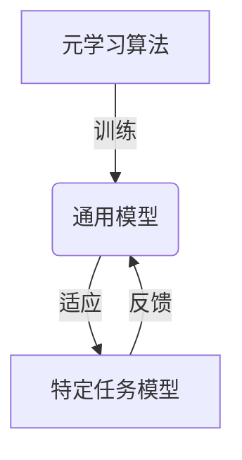
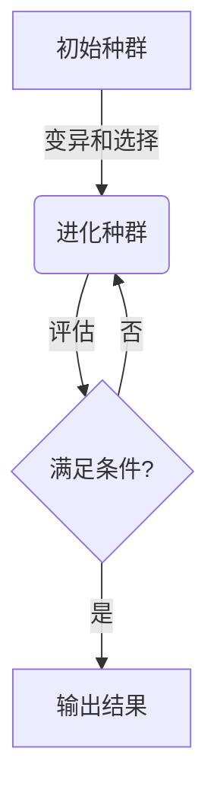
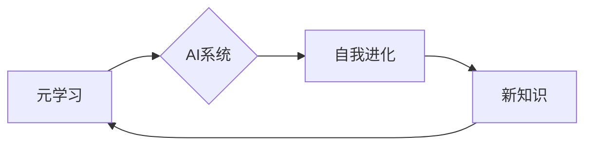

# 一切皆是映射：游戏AI的元学习与自我进化

## 1.背景介绍

在游戏行业中,人工智能(AI)技术的应用已经成为一个不可忽视的趋势。随着游戏复杂度的不断提高,传统的规则based AI系统已经难以满足玩家对智能化游戏体验的需求。因此,开发出具有自主学习和自我进化能力的AI系统,成为了游戏开发商追求的新目标。

元学习(Meta-Learning)和自我进化(Self-Evolution)作为AI领域的两大前沿理论,为实现这一目标提供了全新的思路。元学习旨在让AI系统具备快速学习新知识和技能的能力,而自我进化则赋予AI系统自主进化和自我完善的能力。将这两种技术相结合,就能创造出真正"智能"的游戏AI,为玩家带来前所未有的游戏体验。

### 元学习与自我进化的映射关系

元学习和自我进化看似是两个独立的概念,但实际上它们之间存在着内在的映射关系。元学习为AI系统提供了快速获取新知识的能力,而自我进化则让AI系统能够根据这些新知识自主进化,形成一个正向反馈的闭环。

我们可以将这种关系用一个简单的公式来表示:

$$进化 = 学习 \circ 自适应$$

其中,进化(Evolution)是AI系统的最终目标,学习(Learning)代表元学习为AI系统提供的知识获取能力,而自适应(Self-Adaptation)则对应自我进化中的自主进化机制。通过这个公式,我们可以清晰地看到元学习和自我进化是如何相互作用、相辅相成的。

## 2.核心概念与联系

### 2.1 元学习(Meta-Learning)

元学习的核心思想是"学会如何学习"。传统的机器学习算法需要大量的训练数据和反复的迭代才能获得一个可用的模型,而元学习则旨在让AI系统能够基于少量数据快速习得新知识和技能。

实现元学习的关键在于构建一个能够有效泛化的模型。这个模型不是直接对具体的任务进行学习,而是学习一种"如何学习"的策略,从而在遇到新任务时能够快速适配。常见的元学习算法包括:

1. **模型无关的元学习(Model-Agnostic Meta-Learning, MAML)**: 通过对模型参数的微调,使得模型能够快速适应新任务。
2. **神经进化策略(Neural Evolution Strategies, NES)**: 借鉴进化算法的思想,通过对神经网络参数的变异和选择,实现快速进化。

### 2.2 自我进化(Self-Evolution)

自我进化的核心思想是赋予AI系统自主进化的能力,使其能够根据环境的变化和任务的需求,自动调整自身的结构和行为策略。

实现自我进化的关键在于设计一个合理的进化机制。常见的自我进化算法包括:

1. **新手进化策略(Novelty Search)**: 根据个体的新颖性而非适应度来进行选择,从而促进多样性和探索性。
2. **多目标进化(Multi-Objective Evolution)**: 同时优化多个目标函数,实现在多个方面的均衡发展。

### 2.3 元学习与自我进化的联系

元学习和自我进化虽然侧重点不同,但它们都旨在赋予AI系统更强的适应性和进化性。通过将两者结合,我们可以构建出一个全新的AI系统:

1. 元学习为AI系统提供快速习得新知识的能力
2. 自我进化则让AI系统能够基于这些新知识自主进化,形成一个正向反馈的闭环

在这个闭环系统中,元学习和自我进化相互促进、相得益彰。AI系统通过元学习快速获取新知识,然后基于这些知识通过自我进化进一步完善自身,获得更多新知识,如此循环往复,实现持续的自我进化。

## 3.核心算法原理具体操作步骤

### 3.1 元学习算法MAML

MAML(Model-Agnostic Meta-Learning)是一种广为人知的元学习算法,它的核心思想是通过对模型参数的微调,使得模型能够快速适应新任务。具体操作步骤如下:

1. **初始化**: 随机初始化一个模型参数 $\theta$。

2. **采样任务**: 从任务分布 $p(\mathcal{T})$ 中采样一个新任务 $\mathcal{T}_i$,并将其划分为支持集(support set) $\mathcal{D}_i^{tr}$ 和查询集(query set) $\mathcal{D}_i^{val}$。

3. **内循环**: 在支持集 $\mathcal{D}_i^{tr}$ 上进行几步梯度下降,得到适应该任务的模型参数 $\theta_i'$:

   $$\theta_i' = \theta - \alpha \nabla_\theta \mathcal{L}_{\mathcal{T}_i}(\theta, \mathcal{D}_i^{tr})$$

   其中 $\alpha$ 为内循环的学习率,而 $\mathcal{L}_{\mathcal{T}_i}$ 为任务 $\mathcal{T}_i$ 的损失函数。

4. **外循环**: 在查询集 $\mathcal{D}_i^{val}$ 上计算适应后的模型损失 $\mathcal{L}_{\mathcal{T}_i}(\theta_i', \mathcal{D}_i^{val})$,并对原始参数 $\theta$ 进行更新:

   $$\theta \leftarrow \theta - \beta \nabla_\theta \sum_{\mathcal{T}_i \sim p(\mathcal{T})} \mathcal{L}_{\mathcal{T}_i}(\theta_i', \mathcal{D}_i^{val})$$

   其中 $\beta$ 为外循环的学习率。

5. **重复训练**: 重复步骤2-4,直到模型收敛。

通过这种双循环的优化方式,MAML算法能够学习到一个通用的初始参数 $\theta$,使得在遇到新任务时,只需要少量数据和少量梯度更新步骤,就能快速适应该任务。

### 3.2 自我进化算法NES

NES(Neural Evolution Strategies)是一种借鉴进化算法思想的自我进化算法,它通过对神经网络参数的变异和选择,实现快速进化。具体操作步骤如下:

1. **初始化**: 随机初始化一个种群,每个个体对应一组神经网络参数 $\theta_i$。

2. **评估适应度**: 对每个个体 $\theta_i$ 计算其在目标任务上的适应度(fitness) $F(\theta_i)$。适应度函数 $F$ 可以是任何与任务相关的评估指标。

3. **变异**: 根据适应度值,从种群中采样一个子集 $\{\theta_i\}_{i=1}^{k}$,计算其加权平均 $\bar{\theta}$ 和协方差矩阵 $\Sigma$:

   $$\bar{\theta} = \frac{1}{k} \sum_{i=1}^{k} w_i \theta_i, \quad \Sigma = \frac{1}{k} \sum_{i=1}^{k} w_i (\theta_i - \bar{\theta})(\theta_i - \bar{\theta})^T$$

   其中 $w_i$ 为个体 $\theta_i$ 的权重,通常与其适应度成正比。

   然后,根据 $\bar{\theta}$ 和 $\Sigma$,采样一组新的参数 $\theta'$:

   $$\theta' \sim \mathcal{N}(\bar{\theta}, \Sigma)$$

4. **选择**: 将新参数 $\theta'$ 作为新一代种群中的个体。

5. **重复进化**: 重复步骤2-4,直到满足终止条件。

通过这种进化过程,NES算法能够逐步优化神经网络参数,使其在目标任务上取得更好的性能。与传统的梯度下降算法相比,NES更加鲁棒,能够更好地处理非凸、非平滑的优化问题。

## 4.数学模型和公式详细讲解举例说明

在讨论元学习和自我进化算法时,我们不可避免地会涉及到一些数学模型和公式。下面我们将对其中的几个关键公式进行详细讲解和举例说明。

### 4.1 MAML算法中的双循环优化

MAML算法的核心在于通过双循环优化,学习到一个通用的初始参数 $\theta$。具体来说,在内循环中,我们在支持集 $\mathcal{D}_i^{tr}$ 上进行几步梯度下降,得到适应该任务的模型参数 $\theta_i'$:

$$\theta_i' = \theta - \alpha \nabla_\theta \mathcal{L}_{\mathcal{T}_i}(\theta, \mathcal{D}_i^{tr})$$

其中 $\alpha$ 为内循环的学习率,而 $\mathcal{L}_{\mathcal{T}_i}$ 为任务 $\mathcal{T}_i$ 的损失函数。

在外循环中,我们在查询集 $\mathcal{D}_i^{val}$ 上计算适应后的模型损失 $\mathcal{L}_{\mathcal{T}_i}(\theta_i', \mathcal{D}_i^{val})$,并对原始参数 $\theta$ 进行更新:

$$\theta \leftarrow \theta - \beta \nabla_\theta \sum_{\mathcal{T}_i \sim p(\mathcal{T})} \mathcal{L}_{\mathcal{T}_i}(\theta_i', \mathcal{D}_i^{val})$$

其中 $\beta$ 为外循环的学习率。

通过这种双循环的优化方式,MAML算法能够学习到一个通用的初始参数 $\theta$,使得在遇到新任务时,只需要少量数据和少量梯度更新步骤,就能快速适应该任务。

让我们以一个简单的回归问题为例,来直观地解释MAML算法的工作原理。假设我们有一个包含多个任务的数据集,每个任务都是一条不同的曲线,我们的目标是找到一个通用的模型参数 $\theta$,使得在遇到新的曲线时,只需要少量数据就能快速拟合。

在内循环中,我们从一个任务中采样支持集 $\mathcal{D}_i^{tr}$,并在该支持集上进行几步梯度下降,得到适应该任务的模型参数 $\theta_i'$。这个过程相当于在该任务的曲线上"微调"了模型参数,使得模型能够很好地拟合该曲线。

在外循环中,我们在查询集 $\mathcal{D}_i^{val}$ 上计算适应后的模型损失,并对原始参数 $\theta$ 进行更新。这个过程相当于在多个任务的曲线上进行"元更新",使得模型参数 $\theta$ 能够更好地适应整个任务分布。

通过不断地重复这个双循环优化过程,MAML算法最终会找到一个通用的初始参数 $\theta$,使得在遇到新的曲线时,只需要少量数据和少量梯度更新步骤,就能快速拟合该曲线。

### 4.2 NES算法中的自然梯度估计

在NES算法中,我们需要估计适应度函数 $F(\theta)$ 关于参数 $\theta$ 的梯度,以指导参数的更新方向。然而,直接计算梯度往往是一个非常困难的任务,尤其是当参数空间维度很高时。

NES算法采用了一种称为"自然梯度估计"(Natural Gradient Estimation)的技术,通过对种群个体的统计特性进行估计,来近似计算梯度。具体来说,我们首先根据个体的适应度值,计算其加权平均 $\bar{\theta}$ 和协方差矩阵 $\Sigma$:

$$\bar{\theta} = \frac{1}{k} \sum_{i=1}^{k} w_i \theta_i, \quad \Sigma = \frac{1}{k}