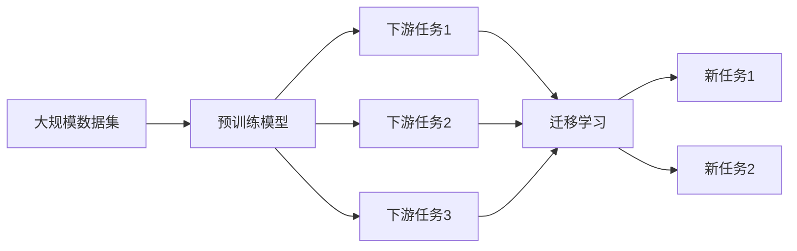

# 一切皆是映射：预训练深度模型与迁移学习

## 1. 背景介绍
### 1.1 深度学习的发展历程
#### 1.1.1 深度学习的起源与发展
#### 1.1.2 深度学习的主要里程碑
#### 1.1.3 深度学习的应用现状

### 1.2 预训练模型的提出
#### 1.2.1 预训练模型的概念
#### 1.2.2 预训练模型的发展历程
#### 1.2.3 预训练模型的意义

### 1.3 迁移学习的兴起  
#### 1.3.1 迁移学习的定义
#### 1.3.2 迁移学习的发展历程
#### 1.3.3 迁移学习的重要性

随着深度学习的快速发展,越来越多的研究者和工程师开始关注如何利用已有的知识来解决新的问题。传统的机器学习方法通常需要大量的标注数据,而人工标注数据往往非常昂贵且耗时。因此,如何利用已有的知识和模型来减少对标注数据的依赖,提高模型的泛化能力,成为了一个亟待解决的问题。

预训练模型(Pre-trained Models)和迁移学习(Transfer Learning)应运而生。预训练模型指的是在大规模数据集上训练的通用模型,这些模型往往具有很强的特征提取和表示能力。通过在下游任务上微调(Fine-tuning)预训练模型,可以大大减少所需的标注数据,并取得不错的效果。迁移学习则更进一步,它旨在利用已有的知识来解决新的问题,通过知识迁移,可以显著提高模型的学习效率和性能。

预训练模型和迁移学习的核心思想在于,世界上的知识和规律是互通的,模型学习到的特征和表示可以在不同的任务间迁移和复用。这种"一切皆是映射"的观点,为人工智能的发展开辟了一条全新的道路。本文将深入探讨预训练模型和迁移学习的原理、方法和应用,揭示其背后的奥秘。

## 2. 核心概念与联系
### 2.1 预训练模型
#### 2.1.1 预训练模型的定义
#### 2.1.2 预训练模型的类型
#### 2.1.3 预训练模型的优势

### 2.2 迁移学习
#### 2.2.1 迁移学习的定义  
#### 2.2.2 迁移学习的分类
#### 2.2.3 迁移学习的优势

### 2.3 预训练模型与迁移学习的关系
#### 2.3.1 预训练模型是迁移学习的基础
#### 2.3.2 迁移学习扩展了预训练模型的应用
#### 2.3.3 二者结合推动了人工智能的发展

预训练模型和迁移学习是人工智能领域的两个重要概念,它们密切相关却又各有侧重。预训练模型通常指的是在大规模数据集上训练的通用模型,如BERT、GPT、VGG等。这些模型在训练过程中学习到了丰富的特征表示,具有很强的迁移能力。通过在预训练模型的基础上进行微调,可以大大减少下游任务所需的标注数据,并取得不错的效果。

迁移学习则更加注重知识的迁移和复用。它的目标是利用已有的知识来解决新的问题,从而提高模型的学习效率和性能。根据迁移的知识类型和方式,迁移学习可以分为很多种,如参数迁移、特征迁移、关系迁移等。通过迁移学习,我们可以将一个领域的知识应用到另一个领域,或者将一个任务的知识应用到另一个任务,从而实现知识的跨域复用。

预训练模型为迁移学习提供了基础,而迁移学习则扩展了预训练模型的应用范围。二者的结合,使得我们可以更加高效地开发和部署人工智能系统,推动了人工智能的快速发展。下图展示了预训练模型与迁移学习的关系:



## 3. 核心算法原理具体操作步骤
### 3.1 预训练模型的训练
#### 3.1.1 无监督预训练
#### 3.1.2 自监督预训练
#### 3.1.3 多任务预训练

### 3.2 预训练模型的微调
#### 3.2.1 特定任务微调
#### 3.2.2 多任务微调 
#### 3.2.3 持续学习微调

### 3.3 迁移学习的实现
#### 3.3.1 参数迁移
#### 3.3.2 特征迁移
#### 3.3.3 关系迁移

预训练模型的训练通常分为无监督预训练、自监督预训练和多任务预训练三种范式。无监督预训练利用大规模无标注数据,通过重建、对比学习等方式学习数据的内在结构和规律。自监督预训练则利用数据本身的一些属性,构造自监督信号进行训练。多任务预训练则同时在多个任务上训练模型,利用任务之间的相关性提高模型的泛化能力。

在获得预训练模型后,我们可以根据具体任务对其进行微调。常见的微调方式包括特定任务微调、多任务微调和持续学习微调。特定任务微调是指在特定任务的数据集上微调预训练模型;多任务微调是指同时在多个任务上微调模型;持续学习微调则是在新数据到来时不断更新模型,使其适应新的变化。

迁移学习的实现方式多种多样,主要可以分为参数迁移、特征迁移和关系迁移三类。参数迁移是指直接复用预训练模型的部分参数,如BERT的embedding层和attention层;特征迁移是指利用预训练模型提取的特征,如BERT的句向量;关系迁移则是学习不同任务或领域之间的关系映射。

具体来说,预训练模型的训练和微调可以按照以下步骤进行:

1. 选择合适的预训练范式(无监督、自监督或多任务),构建预训练任务和损失函数。
2. 在大规模数据集上训练预训练模型,直到模型收敛。 
3. 根据下游任务选择合适的微调方式(特定任务、多任务或持续学习)。
4. 利用下游任务的数据集对预训练模型进行微调,同时适当调整模型结构和超参数。
5. 在验证集上评估微调后的模型性能,根据需要进一步调优。

迁移学习的实现步骤则因具体方法而异,通常包括:

1. 根据任务的特点和数据的性质,选择合适的迁移学习方法(参数迁移、特征迁移或关系迁移)。
2. 将预训练模型应用于新任务,提取所需的知识或表示。
3. 根据新任务的要求,对迁移得到的知识或表示进行必要的变换和适配。
4. 将适配后的知识或表示应用于新任务,训练新的模型。
5. 在新任务的验证集上评估模型性能,必要时进行调优。

## 4. 数学模型和公式详细讲解举例说明
### 4.1 预训练模型的目标函数
#### 4.1.1 无监督预训练的目标函数
#### 4.1.2 自监督预训练的目标函数
#### 4.1.3 多任务预训练的目标函数

### 4.2 微调的损失函数
#### 4.2.1 特定任务微调的损失函数 
#### 4.2.2 多任务微调的损失函数
#### 4.2.3 持续学习微调的损失函数

### 4.3 迁移学习的数学模型
#### 4.3.1 参数迁移的数学模型
#### 4.3.2 特征迁移的数学模型
#### 4.3.3 关系迁移的数学模型

预训练模型和迁移学习的核心是如何构建合适的目标函数和损失函数,从而引导模型学习到我们想要的知识和表示。下面我们通过数学公式来详细说明。

对于无监督预训练,我们通常使用重建损失或对比损失作为目标函数。以自编码器为例,其重建损失可以表示为:

$$L_{rec}(x) = \Vert x - g_{\theta}(f_{\theta}(x)) \Vert^2$$

其中$x$为输入数据,$f_{\theta}$为编码器,$g_{\theta}$为解码器,$\theta$为模型参数。自编码器通过最小化重建损失来学习数据的压缩表示。

对于自监督预训练,我们需要构造自监督信号和对应的损失函数。以BERT为例,其使用了掩码语言模型(MLM)和下一句预测(NSP)两个自监督任务。MLM的损失函数可以表示为:

$$L_{MLM}(x) = -\sum_{i \in m} \log p(x_i | x_{\backslash m})$$

其中$x$为输入序列,$m$为被掩码的位置集合,$x_{\backslash m}$为未被掩码的部分。MLM通过最大化被掩码位置的预测概率来学习上下文表示。

对于多任务预训练,我们需要同时优化多个任务的损失函数。以MT-DNN为例,其目标函数可以表示为:

$$L(x) = \sum_{i=1}^{K} \lambda_i L_i(x)$$

其中$K$为任务数量,$L_i$为第$i$个任务的损失函数,$\lambda_i$为第$i$个任务的权重系数。通过加权求和不同任务的损失,MT-DNN可以在多个任务上同时训练,提高模型的泛化能力。

在微调阶段,我们通常直接优化下游任务的损失函数。以文本分类任务为例,其交叉熵损失可以表示为:

$$L(x, y) = -\sum_{i=1}^{N} y_i \log p(y_i|x)$$

其中$x$为输入文本,$y$为标签,$N$为类别数量。通过最小化交叉熵损失,我们可以使预训练模型适应特定任务。

对于迁移学习,不同的方法有不同的数学模型。以特征迁移为例,我们可以将其表示为:

$$f_t(x) = g(f_s(x))$$

其中$x$为输入数据,$f_s$为源域的特征提取器,$g$为适配函数,$f_t$为目标域的特征提取器。通过学习适配函数$g$,我们可以将源域的特征映射到目标域,实现特征迁移。

总之,预训练模型和迁移学习的数学模型和公式体现了其核心思想,即通过构建合适的目标函数和损失函数,引导模型学习到通用的、可迁移的知识和表示。这些数学工具为我们理解和应用预训练模型和迁移学习提供了坚实的基础。

## 5. 项目实践：代码实例和详细解释说明
### 5.1 预训练模型的实现
#### 5.1.1 BERT的实现
#### 5.1.2 GPT的实现
#### 5.1.3 VGG的实现

### 5.2 迁移学习的应用
#### 5.2.1 基于BERT的文本分类
#### 5.2.2 基于GPT的文本生成
#### 5.2.3 基于VGG的图像分类

为了更直观地理解预训练模型和迁移学习,下面我们通过代码实例来说明其实现和应用。

首先,让我们看一下BERT的预训练实现。以下是使用PyTorch实现BERT预训练的核心代码:

```python
class BertPretrainModel(nn.Module):
    def __init__(self, config):
        super().__init__()
        self.bert = BertModel(config)
        self.cls = BertPreTrainingHeads(config)
        
    def forward(self, input_ids, token_type_ids=None, attention_mask=None, masked_lm_labels=None, next_sentence_label=None):
        outputs = self.bert(input_ids, token_type_ids, attention_mask)
        sequence_output, pooled_output = outputs[:2]
        prediction_scores, seq_relationship_score = self.cls(sequence_output, pooled_output)
        
        total_loss = 0
        if maske