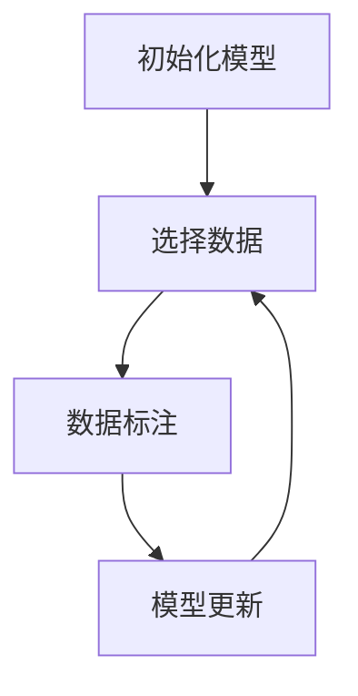

# 主动学习原理与代码实战案例讲解

## 1.背景介绍

在机器学习领域，数据是驱动模型性能的关键因素。然而，获取和标注大量高质量的数据往往是昂贵且耗时的。主动学习（Active Learning）作为一种有效的策略，旨在通过智能选择最有价值的数据进行标注，从而在减少标注成本的同时提升模型性能。主动学习的核心思想是让模型主动选择那些对其学习最有帮助的数据点进行标注，而不是被动地接受随机选择的数据。

## 2.核心概念与联系

### 2.1 主动学习的定义

主动学习是一种机器学习方法，模型可以主动选择最有信息量的数据点进行标注，以提高学习效率和模型性能。其主要目标是通过最少的数据标注获得最优的模型性能。

### 2.2 主动学习与被动学习的区别

被动学习（Passive Learning）是指模型被动地接受随机选择的数据进行训练，而主动学习则是模型根据当前的学习状态主动选择最有价值的数据点进行标注。主动学习的优势在于可以显著减少标注数据的数量，同时保持甚至提升模型的性能。

### 2.3 主动学习的基本流程

主动学习的基本流程包括以下几个步骤：

1. 初始化模型：使用少量已标注的数据训练初始模型。
2. 选择数据：根据某种策略选择最有价值的未标注数据点。
3. 数据标注：将选择的数据点交给专家进行标注。
4. 模型更新：使用新标注的数据点更新模型。
5. 重复步骤2-4，直到达到预期的性能或标注预算。



## 3.核心算法原理具体操作步骤

### 3.1 不确定性采样（Uncertainty Sampling）

不确定性采样是主动学习中最常用的策略之一。其基本思想是选择模型最不确定的数据点进行标注。常见的不确定性度量方法包括：

- 最大熵（Maximum Entropy）
- 最小置信度（Least Confidence）
- 最小边际（Margin Sampling）

### 3.2 查询分布（Query by Committee）

查询分布方法通过训练多个模型（委员会）来选择数据点。委员会成员对未标注数据点的预测结果存在分歧的数据点被认为是最有价值的。

### 3.3 核心集（Core-set）

核心集方法通过选择能够代表整个数据分布的核心数据点进行标注。这种方法通常使用聚类算法来选择核心数据点。

### 3.4 具体操作步骤

1. 训练初始模型：使用少量已标注的数据训练初始模型。
2. 选择数据点：根据不确定性采样、查询分布或核心集方法选择最有价值的未标注数据点。
3. 数据标注：将选择的数据点交给专家进行标注。
4. 更新模型：使用新标注的数据点更新模型。
5. 重复上述步骤，直到达到预期的性能或标注预算。

## 4.数学模型和公式详细讲解举例说明

### 4.1 不确定性采样的数学模型

#### 4.1.1 最大熵

最大熵方法选择熵值最大的未标注数据点。熵的计算公式为：

$$
H(x) = - \sum_{i=1}^{C} P(y_i|x) \log P(y_i|x)
$$

其中，$P(y_i|x)$ 是模型对数据点 $x$ 的类别 $y_i$ 的预测概率，$C$ 是类别的总数。

#### 4.1.2 最小置信度

最小置信度方法选择模型置信度最低的数据点。置信度的计算公式为：

$$
LC(x) = 1 - \max_{i} P(y_i|x)
$$

#### 4.1.3 最小边际

最小边际方法选择模型对前两大类别预测概率差值最小的数据点。边际的计算公式为：

$$
Margin(x) = P(y_1|x) - P(y_2|x)
$$

### 4.2 查询分布的数学模型

查询分布方法通过计算委员会成员对数据点的预测分歧来选择数据点。分歧的度量方法包括：

- 平均KL散度（Average Kullback-Leibler Divergence）
- 投票熵（Vote Entropy）

#### 4.2.1 平均KL散度

平均KL散度的计算公式为：

$$
KL(x) = \frac{1}{M} \sum_{m=1}^{M} D_{KL}(P_m(y|x) || P(y|x))
$$

其中，$M$ 是委员会成员的数量，$P_m(y|x)$ 是第 $m$ 个模型对数据点 $x$ 的预测概率，$P(y|x)$ 是所有模型的平均预测概率。

#### 4.2.2 投票熵

投票熵的计算公式为：

$$
VE(x) = - \sum_{i=1}^{C} \frac{V(y_i|x)}{M} \log \frac{V(y_i|x)}{M}
$$

其中，$V(y_i|x)$ 是委员会成员对类别 $y_i$ 的投票次数。

## 5.项目实践：代码实例和详细解释说明

### 5.1 环境准备

首先，我们需要安装必要的库：

```bash
pip install numpy scikit-learn
```

### 5.2 数据准备

我们使用 `scikit-learn` 提供的 `make_classification` 函数生成一个二分类数据集：

```python
import numpy as np
from sklearn.datasets import make_classification
from sklearn.model_selection import train_test_split

# 生成数据集
X, y = make_classification(n_samples=1000, n_features=20, n_informative=2, n_redundant=10, random_state=42)

# 划分训练集和测试集
X_train, X_test, y_train, y_test = train_test_split(X, y, test_size=0.2, random_state=42)
```

### 5.3 初始模型训练

使用少量已标注的数据训练初始模型：

```python
from sklearn.ensemble import RandomForestClassifier

# 使用前10个样本作为初始标注数据
initial_idx = np.random.choice(range(len(X_train)), size=10, replace=False)
X_initial, y_initial = X_train[initial_idx], y_train[initial_idx]

# 训练初始模型
model = RandomForestClassifier()
model.fit(X_initial, y_initial)
```

### 5.4 不确定性采样

选择最不确定的数据点进行标注：

```python
from sklearn.metrics import pairwise_distances_argmin_min

# 计算未标注数据点的预测概率
probs = model.predict_proba(X_train)

# 计算最小置信度
uncertainty = 1 - np.max(probs, axis=1)

# 选择不确定性最高的数据点
query_idx = np.argsort(uncertainty)[-10:]
X_query, y_query = X_train[query_idx], y_train[query_idx]
```

### 5.5 数据标注与模型更新

将选择的数据点进行标注并更新模型：

```python
# 更新标注数据集
X_initial = np.concatenate([X_initial, X_query])
y_initial = np.concatenate([y_initial, y_query])

# 更新模型
model.fit(X_initial, y_initial)
```

### 5.6 重复上述步骤

重复选择数据、标注和更新模型的步骤，直到达到预期的性能或标注预算。

## 6.实际应用场景

### 6.1 医疗诊断

在医疗诊断中，标注数据通常需要专业医生的参与，成本高且耗时。主动学习可以通过选择最有价值的病例进行标注，显著减少标注成本。

### 6.2 自然语言处理

在自然语言处理任务中，如文本分类和情感分析，主动学习可以通过选择最具信息量的文本进行标注，提高模型的性能。

### 6.3 图像识别

在图像识别任务中，主动学习可以通过选择最具代表性的图像进行标注，减少标注工作量，同时提升模型的准确性。

## 7.工具和资源推荐

### 7.1 工具

- [scikit-learn](https://scikit-learn.org/stable/): 一个强大的机器学习库，提供了多种主动学习算法的实现。
- [modAL](https://modal-python.readthedocs.io/en/latest/): 一个专门用于主动学习的Python库，提供了丰富的主动学习策略和工具。

### 7.2 资源

- [Active Learning Literature Survey](http://burrsettles.com/pub/settles.activelearning.pdf): 一篇详细的主动学习文献综述，涵盖了主动学习的基本概念、算法和应用。
- [Deep Active Learning](https://arxiv.org/abs/1703.02910): 一篇关于深度主动学习的研究论文，介绍了深度学习与主动学习的结合。

## 8.总结：未来发展趋势与挑战

主动学习作为一种有效的机器学习策略，已经在多个领域展现了其强大的潜力。未来，随着深度学习和大数据技术的发展，主动学习将会在更多的实际应用中发挥重要作用。然而，主动学习也面临一些挑战，如如何在高维数据中选择最有价值的数据点、如何处理不平衡数据等。解决这些挑战将是未来研究的重点方向。

## 9.附录：常见问题与解答

### 9.1 主动学习适用于哪些场景？

主动学习适用于标注成本高、数据量大且模型性能对标注数据敏感的场景，如医疗诊断、自然语言处理和图像识别等。

### 9.2 如何选择合适的主动学习策略？

选择合适的主动学习策略需要根据具体的应用场景和数据特点进行综合考虑。常见的不确定性采样、查询分布和核心集方法各有优缺点，可以根据实际需求进行选择。

### 9.3 主动学习是否总能提高模型性能？

主动学习在大多数情况下可以提高模型性能，但并不保证在所有情况下都能显著提升。其效果取决于数据的分布、标注策略和模型的复杂度等因素。

### 9.4 主动学习与半监督学习的区别是什么？

主动学习和半监督学习都是减少标注数据需求的有效方法。主动学习通过智能选择最有价值的数据点进行标注，而半监督学习则利用大量未标注数据进行训练。两者可以结合使用，以进一步提升模型性能。

---

作者：禅与计算机程序设计艺术 / Zen and the Art of Computer Programming