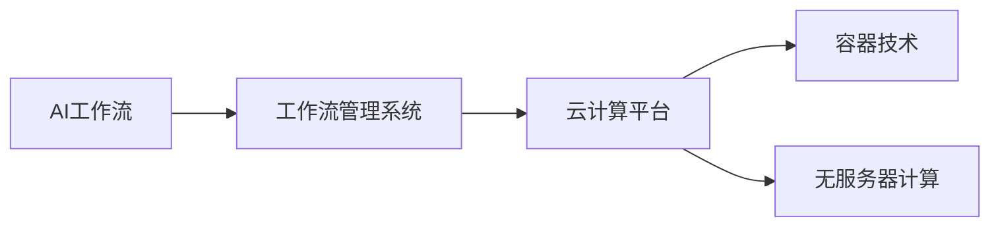
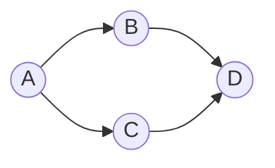

# 云计算环境中AI代理工作流的设计与执行

## 1. 背景介绍
### 1.1 云计算的发展现状
云计算技术近年来发展迅速,已经成为IT行业的重要技术趋势。云计算提供了按需、弹性、可扩展的计算资源,使得企业和开发者能够更加灵活高效地构建和部署应用系统。同时,云计算环境也为人工智能(AI)系统的开发和应用带来了新的机遇。

### 1.2 AI在云计算中的应用
AI技术与云计算的结合正在不断深化。云计算为AI提供了强大的计算能力、海量的数据存储和处理能力。越来越多的AI应用被部署到云端,通过云服务的方式提供给用户使用。云计算平台上集成了各种AI开发工具和框架,方便开发者快速构建AI应用。

### 1.3 AI工作流面临的挑战
然而,在云计算环境中构建AI工作流仍然面临诸多挑战:

1. 工作流的灵活性和可扩展性不足,难以应对复杂多变的AI任务需求。
2. 工作流的执行效率有待提升,尤其是在处理大规模数据和计算密集型任务时。
3. 工作流的容错能力和鲁棒性有待加强,需要更好地应对各种异常和故障情况。
4. 工作流的监控和管理能力不足,缺乏对工作流全生命周期的有效监控和管理手段。

为了应对这些挑战,亟需探索创新的AI工作流设计和执行方法,提升云计算环境中AI工作流的灵活性、效率、可靠性和可管理性。

## 2. 核心概念与联系
### 2.1 AI工作流
AI工作流是指在人工智能应用开发和部署过程中,将各个AI任务组织成有序的、可执行的工作流程。一个典型的AI工作流可能包括数据预处理、特征工程、模型训练、模型评估、模型服务等多个阶段,每个阶段又由多个具体的任务组成。

### 2.2 工作流管理系统
工作流管理系统是一种软件系统,用于定义、执行、监控和管理工作流。它提供了一套完整的工具和框架,帮助用户设计工作流、调度任务执行、监控工作流运行状态、处理异常情况等。常见的工作流管理系统有Apache Airflow、Kubeflow、Argo等。

### 2.3 云计算
云计算是一种按需提供计算资源的模式,用户可以根据需要动态申请和使用计算、存储、网络等资源。云计算具有高度的可扩展性、灵活性和经济性,使得用户能够以更低的成本、更快的速度构建和运行应用系统。

### 2.4 容器技术
容器是一种轻量级的虚拟化技术,可以将应用程序及其依赖打包在一个独立的、可移植的容器镜像中。容器化可以实现应用的快速部署、弹性伸缩、版本控制等。Kubernetes是当前最流行的容器编排平台,提供了强大的容器管理和编排能力。

### 2.5 无服务器计算
无服务器计算(Serverless)是一种新兴的云计算模式,用户无需管理底层服务器,只需专注于编写业务逻辑代码。无服务器平台会自动进行资源配置、弹性伸缩、容错处理等,简化了应用开发和运维。

下图展示了云计算环境中AI工作流涉及的核心概念以及它们之间的关系:



## 3. 核心算法原理具体操作步骤

在云计算环境中,AI工作流的执行涉及任务编排和调度、资源管理与分配、容错处理等核心算法。下面详细介绍几种关键算法的原理和操作步骤。

### 3.1 有向无环图DAG
有向无环图(DAG)是AI工作流的一种常见表示方法。DAG中的每个节点表示一个任务,有向边表示任务之间的依赖关系和执行顺序。通过DAG,可以清晰地描述复杂工作流的结构和执行逻辑。

构建DAG的具体步骤如下:
1. 定义工作流中的所有任务,每个任务包括输入、处理逻辑、输出等信息。
2. 分析任务之间的依赖关系,确定各个任务的先后顺序。 
3. 用节点表示每个任务,用有向边连接存在依赖关系的任务节点。
4. 检查DAG是否存在环,确保工作流结构的正确性。

### 3.2 拓扑排序
对于给定的DAG,拓扑排序算法可以生成一个任务的线性执行序列,该序列满足所有任务的依赖约束。拓扑排序的结果可以指导工作流的串行执行。

拓扑排序的具体步骤如下:
1. 找出DAG中没有前驱(入度为0)的节点,将其加入到队列中。
2. 从队列中取出一个节点,将其加入到拓扑序列中。
3. 删除该节点的所有出边,并将新的入度为0的节点加入队列。 
4. 重复步骤2和3,直到队列为空。
5. 如果拓扑序列中包含了DAG的所有节点,则拓扑排序成功;否则DAG中存在环,无法进行拓扑排序。

### 3.3 关键路径算法
在考虑任务执行时间的情况下,关键路径算法可以找出工作流的最长执行路径,即完成整个工作流所需的最短时间。关键路径上的任务被称为关键任务,它们的执行时间直接影响整个工作流的完成时间。

关键路径算法的具体步骤如下:
1. 正向遍历DAG,计算每个任务的最早开始时间。
2. 反向遍历DAG,计算每个任务的最晚开始时间。
3. 对每个任务,用最晚开始时间减去最早开始时间,得到任务的时间余量。
4. 时间余量为0的任务就是关键任务,它们组成了关键路径。
5. 关键路径的长度就是完成整个工作流的最短时间。

### 3.4 资源感知调度
在共享的云计算环境中,需要考虑任务对计算、存储、网络等资源的需求,合理地将任务分配到不同的计算节点上执行。资源感知调度算法根据任务的资源需求和节点的资源状态,实现任务与节点的最优匹配。

资源感知调度的具体步骤如下:
1. 建模任务对各类资源的需求,包括CPU、内存、磁盘、网络带宽等。
2. 监控计算节点的资源使用情况,包括已用和可用的资源量。
3. 根据任务的资源需求和节点的资源状态,设计调度策略,如最小资源浪费、负载均衡等。
4. 在调度决策时,选择满足资源约束且优化调度目标的节点来执行任务。
5. 在任务执行过程中,动态监测资源使用情况,必要时进行任务重调度。

## 4. 数学模型和公式详细讲解举例说明

为了优化云计算环境中AI工作流的执行性能,可以建立数学模型,运用优化理论和算法来求解任务调度问题。下面以一个简单的任务调度模型为例,讲解其数学定义和求解方法。

### 4.1 问题定义
考虑一个DAG表示的工作流$G=(V,E)$,其中$V$表示任务集合,$E$表示任务间的依赖关系。每个任务$i$都有一个执行时间$t_i$。目标是找到一种任务调度方案,使得工作流的完成时间最小。

### 4.2 数学模型
定义决策变量$x_{ij}$:
$$
x_{ij}=
\begin{cases}
1, & \text{if task $i$ is scheduled on node $j$} \\
0, & \text{otherwise}
\end{cases}
$$

定义开始时间变量$s_i$表示任务$i$的开始执行时间。

目标函数:
$$
\min \max_{i \in V} (s_i + t_i)
$$

约束条件:
$$
\begin{align}
& \sum_{j=1}^{m} x_{ij} = 1, \forall i \in V \\
& s_i + t_i \leq s_k, \forall (i,k) \in E \\
& s_i \geq 0, \forall i \in V \\
& x_{ij} \in \{0,1\}, \forall i \in V, j=1,\ldots,m
\end{align}
$$

其中,$m$表示可用的计算节点数量。约束(1)保证每个任务只被调度到一个节点上;约束(2)保证任务之间的依赖关系得到满足;约束(3)保证任务的开始时间非负;约束(4)定义了决策变量的取值范围。

### 4.3 求解方法
上述调度问题可以被建模为混合整数规划问题,求解难度较大。可以考虑以下几种求解方法:

1. 精确算法:利用优化求解器,如Gurobi、CPLEX等,直接求解混合整数规划模型,得到最优解。但是当问题规模较大时,求解时间可能会很长。

2. 启发式算法:设计基于问题特点的启发式规则,如最长处理时间优先(LPT)、最小松弛时间优先(MSLF)等,快速地得到接近最优的可行解。

3. 元启发式算法:如遗传算法、粒子群优化算法等,通过对解空间的智能搜索,找到近似最优解。这类算法通用性强,但需要精心设计算法组件和参数。

4. 近似算法:针对特定问题结构,如树形结构、层次结构等,设计多项式时间近似算法,在理论上保证解的质量。

### 4.4 算例分析
考虑如下的任务调度问题,DAG如下图所示:



每个任务的执行时间为:$t_A=2,t_B=3,t_C=2,t_D=1$。可用节点数$m=2$。

求解得到最优调度方案:
$$
\begin{align}
& x_{A1}=1, x_{B1}=1, x_{C2}=1, x_{D1}=1 \\
& s_A=0, s_B=2, s_C=0, s_D=5 \\
& \max_{i \in V} (s_i + t_i) = 6
\end{align}
$$

即任务A和B调度到节点1,任务C调度到节点2,任务D在任务B完成后调度到节点1。整个工作流的最优完成时间为6。

通过数学建模和求解,可以为云计算环境中的AI工作流调度提供理论指导和量化依据,辅助实现高效优化的任务调度。

## 5. 项目实践:代码实例和详细解释说明
下面以一个基于Python的简单AI工作流项目为例,演示如何使用工作流管理工具Airflow设计和执行AI工作流。

### 5.1 安装Airflow
首先需要安装Airflow及其依赖:
```bash
pip install apache-airflow
```

### 5.2 定义DAG
使用Python代码定义工作流的DAG结构:

```python
from airflow import DAG
from airflow.operators.python import PythonOperator
from datetime import datetime, timedelta

default_args = {
    'owner': 'airflow',
    'depends_on_past': False,
    'start_date': datetime(2023, 1, 1),
    'retries': 1,
    'retry_delay': timedelta(minutes=5),
}

dag = DAG(
    'ai_workflow',
    default_args=default_args,
    description='A simple AI workflow',
    schedule_interval=timedelta(days=1),
)

def preprocess_data():
    # 数据预处理逻辑
    print('Preprocessing data...')

def train_model():
    # 模型训练逻辑  
    print('Training model...')

def evaluate_model():
    # 模型评估逻辑
    print('Evaluating model...')

preprocess_task = PythonOperator(
    task_id='preprocess_data',
    python_callable=preprocess_data,
    dag=dag,
)

train_task = PythonOperator(
    task_id='train_model',