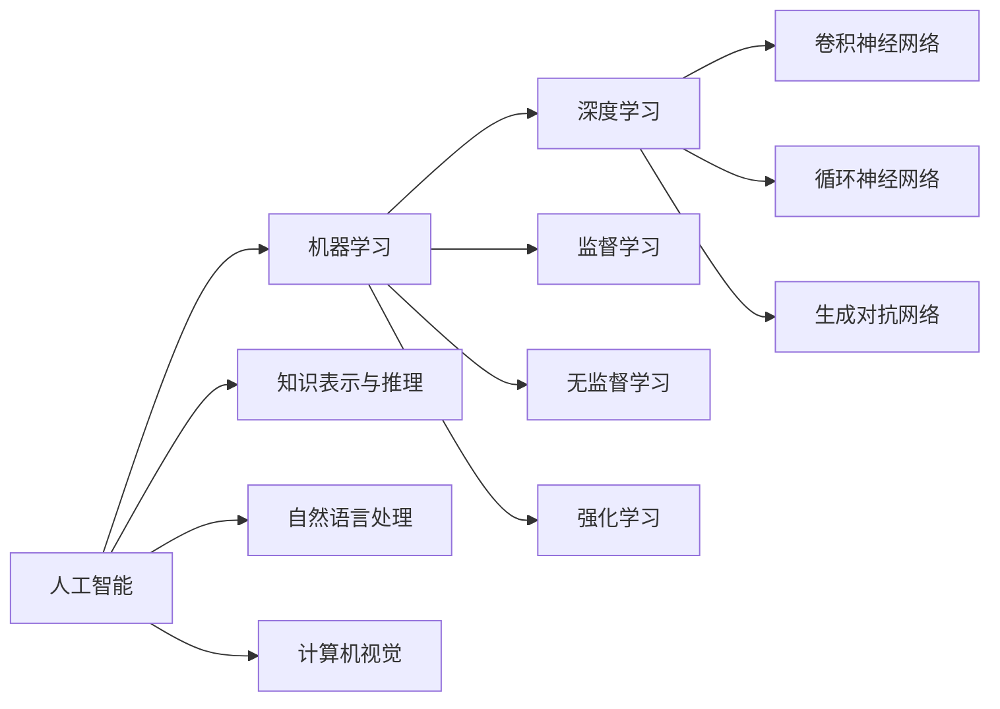

# 人工智能(AI)原理与代码实战案例讲解

## 1.背景介绍
### 1.1 人工智能的定义与发展历程
#### 1.1.1 人工智能的定义
人工智能(Artificial Intelligence, AI)是计算机科学的一个分支,它致力于研究如何创造出能够模拟人类智能行为的计算机程序或系统。人工智能的目标是让机器能够执行通常需要人类智能才能完成的任务,如视觉感知、语音识别、决策和语言翻译等。

#### 1.1.2 人工智能的发展历程
人工智能的发展可以追溯到20世纪50年代初。1956年,约翰·麦卡锡首次提出了"人工智能"这个术语。此后,人工智能经历了几次起起伏伏的发展历程:

- 1950s-1960s:早期的人工智能研究,主要关注通用问题求解和符号推理。代表性成果有逻辑理论家(Logic Theorist)等。 

- 1970s-1980s:专家系统的兴起。研究者们开发出了一些基于规则的系统,用于解决特定领域的问题。如MYCIN医疗诊断系统等。

- 1990s-2000s:机器学习技术的崛起,尤其是支持向量机、贝叶斯网络等算法的出现和应用。IBM深蓝击败国际象棋冠军。

- 2010s至今:深度学习的蓬勃发展。得益于大数据、算力提升和算法创新,CNN、RNN等深度神经网络在计算机视觉、自然语言处理等领域取得了突破性进展。

### 1.2 人工智能的分类
根据实现方式和应用领域,人工智能可以分为以下几类:

#### 1.2.1 符号主义 VS 连接主义
- 符号主义(Symbolism):基于逻辑推理和知识表示,通过定义规则来实现智能,如专家系统。
- 连接主义(Connectionism):模拟人脑神经网络连接,通过大量参数学习来获得智能,代表就是目前流行的深度学习。

#### 1.2.2 弱人工智能 VS 强人工智能
- 弱人工智能(Weak AI):针对特定任务而设计的智能系统,如语音识别、人脸识别等。
- 强人工智能(Strong AI):具有与人类相当的通用智能,能够像人一样思考和解决问题。目前尚未实现。

#### 1.2.3 感知智能、认知智能、行为智能
- 感知智能:计算机视觉、语音识别等赋予机器感知外界信息的能力
- 认知智能:自然语言理解、知识图谱等让机器能理解信息内在联系
- 行为智能:规划决策、控制执行等使机器能对外界做出行为反应

## 2.核心概念与联系
### 2.1 机器学习
机器学习是人工智能的核心,它使计算机能够在没有明确编程的情况下学习和改进。常见的任务包括分类、回归、聚类、降维等。根据学习方式,可分为:

- 监督学习:训练数据带有标签,模型学习输入到标签的映射。如分类、回归任务。
- 无监督学习:训练数据没有标签,模型自主发现数据内在结构和关联。如聚类、降维任务。 
- 强化学习:通过与环境的交互获得奖励反馈,学习最优策略。如AlphaGo下棋。

### 2.2 深度学习
深度学习是机器学习的一个分支,它模仿人脑的结构和功能,使用多层神经网络从数据中学习多级抽象表示。常见的深度学习架构有:

- 卷积神经网络(CNN):善于处理网格拓扑结构数据,广泛用于图像识别等。
- 循环神经网络(RNN):适合处理序列数据,如自然语言文本。
- 生成对抗网络(GAN):通过生成器和判别器的博弈学习,可用于图像生成、风格迁移等。

### 2.3 知识表示与推理
知识表示旨在将世界知识转化为计算机可以理解和处理的形式。常见方法有:

- 一阶逻辑:使用谓词、函数、量词等描述事实和规则。
- 产生式规则:if-then形式的条件动作对,常用于专家系统。
- 语义网络:用有向图表示概念实体及其关系。
- 框架:一种结构化、层次化组织知识的方式。

基于知识表示,可以运用逻辑推理、规则推理等方法进行智能决策。

### 2.4 自然语言处理
NLP致力于实现人机之间的自然语言交互。其任务包括:

- 句法分析:确定句子成分和语法结构。
- 语义分析:理解句子的字面含义。
- 语用分析:结合上下文推断句子的实际意图。
- 信息抽取:从文本中提取结构化信息,如实体、关系、事件等。
- 机器翻译:将一种自然语言转换成另一种。
- 文本摘要:生成简明扼要的文本摘要。

### 2.5 计算机视觉
CV让机器具备通过视觉感知世界、理解图像视频内容的能力。主要任务有:

- 图像分类:判断图像所属类别。
- 物体检测:标定图像中感兴趣目标的位置。
- 语义分割:在像素级别标注出图像中的目标区域。
- 人脸识别:判断图像中的人脸身份。
- 行为识别:分析视频中人物的行为动作。

### 核心概念关系总结

## 3.核心算法原理具体操作步骤
本节选取几个典型的人工智能算法,介绍其原理和实现步骤。

### 3.1 BP神经网络
BP(Back Propagation)神经网络是一种常见的前馈神经网络,可用于分类、回归等任务。其核心思想是通过反向传播误差来优化网络参数。

#### 3.1.1 算法步骤
1. 随机初始化网络权重和偏置
2. 前向传播:输入信号从输入层经隐藏层传递到输出层,计算各层神经元的激活值
3. 计算输出层误差:比较网络输出与期望输出,计算误差
4. 反向传播误差:将输出层误差按权重传递到隐藏层,计算各层神经元的误差项
5. 更新权重和偏置:根据误差项和学习率调整各层连接权重和偏置项
6. 重复步骤2-5,直到满足停止条件(如误差阈值、迭代次数等)

#### 3.1.2 前向传播
$$a_j^l = \sigma(\sum_i w_{ij}^l a_i^{l-1} + b_j^l)$$

其中$a_j^l$为第$l$层第$j$个神经元的激活值,$w_{ij}^l$为第$l-1$层第$i$个神经元到第$l$层第$j$个神经元的连接权重,$b_j^l$为第$l$层第$j$个神经元的偏置项,$\sigma$为激活函数(如sigmoid、ReLU等)。

#### 3.1.3 反向传播
输出层误差项:
$$\delta_j^L = \frac{\partial J}{\partial z_j^L} = \frac{\partial J}{\partial a_j^L} \cdot \frac{\partial a_j^L}{\partial z_j^L} = (a_j^L - y_j) \cdot \sigma'(z_j^L)$$

隐藏层误差项:
$$\delta_j^l = \frac{\partial J}{\partial z_j^l} = \sum_k \frac{\partial J}{\partial z_k^{l+1}} \cdot \frac{\partial z_k^{l+1}}{\partial a_j^l} \cdot \frac{\partial a_j^l}{\partial z_j^l} = \sum_k \delta_k^{l+1} w_{jk}^{l+1} \cdot \sigma'(z_j^l)$$

权重更新:
$$w_{ij}^l := w_{ij}^l - \alpha \cdot \frac{\partial J}{\partial w_{ij}^l} = w_{ij}^l - \alpha \cdot a_i^{l-1} \delta_j^l$$

偏置更新:
$$b_j^l := b_j^l - \alpha \cdot \frac{\partial J}{\partial b_j^l} = b_j^l - \alpha \cdot \delta_j^l$$

其中$J$为损失函数,$\alpha$为学习率。

### 3.2 卷积神经网络
CNN在图像识别等领域表现出色。其核心是卷积层和池化层,可以自动提取图像的空间层次特征。

#### 3.2.1 算法步骤
1. 输入图像经过多个卷积层和池化层,提取不同尺度、不同抽象层次的特征
2. 将提取到的特征展平并送入全连接层进行分类预测
3. 计算损失函数,并通过反向传播算法更新网络参数
4. 重复步骤1-3,直到模型收敛或达到预设的迭代次数

#### 3.2.2 卷积层
卷积层使用卷积核对输入特征图进行卷积操作,得到输出特征图。设输入特征图为$X$,卷积核为$W$,偏置为$b$,激活函数为$f$,则卷积层输出为:

$$Y = f(W * X + b)$$

其中$*$表示卷积操作。卷积核在输入特征图上滑动,对局部区域进行加权求和,提取局部特征。

#### 3.2.3 池化层
池化层对输入特征图进行降采样,减小特征图尺寸,增加感受野,提高特征的平移不变性。常见的池化操作有最大池化和平均池化。以最大池化为例,设池化窗口大小为$k \times k$,则输出特征图中每个像素为对应输入区域中的最大值:

$$Y_{i,j} = \max_{0 \leq m,n < k} X_{i \cdot s+m, j \cdot s+n}$$

其中$s$为池化窗口的滑动步长。

### 3.3 Transformer
Transformer是一种基于自注意力机制的序列建模架构,广泛应用于自然语言处理任务。其抛弃了RNN中的循环结构,通过自注意力机制直接建模序列中元素之间的依赖关系。

#### 3.3.1 算法步骤
1. 将输入序列通过词嵌入和位置编码映射为实值向量表示
2. 对输入序列进行多头自注意力计算,得到每个位置与其他位置的注意力权重
3. 将自注意力的输出通过前馈神经网络进行非线性变换
4. 重复步骤2-3多个编码器层,得到最终的序列表示
5. 解码器以类似的方式对目标序列进行处理,并引入编码器-解码器注意力机制
6. 根据解码器的输出计算损失函数,并通过反向传播算法更新模型参数

#### 3.3.2 自注意力机制
自注意力机制用于计算序列中每个位置与其他位置之间的相关性。设输入序列为$X \in \mathbb{R}^{n \times d}$,自注意力的计算过程为:

1. 将输入$X$通过三个线性变换得到查询矩阵$Q$、键矩阵$K$和值矩阵$V$:
$$Q = XW_Q, K = XW_K, V = XW_V$$

2. 计算查询矩阵和键矩阵的注意力得分:
$$A = \text{softmax}(\frac{QK^T}{\sqrt{d_k}})$$

3. 将注意力得分与值矩阵相乘得到自注意力输出:
$$\text{Attention}(Q,K,V) = AV$$

其中$W_Q, W_K, W_V$为可学习的参数矩阵,$d_k$为键向量的维度。

多头自注意力机制将上述过程独立重复多次,然后将不同头的输出拼接起来并经过线性变换:

$$\text{MultiHead}(Q,K,V) = \text{