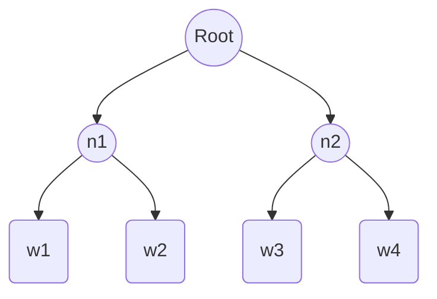

# 从零开始大模型开发与微调：FastText的原理与基础算法

## 1. 背景介绍

### 1.1 自然语言处理的发展历程

自然语言处理(Natural Language Processing, NLP)是人工智能的一个重要分支,旨在让计算机能够理解、处理和生成人类语言。NLP技术的发展经历了规则系统、统计学习和深度学习三个主要阶段。

### 1.2 词嵌入技术的兴起

在深度学习时代,词嵌入(Word Embedding)技术的出现极大地推动了NLP的进步。词嵌入将词语映射为低维稠密向量,捕捉了词语之间的语义关系,为下游NLP任务提供了高质量的输入特征。Word2Vec、GloVe等经典词嵌入模型相继问世。

### 1.3 FastText模型的诞生

2016年,Facebook AI Research (FAIR)推出了FastText词嵌入模型,在学术界和工业界引起了广泛关注。FastText在Word2Vec的基础上进行了改进,引入了字符级n-gram特征,提升了对罕见词和未登录词的建模能力,并且大幅提高了训练效率。

## 2. 核心概念与联系

### 2.1 FastText的核心思想

- 子词信息：FastText不仅学习词级别的嵌入,还学习字符级n-gram的嵌入。这使得模型能够通过词内的字符组合推断出词义。

- 快速训练：FastText使用了Hierarchical Softmax和Negative Sampling等优化技巧,大幅降低了训练复杂度,在保证精度的同时显著提升了训练速度。

- 词袋模型：FastText使用简单的词袋模型对文本进行表示,忽略了词序信息。这种简化使得模型更加高效和鲁棒。

### 2.2 FastText与Word2Vec的异同

FastText和Word2Vec都是无监督的词嵌入学习方法,但存在以下区别：

- FastText引入了字符级n-gram特征,增强了对构词能力的建模。

- FastText在输出层使用了层次Softmax,而Word2Vec使用传统的Softmax。

- FastText的训练速度更快,在大规模语料上的表现更优。

### 2.3 FastText在NLP任务中的应用

FastText预训练的词向量可以应用于各种NLP任务,如文本分类、情感分析、命名实体识别等。FastText还提供了便捷的文本分类工具,可以直接用于文本分类任务。

## 3. 核心算法原理具体操作步骤

### 3.1 FastText的网络架构

FastText模型由三层神经网络组成：输入层、隐藏层和输出层。

#### 3.1.1 输入层

输入层将词w表示为词向量和字符级n-gram向量的叠加：

$$\mathbf{x}_w = \mathbf{v}_w + \sum_{g\in \mathcal{G}_w} \mathbf{z}_g$$

其中$\mathbf{v}_w$是词w的词向量,$\mathbf{z}_g$是字符级n-gram $g$的嵌入向量,$\mathcal{G}_w$是词w中出现的所有n-gram的集合。

#### 3.1.2 隐藏层 

隐藏层对输入层的词向量进行平均,得到文本的向量表示：

$$\mathbf{h} = \frac{1}{N} \sum_{w \in \text{text}} \mathbf{x}_w$$

其中$N$是文本中的词数。这实际上是一个词袋模型。

#### 3.1.3 输出层

输出层使用Hierarchical Softmax对目标词进行预测。Hierarchical Softmax将词表组织成一个Huffman树,大大减少了输出类别数。对于每个非叶节点,FastText使用一个二分类器来预测目标词在其左子树还是右子树。

### 3.2 模型训练

FastText使用负采样(Negative Sampling)策略进行训练。对于每个训练样本(中心词,目标词),FastText随机采样$K$个负样本,然后最小化以下损失函数：

$$J = -\log \sigma (\mathbf{v}_{w_O}^\top \mathbf{h}) - \sum_{i=1}^K \mathbb{E}_{w_i \sim P_n(w)} \log \sigma (-\mathbf{v}_{w_i}^\top \mathbf{h})$$

其中$w_O$是目标词,$\mathbf{v}_{w_O}$是目标词的向量,$P_n(w)$是负采样分布。

### 3.3 推理阶段

在推理阶段,FastText将输入文本转化为向量,然后使用分类器对其进行分类。对于一个类别$c$,它的得分计算如下：

$$s(c|\mathbf{h}) = \mathbf{W}_c^\top \mathbf{h} + b_c$$

其中$\mathbf{W}_c$和$b_c$是类别$c$的权重向量和偏置项。最终的类别概率通过Softmax归一化得到。

## 4. 数学模型和公式详细讲解举例说明

### 4.1 词向量的表示

在FastText中,每个词$w$由两部分组成：词向量$\mathbf{v}_w \in \mathbb{R}^d$ 和字符级n-gram向量$\mathbf{z}_g \in \mathbb{R}^d$。假设词$w$="apple",且$n=3$,那么它的字符级n-gram集合为：

$$\mathcal{G}_{\text{"apple"}} = \{<ap, app, ppl, ple, le>, <apple>\}$$

其中$<>$表示特殊的起始和终止符号。词"apple"的向量表示为：

$$\mathbf{x}_{\text{"apple"}} = \mathbf{v}_{\text{"apple"}} + \mathbf{z}_{<ap} + \mathbf{z}_{app} + \mathbf{z}_{ppl} + \mathbf{z}_{ple} + \mathbf{z}_{le>} + \mathbf{z}_{<apple>}$$

### 4.2 Hierarchical Softmax

传统的Softmax需要计算每个类别的得分,计算复杂度为$O(|\mathcal{V}|)$,其中$|\mathcal{V}|$是词表大小。Hierarchical Softmax将复杂度降至$O(\log |\mathcal{V}|)$。

举例来说,假设词表$\mathcal{V} = \{w_1, w_2, w_3, w_4\}$,其Huffman树如下：



对于目标词$w_3$,其Hierarchical Softmax概率为：

$$P(w_3|\mathbf{h}) = P(n_2|\mathbf{h}) \cdot P(w_3|n_2, \mathbf{h})$$

其中$P(n_2|\mathbf{h}) = \sigma (\mathbf{v}_{n_2}^\top \mathbf{h})$,$P(w_3|n_2, \mathbf{h}) = \sigma (\mathbf{v}_{w_3}^\top \mathbf{h})$。这里$\mathbf{v}_{n_2}$和$\mathbf{v}_{w_3}$分别是非叶节点$n_2$和词$w_3$的向量。

### 4.3 负采样

负采样是一种近似的目标函数,通过随机采样负样本来简化计算。FastText使用以下分布进行负采样：

$$P_n(w) = \frac{f(w)^{3/4}}{\sum_{w' \in \mathcal{V}} f(w')^{3/4}}$$

其中$f(w)$是词$w$在语料库中的频率。这种分布倾向于对高频词进行下采样。

## 5. 项目实践：代码实例和详细解释说明

下面是使用Python和FastText库进行文本分类的示例代码：

```python
import fasttext

# 训练模型
model = fasttext.train_supervised('train.txt', lr=0.5, epoch=25, wordNgrams=2)

# 评估模型
print(model.test('test.txt'))

# 预测新文本的类别
texts = ['This is a positive sentence.', 'This is a negative sentence.']
labels = model.predict(texts)
print(labels)

# 获取词向量
vec = model.get_word_vector('hello')
print(vec)
```

代码解释：

1. 首先导入fasttext库。
2. 使用`train_supervised`函数训练监督模型,参数包括训练文件路径、学习率、训练轮数和n-gram长度等。
3. 使用`test`函数在测试集上评估模型性能。
4. 使用`predict`函数预测新文本的类别。
5. 使用`get_word_vector`函数获取词"hello"的嵌入向量。

需要注意的是,训练文件和测试文件应按照FastText要求的格式准备,即每行为一个样本,标签以"__label__"为前缀。例如：

```
__label__positive This is a good movie.
__label__negative The food is terrible.
```

## 6. 实际应用场景

FastText在工业界有广泛的应用,下面列举几个典型场景：

### 6.1 情感分析

FastText可用于训练情感分类模型,自动判断用户评论、社交媒体帖子的情感倾向,如正面、负面、中性等。这在舆情监控、客户服务等领域有重要价值。

### 6.2 新闻分类

使用FastText可以训练新闻分类模型,自动将新闻文章划分到预定义的类别,如体育、娱乐、科技等。这在新闻聚合、推荐系统中有应用。

### 6.3 语言识别

FastText提供了预训练的语言识别模型,可以快速判断一段文本的语言类型。Facebook使用FastText开发了一个支持176种语言的语言识别系统。

### 6.4 问答匹配

将问题和候选答案都表示为FastText向量,然后通过计算向量相似度来找到最佳匹配的答案。这种方法简单高效,在FAQ系统、对话系统中有应用。

## 7. 工具和资源推荐

- FastText官方网站：https://fasttext.cc/
- FastText Github仓库：https://github.com/facebookresearch/fastText
- Gensim库：https://radimrehurek.com/gensim/ (提供了FastText的Python接口)
- FastText预训练词向量：https://fasttext.cc/docs/en/crawl-vectors.html
- FastText语言识别模型：https://fasttext.cc/docs/en/language-identification.html

## 8. 总结：未来发展趋势与挑战

FastText是一个简洁高效的词嵌入和文本分类工具,其字符级n-gram特征和Hierarchical Softmax优化使其在处理大规模语料时有独特优势。未来FastText有望在以下方面进一步发展：

- 与深度学习模型如CNN、RNN等结合,提升文本建模能力。
- 探索更高级的词表示方法,如使用字符级卷积、Transformer等。
- 在更多语言和领域的数据上进行预训练,提供更全面的多语言词向量。
- 优化模型训练和推理过程,进一步提高效率。

同时,FastText也面临一些挑战：

- 仍然是静态词嵌入模型,无法建模词义的动态性和多样性。
- 对长文本和句间关系的建模能力有限。
- 在某些任务上,如语义相似度、类比推理等,性能不如BERT等预训练语言模型。

总的来说,FastText是一个实用高效的NLP工具,其思想值得借鉴,但仍需与最新的深度学习技术相结合,不断推进模型性能和适用性。

## 9. 附录：常见问题与解答

### 9.1 FastText支持哪些语言？

FastText可以处理任何语言的文本,只要提供相应的训练语料。预训练词向量涵盖157种语言,语言识别模型支持176种语言。

### 9.2 FastText对硬件的要求是什么？

FastText对硬件要求较低,在普通CPU上即可训练和使用。但对于大规模语料,使用GPU可以显著加速训练过程。

### 9.3 如何选择FastText的超参数？

FastText的主要超参数包括词向量维度、学习率、n-gram长度、迭代轮数等。一般来说,词向量维度取100-300,学习率取0.1-1.0,n-gram长度取3-6,迭代轮数取10-50。具体值需要根据任务和数据集进行调优。

### 9.4 FastText适合处理什么样的NLP任务？

FastText特别适合文本分类任务,如情感分析、主题分类、语言识别等。对于一些语义理解任务,如文