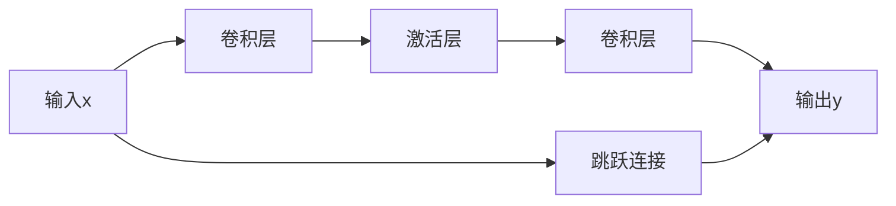

# 从零开始大模型开发与微调：ResNet实战

## 1. 背景介绍
在深度学习的世界中，卷积神经网络（CNN）已经成为图像识别和分类任务的核心技术。自从AlexNet在2012年ImageNet挑战中取得突破性成绩以来，各种CNN架构相继涌现。其中，ResNet（残差网络）以其独特的残差学习框架解决了深度网络训练中的退化问题，成为了深度学习领域的一个里程碑。本文将深入探讨ResNet的开发与微调过程，为读者提供一个从零开始的实战指南。

## 2. 核心概念与联系
### 2.1 深度学习与卷积神经网络
深度学习是机器学习的一个分支，它通过构建多层的神经网络来学习数据的高层特征。卷积神经网络是深度学习中专门用于处理具有已知网格结构的数据（如图像）的一类网络。

### 2.2 残差学习的引入
随着网络深度的增加，理论上网络的表达能力应该更强，但实际上却出现了性能下降的问题，即所谓的网络退化。残差学习框架的提出，通过引入跳跃连接（skip connections）来允许网络学习输入与输出之间的残差，有效解决了这一问题。

### 2.3 ResNet的核心结构
ResNet的核心是残差块（Residual Block），它包含两个主要部分：一组卷积层和一个跳跃连接。跳跃连接使得网络可以直接传递梯度，从而避免了深层网络中梯度消失的问题。

## 3. 核心算法原理具体操作步骤
### 3.1 残差块的构建

残差块的基本操作步骤如上图所示，输入x通过一系列卷积层和激活层后得到输出y，同时x也通过跳跃连接直接与输出相加，从而形成最终的残差块输出。

### 3.2 网络的堆叠
ResNet通过堆叠多个残差块来构建深层网络，每个残差块的输出作为下一个残差块的输入。

## 4. 数学模型和公式详细讲解举例说明
在残差块中，设输入为 $x$，第一个卷积层的权重为 $W_1$，第二个卷积层的权重为 $W_2$，则残差块的输出 $y$ 可以表示为：
$$
y = F(x, \{W_i\}) + x
$$
其中，$F(x, \{W_i\})$ 是卷积层和激活层的复合函数。当输入和输出维度不一致时，可以引入一个线性变换 $W_s$ 来调整维度：
$$
y = F(x, \{W_i\}) + W_s x
$$
这样，网络可以学习输入和输出之间的残差函数 $F(x, \{W_i\})$，而不是直接学习映射函数。

## 5. 项目实践：代码实例和详细解释说明
在实践中，我们将使用Python和深度学习框架（如TensorFlow或PyTorch）来实现ResNet。以下是一个简化的ResNet残差块的实现示例：

```python
import torch
import torch.nn as nn

class BasicBlock(nn.Module):
    expansion = 1

    def __init__(self, in_channels, out_channels, stride=1, downsample=None):
        super(BasicBlock, self).__init__()
        self.conv1 = nn.Conv2d(in_channels, out_channels, kernel_size=3, stride=stride, padding=1, bias=False)
        self.bn1 = nn.BatchNorm2d(out_channels)
        self.relu = nn.ReLU(inplace=True)
        self.conv2 = nn.Conv2d(out_channels, out_channels, kernel_size=3, padding=1, bias=False)
        self.bn2 = nn.BatchNorm2d(out_channels)
        self.downsample = downsample

    def forward(self, x):
        identity = x

        out = self.conv1(x)
        out = self.bn1(out)
        out = self.relu(out)

        out = self.conv2(out)
        out = self.bn2(out)

        if self.downsample is not None:
            identity = self.downsample(x)

        out += identity
        out = self.relu(out)

        return out
```
在这个代码示例中，我们定义了一个 `BasicBlock` 类，它继承自 `nn.Module`。这个类实现了一个基本的残差块，包括两个卷积层、批量归一化层和ReLU激活函数。如果输入和输出的维度不一致，`downsample` 参数可以用来进行维度匹配。

## 6. 实际应用场景
ResNet在多个领域都有广泛的应用，包括但不限于图像识别、物体检测、视频分析和医学图像处理。例如，在图像识别任务中，ResNet可以有效地识别和分类来自不同类别的图像。

## 7. 工具和资源推荐
- **深度学习框架**：TensorFlow, PyTorch, Keras
- **数据集**：ImageNet, COCO, CIFAR-10
- **学习资源**：Coursera, Udacity, fast.ai

## 8. 总结：未来发展趋势与挑战
ResNet的提出极大地推动了深度学习的发展，但仍然存在一些挑战和发展趋势。例如，如何设计更高效的网络结构以减少计算资源的消耗，以及如何进一步提高网络的泛化能力等。未来的研究可能会集中在网络架构的自动搜索（NAS）和模型压缩等方面。

## 9. 附录：常见问题与解答
- **Q1**: ResNet如何解决梯度消失问题？
- **A1**: 通过引入跳跃连接，ResNet允许梯度直接流过网络，从而减轻了梯度消失的问题。

- **Q2**: ResNet和普通的深层网络有什么区别？
- **A2**: ResNet的关键区别在于它的残差块设计，这使得网络能够通过跳跃连接学习残差函数，而不是直接学习映射函数。

- **Q3**: 如何选择ResNet的层数？
- **A3**: 层数的选择通常基于具体任务的需求和可用的计算资源。实验和经验可以帮助确定最佳的层数。

作者：禅与计算机程序设计艺术 / Zen and the Art of Computer Programming