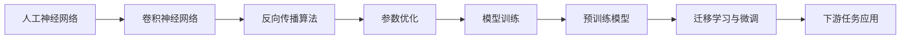

# 从零开始大模型开发与微调：基于卷积的MNIST分类模型

## 1. 背景介绍

### 1.1 深度学习与大模型的兴起

近年来,随着计算能力的提升和数据量的增长,深度学习技术取得了飞速发展。特别是在计算机视觉、自然语言处理等领域,深度学习模型展现出了远超传统机器学习方法的性能。其中,卷积神经网络(Convolutional Neural Network, CNN)作为一种专门用于处理网格结构数据(如图像)的神经网络,在图像分类、目标检测、语义分割等任务上取得了广泛成功。

而随着模型参数量和训练数据规模的不断扩大,大模型(Large-scale Model)的概念开始兴起。大模型通过海量参数和数据的学习,能够建立起对世界知识的深度理解,从而在下游任务上取得更加优异的表现。

### 1.2 MNIST数据集简介

MNIST是一个手写数字识别的经典数据集,被誉为计算机视觉领域的"Hello World"。它包含60,000张训练图像和10,000张测试图像,每张图像都是28x28像素的灰度图,共10个类别(数字0-9)。尽管MNIST属于相对简单的数据集,但对于验证新的模型架构和优化算法具有重要意义。同时,通过在MNIST上探索大模型的开发和微调流程,能为后续更加复杂的任务提供宝贵经验。

### 1.3 本文的主要内容

本文将详细介绍如何从零开始,基于卷积神经网络构建一个用于MNIST手写数字识别的大模型。我们会分别从以下几个方面展开:

1. 介绍卷积神经网络的核心概念与内在联系
2. 讲解模型的核心算法原理和具体操作步骤
3. 推导相关的数学模型和公式,并举例说明
4. 给出模型的代码实现,并详细解释说明
5. 探讨模型的实际应用场景
6. 推荐相关的开发工具和学习资源
7. 总结大模型的未来发展趋势与面临的挑战
8. 归纳大模型开发中的常见问题与解答

通过本文的学习,读者将掌握从零开始构建卷积神经网络大模型的完整流程,并能够将其应用到实际的图像分类任务中去。

## 2. 核心概念与联系

### 2.1 人工神经网络

人工神经网络(Artificial Neural Network, ANN)是一种模拟生物神经系统结构和功能的计算模型。它由大量的人工神经元相互连接构成,每个神经元可以接收其他神经元的输入信号,并产生输出信号。通过调整神经元之间连接的权重,神经网络可以学习到输入和输出之间的复杂映射关系。

### 2.2 卷积神经网络

卷积神经网络是一种专门用于处理网格结构数据的神经网络。它的基本组成单元是卷积层(Convolutional Layer)和池化层(Pooling Layer):

- 卷积层使用一组可学习的卷积核(Kernel)在输入特征图上滑动,提取局部特征。每个卷积核会生成一个新的二维特征图。
- 池化层对卷积层的输出进行下采样,减小特征图的尺寸,同时保留最显著的特征。常见的池化操作包括最大池化(Max Pooling)和平均池化(Average Pooling)。

通过交替使用卷积层和池化层,CNN能够逐层提取图像的层次化特征,从低层的边缘、纹理到高层的物体部件和整体结构。

### 2.3 反向传播算法

反向传播(Backpropagation)是训练神经网络的核心算法。它根据损失函数对网络输出的梯度,采用链式法则自顶向下地计算每一层网络参数的梯度,并使用梯度下降法更新参数,最小化损失函数。通过多轮迭代优化,网络能够学习到最优的参数配置。

### 2.4 迁移学习与微调

迁移学习(Transfer Learning)是指将一个模型在某个源任务上学习到的知识,迁移到另一个目标任务上,以提高目标任务的学习效率和性能。微调(Fine-tuning)是迁移学习的一种常见方式,即在目标任务的数据上,使用较小的学习率对预训练模型的部分或全部参数进行再训练,使其适应新的任务。

### 2.5 核心概念之间的联系

下面我们使用Mermaid流程图来展示上述核心概念之间的内在联系:

从图中可以看出,卷积神经网络是人工神经网络的一个重要分支,专门用于处理网格结构数据。而反向传播算法是训练卷积神经网络的核心,通过参数的迭代优化,使模型学习到最优配置。在此基础上,我们可以在大规模数据上训练出一个预训练模型,再通过迁移学习和微调的方式,将其应用到下游的具体任务中。

## 3. 核心算法原理具体操作步骤

### 3.1 卷积操作

卷积操作是卷积神经网络的核心组成部分。对于一个二维图像输入x和卷积核w,卷积操作的数学定义为:

$y[i,j] = \sum_m \sum_n x[i+m, j+n] \cdot w[m,n]$

其中,y是输出特征图,$i,j$表示输出特征图上的位置索引,$m,n$表示卷积核的尺寸。

卷积操作的具体步骤如下:

1. 将卷积核放置在输入特征图的左上角,对应位置相乘并求和,得到输出特征图的第一个元素。
2. 将卷积核向右滑动一个步长(stride),重复步骤1,得到输出特征图的第二个元素。
3. 当卷积核到达输入特征图的最右边时,再向下滑动一个步长,重复步骤1-2,直到遍历完整个输入特征图。

通过卷积操作,CNN可以提取输入图像的局部特征,并通过多层卷积的堆叠,逐步建立起图像的层次化表示。

### 3.2 池化操作

池化操作用于对卷积层的输出进行下采样,减小特征图的尺寸,同时保留最显著的特征。以最大池化为例,其数学定义为:

$y[i,j] = \max_{m,n} x[i \cdot s + m, j \cdot s + n]$

其中,y是输出特征图,$i,j$表示输出特征图上的位置索引,$s$表示池化的步长,$m,n$表示池化窗口的尺寸。

最大池化的具体步骤如下:

1. 将池化窗口放置在输入特征图的左上角,取窗口内的最大值作为输出特征图的第一个元素。
2. 将池化窗口向右滑动$s$个步长,重复步骤1,得到输出特征图的第二个元素。
3. 当池化窗口到达输入特征图的最右边时,再向下滑动$s$个步长,重复步骤1-2,直到遍历完整个输入特征图。

通过池化操作,CNN可以降低特征图的空间维度,减少后续层的计算量,同时还能提高特征的平移不变性。

### 3.3 反向传播算法

反向传播算法用于计算神经网络损失函数对每一层参数的梯度,并根据梯度更新参数。假设神经网络的层数为$L$,第$l$层的输入为$a^{(l-1)}$,权重矩阵为$W^{(l)}$,偏置向量为$b^{(l)}$,激活函数为$f^{(l)}$,损失函数为$J$。反向传播的具体步骤如下:

1. 前向传播:根据输入$a^{(0)} = x$,逐层计算每一层的输出:

$z^{(l)} = W^{(l)} a^{(l-1)} + b^{(l)}$

$a^{(l)} = f^{(l)}(z^{(l)})$

2. 计算输出层的损失函数值$J$和梯度$\delta^{(L)} = \nabla_{a^{(L)}} J \odot f'^{(L)}(z^{(L)})$。

3. 反向传播:从最后一层$l=L-1$开始,逐层计算每一层的梯度:

$\delta^{(l)} = ((W^{(l+1)})^T \delta^{(l+1)}) \odot f'^{(l)}(z^{(l)})$

其中,$\odot$表示Hadamard乘积(逐元素相乘)。

4. 计算每一层权重和偏置的梯度:

$\nabla_{W^{(l)}} J = \delta^{(l)} (a^{(l-1)})^T$

$\nabla_{b^{(l)}} J = \delta^{(l)}$

5. 使用梯度下降法更新每一层的权重和偏置:

$W^{(l)} := W^{(l)} - \alpha \nabla_{W^{(l)}} J$

$b^{(l)} := b^{(l)} - \alpha \nabla_{b^{(l)}} J$

其中,$\alpha$表示学习率。

6. 重复步骤1-5,直到损失函数收敛或达到预设的迭代次数。

通过反向传播算法,神经网络可以学习到最优的参数配置,从而最小化损失函数,提高模型的性能。

## 4. 数学模型和公式详细讲解举例说明

### 4.1 交叉熵损失函数

对于多分类问题,交叉熵损失函数是一种常用的损失函数形式。假设模型的输出向量为$\hat{y} = (\hat{y}_1, \hat{y}_2, \dots, \hat{y}_K)$,真实标签的one-hot编码为$y = (y_1, y_2, \dots, y_K)$,其中$K$表示类别数。交叉熵损失函数定义为:

$J(\hat{y}, y) = -\sum_{k=1}^K y_k \log \hat{y}_k$

举例说明:假设一个3分类问题,模型的输出向量为$\hat{y} = (0.2, 0.3, 0.5)$,真实标签为第三类,即$y = (0, 0, 1)$。则交叉熵损失为:

$J(\hat{y}, y) = -(0 \log 0.2 + 0 \log 0.3 + 1 \log 0.5) \approx 0.693$

可以看出,交叉熵损失函数衡量了模型预测分布与真实分布之间的差异,当两者完全一致时,损失函数达到最小值0。

### 4.2 Softmax函数

在多分类问题中,我们通常使用Softmax函数将模型的输出转化为一个概率分布。假设模型的原始输出向量为$z = (z_1, z_2, \dots, z_K)$,Softmax函数定义为:

$\hat{y}_k = \frac{\exp(z_k)}{\sum_{i=1}^K \exp(z_i)}$

举例说明:假设模型的原始输出向量为$z = (1.0, 2.0, 3.0)$,则Softmax函数的计算过程为:

$\hat{y}_1 = \frac{\exp(1.0)}{\exp(1.0) + \exp(2.0) + \exp(3.0)} \approx 0.090$

$\hat{y}_2 = \frac{\exp(2.0)}{\exp(1.0) + \exp(2.0) + \exp(3.0)} \approx 0.245$ 

$\hat{y}_3 = \frac{\exp(3.0)}{\exp(1.0) + \exp(2.0) + \exp(3.0)} \approx 0.665$

可以看出,Softmax函数将原始输出向量转化为一个概率分布,满足$\sum_{k=1}^K \hat{y}_k = 1$且$\hat{y}_k \in (0,1)$。这使得我们可以将输出解释为模型对每个类别的置信度。

### 4.3 L2正则化

L2正则化是一种常用的正则化方法,用于控制模型的复杂度,防止过拟合。它在损失函数中加入权重参数的L2范数作为惩罚项,使模型倾向