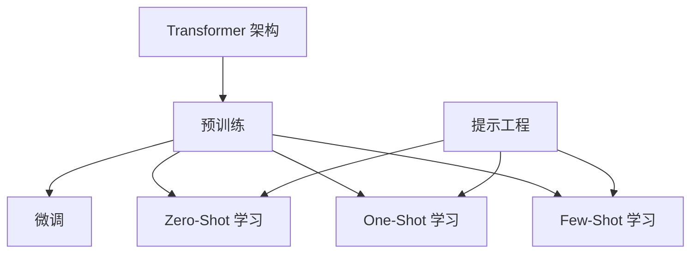

# 从零开始大模型开发与微调：大模型带来的变革

## 1. 背景介绍
### 1.1 大模型的崛起
近年来,随着深度学习技术的飞速发展,以Transformer为代表的大规模预训练语言模型(Large Language Models, LLMs)在自然语言处理领域取得了突破性的进展。从GPT-3、PaLM到ChatGPT,这些大模型展现出了惊人的语言理解和生成能力,引发了业界的广泛关注。

### 1.2 大模型的优势
与传统的自然语言处理模型相比,大模型具有以下优势:

- 强大的语言理解和生成能力:通过在海量语料上的预训练,大模型能够更好地理解自然语言,并生成流畅、连贯的文本。
- 广泛的应用前景:大模型可以应用于问答、对话、文本生成、信息抽取等多个任务,具有广阔的应用前景。
- 更少的训练数据需求:得益于预训练的知识,大模型在下游任务上往往只需要少量的微调数据就能取得不错的效果。

### 1.3 大模型带来的挑战
尽管大模型展现出了巨大的潜力,但它们也带来了一些挑战:

- 计算资源需求高:训练和部署大模型需要大量的计算资源,对硬件和能源消耗提出了更高的要求。
- 模型可解释性差:由于模型参数量巨大,大模型的决策过程往往难以解释,这可能影响模型的可信度。
- 偏见和安全风险:大模型从海量语料中学习,可能继承了一些偏见,并存在生成有害内容的风险。

## 2. 核心概念与联系
### 2.1 Transformer 架构
Transformer 是大模型的核心架构,它摒弃了传统的循环神经网络(RNN),转而使用自注意力机制(Self-Attention)来建模序列数据。Transformer 由编码器(Encoder)和解码器(Decoder)组成,通过自注意力和前馈神经网络(Feed-Forward Network)的交替堆叠,实现了并行计算和长程依赖建模。

### 2.2 预训练和微调
大模型的训练过程通常分为两个阶段:预训练(Pre-training)和微调(Fine-tuning)。

- 预训练:在大规模无标注语料上,以自监督的方式训练模型,让模型学习到语言的通用表示。常见的预训练任务包括语言模型、掩码语言模型等。
- 微调:在特定的下游任务上,以少量标注数据对预训练模型进行微调,使其适应具体任务。微调可以大大减少所需的训练数据和训练时间。

### 2.3 Zero-Shot、One-Shot 和 Few-Shot 学习
得益于强大的语言理解能力,大模型展现出了零样本(Zero-Shot)、单样本(One-Shot)和少样本(Few-Shot)学习的能力。

- Zero-Shot 学习:无需训练样本,模型可以直接根据任务描述完成任务。
- One-Shot 学习:只需一个样本,模型就能理解任务并完成任务。
- Few-Shot 学习:使用少量样本(通常小于10个)对模型进行微调,模型即可快速适应新任务。

### 2.4 提示工程(Prompt Engineering)
提示工程是指根据任务设计合适的输入提示(Prompt),引导大模型生成期望的输出。通过精心设计的提示,可以在无需微调的情况下实现 Zero-Shot 或 Few-Shot 学习。提示工程已成为大模型应用的重要技术。

以下是核心概念之间的联系图:



## 3. 核心算法原理与具体操作步骤
### 3.1 Transformer 的自注意力机制
Transformer 的核心是自注意力机制,它允许模型在处理某个词时,参考句子中的所有其他词,从而建模词之间的长程依赖关系。自注意力的计算过程如下:

1. 将输入序列 $X \in \mathbb{R}^{n \times d}$ 通过三个线性变换得到查询矩阵 $Q$、键矩阵 $K$ 和值矩阵 $V$:

$$ Q = XW_Q, K = XW_K, V = XW_V $$

其中 $W_Q, W_K, W_V \in \mathbb{R}^{d \times d_k}$ 是可学习的参数矩阵。

2. 计算查询矩阵 $Q$ 和键矩阵 $K$ 的点积,并除以 $\sqrt{d_k}$ 进行缩放,得到注意力分数矩阵 $A$:

$$ A = \text{softmax}(\frac{QK^T}{\sqrt{d_k}}) $$

3. 将注意力分数矩阵 $A$ 与值矩阵 $V$ 相乘,得到自注意力的输出 $Z$:

$$ Z = AV $$

通过自注意力机制,Transformer 可以有效地捕捉序列中的长程依赖,并实现并行计算。

### 3.2 预训练的掩码语言模型(Masked Language Model, MLM)
掩码语言模型是一种常用的预训练任务,其目标是根据上下文预测被掩码的词。具体步骤如下:

1. 随机选择输入序列中的一部分词(通常是15%),并将其替换为特殊的 [MASK] 标记。
2. 将掩码后的序列输入到 Transformer 编码器,得到每个位置的隐藏状态。
3. 使用被掩码位置的隐藏状态,通过一个线性层和 softmax 函数预测原始词。
4. 使用交叉熵损失函数计算预测词与真实词之间的差异,并通过反向传播更新模型参数。

通过MLM预训练,模型可以学习到语言的通用表示,并在下游任务中展现出良好的迁移能力。

### 3.3 微调的具体步骤
在下游任务上对预训练模型进行微调的具体步骤如下:

1. 根据任务的输入和输出格式,准备微调数据集。
2. 将预训练模型的最后一层替换为与任务相关的输出层(如分类层、序列标注层等)。
3. 使用微调数据集,通过反向传播算法更新整个模型的参数。通常使用较小的学习率,以避免破坏预训练的知识。
4. 在验证集上评估模型性能,根据需要调整超参数。
5. 使用微调后的模型对测试集进行预测,评估模型在实际任务中的表现。

微调通常只需要较少的数据和训练时间,即可在下游任务上取得不错的效果。

## 4. 数学模型和公式详细讲解举例说明
### 4.1 Transformer 的数学模型
Transformer 的编码器和解码器都由多个相同的层堆叠而成,每一层包括两个子层:自注意力层和前馈神经网络层。

对于编码器的第 $l$ 层,其输入为上一层的输出 $H^{(l-1)} \in \mathbb{R}^{n \times d}$,经过自注意力层得到隐藏状态 $\tilde{H}^{(l)}$:

$$ \tilde{H}^{(l)} = \text{SelfAttention}(H^{(l-1)}) + H^{(l-1)} $$

然后,隐藏状态 $\tilde{H}^{(l)}$ 经过前馈神经网络层得到该层的输出 $H^{(l)}$:

$$ H^{(l)} = \text{FFN}(\tilde{H}^{(l)}) + \tilde{H}^{(l)} $$

其中, $\text{FFN}$ 表示前馈神经网络,通常由两个线性变换和一个 ReLU 激活函数组成:

$$ \text{FFN}(x) = \max(0, xW_1 + b_1)W_2 + b_2 $$

解码器的结构与编码器类似,但在自注意力层之后多了一个编码-解码注意力层,用于关注编码器的输出。

### 4.2 自注意力的计算举例
假设有一个长度为4的输入序列 $X \in \mathbb{R}^{4 \times d}$,自注意力的计算过程如下:

1. 计算查询矩阵 $Q$、键矩阵 $K$ 和值矩阵 $V$:

$$ Q = XW_Q, K = XW_K, V = XW_V $$

其中 $W_Q, W_K, W_V \in \mathbb{R}^{d \times d_k}$ 是可学习的参数矩阵。

2. 计算注意力分数矩阵 $A$:

$$ A = \text{softmax}(\frac{QK^T}{\sqrt{d_k}}) $$

假设 $d_k=64$,注意力分数矩阵 $A$ 的维度为 $4 \times 4$,其中 $A_{ij}$ 表示第 $i$ 个词对第 $j$ 个词的注意力分数。

3. 计算自注意力的输出 $Z$:

$$ Z = AV $$

输出矩阵 $Z$ 的维度为 $4 \times d_k$,其中 $Z_i$ 表示第 $i$ 个词的新表示,融合了序列中所有词的信息,权重由注意力分数决定。

通过这个例子,我们可以看到自注意力机制如何捕捉词之间的依赖关系,并生成新的词表示。

## 5. 项目实践：代码实例和详细解释说明
下面是一个使用 PyTorch 实现 Transformer 编码器的代码示例:

```python
import torch
import torch.nn as nn

class SelfAttention(nn.Module):
    def __init__(self, hidden_size, num_heads):
        super(SelfAttention, self).__init__()
        self.hidden_size = hidden_size
        self.num_heads = num_heads
        self.head_size = hidden_size // num_heads
        
        self.query = nn.Linear(hidden_size, hidden_size)
        self.key = nn.Linear(hidden_size, hidden_size)
        self.value = nn.Linear(hidden_size, hidden_size)
        
        self.out = nn.Linear(hidden_size, hidden_size)
        
    def forward(self, x):
        batch_size, seq_len, _ = x.size()
        
        q = self.query(x).view(batch_size, seq_len, self.num_heads, self.head_size).transpose(1, 2)
        k = self.key(x).view(batch_size, seq_len, self.num_heads, self.head_size).transpose(1, 2)
        v = self.value(x).view(batch_size, seq_len, self.num_heads, self.head_size).transpose(1, 2)
        
        scores = torch.matmul(q, k.transpose(-2, -1)) / (self.head_size ** 0.5)
        scores = torch.softmax(scores, dim=-1)
        
        out = torch.matmul(scores, v).transpose(1, 2).contiguous().view(batch_size, seq_len, self.hidden_size)
        out = self.out(out)
        
        return out

class TransformerEncoderLayer(nn.Module):
    def __init__(self, hidden_size, num_heads, ff_size, dropout=0.1):
        super(TransformerEncoderLayer, self).__init__()
        self.self_attention = SelfAttention(hidden_size, num_heads)
        self.norm1 = nn.LayerNorm(hidden_size)
        self.ff = nn.Sequential(
            nn.Linear(hidden_size, ff_size),
            nn.ReLU(),
            nn.Linear(ff_size, hidden_size)
        )
        self.norm2 = nn.LayerNorm(hidden_size)
        self.dropout = nn.Dropout(dropout)
        
    def forward(self, x):
        x_att = self.self_attention(x)
        x = self.norm1(x + self.dropout(x_att))
        x_ff = self.ff(x)
        x = self.norm2(x + self.dropout(x_ff))
        return x

class TransformerEncoder(nn.Module):
    def __init__(self, num_layers, hidden_size, num_heads, ff_size, dropout=0.1):
        super(TransformerEncoder, self).__init__()
        self.layers = nn.ModuleList([
            TransformerEncoderLayer(hidden_size, num_heads, ff_size, dropout)
            for _ in range(num_layers)
        ])
        
    def forward(self, x):
        for layer in self.layers:
            x = layer(x)
        return x
```

这个代码实现了 Transformer 编码器的核心组件:

1. `SelfAttention` 类实现了多头自注意力机制。它首先通过线性变换得到查询矩阵 $Q$、键矩阵 