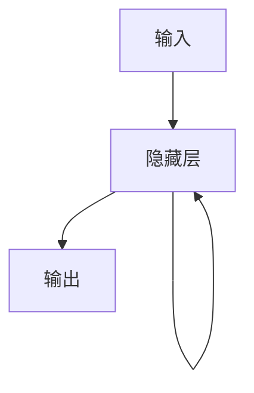
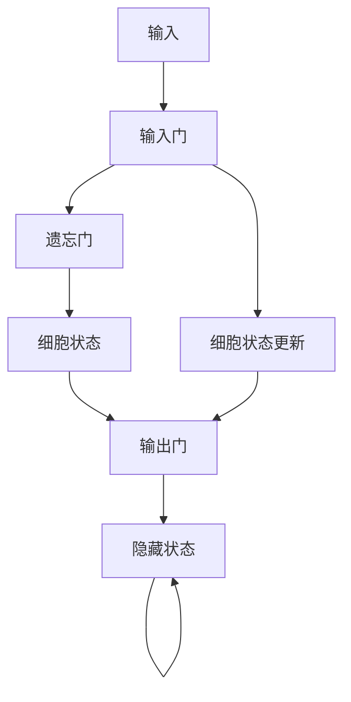
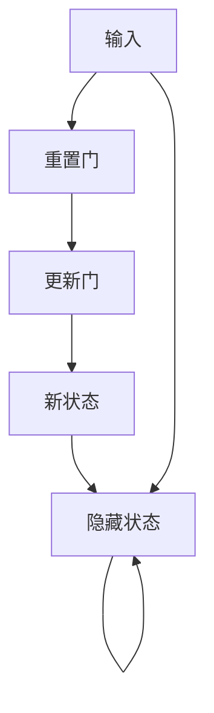

## 1. 背景介绍

随着人工智能技术的不断发展，循环神经网络（Recurrent Neural Network，RNN）已经成为了自然语言处理、语音识别、图像处理等领域中的重要技术。RNN可以处理序列数据，具有记忆能力，能够捕捉序列中的长期依赖关系。但是，RNN也存在着一些问题，比如梯度消失和梯度爆炸等问题，这些问题会导致模型的训练变得困难。为了解决这些问题，人们提出了一些改进的RNN模型，比如长短时记忆网络（Long Short-Term Memory，LSTM）和门控循环单元（Gated Recurrent Unit，GRU）等。

本文将从RNN的基本原理出发，介绍RNN的改进模型，包括LSTM和GRU，并通过实例演示如何使用这些模型进行大模型开发和微调。

## 2. 核心概念与联系

### 2.1 循环神经网络

循环神经网络是一种能够处理序列数据的神经网络。它的输入和输出都是序列数据，每个时间步的输入和输出都与前面的时间步有关系。循环神经网络的基本结构如下图所示：



在循环神经网络中，隐藏层的输出会被传递到下一个时间步，作为下一个时间步的输入。这样，循环神经网络就可以捕捉序列中的长期依赖关系。

### 2.2 长短时记忆网络

长短时记忆网络是一种改进的循环神经网络，它可以解决循环神经网络中的梯度消失和梯度爆炸问题。LSTM的基本结构如下图所示：



LSTM中引入了三个门控机制：输入门、遗忘门和输出门。输入门控制哪些信息可以进入细胞状态，遗忘门控制哪些信息可以从细胞状态中删除，输出门控制哪些信息可以输出到下一个时间步。这些门控机制可以有效地控制信息的流动，从而解决梯度消失和梯度爆炸问题。

### 2.3 门控循环单元

门控循环单元是另一种改进的循环神经网络，它也可以解决梯度消失和梯度爆炸问题。GRU的基本结构如下图所示：



GRU中引入了两个门控机制：重置门和更新门。重置门控制哪些信息可以被忽略，更新门控制哪些信息可以被更新。这些门控机制可以有效地控制信息的流动，从而解决梯度消失和梯度爆炸问题。

## 3. 核心算法原理具体操作步骤

### 3.1 循环神经网络

循环神经网络的核心算法原理是反向传播算法。在训练过程中，我们需要计算损失函数对模型参数的梯度，然后使用梯度下降算法来更新模型参数。由于循环神经网络中存在着时间依赖关系，因此我们需要使用反向传播算法来计算梯度。

具体操作步骤如下：

1. 初始化模型参数。
2. 对于每个时间步，计算隐藏状态。
3. 对于每个时间步，计算输出。
4. 计算损失函数。
5. 计算损失函数对模型参数的梯度。
6. 使用梯度下降算法来更新模型参数。
7. 重复步骤2-6，直到模型收敛。

### 3.2 长短时记忆网络

长短时记忆网络的核心算法原理是LSTM算法。LSTM算法中引入了三个门控机制：输入门、遗忘门和输出门。这些门控机制可以有效地控制信息的流动，从而解决梯度消失和梯度爆炸问题。

具体操作步骤如下：

1. 初始化模型参数。
2. 对于每个时间步，计算输入门、遗忘门和输出门。
3. 对于每个时间步，计算细胞状态。
4. 对于每个时间步，计算隐藏状态。
5. 计算损失函数。
6. 计算损失函数对模型参数的梯度。
7. 使用梯度下降算法来更新模型参数。
8. 重复步骤2-7，直到模型收敛。

### 3.3 门控循环单元

门控循环单元的核心算法原理是GRU算法。GRU算法中引入了两个门控机制：重置门和更新门。这些门控机制可以有效地控制信息的流动，从而解决梯度消失和梯度爆炸问题。

具体操作步骤如下：

1. 初始化模型参数。
2. 对于每个时间步，计算重置门和更新门。
3. 对于每个时间步，计算新状态。
4. 对于每个时间步，计算隐藏状态。
5. 计算损失函数。
6. 计算损失函数对模型参数的梯度。
7. 使用梯度下降算法来更新模型参数。
8. 重复步骤2-7，直到模型收敛。

## 4. 数学模型和公式详细讲解举例说明

### 4.1 循环神经网络

循环神经网络的数学模型和公式如下：

$$h_t = f(W_{xh}x_t + W_{hh}h_{t-1} + b_h)$$

$$y_t = g(W_{hy}h_t + b_y)$$

其中，$x_t$是输入向量，$h_t$是隐藏状态向量，$y_t$是输出向量，$W_{xh}$、$W_{hh}$、$W_{hy}$是权重矩阵，$b_h$、$b_y$是偏置向量，$f$、$g$是激活函数。

### 4.2 长短时记忆网络

长短时记忆网络的数学模型和公式如下：

$$i_t = \sigma(W_{xi}x_t + W_{hi}h_{t-1} + b_i)$$

$$f_t = \sigma(W_{xf}x_t + W_{hf}h_{t-1} + b_f)$$

$$o_t = \sigma(W_{xo}x_t + W_{ho}h_{t-1} + b_o)$$

$$\tilde{C}_t = \tanh(W_{xc}x_t + W_{hc}h_{t-1} + b_c)$$

$$C_t = f_t \odot C_{t-1} + i_t \odot \tilde{C}_t$$

$$h_t = o_t \odot \tanh(C_t)$$

其中，$i_t$、$f_t$、$o_t$是输入门、遗忘门和输出门，$\tilde{C}_t$是新的细胞状态，$C_t$是细胞状态，$h_t$是隐藏状态。

### 4.3 门控循环单元

门控循环单元的数学模型和公式如下：

$$r_t = \sigma(W_{xr}x_t + W_{hr}h_{t-1} + b_r)$$

$$z_t = \sigma(W_{xz}x_t + W_{hz}h_{t-1} + b_z)$$

$$\tilde{h}_t = \tanh(W_{xh}x_t + r_t \odot (W_{hh}h_{t-1}) + b_h)$$

$$h_t = (1 - z_t) \odot h_{t-1} + z_t \odot \tilde{h}_t$$

其中，$r_t$、$z_t$是重置门和更新门，$\tilde{h}_t$是新的隐藏状态，$h_t$是隐藏状态。

## 5. 项目实践：代码实例和详细解释说明

### 5.1 循环神经网络

下面是一个使用循环神经网络进行文本分类的代码实例：

```python
import torch
import torch.nn as nn

class RNN(nn.Module):
    def __init__(self, input_size, hidden_size, output_size):
        super(RNN, self).__init__()
        self.hidden_size = hidden_size
        self.rnn = nn.RNN(input_size, hidden_size)
        self.fc = nn.Linear(hidden_size, output_size)
    
    def forward(self, x):
        h0 = torch.zeros(1, x.size(1), self.hidden_size)
        out, hn = self.rnn(x, h0)
        out = self.fc(out[-1])
        return out
```

在这个代码中，我们定义了一个RNN类，它继承自nn.Module类。在RNN类的构造函数中，我们定义了一个RNN层和一个全连接层。在RNN类的forward函数中，我们首先初始化隐藏状态$h_0$，然后将输入$x$和$h_0$传入RNN层中，得到输出$out$和最后一个隐藏状态$hn$。最后，我们将$out$的最后一个时间步的输出传入全连接层中，得到最终的输出。

### 5.2 长短时记忆网络

下面是一个使用长短时记忆网络进行文本分类的代码实例：

```python
import torch
import torch.nn as nn

class LSTM(nn.Module):
    def __init__(self, input_size, hidden_size, output_size):
        super(LSTM, self).__init__()
        self.hidden_size = hidden_size
        self.lstm = nn.LSTM(input_size, hidden_size)
        self.fc = nn.Linear(hidden_size, output_size)
    
    def forward(self, x):
        h0 = torch.zeros(1, x.size(1), self.hidden_size)
        c0 = torch.zeros(1, x.size(1), self.hidden_size)
        out, (hn, cn) = self.lstm(x, (h0, c0))
        out = self.fc(out[-1])
        return out
```

在这个代码中，我们定义了一个LSTM类，它继承自nn.Module类。在LSTM类的构造函数中，我们定义了一个LSTM层和一个全连接层。在LSTM类的forward函数中，我们首先初始化隐藏状态$h_0$和细胞状态$c_0$，然后将输入$x$、$h_0$和$c_0$传入LSTM层中，得到输出$out$和最后一个隐藏状态$hn$和细胞状态$cn$。最后，我们将$out$的最后一个时间步的输出传入全连接层中，得到最终的输出。

### 5.3 门控循环单元

下面是一个使用门控循环单元进行文本分类的代码实例：

```python
import torch
import torch.nn as nn

class GRU(nn.Module):
    def __init__(self, input_size, hidden_size, output_size):
        super(GRU, self).__init__()
        self.hidden_size = hidden_size
        self.gru = nn.GRU(input_size, hidden_size)
        self.fc = nn.Linear(hidden_size, output_size)
    
    def forward(self, x):
        h0 = torch.zeros(1, x.size(1), self.hidden_size)
        out, hn = self.gru(x, h0)
        out = self.fc(out[-1])
        return out
```

在这个代码中，我们定义了一个GRU类，它继承自nn.Module类。在GRU类的构造函数中，我们定义了一个GRU层和一个全连接层。在GRU类的forward函数中，我们首先初始化隐藏状态$h_0$，然后将输入$x$和$h_0$传入GRU层中，得到输出$out$和最后一个隐藏状态$hn$。最后，我们将$out$的最后一个时间步的输出传入全连接层中，得到最终的输出。

## 6. 实际应用场景

循环神经网络、长短时记忆网络和门控循环单元在自然语言处理、语音识别、图像处理等领域中都有广泛的应用。比如，在自然语言处理中，我们可以使用循环神经网络进行文本分类、情感分析、机器翻译等任务；在语音识别中，我们可以使用长短时记忆网络进行语音识别、语音合成等任务；在图像处理中，我们可以使用门控循环单元进行图像描述、图像生成等任务。

## 7. 工具和资源推荐

在使用循环神经网络、长短时记忆网络和门控循环单元进行大模型开发和微调时，我们可以使用一些工具和资源来提高效率和准确性。比如，我们可以使用PyTorch、TensorFlow等深度学习框架来实现模型；我们可以使用GloVe、Word2Vec等预训练词向量来提高模型的表现；我们可以使用NLTK、spaCy等自然语言处理工具包来处理文本数据。

## 8. 总结：未来发展趋势与挑战

循环神经网络、长短时记忆网络和门控循环单元是目前自然语言处理、语音识别、图像处理等领域中最常用的技术之一。随着人工智能技术的不断发展，这些技术也在不断地发展和改进。未来，我们可以期待这些技术在更多的领域中得到应用，比如智能交通、智能医疗等领域。同时，这些技术也面临着一些挑战，比如模型的可解释性、数据隐私等问题，这些问题需要我们不断地探索和解决。

## 9. 附录：常见问题与解答

Q: 循环神经网络、长短时记忆网络和门控循环单元有什么区别？

A: 循环神经网络是一种能够处理序列数据的神经网络，它的输入和输出都是序列数据，每个时间步的输入和输出都与前面的时间步有关系。长短时记忆网络是一种改进的循环神经网络，它可以解决循环神经网络中的梯度消失和梯度爆炸问题。门控循环单元是另一