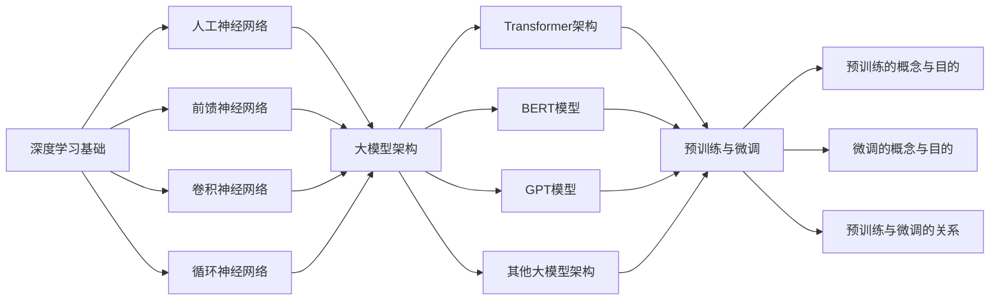

# 从零开始大模型开发与微调：深度学习基础

## 1. 背景介绍
### 1.1 人工智能与深度学习的发展历程
#### 1.1.1 人工智能的起源与发展
#### 1.1.2 深度学习的兴起
#### 1.1.3 大模型的出现与影响

### 1.2 大模型的定义与特点 
#### 1.2.1 大模型的定义
#### 1.2.2 大模型的特点
#### 1.2.3 大模型与传统机器学习模型的区别

### 1.3 大模型的应用领域
#### 1.3.1 自然语言处理
#### 1.3.2 计算机视觉
#### 1.3.3 语音识别
#### 1.3.4 其他应用领域

## 2. 核心概念与联系
### 2.1 深度学习基础
#### 2.1.1 人工神经网络
#### 2.1.2 前馈神经网络
#### 2.1.3 卷积神经网络
#### 2.1.4 循环神经网络

### 2.2 大模型架构
#### 2.2.1 Transformer 架构
#### 2.2.2 BERT 模型
#### 2.2.3 GPT 模型
#### 2.2.4 其他大模型架构

### 2.3 预训练与微调
#### 2.3.1 预训练的概念与目的
#### 2.3.2 微调的概念与目的
#### 2.3.3 预训练与微调的关系

## 3. 核心算法原理具体操作步骤
### 3.1 Transformer 架构
#### 3.1.1 自注意力机制
#### 3.1.2 多头注意力
#### 3.1.3 位置编码
#### 3.1.4 残差连接与层归一化

### 3.2 BERT 模型
#### 3.2.1 Masked Language Model (MLM)
#### 3.2.2 Next Sentence Prediction (NSP)
#### 3.2.3 BERT 的输入表示
#### 3.2.4 BERT 的微调

### 3.3 GPT 模型
#### 3.3.1 因果语言建模
#### 3.3.2 GPT 的输入表示
#### 3.3.3 GPT 的微调

## 4. 数学模型和公式详细讲解举例说明
### 4.1 Softmax 函数
$$
\text{Softmax}(x_i) = \frac{e^{x_i}}{\sum_{j=1}^{n} e^{x_j}}
$$

### 4.2 交叉熵损失函数
$$
\text{CrossEntropyLoss}(y, \hat{y}) = -\sum_{i=1}^{n} y_i \log(\hat{y}_i)
$$

### 4.3 注意力机制
$$
\text{Attention}(Q, K, V) = \text{softmax}(\frac{QK^T}{\sqrt{d_k}})V
$$

### 4.4 层归一化
$$
\text{LayerNorm}(x) = \frac{x - \text{E}[x]}{\sqrt{\text{Var}[x] + \epsilon}} * \gamma + \beta
$$

## 5. 项目实践：代码实例和详细解释说明
### 5.1 使用 PyTorch 实现 Transformer 模型
#### 5.1.1 定义 Transformer 模型类
#### 5.1.2 实现自注意力机制
#### 5.1.3 实现前馈神经网络
#### 5.1.4 实现 Transformer 编码器和解码器

### 5.2 使用 Hugging Face 的 Transformers 库进行预训练和微调
#### 5.2.1 加载预训练模型
#### 5.2.2 准备数据集
#### 5.2.3 定义微调任务
#### 5.2.4 进行微调训练和评估

### 5.3 使用 TensorFlow 实现 BERT 模型
#### 5.3.1 定义 BERT 模型类
#### 5.3.2 实现 Masked Language Model (MLM) 任务
#### 5.3.3 实现 Next Sentence Prediction (NSP) 任务
#### 5.3.4 进行预训练和微调

## 6. 实际应用场景
### 6.1 情感分析
#### 6.1.1 数据准备
#### 6.1.2 模型选择与微调
#### 6.1.3 模型评估与部署

### 6.2 命名实体识别
#### 6.2.1 数据准备
#### 6.2.2 模型选择与微调
#### 6.2.3 模型评估与部署

### 6.3 文本摘要
#### 6.3.1 数据准备
#### 6.3.2 模型选择与微调
#### 6.3.3 模型评估与部署

## 7. 工具和资源推荐
### 7.1 深度学习框架
#### 7.1.1 PyTorch
#### 7.1.2 TensorFlow
#### 7.1.3 Keras

### 7.2 预训练模型库
#### 7.2.1 Hugging Face Transformers
#### 7.2.2 OpenAI GPT
#### 7.2.3 Google BERT

### 7.3 数据集资源
#### 7.3.1 GLUE 基准测试
#### 7.3.2 SQuAD 问答数据集
#### 7.3.3 Common Crawl 语料库

## 8. 总结：未来发展趋势与挑战
### 8.1 大模型的发展趋势
#### 8.1.1 模型规模的持续增长
#### 8.1.2 多模态学习的兴起
#### 8.1.3 模型的可解释性和可控性

### 8.2 大模型面临的挑战
#### 8.2.1 计算资源的限制
#### 8.2.2 数据隐私与安全
#### 8.2.3 模型的公平性和伦理问题

### 8.3 未来研究方向
#### 8.3.1 模型压缩与加速
#### 8.3.2 少样本学习与迁移学习
#### 8.3.3 可解释性与可控性的提升

## 9. 附录：常见问题与解答
### 9.1 如何选择合适的预训练模型？
### 9.2 微调时如何避免过拟合？
### 9.3 如何处理不平衡的数据集？
### 9.4 如何评估大模型的性能？
### 9.5 如何部署大模型到生产环境？

大模型的出现标志着人工智能领域的重大突破，它们在自然语言处理、计算机视觉等领域取得了令人瞩目的成果。本文从深度学习的基础知识出发，详细介绍了大模型的核心概念、算法原理以及实际应用。

深度学习是大模型的基石，其中人工神经网络、前馈神经网络、卷积神经网络和循环神经网络是构建大模型的重要组件。Transformer 架构的出现，特别是其中的自注意力机制和多头注意力，极大地提升了模型处理长序列数据的能力。BERT 和 GPT 等大模型在此基础上进一步发展，通过预训练和微调的方式，在各种自然语言处理任务上取得了出色的表现。

本文详细讲解了 Transformer、BERT 和 GPT 的核心算法原理，并通过数学公式和代码实例进行了说明。同时，本文还介绍了大模型在情感分析、命名实体识别和文本摘要等实际应用场景中的使用方法，以及相关的工具和资源。

展望未来，大模型的发展趋势包括模型规模的持续增长、多模态学习的兴起以及模型可解释性和可控性的提升。然而，大模型也面临着计算资源限制、数据隐私与安全以及公平性和伦理问题等挑战。未来的研究方向可能集中在模型压缩与加速、少样本学习与迁移学习以及可解释性与可控性的提升等方面。

总之，大模型的开发与微调是一个复杂而又充满机遇的领域，需要研究者和实践者不断探索和创新。希望本文能为读者提供一个全面而深入的认识，帮助大家从零开始掌握大模型开发与微调的基础知识和实践技能。

作者：禅与计算机程序设计艺术 / Zen and the Art of Computer Programming