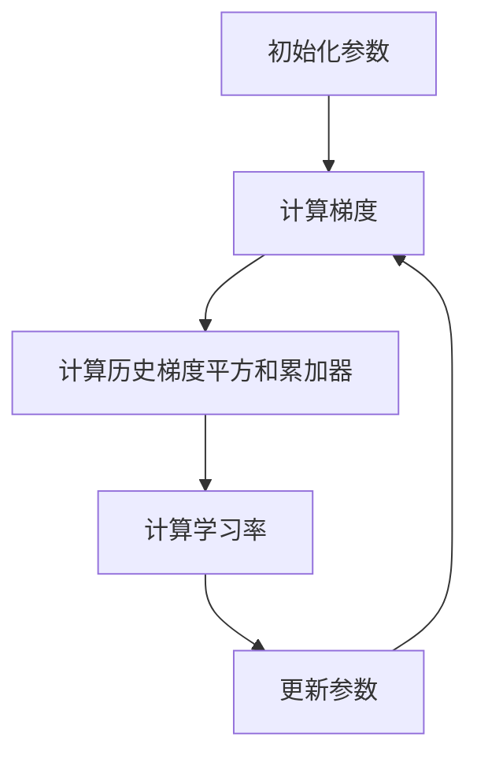

## 1. 背景介绍

在机器学习和深度学习中，优化算法是非常重要的一部分。优化算法的目的是通过调整模型参数来最小化损失函数，从而提高模型的准确性和性能。Adagrad 是一种常用的优化算法，它可以自适应地调整每个参数的学习率，从而更好地适应不同的数据和模型。

## 2. 核心概念与联系

Adagrad 是一种自适应学习率算法，它的核心思想是根据每个参数的历史梯度信息来自适应地调整学习率。具体来说，Adagrad 会为每个参数维护一个历史梯度平方和的累加器，然后将学习率除以这个累加器的平方根。这样做的好处是，对于频繁出现的参数，学习率会逐渐减小，从而更加稳定地更新参数；而对于不经常出现的参数，学习率会逐渐增大，从而更快地更新参数。

Adagrad 的核心概念可以用下面的 Mermaid 流程图来表示：



## 3. 核心算法原理具体操作步骤

Adagrad 的具体操作步骤如下：

1. 初始化参数：将模型参数初始化为一些随机值。
2. 计算梯度：使用训练数据计算模型的梯度。
3. 计算历史梯度平方和累加器：为每个参数维护一个历史梯度平方和的累加器，然后将当前梯度的平方加入到累加器中。
4. 计算学习率：将学习率除以每个参数的历史梯度平方和的平方根。
5. 更新参数：使用计算出的学习率来更新模型参数。

## 4. 数学模型和公式详细讲解举例说明

Adagrad 的数学模型和公式如下：

$$
g_{t,i} = \nabla_{\theta} J(\theta_{t,i}) \\
G_{t,ii} = \sum_{\tau=1}^{t} g_{\tau,i}^2 \\
\theta_{t+1,i} = \theta_{t,i} - \frac{\eta}{\sqrt{G_{t,ii} + \epsilon}} g_{t,i}
$$

其中，$g_{t,i}$ 表示第 $i$ 个参数在第 $t$ 个时间步的梯度，$G_{t,ii}$ 表示第 $i$ 个参数在前 $t$ 个时间步的历史梯度平方和的累加器，$\theta_{t,i}$ 表示第 $i$ 个参数在第 $t$ 个时间步的值，$\eta$ 表示学习率，$\epsilon$ 是一个很小的常数，用来避免除以零的情况。

## 5. 项目实践：代码实例和详细解释说明

下面是一个使用 Adagrad 优化算法训练 MNIST 数据集的代码示例：

```python
import tensorflow as tf
from tensorflow.examples.tutorials.mnist import input_data

# 加载 MNIST 数据集
mnist = input_data.read_data_sets("MNIST_data/", one_hot=True)

# 定义模型
x = tf.placeholder(tf.float32, [None, 784])
y = tf.placeholder(tf.float32, [None, 10])
W = tf.Variable(tf.zeros([784, 10]))
b = tf.Variable(tf.zeros([10]))
y_pred = tf.nn.softmax(tf.matmul(x, W) + b)

# 定义损失函数和优化器
cross_entropy = tf.reduce_mean(-tf.reduce_sum(y * tf.log(y_pred), reduction_indices=[1]))
optimizer = tf.train.AdagradOptimizer(0.5).minimize(cross_entropy)

# 训练模型
sess = tf.Session()
sess.run(tf.global_variables_initializer())
for i in range(1000):
    batch_xs, batch_ys = mnist.train.next_batch(100)
    sess.run(optimizer, feed_dict={x: batch_xs, y: batch_ys})

# 测试模型
correct_prediction = tf.equal(tf.argmax(y_pred, 1), tf.argmax(y, 1))
accuracy = tf.reduce_mean(tf.cast(correct_prediction, tf.float32))
print(sess.run(accuracy, feed_dict={x: mnist.test.images, y: mnist.test.labels}))
```

在这个代码示例中，我们首先加载了 MNIST 数据集，然后定义了一个简单的全连接神经网络模型。接着，我们使用 Adagrad 优化算法来最小化交叉熵损失函数，并在训练过程中使用了随机梯度下降的方法。最后，我们测试了模型的准确率。

## 6. 实际应用场景

Adagrad 优化算法可以应用于各种机器学习和深度学习任务中，特别是在处理大规模数据集和复杂模型时更为有效。例如，在自然语言处理、计算机视觉和语音识别等领域中，Adagrad 优化算法都有广泛的应用。

## 7. 工具和资源推荐

以下是一些有关 Adagrad 优化算法的工具和资源：

- TensorFlow：一个流行的深度学习框架，支持 Adagrad 优化算法。
- PyTorch：另一个流行的深度学习框架，也支持 Adagrad 优化算法。
- 《深度学习》：一本经典的深度学习教材，其中有关 Adagrad 优化算法的介绍非常详细。

## 8. 总结：未来发展趋势与挑战

Adagrad 优化算法是一种非常有效的自适应学习率算法，它可以帮助我们更好地训练机器学习和深度学习模型。未来，随着数据集和模型的规模不断增大，Adagrad 优化算法的重要性将会更加突出。然而，Adagrad 优化算法也存在一些挑战，例如对于稀疏数据和非凸优化问题的处理仍然存在一些问题。

## 9. 附录：常见问题与解答

Q: Adagrad 优化算法和其他自适应学习率算法有什么区别？

A: Adagrad 优化算法和其他自适应学习率算法（如 RMSProp 和 Adam）的区别在于它们如何计算历史梯度信息。Adagrad 优化算法使用历史梯度平方和的累加器，而 RMSProp 和 Adam 则使用指数加权移动平均。

Q: Adagrad 优化算法有哪些优点和缺点？

A: Adagrad 优化算法的优点是可以自适应地调整每个参数的学习率，从而更好地适应不同的数据和模型。缺点是对于稀疏数据和非凸优化问题的处理仍然存在一些问题。