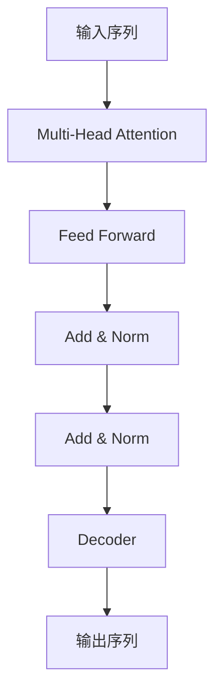

# 使用WikiText2数据集训练Wiki-GPT模型

## 1.背景介绍

### 1.1 自然语言处理的重要性

在当今时代,自然语言处理(NLP)已经成为人工智能领域中最重要和最具挑战性的研究方向之一。它旨在使计算机能够理解和生成人类语言,从而实现人机自然交互。随着大数据时代的到来,海量的文本数据为NLP的发展提供了丰富的资源。

### 1.2 语言模型在NLP中的作用

语言模型是NLP的核心组成部分,它通过学习大量文本数据,捕捉语言的统计规律,从而能够生成自然、流畅的语言输出。传统的语言模型主要基于n-gram统计方法,但存在上下文捕捉能力有限等缺陷。近年来,基于深度学习的神经网络语言模型(Neural Language Model)展现出了强大的语言建模能力,成为NLP领域的研究热点。

### 1.3 GPT模型及其重要意义

2018年,OpenAI发布了生成式预训练转换器(Generative Pre-trained Transformer,GPT)模型,这是第一个将自注意力机制(Self-Attention)应用于语言模型的工作。GPT模型在大规模无监督预训练后,能够在下游任务中通过简单的微调获得出色的性能表现,体现了强大的迁移学习能力。GPT模型的出现开启了大型预训练语言模型的新时代,为NLP领域带来了革命性的进步。

## 2.核心概念与联系

### 2.1 Transformer架构

Transformer是一种全新的基于自注意力机制的序列到序列模型架构,它摒弃了传统序列模型中的循环神经网络和卷积神经网络结构,完全依赖注意力机制来捕捉输入和输出序列之间的长程依赖关系。Transformer架构具有并行计算能力强、捕捉长距离依赖能力强等优点,成为当前主流的序列模型架构。



### 2.2 自注意力机制

自注意力机制(Self-Attention)是Transformer架构的核心,它能够捕捉输入序列中任意两个位置之间的依赖关系。与RNN和CNN不同,自注意力机制不存在递归计算或卷积核滑动窗口的限制,因此能够更好地捕捉长距离依赖关系。多头注意力(Multi-Head Attention)进一步增强了模型对不同位置关系的建模能力。

### 2.3 掩码语言模型

GPT模型采用了掩码语言模型(Masked Language Model)的训练方式。与BERT模型不同,GPT模型是从左到右生成文本,每次只预测下一个词。这种单向语言模型的优点是可以很好地捕捉语言的先后顺序特性,并且在文本生成任务中具有更好的性能表现。

## 3.核心算法原理具体操作步骤

### 3.1 GPT模型训练流程

1) **数据预处理**:将原始文本数据进行分词、构建词表、添加特殊标记等预处理操作。

2) **模型初始化**:初始化Transformer编码器,包括词嵌入层、位置编码层、多头注意力层和前馈神经网络层等模块。

3) **模型训练**:使用掩码语言模型的方式对GPT模型进行训练。具体来说,对于每个输入序列,模型需要预测被掩码的下一个词的概率分布。

4) **损失计算**:计算模型预测的概率分布与真实标签之间的交叉熵损失。

5) **模型更新**:使用优化算法(如Adam)根据损失值更新模型参数。

6) **迭代训练**:重复3-5步,直至模型收敛或达到预设的训练轮次。

### 3.2 GPT模型微调

在完成大规模无监督预训练后,GPT模型可以通过微调的方式迁移到下游任务中,例如文本生成、机器翻译、问答系统等。微调的具体步骤如下:

1) **数据准备**:准备下游任务所需的标注数据集。

2) **模型加载**:加载预训练好的GPT模型权重。

3) **微调训练**:在下游任务数据集上对GPT模型进行有监督微调训练,根据任务目标设计合适的输入和输出表示,并计算相应的损失函数。

4) **模型评估**:在验证集上评估微调后的模型性能,根据需要进行超参数调整。

5) **模型部署**:将微调好的模型应用于实际的下游任务场景。

## 4.数学模型和公式详细讲解举例说明

### 4.1 Transformer中的缩放点积注意力

缩放点积注意力(Scaled Dot-Product Attention)是Transformer中自注意力机制的核心计算单元,用于捕捉输入序列中任意两个位置之间的依赖关系。其数学表达式如下:

$$
\mathrm{Attention}(Q, K, V) = \mathrm{softmax}(\frac{QK^T}{\sqrt{d_k}})V
$$

其中:
- $Q$是查询(Query)向量
- $K$是键(Key)向量
- $V$是值(Value)向量
- $d_k$是缩放因子,用于防止点积的值过大导致softmax函数的梯度较小

通过计算查询$Q$与所有键$K$的点积,并对结果进行缩放和softmax操作,我们可以得到一个注意力分数向量。这个向量与值向量$V$相乘,就可以获得最终的注意力表示。

例如,对于一个长度为4的输入序列$X = [x_1, x_2, x_3, x_4]$,我们可以计算其自注意力表示:

$$
\begin{aligned}
Q &= X W^Q \\
K &= X W^K \\
V &= X W^V \\
\mathrm{head}_i &= \mathrm{Attention}(QW_i^Q, KW_i^K, VW_i^V)
\end{aligned}
$$

其中$W^Q, W^K, W^V$是可训练的权重矩阵,用于将输入$X$映射到查询、键和值空间。$W_i^Q, W_i^K, W_i^V$则是多头注意力机制中第$i$个注意力头的权重矩阵。

### 4.2 GPT语言模型的目标函数

GPT模型采用了掩码语言模型的训练方式,其目标是最大化被掩码词的条件概率。具体来说,对于一个长度为$n$的输入序列$X = [x_1, x_2, \dots, x_n]$,我们随机选择一些位置进行掩码,得到掩码后的序列$\tilde{X}$。模型的目标是最大化掩码位置的条件概率:

$$
\max_\theta \sum_{i=1}^n \log P(x_i | \tilde{X}, \theta)
$$

其中$\theta$是模型的参数集合。在实际计算中,我们通常最小化相应的负对数似然损失函数:

$$
\mathcal{L}(\theta) = -\sum_{i=1}^n \log P(x_i | \tilde{X}, \theta)
$$

通过梯度下降算法优化该损失函数,可以学习到GPT模型的最优参数$\theta^*$。

## 5.项目实践:代码实例和详细解释说明

在这一部分,我们将介绍如何使用PyTorch框架实现GPT模型,并在WikiText2数据集上进行训练。

### 5.1 数据预处理

```python
import torchtext

# 下载并加载WikiText2数据集
train_dataset, valid_dataset, test_dataset = torchtext.datasets.WikiText2.splits(root='.data')

# 构建词表
tokenizer = torchtext.data.utils.get_tokenizer('basic_english')
text_pipeline = lambda x: tokenizer(x)
vocab = torchtext.vocab.build_vocab_from_iterator(map(text_pipeline, train_dataset), specials=['<unk>'])
vocab.set_default_index(vocab['<unk>'])

# 数据迭代器
batch_size = 64
train_iter = torchtext.data.BPTTIterator(train_dataset, batch_size=batch_size, bptt_len=35, vocab=vocab)
valid_iter = torchtext.data.BPTTIterator(valid_dataset, batch_size=batch_size, bptt_len=35, vocab=vocab)
test_iter = torchtext.data.BPTTIterator(test_dataset, batch_size=batch_size, bptt_len=35, vocab=vocab)
```

在上述代码中,我们首先下载并加载WikiText2数据集。然后使用torchtext库构建词表,并定义一个文本预处理管道。最后,我们创建数据迭代器,用于在训练和评估时对数据进行批次采样。

### 5.2 GPT模型实现

```python
import torch
import torch.nn as nn
import math

class GPTModel(nn.Module):
    def __init__(self, vocab_size, d_model, nhead, num_layers, dropout=0.1):
        super(GPTModel, self).__init__()
        self.embedding = nn.Embedding(vocab_size, d_model)
        self.pos_encoder = PositionalEncoding(d_model, dropout)
        encoder_layers = nn.TransformerEncoderLayer(d_model, nhead, dim_feedforward=2048, dropout=dropout, batch_first=True)
        self.transformer_encoder = nn.TransformerEncoder(encoder_layers, num_layers)
        self.decoder = nn.Linear(d_model, vocab_size)
        self.init_weights()

    def forward(self, src, src_mask=None):
        src = self.embedding(src)
        src = self.pos_encoder(src)
        output = self.transformer_encoder(src, src_mask)
        output = self.decoder(output)
        return output

    def init_weights(self):
        initrange = 0.1
        self.embedding.weight.data.uniform_(-initrange, initrange)
        self.decoder.bias.data.zero_()
        self.decoder.weight.data.uniform_(-initrange, initrange)

class PositionalEncoding(nn.Module):
    def __init__(self, d_model, dropout=0.1, max_len=5000):
        super(PositionalEncoding, self).__init__()
        self.dropout = nn.Dropout(p=dropout)

        pe = torch.zeros(max_len, d_model)
        position = torch.arange(0, max_len, dtype=torch.float).unsqueeze(1)
        div_term = torch.exp(torch.arange(0, d_model, 2).float() * (-math.log(10000.0) / d_model))
        pe[:, 0::2] = torch.sin(position * div_term)
        pe[:, 1::2] = torch.cos(position * div_term)
        pe = pe.unsqueeze(0)
        self.register_buffer('pe', pe)

    def forward(self, x):
        x = x + self.pe[:, :x.size(1), :]
        return self.dropout(x)
```

上述代码实现了GPT模型的核心部分。`GPTModel`类继承自`nn.Module`,包含以下主要组件:

- `nn.Embedding`层:将输入词元映射到词嵌入向量
- `PositionalEncoding`层:添加位置编码,赋予序列元素位置信息
- `nn.TransformerEncoder`层:基于Transformer编码器架构对输入序列进行编码
- `nn.Linear`层:将编码后的序列映射回词元空间,得到下一个词元的概率分布

在前向传播过程中,输入序列首先通过词嵌入层和位置编码层,然后送入Transformer编码器进行编码,最后通过线性层得到预测的词元概率分布。

### 5.3 模型训练

```python
import time

device = torch.device('cuda' if torch.cuda.is_available() else 'cpu')
model = GPTModel(len(vocab), 256, 8, 6, 0.2).to(device)
criterion = nn.CrossEntropyLoss()
optimizer = torch.optim.Adam(model.parameters(), lr=0.001)

def train(model, iterator, optimizer, criterion):
    model.train()
    epoch_loss = 0
    for batch in iterator:
        optimizer.zero_grad()
        text, target = batch.text.to(device), batch.target.to(device)
        output = model(text, text.ne(0))
        loss = criterion(output.view(-1, len(vocab)), target.view(-1))
        loss.backward()
        optimizer.step()
        epoch_loss += loss.item()
    return epoch_loss / len(iterator)

best_val_loss = float('inf')
epochs = 20
for epoch in range(epochs):
    start_time = time.time()
    train_loss = train(model, train_iter, optimizer, criterion)
    val_loss = train(model, valid_iter, optimizer, criterion)
    
    if val_loss < best_val_loss:
        best_val_loss = val_loss
        torch.save(model.state_dict(), 'best_model.pt')
    
    end_time = time.time()
    epoch_mins, epoch_secs = epoch_time(start_time,