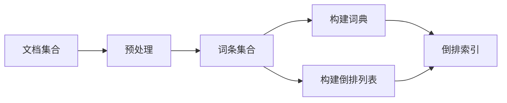

# 倒排索引 原理与代码实例讲解

## 1.背景介绍

在现代信息时代，海量的数据被不断产生和存储。如何高效地检索和管理这些数据成为一个关键挑战。倒排索引作为一种数据结构和检索技术,在搜索引擎、全文搜索和信息检索等领域发挥着重要作用。

### 1.1 什么是倒排索引

倒排索引(Inverted Index)是一种将文档与其包含的词条相关联的索引数据结构。与传统的正向索引相反,倒排索引以词条为中心,将每个词条映射到包含它的文档列表。这种设计使得倒排索引在查找包含特定词条的文档时具有极高的效率。

### 1.2 倒排索引的应用场景

倒排索引广泛应用于以下场景:

- 搜索引擎: 用于索引网页内容,实现高效的全文搜索。
- 全文搜索系统: 在大型文档集合(如电子邮件、文件等)中进行关键词搜索。
- 信息检索系统: 在大规模数据集(如科学文献、新闻报道等)中检索相关信息。
- 自动补全系统: 根据用户输入的前缀快速找到匹配的建议词条。

## 2.核心概念与联系

### 2.1 核心概念

- 文档(Document): 被索引和搜索的基本单元,如网页、电子邮件、文件等。
- 词条(Term): 文档中出现的单词或短语,通常经过标记化(Tokenization)和规范化(Normalization)处理。
- 词典(Dictionary/Lexicon): 存储所有唯一词条及其相关信息的数据结构。
- 倒排列表(Posting List): 对于每个词条,存储包含该词条的文档列表及其相关信息。
- 文档频率(Document Frequency, DF): 包含某个词条的文档数量。
- 词频(Term Frequency, TF): 某个词条在特定文档中出现的次数。

### 2.2 核心概念之间的联系

倒排索引将文档集合中的词条与包含它们的文档相关联。每个词条都对应一个倒排列表,列表中包含该词条出现的所有文档的标识符及相关信息(如词频、位置等)。

词典存储所有唯一词条及其指向倒排列表的指针或偏移量。通过词典,可以快速定位某个词条的倒排列表。

在搜索时,系统首先查找查询词条在词典中的位置,然后访问相应的倒排列表,获取包含该词条的文档列表。对于多词条查询,系统将各个词条的倒排列表进行合并和排序,找到同时包含所有查询词条的文档。

文档频率和词频等信息可用于计算相关性得分,从而对搜索结果进行排序和优化。

## 3.核心算法原理具体操作步骤

倒排索引的构建和查询过程可分为以下几个主要步骤:

### 3.1 文档收集和预处理

1. 从各种数据源(如网页、文件等)收集原始文档。
2. 对文档进行标记化(Tokenization),将文本拆分为单词或短语序列。
3. 对词条进行规范化(Normalization),如转换为小写、去除标点符号等。
4. 可选地进行词条过滤,如去除常用词(stopwords)、应用词干提取(stemming)等。

### 3.2 构建词典和倒排列表

1. 遍历预处理后的文档集合,收集所有唯一的词条,构建词典。
2. 对于每个词条,创建一个倒排列表,存储包含该词条的文档标识符及相关信息(如词频、位置等)。
3. 可选地对倒排列表进行压缩和优化,以减小索引的存储空间。



### 3.3 查询处理

1. 对查询进行标记化和规范化,获取查询词条序列。
2. 在词典中查找每个查询词条,获取其对应的倒排列表。
3. 对于单词条查询,直接返回倒排列表中的文档列表。
4. 对于多词条查询,需要对各个词条的倒排列表进行合并和排序,找到同时包含所有查询词条的文档。
5. 可选地计算每个文档的相关性得分,并对结果进行排序和优化。


## 4.数学模型和公式详细讲解举例说明

在倒排索引中,常用的数学模型和公式包括:

### 4.1 词频-逆文档频率 (TF-IDF)

TF-IDF是一种常用的相关性评分模型,用于衡量一个词条对于某个文档的重要性。它综合考虑了词频(TF)和逆文档频率(IDF)两个因素。

$$\text{TF-IDF}(t, d) = \text{TF}(t, d) \times \text{IDF}(t)$$

其中:

- $\text{TF}(t, d)$ 表示词条 $t$ 在文档 $d$ 中的词频,可以使用原始词频或者进行归一化处理。
- $\text{IDF}(t) = \log \frac{N}{|\{d \in D: t \in d\}|}$ 表示词条 $t$ 的逆文档频率,其中 $N$ 是文档总数, $|\{d \in D: t \in d\}|$ 是包含词条 $t$ 的文档数量。

IDF的作用是降低常见词条的权重,提高稀有词条的权重。TF-IDF值越高,表示该词条对于该文档越重要。

### 4.2 布尔模型

布尔模型是一种基于集合理论的简单检索模型。它将查询视为一系列词条的布尔表达式,使用与(AND)、或(OR)、非(NOT)等布尔运算符组合词条,并返回满足该表达式的文档集合。

例如,查询 `(apple AND orange) OR banana` 将返回包含 `apple` 和 `orange` 或者包含 `banana` 的文档。

布尔模型的优点是简单直观,但缺点是无法对结果进行排序和相关性评分。

### 4.3 向量空间模型

向量空间模型(Vector Space Model, VSM)将文档和查询都表示为向量,并根据它们之间的相似度来评估相关性。

假设有 $N$ 个唯一的词条,每个文档 $d$ 可以表示为一个 $N$ 维向量 $\vec{d} = (w_1, w_2, \ldots, w_N)$,其中 $w_i$ 表示词条 $i$ 在该文档中的权重,通常使用 TF-IDF 值。

类似地,查询 $q$ 也可以表示为一个 $N$ 维向量 $\vec{q} = (q_1, q_2, \ldots, q_N)$,其中 $q_i$ 表示查询中词条 $i$ 的权重。

文档 $d$ 与查询 $q$ 的相似度可以使用余弦相似度来计算:

$$\text{sim}(d, q) = \frac{\vec{d} \cdot \vec{q}}{|\vec{d}| \times |\vec{q}|} = \frac{\sum_{i=1}^N w_i \times q_i}{\sqrt{\sum_{i=1}^N w_i^2} \times \sqrt{\sum_{i=1}^N q_i^2}}$$

相似度值越高,表示文档与查询越相关。

VSM的优点是可以对结果进行排序和相关性评分,但缺点是忽略了词条之间的位置和序列信息。

### 4.4 BM25 模型

BM25是一种常用的相关性评分函数,它综合考虑了词频、文档长度和文档频率等因素。BM25分数越高,表示文档与查询越相关。

$$\text{BM25}(d, q) = \sum_{t \in q} \text{IDF}(t) \times \frac{f(t, d) \times (k_1 + 1)}{f(t, d) + k_1 \times (1 - b + b \times \frac{|d|}{avgdl})}$$

其中:

- $f(t, d)$ 是词条 $t$ 在文档 $d$ 中的词频。
- $|d|$ 是文档 $d$ 的长度(字数或词数)。
- $avgdl$ 是文档集合中所有文档的平均长度。
- $k_1$ 和 $b$ 是调节参数,通常设置为 $k_1 \in [1.2, 2.0]$, $b = 0.75$。

BM25模型通过调节参数,可以平衡词频、文档长度和文档频率对相关性的影响。

## 5.项目实践：代码实例和详细解释说明

下面是一个使用Python实现简单倒排索引的示例:

```python
import re
from collections import defaultdict

# 预处理函数,进行标记化和规范化
def preprocess(text):
    # 去除标点符号和数字
    text = re.sub(r'[\d+\.,\?]+', '', text)
    # 转换为小写
    text = text.lower()
    # 拆分为词条列表
    tokens = text.split()
    return tokens

# 构建倒排索引
def build_inverted_index(documents):
    inverted_index = defaultdict(list)
    for doc_id, doc in enumerate(documents):
        tokens = preprocess(doc)
        for token in set(tokens):
            # 记录包含该词条的文档ID
            inverted_index[token].append(doc_id)
    return inverted_index

# 查询倒排索引
def query_inverted_index(inverted_index, query):
    query_tokens = preprocess(query)
    result = []
    for token in query_tokens:
        if token in inverted_index:
            # 获取包含该词条的文档列表
            result.extend(inverted_index[token])
    # 去重并排序
    return sorted(set(result))

# 示例用法
documents = [
    "The quick brown fox jumps over the lazy dog",
    "The dog barks at the brown fox",
    "A quick fox jumps over the lazy cat"
]

inverted_index = build_inverted_index(documents)
print("Inverted Index:")
for term, posting_list in inverted_index.items():
    print(f"{term}: {posting_list}")

query = "quick fox"
result = query_inverted_index(inverted_index, query)
print(f"\nQuery: '{query}', Result: {result}")
```

上述代码实现了以下功能:

1. `preprocess(text)` 函数对文本进行预处理,包括去除标点符号和数字、转换为小写以及拆分为词条列表。

2. `build_inverted_index(documents)` 函数构建倒排索引。它遍历文档集合,对每个文档进行预处理,然后将每个唯一词条与包含它的文档ID列表相关联,存储在倒排索引字典中。

3. `query_inverted_index(inverted_index, query)` 函数用于查询倒排索引。它首先对查询进行预处理,获取查询词条列表。然后,对于每个查询词条,从倒排索引中获取包含该词条的文档ID列表。最后,合并并去重所有文档ID列表,得到包含所有查询词条的文档ID列表。

在示例用法中,我们首先构建了一个包含三个文档的倒排索引。然后,打印出整个倒排索引的内容。最后,我们使用查询 `"quick fox"`进行搜索,并打印出包含这两个词条的文档ID列表。

需要注意的是,这只是一个简单的示例,实际的倒排索引系统通常需要考虑更多的因素,如词条过滤、索引压缩、相关性评分等。但是,这个示例展示了构建和查询倒排索引的基本原理和流程。

## 6.实际应用场景

倒排索引在以下场景中发挥着重要作用:

### 6.1 网络搜索引擎

搜索引擎是倒排索引最典型的应用场景。主流搜索引擎(如Google、Bing等)使用倒排索引来索引互联网上的网页内容,实现高效的全文搜索。当用户输入查询时,搜索引擎会查询倒排索引,快速找到包含相关词条的网页,并根据相关性算法对结果进行排序和优化。

### 6.2 企