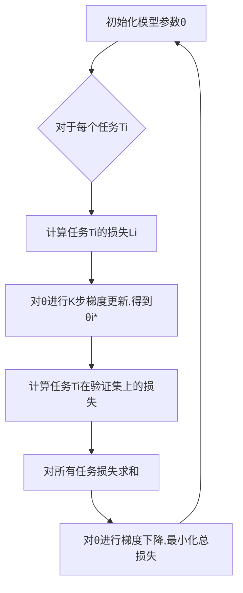

# 元学习(Meta-Learning)原理与代码实战案例讲解

## 1.背景介绍

### 1.1 机器学习的挑战

在过去几十年中,机器学习取得了长足的进步,并在许多领域得到广泛应用,如计算机视觉、自然语言处理、推荐系统等。然而,传统的机器学习方法面临一些挑战:

1. **数据饥渿(Data Hunger)**: 大多数机器学习算法需要大量的标注数据进行训练,而获取高质量的标注数据通常代价高昂且耗时。

2. **缺乏泛化能力**: 训练出的模型往往只能在特定的任务和领域表现良好,当面临新的任务时,需要从头开始训练新的模型,缺乏跨任务的泛化能力。

3. **环境变迁**: 真实世界的环境在不断变化,模型需要持续适应新的环境变化,否则其性能将逐渐降低。

### 1.2 元学习的兴起

为了解决上述挑战,**元学习(Meta-Learning)** 这一新兴的机器学习范式应运而生。元学习的核心思想是:在训练过程中获取一些可迁移的知识,使得模型能够快速适应新的任务、新的环境,从而提高学习效率和泛化能力。

元学习的目标是"学会学习(Learn to Learn)",即通过学习任务之间的共性,获取一种通用的学习策略,从而在面临新任务时,能够基于少量数据快速习得新技能。这种学习方式与人类学习的方式更加贴近。

### 1.3 元学习的应用前景

元学习技术为解决机器学习中的数据饥渿、缺乏泛化能力等问题提供了新的思路,因此具有广阔的应用前景:

- **小样本学习**: 在医疗影像、遥感等领域,标注数据获取成本高昂,元学习可基于少量标注样本快速习得新任务。

- **持续学习**: 对于需要持续适应环境变化的系统(如机器人、自动驾驶等),元学习可提高其持续学习的能力。

- **多任务学习**: 元学习为多任务学习提供了统一的框架,可同时完成多个相关任务,提高学习效率。

- **自动机器学习**: 元学习为自动选择模型、超参数调优等机器学习自动化流程提供了新的思路。

- **强化学习**: 元学习可加速强化学习的训练过程,提高策略的泛化能力。

## 2.核心概念与联系

### 2.1 元学习的形式化定义

形式上,我们可以将元学习过程建模为一个两层的优化问题:

在基础学习器(Base-Learner)层,我们学习一个任务相关的模型 $f_{\theta}$,其参数 $\theta$ 在特定任务 $\mathcal{T}_i$ 上的训练数据 $\mathcal{D}_i^{tr}$ 上进行优化:

$$\theta_i^* = \arg\min_\theta \mathcal{L}_{\mathcal{T}_i}(f_\theta, \mathcal{D}_i^{tr})$$

其中 $\mathcal{L}_{\mathcal{T}_i}$ 是针对任务 $\mathcal{T}_i$ 的损失函数。

在元学习器(Meta-Learner)层,我们优化一个元学习模型的参数 $\phi$,使得基础学习器在一系列不同的任务 $\{\mathcal{T}_i\}$ 上都能快速适应,即最小化所有任务的损失之和:

$$\phi^* = \arg\min_\phi \sum_{\mathcal{T}_i \sim p(\mathcal{T})} \mathcal{L}_{\mathcal{T}_i}(f_{\theta_i^*}, \mathcal{D}_i^{val})$$

其中 $\mathcal{D}_i^{val}$ 是任务 $\mathcal{T}_i$ 的验证集,用于评估基础学习器在该任务上的泛化性能。

### 2.2 元学习的范式

根据基础学习器和元学习器的具体形式,元学习可分为以下几种主要范式:

1. **优化基于元学习(Optimization-Based Meta-Learning)**
   - 基础学习器: 一个可训练的模型,如神经网络
   - 元学习器: 优化算法的初始化或调整,如梯度下降的学习率等

2. **度量基于元学习(Metric-Based Meta-Learning)** 
   - 基础学习器: 一个基于相似性的模型,如最近邻分类器
   - 元学习器: 学习任务之间的度量空间

3. **模型基于元学习(Model-Based Meta-Learning)**
   - 基础学习器: 一个生成模型,如贝叶斯模型
   - 元学习器: 学习生成模型的先验分布

4. **无模型元学习(Model-Agnostic Meta-Learning)**
   - 基础学习器: 任意机器学习模型
   - 元学习器: 通过梯度下降直接优化模型参数

上述范式各有特点,在不同的场景下会有不同的应用。接下来我们将重点介绍无模型元学习,因为它具有更广的适用性。

### 2.3 无模型元学习(MAML)算法

无模型元学习(Model-Agnostic Meta-Learning, MAML)是元学习领域的一个里程碑式算法,由 Chelsea Finn 等人于 2017 年提出。MAML 算法的核心思想是:在元训练阶段,通过一些任务进行练习,学习一个好的模型初始化,使得在新任务上只需少量数据和少量梯度更新,即可快速收敛到一个有良好性能的模型。

MAML 算法的优势在于,它对基础学习器的模型无任何假设,可以应用于任意的有监督、无监督或强化学习任务。此外,MAML 算法简单高效,易于实现和扩展。

MAML 算法的训练过程可概括为以下两个循环:

**内循环(Inner Loop)**: 对于一个任务 $\mathcal{T}_i$,基于其训练数据 $\mathcal{D}_i^{tr}$,我们通过几步梯度下降从初始参数 $\theta$ 得到针对该任务的适应性参数 $\theta_i^*$:

$$\theta_i^* = \theta - \alpha \nabla_\theta \mathcal{L}_{\mathcal{T}_i}(f_\theta, \mathcal{D}_i^{tr})$$

其中 $\alpha$ 是内循环的学习率。

**外循环(Outer Loop)**: 在元训练集上的所有任务上,我们优化模型初始参数 $\theta$,使得经过内循环更新后的 $\theta_i^*$ 在各自任务的验证集 $\mathcal{D}_i^{val}$ 上的损失最小:

$$\theta^* = \arg\min_\theta \sum_{\mathcal{T}_i \sim p(\mathcal{T})} \mathcal{L}_{\mathcal{T}_i}(f_{\theta_i^*}, \mathcal{D}_i^{val})$$

通过上述两个循环的交替优化,MAML 算法可以找到一个好的模型初始化 $\theta^*$,使得在新任务上只需少量数据和更新步骤,即可获得良好的性能。



上图展示了 MAML 算法的基本流程。需要注意的是,在实际应用中,MAML 算法还可以进行一些改进和扩展,如使用高阶优化、多步梯度更新等,以提高性能和稳定性。

## 3.核心算法原理具体操作步骤

在了解了 MAML 算法的基本原理后,我们来看一下它的具体实现细节和操作步骤。

### 3.1 MAML 算法伪代码

```python
# 导入必要的库
import numpy as np
import torch
import torch.nn as nn

# 定义一个简单的神经网络模型
class Net(nn.Module):
    def __init__(self):
        super(Net, self).__init__()
        self.fc1 = nn.Linear(28 * 28, 256)
        self.fc2 = nn.Linear(256, 10)

    def forward(self, x):
        x = x.view(-1, 28 * 28)
        x = torch.relu(self.fc1(x))
        x = self.fc2(x)
        return x

# MAML 算法实现
def maml(model, optimizer, tasks, inner_train_steps=1, inner_lr=0.01, meta_lr=0.001):
    # 对于每个任务
    for task in tasks:
        # 获取任务的训练数据和测试数据
        train_data, test_data = task

        # 计算任务在当前模型参数下的损失
        train_loss = F.cross_entropy(model(train_data[0]), train_data[1])

        # 计算任务的梯度
        train_loss.backward()

        # 根据梯度更新模型参数
        for _ in range(inner_train_steps):
            optimizer.step()
            optimizer.zero_grad()

        # 计算更新后模型在测试数据上的损失
        test_loss = F.cross_entropy(model(test_data[0]), test_data[1])

        # 对测试损失进行反向传播
        test_loss.backward()

    # 更新元学习器的参数
    optimizer.step()
    optimizer.zero_grad()

# 初始化模型和优化器
model = Net()
optimizer = torch.optim.Adam(model.parameters(), lr=meta_lr)

# 执行 MAML 算法
for epoch in range(num_epochs):
    maml(model, optimizer, tasks)
```

上面是 MAML 算法在 PyTorch 中的一个简单实现。我们定义了一个简单的神经网络模型 `Net`，然后在 `maml` 函数中实现了 MAML 算法的核心逻辑。

在每个epoch中,我们遍历所有的任务。对于每个任务,我们首先计算当前模型在该任务的训练数据上的损失,然后根据该损失计算梯度并进行 `inner_train_steps` 步的梯度更新,得到针对该任务的适应性模型参数。接着,我们在该任务的测试数据上计算适应性模型的损失,并对该损失进行反向传播。

在遍历完所有任务后,我们使用元学习器的优化器(如 Adam)更新模型的初始参数,以最小化所有任务的测试损失之和。

需要注意的是,上面的代码只是一个简单的示例,在实际应用中可能需要进行一些修改和扩展,如添加正则化项、使用高阶优化等。

### 3.2 MAML 算法关键步骤解析

1. **初始化模型参数**

   我们首先初始化一个模型 $f_\theta$,其参数 $\theta$ 将在元训练过程中进行优化。

2. **采样任务批次**

   从任务分布 $p(\mathcal{T})$ 中采样一个任务批次 $\{\mathcal{T}_i\}$,每个任务 $\mathcal{T}_i$ 包含一个训练集 $\mathcal{D}_i^{tr}$ 和一个验证集 $\mathcal{D}_i^{val}$。

3. **内循环:任务适应**

   对于每个任务 $\mathcal{T}_i$,我们通过 $K$ 步梯度下降从初始参数 $\theta$ 得到针对该任务的适应性参数 $\theta_i^*$:

   $$\theta_i^* = \theta - \alpha \sum_{k=1}^K \nabla_\theta \mathcal{L}_{\mathcal{T}_i}(f_{\theta - \alpha \sum_{j=1}^{k-1} \nabla_\theta \mathcal{L}_{\mathcal{T}_i}(f_\theta, \mathcal{D}_i^{tr})}, \mathcal{D}_i^{tr})$$

   其中 $\alpha$ 是内循环的学习率。

4. **外循环:元更新**

   在元训练集上的所有任务上,我们优化模型初始参数 $\theta$,使得经过内循环更新后的 $\theta_i^*$ 在各自任务的验证集 $\mathcal{D}_i^{val}$ 上的损失最小:

   $$\theta \leftarrow \theta - \beta \nabla_\theta \sum_{\mathcal{T}_i \sim p(\mathcal{T})} \mathcal{L}_{\mathcal{T}_i}(f_{\theta_i^*}, \mathcal{D}_i^{val