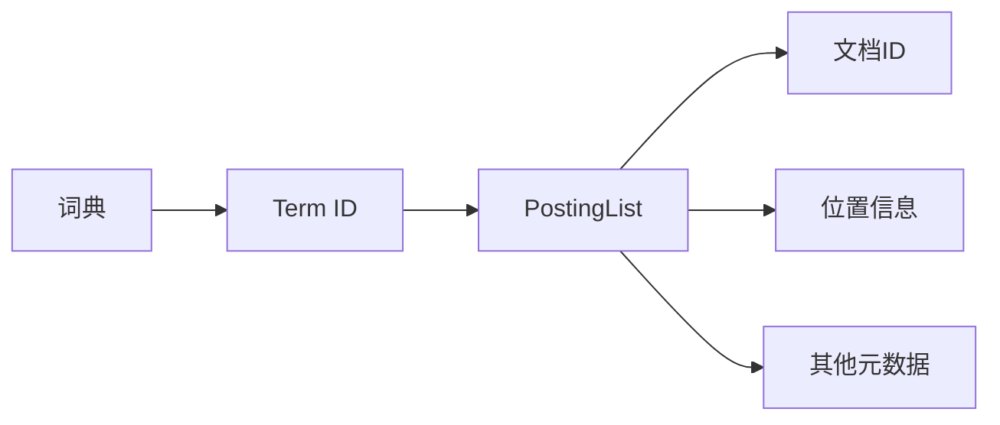
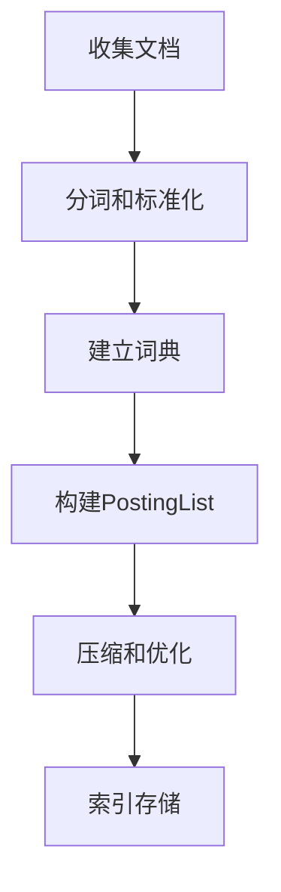
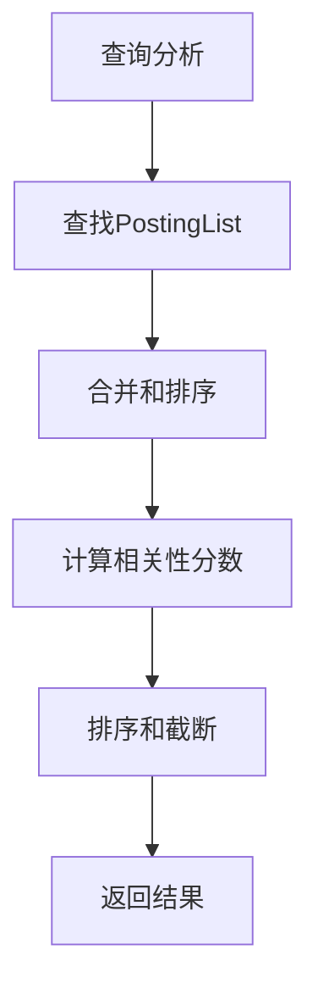

# 全文搜索 原理与代码实例讲解

## 1.背景介绍

### 1.1 什么是全文搜索

全文搜索(Full-Text Search)是一种在文本数据集合中查找指定关键字或短语的技术。与传统的数据库查询不同,全文搜索会扫描整个文本内容,而不仅仅是针对特定字段进行匹配。这种搜索方式可以应用于网页、文档、电子邮件等各种形式的文本数据。

### 1.2 全文搜索的重要性

随着信息时代的到来,数据量呈爆炸式增长,有效地检索和利用这些海量数据成为一个巨大的挑战。全文搜索技术为我们提供了一种高效、灵活的方式来查找和利用这些数据。它在以下几个方面发挥着重要作用:

1. **信息检索**: 全文搜索是现代搜索引擎的核心技术,使用户能够快速、准确地找到所需的信息。
2. **知识管理**: 在企业内部,全文搜索可以帮助员工快速定位和利用组织内部的知识资源。
3. **电子发现**: 在法律领域,全文搜索被广泛应用于电子数据的发现和分析。
4. **数据分析**: 全文搜索可以帮助数据分析师快速找到相关的数据集,从而加快分析过程。

### 1.3 全文搜索的挑战

尽管全文搜索技术带来了诸多好处,但它也面临着一些挑战:

1. **大数据量**: 随着数据量的不断增长,如何高效地索引和搜索海量数据成为一个巨大的挑战。
2. **多语言支持**: 不同语言的文本处理需求不同,需要针对不同语言进行特殊处理。
3. **相关性排序**: 如何根据查询与文档的相关程度对搜索结果进行合理排序,是全文搜索需要解决的一个核心问题。
4. **近实时更新**: 在某些应用场景下,需要支持对索引的近实时更新,以确保搜索结果的时效性。

## 2.核心概念与联系

### 2.1 倒排索引

倒排索引(Inverted Index)是全文搜索系统的核心数据结构。它将文档集合中的每个词条映射到包含该词条的文档列表,从而实现了从词条到文档的反向映射。

倒排索引通常由以下几个部分组成:

1. **词条(Term)**: 文档集合中出现的每个单词或短语。
2. **词典(Dictionary)**: 存储所有不重复的词条,并为每个词条分配一个唯一的编号(Term ID)。
3. **PostingList**: 对于每个词条,存储一个包含该词条的文档列表,称为PostingList。

下图展示了倒排索引的基本结构:



### 2.2 分词与标准化

在构建倒排索引之前,需要对原始文本进行分词(Tokenization)和标准化(Normalization)处理。

1. **分词**: 将文本拆分为一系列独立的词条(Token),如单词、数字或标点符号。
2. **标准化**: 将词条转换为标准形式,以提高搜索的准确性和召回率。常见的标准化操作包括:
   - 大小写转换
   - 去除停用词(如"the"、"a"等)
   - 词干提取(如"running"和"ran"映射到相同的词干"run")

### 2.3 布尔模型与向量空间模型

全文搜索系统通常采用两种主要的检索模型:布尔模型(Boolean Model)和向量空间模型(Vector Space Model)。

1. **布尔模型**: 将查询视为一组词条的集合运算(如AND、OR、NOT),文档要么完全匹配查询,要么完全不匹配。这种模型简单直观,但缺乏相关性排序。
2. **向量空间模型**: 将文档和查询都表示为向量,通过计算它们之间的相似度来确定相关性。常用的相似度计算方法包括余弦相似度、欧几里得距离等。这种模型可以提供相关性排序,但计算复杂度较高。

### 2.4 评价指标

为了评估全文搜索系统的性能,通常使用以下几个指标:

1. **准确率(Precision)**: 搜索结果中相关文档的比例。
2. **召回率(Recall)**: 相关文档在搜索结果中被检索到的比例。
3. **F1分数**: 准确率和召回率的调和平均数,用于综合评估系统性能。
4. **查询响应时间**: 系统响应查询的时间,反映了系统的效率。

## 3.核心算法原理具体操作步骤

### 3.1 索引构建

构建倒排索引的基本步骤如下:

1. **收集文档**: 从各种数据源(如网页、文件系统等)收集需要索引的文档。
2. **分词和标准化**: 对每个文档进行分词和标准化处理,得到一系列标准化的词条。
3. **建立词典**: 将所有不重复的词条存储在词典中,并为每个词条分配一个唯一的Term ID。
4. **构建PostingList**: 对于每个词条,遍历文档集合,将包含该词条的文档ID及其在文档中的位置信息等元数据存储在PostingList中。
5. **压缩和优化**: 对PostingList进行压缩和优化,以减小索引的存储空间并提高查询效率。

下图展示了索引构建的基本流程:



### 3.2 查询处理

当用户提交一个查询时,全文搜索系统需要执行以下步骤:

1. **查询分析**: 对查询进行分词和标准化处理,得到一系列标准化的查询词条。
2. **查找PostingList**: 对于每个查询词条,从索引中查找对应的PostingList。
3. **合并和排序**: 根据检索模型(如布尔模型或向量空间模型),合并和排序多个PostingList,得到初步的结果集。
4. **计算相关性分数**: 对于每个结果文档,计算其与查询的相关性分数。
5. **排序和截断**: 根据相关性分数对结果集进行排序,并根据需要截断结果集的大小。
6. **返回结果**: 将排序后的结果集返回给用户。

下图展示了查询处理的基本流程:



### 3.3 优化技术

为了提高全文搜索系统的性能和效率,可以采用以下一些优化技术:

1. **索引压缩**: 使用各种压缩算法(如变长编码、位映射等)来减小索引的存储空间。
2. **缓存和预取**: 缓存热门查询的结果,并预取相关的PostingList,以加速查询响应。
3. **分布式索引**: 将索引分布在多个节点上,以支持更大规模的数据集和更高的查询吞吐量。
4. **分层索引**: 构建多级索引,如首先在较小的顶层索引中查找,然后在底层索引中进行精确匹配。
5. **索引更新**: 支持对索引的增量更新,以确保搜索结果的时效性。

## 4.数学模型和公式详细讲解举例说明

### 4.1 向量空间模型

在向量空间模型中,每个文档和查询都被表示为一个向量,其中每个维度对应于一个词条,向量的值表示该词条在文档或查询中的重要性。

假设我们有一个文档集合$D=\{d_1, d_2, \dots, d_n\}$,其中每个文档$d_i$都是一个向量$\vec{d_i} = (w_{i1}, w_{i2}, \dots, w_{it})$,其中$t$是词典的大小,每个$w_{ij}$表示第$j$个词条在文档$d_i$中的权重。类似地,查询$q$也被表示为一个向量$\vec{q} = (q_1, q_2, \dots, q_t)$。

常用的词条权重计算方法是TF-IDF(Term Frequency-Inverse Document Frequency),它综合考虑了词条在文档中出现的频率(TF)和词条在整个文档集合中的稀有程度(IDF)。对于文档$d_i$中的词条$j$,其TF-IDF权重计算公式如下:

$$w_{ij} = tf_{ij} \times idf_j = \frac{n_{ij}}{\sum_k n_{ik}} \times \log\frac{N}{n_j}$$

其中:

- $n_{ij}$是词条$j$在文档$d_i$中出现的次数
- $\sum_k n_{ik}$是文档$d_i$中所有词条出现次数的总和
- $N$是文档集合的总大小
- $n_j$是包含词条$j$的文档数量

计算出文档向量和查询向量后,我们可以使用余弦相似度来衡量它们之间的相关性:

$$\text{sim}(\vec{d_i}, \vec{q}) = \frac{\vec{d_i} \cdot \vec{q}}{|\vec{d_i}| \times |\vec{q}|} = \frac{\sum_{j=1}^t w_{ij} \times q_j}{\sqrt{\sum_{j=1}^t w_{ij}^2} \times \sqrt{\sum_{j=1}^t q_j^2}}$$

余弦相似度的值范围在$[0, 1]$之间,值越大表示文档与查询越相关。

### 4.2 BM25模型

BM25是一种常用的相关性评分函数,它综合考虑了词条频率、文档长度和词条在整个文档集合中的分布情况。对于文档$d_i$和查询$q$,BM25分数计算公式如下:

$$\text{score}(d_i, q) = \sum_{j \in q} \text{IDF}(j) \times \frac{tf_{ij} \times (k_1 + 1)}{tf_{ij} + k_1 \times (1 - b + b \times \frac{|d_i|}{avgdl})}$$

其中:

- $tf_{ij}$是词条$j$在文档$d_i$中出现的次数
- $\text{IDF}(j)$是词条$j$的逆文档频率,计算方式与TF-IDF中相同
- $|d_i|$是文档$d_i$的长度(词条数量)
- $avgdl$是文档集合中所有文档的平均长度
- $k_1$和$b$是两个调节参数,通常取值分别为$k_1 \in [1.2, 2.0]$和$b = 0.75$

BM25模型通过引入文档长度的归一化因子,可以有效地解决长文档过度排名的问题。

## 5.项目实践:代码实例和详细解释说明

为了更好地理解全文搜索的原理和实现,我们将使用Python和Elasticsearch构建一个简单的全文搜索引擎。Elasticsearch是一个开源的分布式搜索和分析引擎,提供了强大的全文搜索功能。

### 5.1 安装和配置Elasticsearch

首先,我们需要安装Elasticsearch。你可以从官方网站(https://www.elastic.co/downloads/elasticsearch)下载适合你操作系统的版本。解压缩后,进入Elasticsearch的bin目录,运行以下命令启动Elasticsearch:

```bash
./elasticsearch
```

Elasticsearch默认运行在`http://localhost:9200`。你可以在浏览器中访问该地址,查看Elasticsearch是否正常运行。

### 5.2 使用Python客户端

我们将使用官方的Python客户端库`elasticsearch`与Elasticsearch进行交互。首先,安装该库:

```bash
pip install elasticsearch
```

然后,创建一个Python文件`search_engine.py`,并添加以下代码:

```python
from elasticsearch import Elasticsearch

# 连接到Elasticsearch
es = Elasticsearch()

# 创建一个索引
es.indices.create(index='documents', ignore=400)
```

这段代码首先创建一个与Elasticsearch的连接,然后创建一个名为`documents`的索引。`ignore=400`参数确保如果索引已经存在