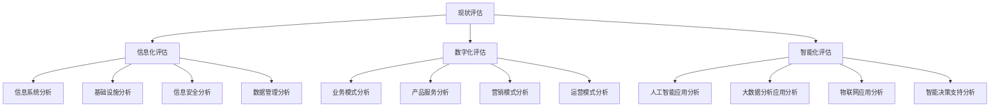
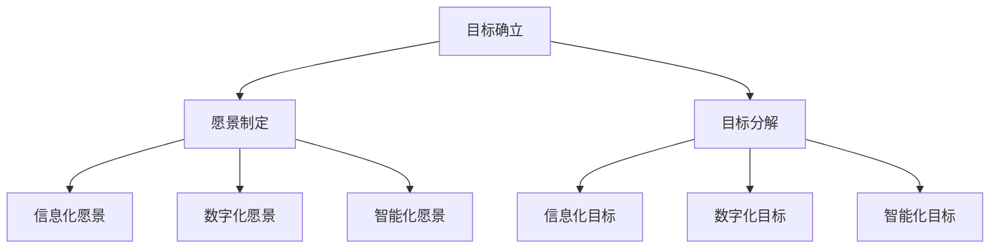
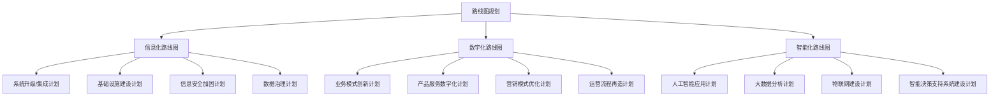
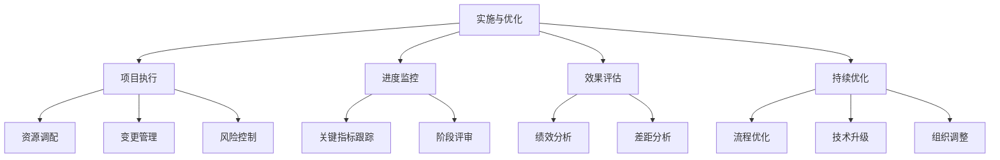

# 公司中长期信息化数字化智能化规划方案

## 1. 背景介绍

在当今快速发展的数字时代，信息化、数字化和智能化已经成为推动企业发展的核心动力。公司需要制定一个全面的中长期规划方案,以确保其在这一转型过程中保持竞争优势。本文将探讨如何为企业制定一个全面的信息化、数字化和智能化规划方案,包括核心概念、关键技术、实施步骤、应用场景等内容。

### 1.1 信息化的重要性

信息化是指利用现代信息技术来促进企业内部管理和外部业务的过程,旨在提高企业的运营效率和竞争力。在当今商业环境中,信息化已成为企业生存和发展的关键因素。通过信息化,企业可以优化内部流程、提高决策效率、改善客户体验等。

### 1.2 数字化转型的必要性 

数字化转型是指利用数字技术来彻底改造企业的业务模式、产品和服务。随着技术的不断进步,传统的商业模式正面临着前所未有的挑战。企业必须拥抱数字化转型,才能保持竞争力并抓住新的商机。

### 1.3 智能化的价值

智能化是指利用人工智能、大数据、物联网等先进技术来提升企业的智能决策能力和运营效率。通过智能化,企业可以实现自动化、优化资源配置、挖掘数据价值等,从而获得更大的竞争优势。

## 2. 核心概念与联系

### 2.1 信息化

信息化包括以下几个关键概念:

1. **信息系统**:指用于收集、存储、处理和传递信息的计算机系统,如ERP、CRM、OA等。
2. **信息基础设施**:包括网络、服务器、存储设备等硬件设施,为信息系统提供支撑。
3. **信息安全**:保护信息系统和数据免受未经授权的访问、使用、披露、中断、修改或破坏。
4. **数据管理**:对企业数据进行有效的采集、存储、处理、分析和应用。

### 2.2 数字化

数字化涉及以下关键概念:

1. **数字化业务模式**:利用数字技术重塑企业的商业模式,如电子商务、共享经济等。
2. **数字化产品和服务**:将实体产品或服务转化为数字形式,如在线教育、远程医疗等。
3. **数字化营销**:利用数字媒体和技术进行营销活动,如社交媒体营销、内容营销等。
4. **数字化运营**:将企业的运营流程和管理方式数字化,如自动化流程、远程协作等。

### 2.3 智能化

智能化包括以下关键概念:

1. **人工智能**:利用计算机系统模拟人类的智能行为,如机器学习、自然语言处理、计算机视觉等。
2. **大数据分析**:从海量数据中发现隐藏的模式、趋势和关联,为决策提供支持。
3. **物联网**:通过互联网将各种物体连接起来,实现信息交换和远程控制。
4. **智能决策支持系统**:利用人工智能、大数据等技术,为企业决策提供智能化支持。

这三个概念相互关联、相辅相成。信息化为数字化和智能化奠定了基础;数字化推动了业务模式和运营方式的变革;智能化则提供了更高级的决策支持和自动化能力。企业需要统筹规划这三个方面,才能真正实现转型升级。

## 3. 核心算法原理具体操作步骤

制定公司中长期信息化、数字化和智能化规划方案,需要遵循一定的原理和步骤。以下是核心算法原理和具体操作步骤:

### 3.1 现状评估

第一步是全面评估公司当前在信息化、数字化和智能化方面的现状,包括:

- **信息化评估**:分析现有信息系统、基础设施、信息安全和数据管理情况。
- **数字化评估**:分析现有业务模式、产品服务、营销模式和运营模式的数字化程度。
- **智能化评估**:分析人工智能、大数据分析、物联网和智能决策支持系统的应用情况。

通过现状评估,可以发现公司在这三个方面的优势、劣势和差距,为后续规划奠定基础。

### 3.2 目标确立

在现状评估的基础上,公司需要确立中长期的信息化、数字化和智能化目标。具体包括:

- **愿景制定**:根据公司的整体发展战略,制定信息化、数字化和智能化的远景愿景。
- **目标分解**:将愿景进一步分解为可衡量的具体目标,包括信息化目标、数字化目标和智能化目标。

目标的制定应该与公司的业务目标相一致,并且要具有可实现性和可衡量性。

### 3.3 路线图规划

在目标确立后,公司需要制定详细的路线图,规划具体的实施步骤和时间表。路线图包括:

- **信息化路线图**:包括信息系统升级/集成计划、基础设施建设计划、信息安全加固计划和数据治理计划。
- **数字化路线图**:包括业务模式创新计划、产品服务数字化计划、营销模式优化计划和运营流程再造计划。
- **智能化路线图**:包括人工智能应用计划、大数据分析计划、物联网建设计划和智能决策支持系统建设计划。

路线图应该合理安排实施顺序和进度,并与公司的资源情况相匹配。

### 3.4 实施与优化

路线图制定完成后,公司需要着手实施并持续优化:

- **项目执行**:根据路线图安排,有序推进各项目的实施,包括资源调配、变更管理和风险控制。
- **进度监控**:持续跟踪关键指标,定期进行阶段评审,确保按计划推进。
- **效果评估**:定期评估实施效果,包括绩效分析和差距分析。
- **持续优化**:根据评估结果,对流程、技术和组织进行持续优化。

实施过程中,公司需要建立高效的项目管理机制,确保各项工作有序开展。同时,要注重变革管理,获取员工的理解和支持。

## 4. 数学模型和公式详细讲解举例说明

在规划信息化、数字化和智能化过程中,可以借助一些数学模型和公式,对相关指标进行量化分析和优化。以下是一些常用的模型和公式:

### 4.1 投资回报率模型

投资回报率(ROI)是衡量投资效益的重要指标,可以用以下公式计算:

$$
ROI = \frac{投资收益 - 投资成本}{投资成本} \times 100\%
$$

其中,投资收益可以是直接的财务收益,也可以是间接的效益(如提高效率、降低成本等)的货币化价值。投资成本包括硬件、软件、人力等各项支出。

通过计算不同方案的ROI,可以比较它们的投资回报率,选择最优方案。

### 4.2 总拥有成本模型

总拥有成本(TCO)是衡量一个系统或解决方案在整个生命周期内的总体成本,包括采购成本、实施成本、运维成本等。TCO模型可以用以下公式表示:

$$
TCO = C_p + C_i + \sum_{t=1}^{n} \frac{C_o(t) + C_m(t)}{(1+r)^t}
$$

其中:

- $C_p$是采购成本
- $C_i$是实施成本
- $C_o(t)$是第t年的运营成本
- $C_m(t)$是第t年的维护成本
- $r$是折现率
- $n$是系统或解决方案的使用年限

通过计算不同方案的TCO,可以比较它们的长期成本,选择成本最优的方案。

### 4.3 数据生命周期成本模型

对于数据密集型的应用,可以使用数据生命周期成本(DLC)模型来优化数据管理成本。DLC模型包括以下几个阶段的成本:

$$
DLC = C_c + C_v + C_p + C_u + C_a + C_d + C_s
$$

其中:

- $C_c$是数据采集成本
- $C_v$是数据验证成本
- $C_p$是数据处理成本
- $C_u$是数据使用成本
- $C_a$是数据分析成本
- $C_d$是数据描述成本
- $C_s$是数据存储成本

通过优化各个阶段的成本,可以降低整体的数据管理成本。

### 4.4 业务流程优化模型

对于业务流程优化,可以使用队列理论模型来分析和优化流程效率。假设业务流程可以看作是一个多服务台的队列系统,服务时间服从某种分布(如指数分布或者均值分布),则系统的平均等待时间可以用下式计算:

$$
W_q = \frac{\lambda W}{\mu (\mu - \lambda)}
$$

其中:

- $W_q$是平均等待时间
- $\lambda$是到达率(每单位时间内到达的客户数)
- $\mu$是服务率(每单位时间内可服务的客户数)
- $W$是服务时间的方差

通过调整服务资源($\mu$)或优化流程($W$),可以减少平均等待时间,提高流程效率。

以上只是信息化、数字化和智能化规划中可以使用的一些数学模型和公式,实际应用中还可以根据具体情况选择其他合适的模型。正确运用这些模型和公式,可以为规划决策提供有力的量化依据。

## 5. 项目实践:代码实例和详细解释说明

为了更好地理解信息化、数字化和智能化规划的实施过程,我们以一个具体的项目为例,介绍相关的代码实例和详细解释。

### 5.1 项目背景

某制造企业决定进