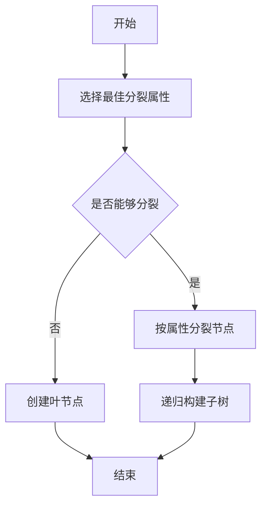

# 决策树 (Decision Trees) 原理与代码实例讲解

## 1. 背景介绍

在机器学习领域，决策树是一种基础且强大的分类与回归方法。它模拟人类决策过程，通过一系列规则对数据进行分类。决策树的优势在于模型的可解释性强，易于理解和实现，同时在处理数据的非线性关系方面表现出色。本文将深入探讨决策树的原理、构建过程，并通过代码实例展示其应用。

## 2. 核心概念与联系

### 2.1 决策树的定义

决策树是一种树形结构，其中每个内部节点代表一个属性上的测试，每个分支代表测试的结果，每个叶节点代表一个类别。

### 2.2 决策树与其他模型的关系

决策树可以单独使用，也可以作为集成学习算法（如随机森林、梯度提升树）的基础构件。与神经网络等其他复杂模型相比，决策树在解释性方面具有明显优势。

## 3. 核心算法原理具体操作步骤

### 3.1 决策树构建过程



### 3.2 分裂属性的选择

选择分裂属性时，我们通常使用信息增益、增益率或基尼不纯度等指标来评估。

## 4. 数学模型和公式详细讲解举例说明

### 4.1 信息增益

信息增益表示得知特征X的信息而使得类Y的信息的不确定性减少的程度。

$$
\text{信息增益}(Y|X) = H(Y) - H(Y|X)
$$

其中，$H(Y)$ 是类Y的熵，$H(Y|X)$ 是给定特征X后类Y的条件熵。

### 4.2 基尼不纯度

基尼不纯度是从数据集中随机选取两个样本，其类别标签不一致的概率。

$$
Gini(p) = 1 - \sum_{i=1}^{J} p_i^2
$$

其中，$p_i$ 是第i个类别的概率。

## 5. 项目实践：代码实例和详细解释说明

### 5.1 使用Python构建决策树

```python
from sklearn.datasets import load_iris
from sklearn.tree import DecisionTreeClassifier

# 加载数据集
iris = load_iris()
X, y = iris.data, iris.target

# 创建决策树分类器
clf = DecisionTreeClassifier(criterion='entropy')
clf.fit(X, y)

# 预测新样本的类别
print(clf.predict([[5.1, 3.5, 1.4, 0.2]]))
```

### 5.2 代码解释

上述代码首先加载了鸢尾花数据集，然后创建了一个以信息熵为标准的决策树分类器，并用数据集训练它。最后，我们用训练好的分类器来预测一个新样本的类别。

## 6. 实际应用场景

决策树在金融风控、医疗诊断、市场细分等多个领域有着广泛的应用。

## 7. 工具和资源推荐

- scikit-learn：一个强大的Python机器学习库，提供了决策树的实现。
- XGBoost：一个高效的集成学习库，其中包含了决策树算法。

## 8. 总结：未来发展趋势与挑战

决策树模型在未来可能会更加注重与深度学习的结合，提高模型的准确性和泛化能力。同时，如何保持模型的可解释性，也是一个重要的研究方向。

## 9. 附录：常见问题与解答

Q1: 决策树如何处理连续属性？
A1: 通过设定阈值将连续属性离散化。

Q2: 决策树如何避免过拟合？
A2: 可以通过剪枝技术来避免过拟合。

作者：禅与计算机程序设计艺术 / Zen and the Art of Computer Programming