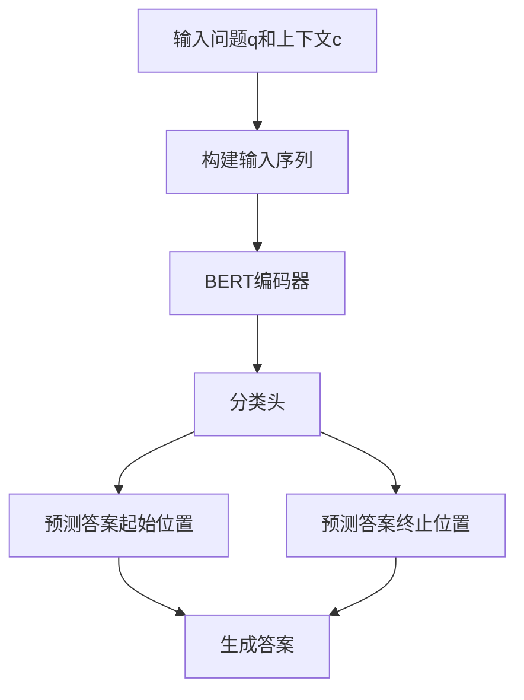

# 利用迁移学习进行问答系统

## 1. 背景介绍

在当今信息时代,问答系统已经成为人们获取知识和解决问题的重要途径。传统的问答系统通常依赖于规则或模板匹配,但这种方法存在局限性,难以处理复杂的自然语言问题。近年来,随着深度学习技术的快速发展,利用迁移学习构建问答系统成为了一种有前景的方法。

迁移学习是一种将在源域学习到的知识迁移到目标域的技术,它可以解决深度学习对大量标注数据的依赖问题。通过在大型语料库上预训练模型,再将其迁移到特定的下游任务如问答系统上进行微调,可以显著提高模型的性能。

### 1.1 问答系统的挑战

构建一个高性能的问答系统面临以下几个主要挑战:

1. **理解问题语义**: 需要准确理解自然语言问题的语义,包括词义、句义等。
2. **查找相关知识**: 需要从海量知识库中快速查找与问题相关的知识片段。
3. **生成答案**: 需要根据查找到的知识片段,生成准确、连贯的自然语言答案。
4. **数据标注成本高**: 训练一个端到端的问答系统需要大量的问答对数据,而人工标注的成本极高。

迁移学习技术可以很好地应对上述挑战,尤其是最后一个数据标注成本高的问题。

## 2. 核心概念与联系

### 2.1 迁移学习

迁移学习(Transfer Learning)是一种将在源域学习到的知识迁移到目标域的技术。其核心思想是利用在源域上训练好的模型,作为目标域任务的初始化权重或者特征提取器,从而减少目标域的训练成本。

根据源域和目标域的相似程度,迁移学习可分为:

- **域内迁移(Intra-Transfer)**:源域和目标域属于相同领域,如图像分类中的猫狗分类和野生动物分类。
- **域间迁移(Inter-Transfer)**:源域和目标域属于不同领域,如图像分类到自然语言处理。

根据微调的策略,迁移学习又可分为:

- **特征提取(Feature Extraction)**:冻结源模型的绝大部分层,只微调最后几层。
- **微调(Fine-tuning)**:在源模型基础上,对所有层进行微调。
- **预训练(Pre-training)**:利用源模型的参数作为目标模型的初始化权重。

在问答系统中,我们通常采用预训练+微调的策略。

### 2.2 预训练语言模型

预训练语言模型(Pre-trained Language Model, PLM)是迁移学习在自然语言处理领域的重要应用。PLM通过在大规模无标注语料库上预训练,学习到通用的语言知识,然后将这些知识迁移到下游任务中进行微调。

常见的PLM包括:

- **BERT**(Bidirectional Encoder Representations from Transformers)
- **GPT**(Generative Pre-trained Transformer)
- **T5**(Text-to-Text Transfer Transformer)
- **ALBERT**(A Lite BERT)

其中,BERT采用的是Masked Language Modeling和Next Sentence Prediction的预训练任务,GPT采用的是Casual Language Modeling的预训练任务。BERT和GPT都是Encoder-Decoder结构,而T5则是一个统一的Text-to-Text框架,可以处理多种文本生成任务。

在问答系统中,我们通常采用BERT或T5作为预训练模型,再针对问答任务进行微调。

## 3. 核心算法原理具体操作步骤 

利用迁移学习构建问答系统的核心步骤如下:

1. **选择合适的预训练语言模型**:根据任务需求选择合适的PLM,如BERT、T5等。
2. **数据预处理**:对问答数据进行预处理,如分词、填充、构建输入等。
3. **微调PLM**:将PLM在标注的问答数据上进行微调,得到针对问答任务的模型。
4. **生成答案**:利用微调后的模型对新的问题进行答案生成。

### 3.1 输入表示

以BERT为例,对于一个输入的问答对(q, a),我们需要构建如下形式的输入序列:

```
[CLS] q [SEP] c [SEP]
```

其中q为问题,c为答案所在的上下文,`[CLS]`用于获取整个序列的表示,`[SEP]`用于分隔不同的输入段。

然后,我们需要对输入序列进行分词、词典映射、填充等操作,得到模型可以接受的张量形式输入。

### 3.2 微调

在微调阶段,我们将BERT模型的大部分参数进行冻结,只对最后几层的参数进行微调。具体地,我们添加一个分类头,将`[CLS]`对应的向量输入到分类头中,得到预测的答案起始位置和终止位置。

损失函数为交叉熵损失函数:

$$
\mathcal{L}=-\sum_{i=1}^{N}\left(y_{i}^{\text{start}}\log\hat{y}_{i}^{\text{start}}+y_{i}^{\text{end}}\log\hat{y}_{i}^{\text{end}}\right)
$$

其中$y^{\text{start}}$和$y^{\text{end}}$为真实的答案起始和终止位置,$\hat{y}^{\text{start}}$和$\hat{y}^{\text{end}}$为模型预测的答案起始和终止位置概率分布。

在训练过程中,我们使用随机梯度下降等优化算法,最小化损失函数,得到最优的模型参数。

### 3.3 生成答案

在测试阶段,对于一个新的问题q,我们将其与上下文c构建成输入序列,输入到微调后的BERT模型中。模型会输出预测的答案起始和终止位置的概率分布,我们取概率最大的位置作为预测的答案。

如果没有找到合适的答案,我们可以返回"没有答案"或者其他默认响应。



## 4. 数学模型和公式详细讲解举例说明

在问答系统的微调过程中,我们需要优化的目标函数是交叉熵损失函数:

$$
\mathcal{L}=-\sum_{i=1}^{N}\left(y_{i}^{\text{start}}\log\hat{y}_{i}^{\text{start}}+y_{i}^{\text{end}}\log\hat{y}_{i}^{\text{end}}\right)
$$

其中:

- $N$是输入序列的长度
- $y^{\text{start}}$和$y^{\text{end}}$是真实的答案起始和终止位置,是one-hot向量
- $\hat{y}^{\text{start}}$和$\hat{y}^{\text{end}}$是模型预测的答案起始和终止位置的概率分布

我们希望最小化这个损失函数,使得模型预测的答案位置概率分布尽可能接近真实的答案位置。

例如,假设我们有一个输入序列"北京是中国的首都",其长度为6。如果真实的答案起始位置是第3个词"中国",终止位置是第4个词"的",那么$y^{\text{start}}$是一个只有第3个元素为1其余为0的one-hot向量,而$y^{\text{end}}$是一个只有第4个元素为1其余为0的one-hot向量。

我们希望模型预测的$\hat{y}^{\text{start}}$和$\hat{y}^{\text{end}}$分别在第3和第4个位置的概率值最大,从而最小化损失函数。

在训练过程中,我们使用随机梯度下降等优化算法,对模型参数进行更新:

$$
\theta \leftarrow \theta - \eta \frac{\partial \mathcal{L}}{\partial \theta}
$$

其中$\theta$是模型参数,$\eta$是学习率。通过不断迭代,我们可以找到一个使损失函数最小的最优参数$\theta^*$。

## 5. 项目实践:代码实例和详细解释说明

以下是一个使用Hugging Face的Transformers库,基于BERT模型构建问答系统的Python代码示例:

```python
from transformers import BertForQuestionAnswering, BertTokenizer

# 加载预训练模型和分词器
model = BertForQuestionAnswering.from_pretrained('bert-base-uncased')
tokenizer = BertTokenizer.from_pretrained('bert-base-uncased')

# 定义问题和上下文
question = "谁是美国第16任总统?"
context = "林肯是美国历史上最著名的总统之一,他是美国内战时期的总统,在任期间废除了奴隶制度。"

# 对输入进行编码
inputs = tokenizer.encode_plus(question, context, return_tensors='pt')
input_ids = inputs['input_ids']
attention_mask = inputs['attention_mask']

# 模型预测
outputs = model(input_ids, attention_mask=attention_mask)
start_scores = outputs.start_logits
end_scores = outputs.end_logits

# 解码输出
all_tokens = tokenizer.convert_ids_to_tokens(input_ids[0])
answer = tokenizer.decode(input_ids[0][torch.argmax(start_scores) : torch.argmax(end_scores)+1])

print(f"Question: {question}")
print(f"Answer: {answer}")
```

代码解释:

1. 首先,我们加载预训练的BERT模型和分词器。
2. 定义输入的问题和上下文文本。
3. 使用分词器对输入进行编码,得到输入id和注意力掩码张量。
4. 将编码后的输入传递给BERT模型,模型会输出预测的答案起始和终止位置的分数(logits)。
5. 使用argmax函数找到起始和终止位置的最大分数索引,从而得到预测的答案文本。
6. 打印输出问题和预测的答案。

在这个示例中,我们使用了Hugging Face提供的BERT预训练模型,并对其进行了简单的微调,从而构建了一个基本的问答系统。在实际应用中,我们还需要进行更多的数据预处理、模型优化等工作,以提高系统的性能和鲁棒性。

## 6. 实际应用场景

迁移学习在问答系统领域有着广泛的应用前景,主要包括以下几个方面:

### 6.1 智能助手

智能助手是问答系统的一个典型应用场景。通过构建基于迁移学习的问答系统,智能助手可以更好地理解用户的自然语言问题,从知识库中检索相关信息,并生成准确的答复。

目前,苹果的Siri、亚马逊的Alexa、谷歌助手等都采用了迁移学习技术,以提高自然语言理解和生成的能力。

### 6.2 客户服务

在客户服务领域,问答系统可以作为虚拟客服代理,快速响应客户的常见问题,减轻人工客服的工作压力。通过迁移学习,我们可以利用现有的大规模问答数据,快速构建出针对特定领域的问答系统。

### 6.3 知识问答

知识问答系统旨在从大规模的知识库中查找答案,回答复杂的事实性问题。迁移学习技术可以帮助知识问答系统更好地理解自然语言问题,并从海量的知识库中准确检索相关信息。

一些著名的知识问答系统,如IBM的Watson、阿里巴巴的AI问答系统等,都采用了迁移学习技术。

### 6.4 教育领域

在教育领域,问答系统可以作为智能辅导系统,回答学生的各种学习问题。通过迁移学习,我们可以利用大规模的教育资源,构建出覆盖各个学科领域的问答系统,为学生提供个性化的学习辅助。

### 6.5 医疗健康

在医疗健康领域,问答系统可以作为医疗助理,回答患者的各种健康相关问题。通过迁移学习,我们可以利用大量的医学文献和病例数据,构建出准确的医疗问答系统,为患者提供可靠的健康咨询服务。

## 7. 工具和资源推荐

在构建基于迁移学习的问答系统时,以下工具和资源可以为您提供帮助:

### 7.1 预训练语言模型

- **BERT**:谷歌开源