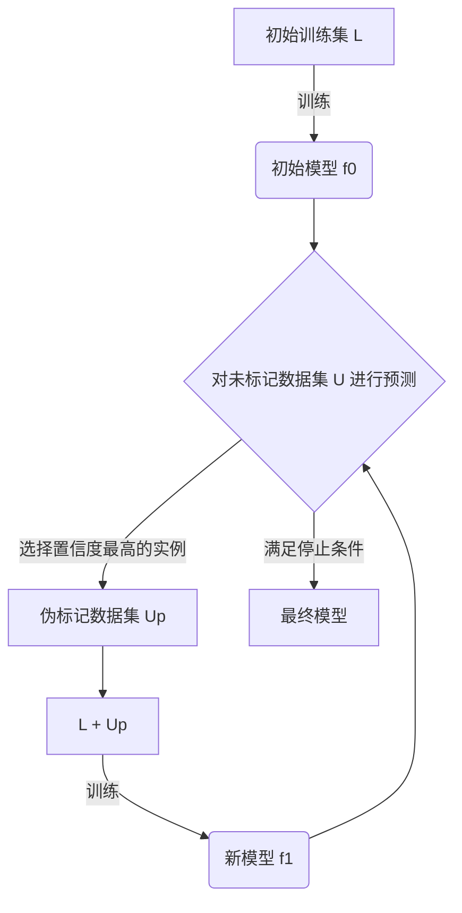
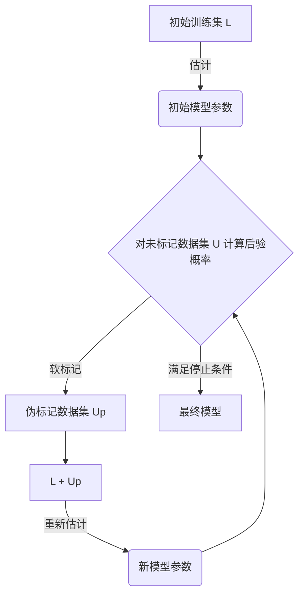
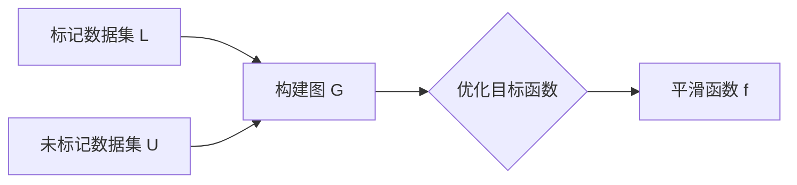
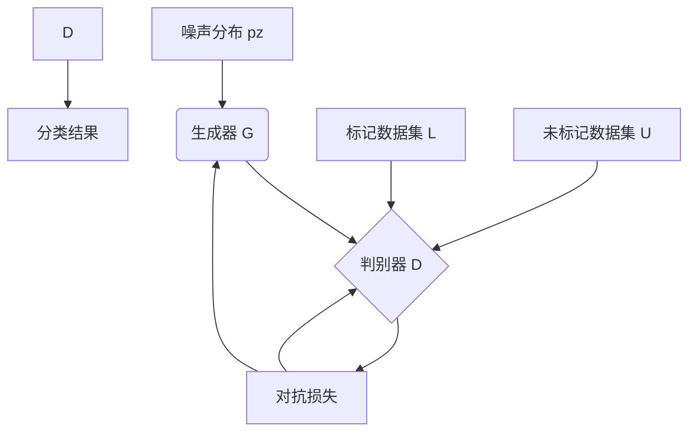

# 半监督学习 (Semi-Supervised Learning) 原理与代码实例讲解

## 1. 背景介绍

在现实世界中,获取大量高质量的标记数据通常是一项昂贵且耗时的过程。而半监督学习(Semi-Supervised Learning, SSL)旨在利用同时存在的少量标记数据和大量未标记数据,通过有效结合两者,提高模型的性能和泛化能力。

传统的监督学习算法依赖于大量标记数据的存在,而在许多应用场景下,标记数据的获取代价非常高昂。另一方面,未标记数据则相对容易获取。半监督学习的出现正是为了解决这一矛盾,充分利用未标记数据中蕴含的有价值信息,从而提高模型的性能。

### 1.1 半监督学习的重要性

半监督学习在诸多领域发挥着重要作用,例如:

- 计算机视觉: 标记图像数据需要大量人力,而未标记图像数据则相对容易获取。
- 自然语言处理: 标记语料库的工作耗时耗力,而未标记语料则可从互联网上轻松获取。
- 生物信息学: 对基因数据进行标记需要专业知识和大量人力物力,而未标记数据则相对容易获取。

### 1.2 半监督学习的挑战

尽管半监督学习具有广阔的应用前景,但它也面临着一些挑战:

- 样本选择偏差: 标记数据和未标记数据可能来自不同的分布,导致模型在未标记数据上的性能下降。
- 算法稳定性: 一些半监督算法对噪声和outlier敏感,需要设计稳健的算法。
- 理论支持: 半监督学习的理论基础相对薄弱,需要更多的理论研究来支撑算法设计。

## 2. 核心概念与联系

### 2.1 半监督学习的形式化定义

给定一个标记数据集 $\mathcal{L} = \{(x_i, y_i)\}_{i=1}^{l}$ 和一个未标记数据集 $\mathcal{U} = \{x_j\}_{j=l+1}^{l+u}$,其中 $l$ 和 $u$ 分别表示标记数据和未标记数据的数量。半监督学习的目标是通过同时利用 $\mathcal{L}$ 和 $\mathcal{U}$ 来学习一个更准确的模型 $f: \mathcal{X} \rightarrow \mathcal{Y}$,其中 $\mathcal{X}$ 和 $\mathcal{Y}$ 分别表示输入空间和输出空间。

### 2.2 半监督学习的假设

半监督学习的有效性基于以下几个基本假设:

1. **平滑性假设 (Smoothness Assumption)**: 如果两个实例 $x_i$ 和 $x_j$ 在输入空间中足够接近,那么它们的输出 $y_i$ 和 $y_j$ 也应该接近。这个假设反映了输入空间和输出空间之间的一致性。

2. **簇假设 (Cluster Assumption)**: 数据集中通常存在簇结构,即具有相似输入的实例倾向于具有相同的输出。这个假设为半监督学习提供了一种利用未标记数据的方式。

3. **流形假设 (Manifold Assumption)**: 高维输入数据实际上可能分布在一个低维流形上。利用这个假设可以更好地捕捉数据的本质结构。

### 2.3 半监督学习与其他学习范式的关系

半监督学习可以看作是监督学习和无监督学习的一种结合和扩展:

- 监督学习: 当只有标记数据集 $\mathcal{L}$ 时,半监督学习就退化为传统的监督学习问题。
- 无监督学习: 当只有未标记数据集 $\mathcal{U}$ 时,半监督学习就变成了无监督学习问题,例如聚类或者密度估计。
- 主动学习 (Active Learning): 主动学习是一种选择性地标记数据的策略,可以看作是半监督学习的一个特例。

## 3. 核心算法原理具体操作步骤

### 3.1 自训练 (Self-Training)

自训练是一种简单而有效的半监督学习算法,其基本思想是:

1. 使用标记数据集 $\mathcal{L}$ 训练一个初始模型 $f_0$。
2. 使用 $f_0$ 对未标记数据集 $\mathcal{U}$ 进行预测,并选择置信度最高的一部分实例作为伪标记数据 $\mathcal{U}_p$。
3. 将 $\mathcal{L}$ 和 $\mathcal{U}_p$ 合并,重新训练模型 $f_1$。
4. 重复步骤2和3,直到满足某个停止条件。

自训练算法的关键在于如何选择置信度最高的实例,以及如何避免传播错误标记的影响。一些常见的策略包括:

- 基于阈值的选择: 只选择置信度高于某个阈值的实例。
- 基于排序的选择: 选择置信度最高的top-k个实例。
- 基于熵的选择: 选择熵最小(置信度最高)的实例。

自训练算法的优点是简单高效,缺点是容易受到错误标记的影响,导致模型性能下降。



### 3.2 同伦标记 (Co-Training)

同伦标记算法适用于存在两个冗余且相关的视图的情况,例如网页分类中的网页内容和链接信息。算法的基本思想是:

1. 使用标记数据集 $\mathcal{L}$ 分别训练两个初始模型 $f_0^{(1)}$ 和 $f_0^{(2)}$,每个模型对应一个视图。
2. 使用 $f_0^{(1)}$ 对未标记数据集 $\mathcal{U}$ 进行预测,并选择置信度最高的一部分实例作为伪标记数据 $\mathcal{U}_p^{(1)}$。
3. 使用 $\mathcal{L}$ 和 $\mathcal{U}_p^{(1)}$ 训练新的模型 $f_1^{(2)}$。
4. 重复步骤2和3,交替训练两个模型,直到满足某个停止条件。

同伦标记算法的关键在于两个视图之间的冗余性和相关性。如果两个视图之间的相关性较弱,则算法的效果可能不佳。同时,该算法也容易受到错误标记的影响。

```mermaid
graph TD
    A[初始训练集 L] -->|训练| B1(初始模型 f0(1))
    A -->|训练| B2(初始模型 f0(2))
    B1 --> C1{对未标记数据集 U 进行预测}
    C1 -->|选择置信度最高的实例| D1[伪标记数据集 Up(1)]
    D1 --> E2[L + Up(1)]
    E2 -->|训练| F2(新模型 f1(2))
    B2 --> C2{对未标记数据集 U 进行预测}
    C2 -->|选择置信度最高的实例| D2[伪标记数据集 Up(2)]
    D2 --> E1[L + Up(2)]
    E1 -->|训练| F1(新模型 f1(1))
    F1 --> C1
    F2 --> C2
    C1 -->|满足停止条件| G1[最终模型 f(1)]
    C2 -->|满足停止条件| G2[最终模型 f(2)]
```

### 3.3 生成模型 (Generative Models)

生成模型是一种基于概率模型的半监督学习算法,其基本思想是:

1. 使用标记数据集 $\mathcal{L}$ 估计类条件概率分布 $P(x|y)$ 和先验概率分布 $P(y)$。
2. 使用贝叶斯公式计算未标记数据的后验概率分布 $P(y|x)$。
3. 将未标记数据的软标记 (soft labels) 作为伪标记数据,与标记数据集 $\mathcal{L}$ 合并,重新估计模型参数。
4. 重复步骤2和3,直到收敛或满足某个停止条件。

生成模型的优点是具有良好的理论基础,并且可以自然地处理未标记数据。缺点是需要做出一些强假设,例如数据服从某种特定的分布,这可能与实际情况不符。



### 3.4 图模型 (Graph-Based Models)

图模型是一种基于图结构的半监督学习算法,其基本思想是:

1. 将所有数据(包括标记数据和未标记数据)表示为一个图 $G=(V, E)$,其中节点 $V$ 表示数据实例,边 $E$ 表示实例之间的相似度。
2. 在图上定义一个平滑函数 $f: V \rightarrow \mathbb{R}$,该函数在相似实例之间应该取相似值。
3. 通过优化某个目标函数(例如正则化框架或谱框架)来求解 $f$,使其在标记数据上的值接近真实标记,同时在整个图上保持平滑性。

图模型的优点是能够很好地捕捉数据的本质结构,并且可以自然地融合标记数据和未标记数据。缺点是计算复杂度较高,并且对图结构的构建方式敏感。



### 3.5 对抗训练 (Adversarial Training)

对抗训练是一种基于生成对抗网络 (Generative Adversarial Networks, GANs) 的半监督学习算法,其基本思想是:

1. 训练一个生成器 $G$,使其能够从一个简单的噪声分布 $p_z(z)$ 生成逼真的数据样本 $G(z)$。
2. 训练一个判别器 $D$,使其能够区分真实数据 $x$ 和生成数据 $G(z)$。
3. 生成器 $G$ 和判别器 $D$ 相互对抗,最终达到一种平衡状态,即生成数据无法被判别器区分。
4. 在这个过程中,判别器 $D$ 也被用作一个半监督分类器,对标记数据和未标记数据进行分类。

对抗训练的优点是能够利用生成模型的优势,同时避免做过多的假设。缺点是训练过程复杂,容易陷入局部最优或模式崩溃。



## 4. 数学模型和公式详细讲解举例说明

### 4.1 自训练算法的数学模型

自训练算法的目标是最小化以下损失函数:

$$J(f) = \frac{1}{l} \sum_{i=1}^l L(f(x_i), y_i) + \lambda \frac{1}{u} \sum_{j=l+1}^{l+u} L(f(x_j), f^*(x_j))$$

其中:

- $L(\cdot, \cdot)$ 是损失函数,例如交叉熵损失或均方误差。
- $f^*(x_j)$ 是伪标记,通常取 $f(x_j)$ 的最大值对应的类别。
- $\lambda$ 是一个权重参