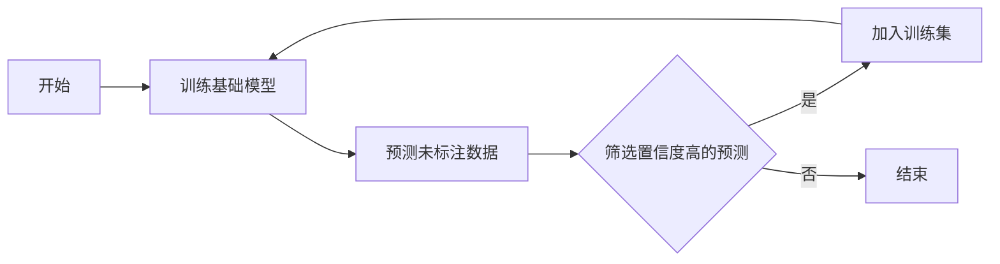

## 1. 背景介绍

在机器学习领域，数据是推动算法学习和进步的关键。然而，获取大量标注数据往往成本高昂且耗时。半监督学习（Semi-Supervised Learning, SSL）应运而生，它介于监督学习和无监督学习之间，能够利用少量标注数据和大量未标注数据进行模型训练。这种学习方式在现实世界中具有极大的实用价值，尤其是在标注资源有限的情况下。

## 2. 核心概念与联系

半监督学习的核心在于如何有效地利用未标注数据来提升学习性能。它基于这样一个假设：相似的数据点很可能具有相同的输出标签。SSL的关键概念包括一致性假设、流形假设和聚类假设，这些假设指导着算法的设计和实现。

## 3. 核心算法原理具体操作步骤

半监督学习算法通常包括自训练、多视图学习、图基方法等。自训练算法首先使用少量标注数据训练一个基础模型，然后用该模型预测未标注数据的标签，再将预测结果中置信度高的数据点及其标签加入训练集中，如此迭代。



## 4. 数学模型和公式详细讲解举例说明

以自训练为例，其数学模型可以表示为：

$$
\hat{y} = f_\theta(x)
$$

其中，$f_\theta$ 是基于参数 $\theta$ 的模型，$x$ 是输入数据点，$\hat{y}$ 是预测的标签。模型的训练目标是最小化损失函数：

$$
L(\theta) = \sum_{(x_i, y_i) \in D_L} L(f_\theta(x_i), y_i) + \lambda \sum_{x_j \in D_U} \Psi(f_\theta(x_j))
$$

这里，$D_L$ 是标注数据集，$D_U$ 是未标注数据集，$L$ 是损失函数，$\Psi$ 是未标注数据的正则化项，$\lambda$ 是正则化系数。

## 5. 项目实践：代码实例和详细解释说明

以Python语言和Scikit-learn库为例，我们可以实现一个简单的自训练模型：

```python
from sklearn.semi_supervised import SelfTrainingClassifier
from sklearn.svm import SVC

# 假设我们有少量标注数据 X_labeled, y_labeled 和大量未标注数据 X_unlabeled
# 创建基础分类器
base_classifier = SVC(probability=True)
# 创建自训练分类器
self_training_model = SelfTrainingClassifier(base_classifier)
# 训练模型
self_training_model.fit(X_labeled, y_labeled)
# 预测未标注数据
self_training_model.predict(X_unlabeled)
```

## 6. 实际应用场景

半监督学习在许多领域都有应用，如图像识别、自然语言处理、生物信息学等。在这些领域中，标注数据的获取可能非常昂贵或困难，而未标注数据却相对容易获得。

## 7. 工具和资源推荐

- Scikit-learn：提供了一些半监督学习算法的实现。
- TensorFlow或PyTorch：这些深度学习框架可以用来构建更复杂的半监督学习模型。
- UDA（Unsupervised Data Augmentation）：一种有效的半监督学习技术，适用于深度学习模型。

## 8. 总结：未来发展趋势与挑战

半监督学习的研究正在快速发展，未来的趋势可能包括更有效的算法、更好的理论支持和更广泛的应用场景。挑战包括如何处理高维数据、如何设计更好的未标注数据利用策略等。

## 9. 附录：常见问题与解答

Q1: 半监督学习和迁移学习有什么区别？
A1: 半监督学习侧重于同时使用标注和未标注数据，而迁移学习侧重于将从一个任务学到的知识应用到另一个任务。

Q2: 如何选择合适的半监督学习算法？
A2: 这取决于具体问题、数据的特性和可用的计算资源。通常需要通过实验来确定最佳选择。

作者：禅与计算机程序设计艺术 / Zen and the Art of Computer Programming