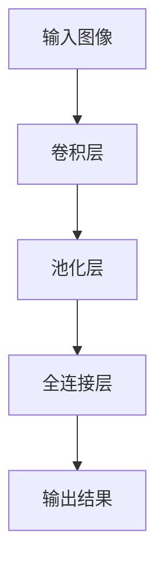

## 1.背景介绍

卷积神经网络（Convolutional Neural Networks，简称CNN）是一种深度学习的算法，自从1998年Yann LeCun等人提出后，CNN在图像识别、语音识别等多个领域取得了显著的成果，特别是在图像识别任务上，CNN已经成为了处理图像的主流算法。

## 2.核心概念与联系

CNN的主要构成部分包括卷积层（Convolutional Layer）、池化层（Pooling Layer）和全连接层（Fully Connected Layer）。其中，卷积层和池化层负责从原始图像中提取特征，全连接层则负责对这些特征进行最终的分类。



## 3.核心算法原理具体操作步骤

下面我们来详细介绍一下CNN的主要组成部分的工作原理。

### 3.1 卷积层

卷积层是CNN的核心，它的主要任务是从原始图像中提取特征。卷积层的工作原理是通过一个滑动窗口（也叫做卷积核）在图像上滑动，每次滑动都会计算窗口内的图像和卷积核的卷积，得到一个新的特征图（也叫做特征映射）。

### 3.2 池化层

池化层的主要任务是降低特征图的维度，减少计算量，同时也能增强模型的鲁棒性。常见的池化操作有最大池化和平均池化。

### 3.3 全连接层

全连接层的主要任务是将卷积层和池化层提取出来的特征进行最终的分类。全连接层的每个神经元都与前一层的所有神经元相连，可以理解为一个普通的神经网络。

## 4.数学模型和公式详细讲解举例说明

### 4.1 卷积操作

卷积操作的数学表达式如下：

$$
\begin{equation}
(F * G)(x,y) = \sum_{m=-\infty}^{\infty} \sum_{n=-\infty}^{\infty} F(m,n)G(x-m,y-n)
\end{equation}
$$

在实际计算中，由于图像的大小是有限的，所以我们只需要计算有限的项。

### 4.2 池化操作

池化操作的数学表达式如下：

最大池化：

$$
\begin{equation}
F_{maxpool}(x,y) = \max_{(m,n)\in W} F(m,n)
\end{equation}
$$

平均池化：

$$
\begin{equation}
F_{avgpool}(x,y) = \frac{1}{|W|} \sum_{(m,n)\in W} F(m,n)
\end{equation}
$$

其中，$W$是池化窗口，$|W|$是窗口中的元素个数。

## 5.项目实践：代码实例和详细解释说明

下面我们来看一个使用Python和TensorFlow实现的简单CNN模型的例子。

```python
import tensorflow as tf
from tensorflow.keras import layers, models

# 构建模型
model = models.Sequential()
model.add(layers.Conv2D(32, (3, 3), activation='relu', input_shape=(32, 32, 3)))
model.add(layers.MaxPooling2D((2, 2)))
model.add(layers.Conv2D(64, (3, 3), activation='relu'))
model.add(layers.MaxPooling2D((2, 2)))
model.add(layers.Conv2D(64, (3, 3), activation='relu'))
model.add(layers.Flatten())
model.add(layers.Dense(64, activation='relu'))
model.add(layers.Dense(10))

# 编译模型
model.compile(optimizer='adam',
              loss=tf.keras.losses.SparseCategoricalCrossentropy(from_logits=True),
              metrics=['accuracy'])

# 训练模型
model.fit(train_images, train_labels, epochs=10, 
                    validation_data=(test_images, test_labels))
```

这个模型包含两个卷积层和两个池化层，以及一个全连接层。模型的输入是32x32大小的彩色图像，输出是10个类别的概率。

## 6.实际应用场景

CNN在很多实际应用场景中都有广泛的应用，例如图像识别、视频分析、自动驾驶等。例如在图像识别任务中，CNN可以用来识别图像中的物体、人脸等；在视频分析任务中，CNN可以用来检测视频中的异常行为；在自动驾驶中，CNN可以用来识别路标、行人等。

## 7.工具和资源推荐

- TensorFlow：Google开源的深度学习框架，支持多种硬件平台，包括CPU、GPU和TPU。
- Keras：基于TensorFlow的高级深度学习框架，简化了深度学习模型的构建和训练。
- PyTorch：Facebook开源的深度学习框架，支持动态图，适合研究和开发。

## 8.总结：未来发展趋势与挑战

虽然CNN在图像识别等任务上取得了显著的成果，但是还有很多挑战需要我们去面对。例如，如何提高模型的泛化能力，如何处理大规模的图像数据，如何提高模型的解释性等。随着深度学习技术的不断发展，我相信这些问题都会得到解决。

## 9.附录：常见问题与解答

Q：为什么CNN在图像识别任务上表现优秀？

A：CNN通过卷积操作可以有效地提取图像的局部特征，而且卷积操作具有平移不变性，即无论物体在图像中的位置如何改变，CNN都可以识别出来。

Q：卷积核的大小应该如何选择？

A：卷积核的大小一般根据输入图像的大小和任务的复杂性来选择。一般来说，对于大图像和复杂任务，我们可以选择大一些的卷积核；对于小图像和简单任务，我们可以选择小一些的卷积核。

作者：禅与计算机程序设计艺术 / Zen and the Art of Computer Programming