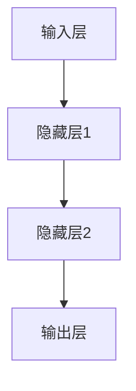

# 反向传播(Backpropagation) - 原理与代码实例讲解

## 1. 背景介绍

### 1.1 神经网络简介

神经网络是一种受生物神经系统启发而设计的计算模型,广泛应用于机器学习和深度学习领域。它由大量互连的节点(神经元)组成,每个节点接收来自其他节点的输入信号,经过加权求和和非线性激活函数处理后,产生输出信号传递给下一层节点。

### 1.2 神经网络训练的挑战

为了使神经网络能够学习并对新数据做出正确预测,需要对网络中的参数(权重和偏置)进行适当的调整。这个过程称为训练,是机器学习中的核心问题之一。然而,训练神经网络并非一件简单的事情,尤其是对于深层网络,传统的优化算法很容易陷入局部最优或出现梯度消失/爆炸等问题。

### 1.3 反向传播算法的重要性

反向传播(Backpropagation)算法是解决上述问题的有力工具。它提供了一种高效的方法,通过计算损失函数相对于网络中每个参数的梯度,然后沿着这些梯度的方向对参数进行调整,从而最小化损失函数,提高神经网络的性能。反向传播算法的出现极大地推动了深度学习的发展,使得训练深层神经网络成为可能。

## 2. 核心概念与联系

### 2.1 前向传播

在介绍反向传播算法之前,我们需要先了解前向传播(Forward Propagation)的概念。前向传播是神经网络进行预测的过程,它将输入数据通过网络层层传递,每一层都会对来自上一层的输入进行加权求和和非线性变换,最终得到输出结果。



### 2.2 损失函数

在训练过程中,我们需要定义一个损失函数(Loss Function)来衡量神经网络的预测结果与真实标签之间的差异。常见的损失函数包括均方误差(Mean Squared Error, MSE)、交叉熵损失(Cross-Entropy Loss)等。损失函数的值越小,表示网络的预测结果越接近真实标签。

### 2.3 反向传播算法

反向传播算法的核心思想是利用链式法则计算损失函数相对于每个参数的梯度,然后沿着这些梯度的方向对参数进行调整,从而最小化损失函数。这个过程包括两个阶段:

1. **前向传播**:输入数据通过网络层层传递,计算出最终的输出结果。
2. **反向传播**:从输出层开始,计算每一层的误差项,并利用链式法则计算损失函数相对于每个参数的梯度。

通过不断地迭代这两个阶段,神经网络的参数会逐渐调整到一个较优的状态,使得损失函数最小化,网络的预测能力也随之提高。

## 3. 核心算法原理具体操作步骤

### 3.1 前向传播过程

在前向传播过程中,输入数据 $\mathbf{X}$ 通过网络层层传递,每一层的输出都是上一层输出经过加权求和和非线性变换后的结果。具体步骤如下:

1. 输入层:输入数据 $\mathbf{X}$ 直接传递给第一个隐藏层。
2. 隐藏层:对于第 $l$ 层,输入为上一层的输出 $\mathbf{a}^{(l-1)}$,权重矩阵为 $\mathbf{W}^{(l)}$,偏置向量为 $\mathbf{b}^{(l)}$,则该层的输出 $\mathbf{a}^{(l)}$ 计算如下:

$$\mathbf{z}^{(l)} = \mathbf{W}^{(l)}\mathbf{a}^{(l-1)} + \mathbf{b}^{(l)}$$
$$\mathbf{a}^{(l)} = g(\mathbf{z}^{(l)})$$

其中 $g(\cdot)$ 是非线性激活函数,如 ReLU、Sigmoid 或 Tanh 函数。

3. 输出层:输出层的计算方式与隐藏层相似,但不需要应用非线性激活函数。输出层的输出就是神经网络的最终预测结果 $\hat{\mathbf{y}}$。

### 3.2 反向传播过程

在反向传播过程中,我们需要计算损失函数相对于每个参数的梯度,并沿着这些梯度的方向对参数进行调整。具体步骤如下:

1. 计算输出层的误差项:

$$\delta^{(L)} = \nabla_{\mathbf{a}^{(L)}} J(\mathbf{W}, \mathbf{b}; \mathbf{X}, \mathbf{y})$$

其中 $J(\cdot)$ 是损失函数, $\mathbf{y}$ 是真实标签, $L$ 表示输出层的层数。

2. 计算隐藏层的误差项:

对于第 $l$ 层,误差项 $\delta^{(l)}$ 由上一层的误差项 $\delta^{(l+1)}$ 和当前层的权重矩阵 $\mathbf{W}^{(l+1)}$ 决定:

$$\delta^{(l)} = (\mathbf{W}^{(l+1)})^T \delta^{(l+1)} \odot g'(\mathbf{z}^{(l)})$$

其中 $\odot$ 表示元素wise乘积,  $g'(\cdot)$ 是激活函数的导数。

3. 计算梯度:

对于第 $l$ 层,损失函数相对于权重矩阵 $\mathbf{W}^{(l)}$ 和偏置向量 $\mathbf{b}^{(l)}$ 的梯度为:

$$\nabla_{\mathbf{W}^{(l)}} J = \delta^{(l)} (\mathbf{a}^{(l-1)})^T$$
$$\nabla_{\mathbf{b}^{(l)}} J = \delta^{(l)}$$

4. 更新参数:

使用梯度下降法更新参数:

$$\mathbf{W}^{(l)} \leftarrow \mathbf{W}^{(l)} - \alpha \nabla_{\mathbf{W}^{(l)}} J$$
$$\mathbf{b}^{(l)} \leftarrow \mathbf{b}^{(l)} - \alpha \nabla_{\mathbf{b}^{(l)}} J$$

其中 $\alpha$ 是学习率,控制着参数更新的步长。

重复上述步骤,直到损失函数收敛或达到预设的迭代次数。

## 4. 数学模型和公式详细讲解举例说明

在反向传播算法中,我们需要计算损失函数相对于每个参数的梯度。为了更好地理解这个过程,我们以均方误差损失函数为例,详细推导梯度的计算过程。

假设我们有一个单层神经网络,输入为 $\mathbf{X}$,权重矩阵为 $\mathbf{W}$,偏置向量为 $\mathbf{b}$,预测输出为 $\hat{\mathbf{y}}$,真实标签为 $\mathbf{y}$。均方误差损失函数定义为:

$$J(\mathbf{W}, \mathbf{b}) = \frac{1}{2} \sum_{i=1}^{m} (\hat{y}_i - y_i)^2$$

其中 $m$ 是训练样本的数量。

我们的目标是计算 $\nabla_{\mathbf{W}} J$ 和 $\nabla_{\mathbf{b}} J$,也就是损失函数相对于权重矩阵和偏置向量的梯度。

### 4.1 计算 $\nabla_{\mathbf{W}} J$

根据链式法则,我们有:

$$\nabla_{\mathbf{W}} J = \frac{\partial J}{\partial \hat{\mathbf{y}}} \frac{\partial \hat{\mathbf{y}}}{\partial \mathbf{W}}$$

其中:

$$\frac{\partial J}{\partial \hat{\mathbf{y}}} = \hat{\mathbf{y}} - \mathbf{y}$$
$$\frac{\partial \hat{\mathbf{y}}}{\partial \mathbf{W}} = \mathbf{X}^T$$

将上述结果代入,我们得到:

$$\nabla_{\mathbf{W}} J = (\hat{\mathbf{y}} - \mathbf{y}) \mathbf{X}^T$$

### 4.2 计算 $\nabla_{\mathbf{b}} J$

同样利用链式法则,我们有:

$$\nabla_{\mathbf{b}} J = \frac{\partial J}{\partial \hat{\mathbf{y}}} \frac{\partial \hat{\mathbf{y}}}{\partial \mathbf{b}}$$

其中:

$$\frac{\partial J}{\partial \hat{\mathbf{y}}} = \hat{\mathbf{y}} - \mathbf{y}$$
$$\frac{\partial \hat{\mathbf{y}}}{\partial \mathbf{b}} = \mathbf{1}$$

将上述结果代入,我们得到:

$$\nabla_{\mathbf{b}} J = \hat{\mathbf{y}} - \mathbf{y}$$

### 4.3 示例

假设我们有一个单层神经网络,输入为 $\mathbf{X} = [1, 2]^T$,权重矩阵为 $\mathbf{W} = [0.5, 0.3]^T$,偏置为 $b = 0.1$,真实标签为 $y = 1$。我们计算预测输出 $\hat{y}$ 和损失函数 $J$:

$$\hat{y} = \mathbf{W}^T \mathbf{X} + b = 0.5 \times 1 + 0.3 \times 2 + 0.1 = 1.2$$
$$J = \frac{1}{2} (\hat{y} - y)^2 = \frac{1}{2} (1.2 - 1)^2 = 0.02$$

接下来,我们计算梯度:

$$\nabla_{\mathbf{W}} J = (\hat{y} - y) \mathbf{X}^T = (1.2 - 1) [1, 2]^T = [0.4, 0.8]^T$$
$$\nabla_{b} J = \hat{y} - y = 1.2 - 1 = 0.2$$

通过上述示例,我们可以更好地理解梯度的计算过程。在实际应用中,我们需要对多层神经网络进行计算,过程会更加复杂,但基本思路是一致的。

## 5. 项目实践: 代码实例和详细解释说明

为了更好地理解反向传播算法,我们将使用 Python 和 NumPy 库实现一个简单的前馈神经网络,并手动计算梯度进行参数更新。

### 5.1 导入所需库

```python
import numpy as np
```

### 5.2 定义激活函数及其导数

```python
def sigmoid(z):
    return 1 / (1 + np.exp(-z))

def sigmoid_prime(z):
    return sigmoid(z) * (1 - sigmoid(z))
```

### 5.3 初始化网络参数

```python
# 输入层到隐藏层的权重矩阵
W1 = np.random.randn(2, 3)
# 隐藏层到输出层的权重矩阵
W2 = np.random.randn(3, 1)
# 隐藏层的偏置向量
b1 = np.random.randn(3)
# 输出层的偏置
b2 = np.random.randn(1)
```

### 5.4 前向传播

```python
def forward_propagation(X):
    # 输入层到隐藏层
    z1 = np.dot(X, W1.T) + b1
    a1 = sigmoid(z1)
    # 隐藏层到输出层
    z2 = np.dot(a1, W2.T) + b2
    a2 = z2  # 输出层不需要激活函数
    return a1, a2
```

### 5.5 反向传播

```python
def backward_propagation(X, y, a1, a2):
    # 输出层误差
    delta2 = a2 - y
    # 隐藏层误差
    delta1 = np.dot(delta2, W2) * sigmoid_prime(a1)
    # 计算梯度
    dW2 = np.dot(a1.T, delta2)
    db2 = np.sum(delta2, axis=0, keepdims=True)
    dW1 = np.dot(X.T, delta1)
    db1 = np.sum(delta1, axis=0)
    return dW1, dW2, db1, db2
```

### 5.6 更新参数

```python
def update_parameters(W1, W2, b1, b2, dW1, dW2, db1, db2, learning_rate):