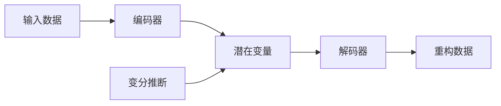

# 变分自编码器与生成模型原理与代码实战案例讲解

## 1. 背景介绍

### 1.1 生成模型概述

生成模型是机器学习和人工智能领域的一个重要分支,其目标是学习数据的潜在分布,并生成与训练数据相似的新样本。生成模型在图像生成、语音合成、自然语言处理等领域有广泛的应用。

### 1.2 变分自编码器的提出

变分自编码器(Variational Autoencoder, VAE)是一种重要的生成模型,由 Diederik P. Kingma 和 Max Welling 在2013年提出。VAE 结合了变分推断和深度学习技术,通过学习数据的潜在表示来生成新样本。

### 1.3 VAE 的优势与应用

与传统的生成模型相比,VAE 具有以下优势:

1. 能够学习数据的低维潜在表示,捕捉数据的关键特征。
2. 生成的样本多样性好,能够生成与训练数据相似但不完全相同的新样本。
3. 模型训练稳定,收敛速度快。

VAE 在图像生成、异常检测、数据压缩等领域有广泛的应用。

## 2. 核心概念与联系

### 2.1 编码器(Encoder)

编码器是 VAE 的重要组成部分,其作用是将高维的输入数据映射到低维的潜在空间。编码器通常由多层神经网络构成,输出为潜在变量的均值和方差。

### 2.2 解码器(Decoder) 

解码器与编码器相对应,其作用是将低维的潜在变量重构为高维的输出数据。解码器同样由多层神经网络构成,输入为潜在变量,输出为重构的数据。

### 2.3 潜在变量(Latent Variable)

潜在变量是 VAE 中连接编码器和解码器的中间表示,它是一个低维的连续随机变量。VAE 通过学习潜在变量的先验分布和后验分布,实现对数据分布的建模。

### 2.4 变分推断(Variational Inference)

变分推断是一种近似推断方法,用于估计后验分布。在 VAE 中,变分推断用于估计潜在变量的后验分布,通过最小化变分下界(ELBO)来优化模型参数。

### 2.5 概念之间的联系

下图展示了 VAE 中各个概念之间的联系:



## 3. 核心算法原理具体操作步骤

### 3.1 VAE 的整体架构

VAE 由编码器、解码器和潜在变量组成,其整体架构如下:

```mermaid
graph TB
A[输入数据 x] --> B[编码器 q_φ(z|x)]
B --> C[潜在变量 z]
C --> D[解码器 p_θ(x|z)]
D --> E[重构数据 x']
```

### 3.2 编码器

编码器 $q_\phi(z|x)$ 将输入数据 $x$ 映射为潜在变量 $z$ 的后验分布的参数。通常假设 $z$ 服从高斯分布,编码器输出 $z$ 的均值 $\mu$ 和对数方差 $\log \sigma^2$。

$$q_\phi(z|x) = \mathcal{N}(z; \mu_\phi(x), \sigma^2_\phi(x)I)$$

其中 $\phi$ 为编码器的参数。

### 3.3 重参数化技巧

为了能够对编码器进行端到端的训练,需要对潜在变量 $z$ 进行重参数化。引入辅助变量 $\epsilon \sim \mathcal{N}(0, I)$,将 $z$ 表示为:

$$z = \mu_\phi(x) + \sigma_\phi(x) \odot \epsilon$$

其中 $\odot$ 表示逐元素乘法。这样就可以将梯度传递给编码器的参数 $\phi$。

### 3.4 解码器

解码器 $p_\theta(x|z)$ 将潜在变量 $z$ 映射为重构的数据 $x'$。对于连续型数据,通常假设 $x'$ 服从高斯分布:

$$p_\theta(x|z) = \mathcal{N}(x; \mu_\theta(z), \sigma^2_\theta(z)I)$$

其中 $\theta$ 为解码器的参数。对于离散型数据,可以使用 Bernoulli 分布或 Categorical 分布。

### 3.5 变分下界(ELBO)

VAE 的训练目标是最大化边际似然 $\log p_\theta(x)$,但直接优化边际似然是困难的。因此,引入变分下界(ELBO)作为替代目标:

$$\log p_\theta(x) \geq \mathbb{E}_{q_\phi(z|x)}[\log p_\theta(x|z)] - D_{KL}(q_\phi(z|x) || p(z))$$

其中第一项是重构误差,第二项是后验分布 $q_\phi(z|x)$ 与先验分布 $p(z)$ 的 KL 散度。通过最大化 ELBO,可以同时最小化重构误差和 KL 散度,实现对数据分布的建模。

### 3.6 训练过程

VAE 的训练过程如下:

1. 从数据集中采样一个批次的数据 $\{x^{(i)}\}_{i=1}^M$。
2. 对每个样本 $x^{(i)}$,通过编码器计算潜在变量的后验分布参数 $\mu_\phi(x^{(i)})$ 和 $\log \sigma^2_\phi(x^{(i)})$。
3. 对每个样本,通过重参数化技巧采样潜在变量 $z^{(i)}$。
4. 对每个样本,通过解码器计算重构数据的参数 $\mu_\theta(z^{(i)})$ 和 $\sigma^2_\theta(z^{(i)})$。
5. 计算重构误差和 KL 散度,得到 ELBO 的估计值。
6. 通过梯度下降算法更新编码器和解码器的参数 $\phi$ 和 $\theta$,最大化 ELBO。
7. 重复步骤 1-6,直到模型收敛。

## 4. 数学模型和公式详细讲解举例说明

### 4.1 边际似然的变分下界

对数边际似然 $\log p_\theta(x)$ 可以分解为:

$$\log p_\theta(x) = D_{KL}(q_\phi(z|x) || p_\theta(z|x)) + \mathcal{L}(\theta, \phi; x)$$

其中 $D_{KL}(q_\phi(z|x) || p_\theta(z|x))$ 是后验分布 $q_\phi(z|x)$ 与真实后验分布 $p_\theta(z|x)$ 的 KL 散度,始终非负。因此,第二项 $\mathcal{L}(\theta, \phi; x)$ 是 $\log p_\theta(x)$ 的下界,称为变分下界(ELBO)。

$$\mathcal{L}(\theta, \phi; x) = \mathbb{E}_{q_\phi(z|x)}[\log p_\theta(x, z) - \log q_\phi(z|x)]$$

进一步展开可得:

$$\mathcal{L}(\theta, \phi; x) = \mathbb{E}_{q_\phi(z|x)}[\log p_\theta(x|z)] - D_{KL}(q_\phi(z|x) || p(z))$$

其中第一项是重构误差,第二项是后验分布与先验分布的 KL 散度。

### 4.2 重构误差

假设 $p_\theta(x|z)$ 服从高斯分布,重构误差可以写为:

$$\mathbb{E}_{q_\phi(z|x)}[\log p_\theta(x|z)] = -\frac{1}{2} \sum_{i=1}^D \left(\frac{(x_i - \mu_{\theta,i}(z))^2}{\sigma_{\theta,i}^2(z)} + \log \sigma_{\theta,i}^2(z)\right) + C$$

其中 $D$ 是数据的维度,$C$ 是与 $\theta$ 和 $\phi$ 无关的常数。

### 4.3 KL 散度

假设先验分布 $p(z)$ 为标准高斯分布 $\mathcal{N}(0, I)$,后验分布 $q_\phi(z|x)$ 为各向同性的高斯分布 $\mathcal{N}(\mu_\phi(x), \sigma_\phi^2(x)I)$,则 KL 散度可以解析求得:

$$D_{KL}(q_\phi(z|x) || p(z)) = \frac{1}{2} \sum_{j=1}^J \left(\mu_{\phi,j}^2(x) + \sigma_{\phi,j}^2(x) - \log \sigma_{\phi,j}^2(x) - 1\right)$$

其中 $J$ 是潜在变量的维度。

### 4.4 ELBO 的计算

将重构误差和 KL 散度代入 ELBO 的表达式,可得:

$$\mathcal{L}(\theta, \phi; x) = -\frac{1}{2} \sum_{i=1}^D \left(\frac{(x_i - \mu_{\theta,i}(z))^2}{\sigma_{\theta,i}^2(z)} + \log \sigma_{\theta,i}^2(z)\right) - \frac{1}{2} \sum_{j=1}^J \left(\mu_{\phi,j}^2(x) + \sigma_{\phi,j}^2(x) - \log \sigma_{\phi,j}^2(x) - 1\right)$$

最大化 ELBO 等价于最小化重构误差和 KL 散度。

## 5. 项目实践：代码实例和详细解释说明

下面以 PyTorch 为例,给出 VAE 的代码实现。

### 5.1 编码器

```python
class Encoder(nn.Module):
    def __init__(self, input_dim, hidden_dim, latent_dim):
        super(Encoder, self).__init__()
        
        self.fc1 = nn.Linear(input_dim, hidden_dim)
        self.fc2 = nn.Linear(hidden_dim, latent_dim)
        self.fc3 = nn.Linear(hidden_dim, latent_dim)
        
    def forward(self, x):
        h = F.relu(self.fc1(x))
        mu = self.fc2(h)
        log_var = self.fc3(h)
        return mu, log_var
```

编码器由三个全连接层组成,输入维度为 `input_dim`,隐藏层维度为 `hidden_dim`,潜在变量维度为 `latent_dim`。编码器输出潜在变量的均值 `mu` 和对数方差 `log_var`。

### 5.2 解码器

```python
class Decoder(nn.Module):
    def __init__(self, latent_dim, hidden_dim, output_dim):
        super(Decoder, self).__init__()
        
        self.fc1 = nn.Linear(latent_dim, hidden_dim)
        self.fc2 = nn.Linear(hidden_dim, output_dim)
        
    def forward(self, z):
        h = F.relu(self.fc1(z))
        x_recon = F.sigmoid(self.fc2(h))
        return x_recon
```

解码器由两个全连接层组成,输入为潜在变量 `z`,输出为重构数据 `x_recon`。最后一层使用 Sigmoid 激活函数,将输出值限制在 [0, 1] 范围内。

### 5.3 VAE 模型

```python
class VAE(nn.Module):
    def __init__(self, input_dim, hidden_dim, latent_dim):
        super(VAE, self).__init__()
        
        self.encoder = Encoder(input_dim, hidden_dim, latent_dim)
        self.decoder = Decoder(latent_dim, hidden_dim, input_dim)
        
    def forward(self, x):
        mu, log_var = self.encoder(x)
        z = self.reparameterize(mu, log_var)
        x_recon = self.decoder(z)
        return x_recon, mu, log_var
    
    def reparameterize(self, mu, log_var):
        std = torch.exp(0.5 * log_var)
        eps = torch.randn_like(std)
        z = mu + eps * std
        return z
```

VAE 模型由编码器和解码器组成。`forward` 方法依次调用编码器、重参数化和解码器,返回重构数据 `x_recon`、潜在变量的均值 `mu` 和对数方差 `log_var`。`reparameterize` 方法实现重参数化技巧,将潜在变量表示为确定性函数和随机噪声的和。

### 5.4 损失函数

```python
def loss_function(x, x_recon, mu, log_var):
    recon_loss = F.binary_cross_entropy