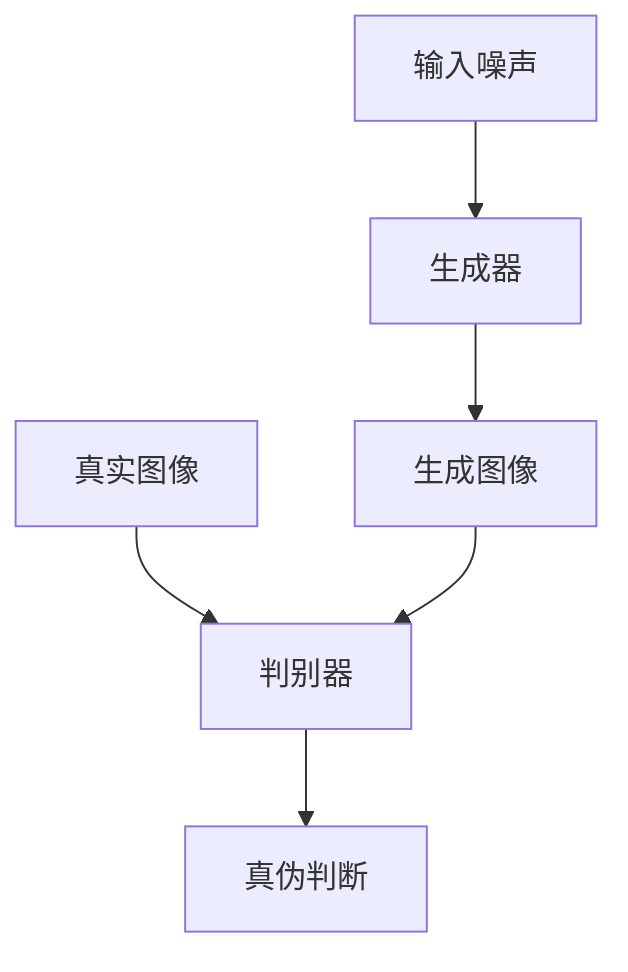
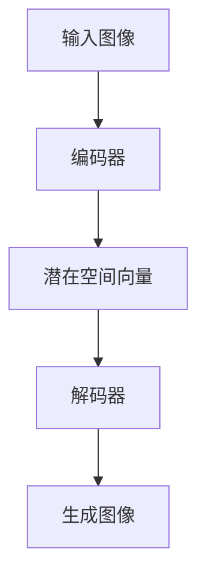
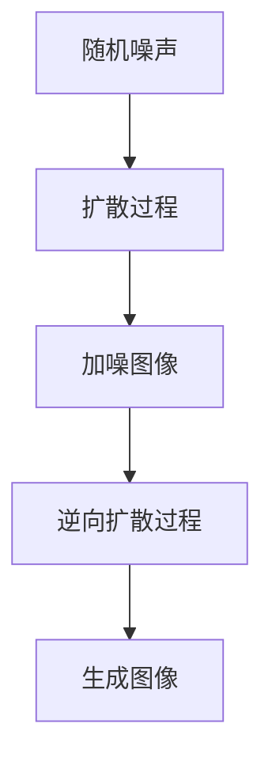

# 图像生成(Image Generation)原理与代码实战案例讲解

## 1.背景介绍

在当今科技飞速发展的时代,人工智能和机器学习技术已经渗透到了我们生活的方方面面。图像生成(Image Generation)作为人工智能领域的一个重要分支,近年来受到了广泛的关注和研究。随着算力的不断提升和数据量的激增,图像生成技术已经能够生成逼真、细腻的图像,在多个领域发挥着重要作用。

图像生成技术的应用范围广泛,包括计算机视觉、多媒体、娱乐、医疗等诸多领域。例如,在电影和游戏行业中,图像生成技术可以用于创建逼真的虚拟场景和角色;在医疗领域,它可以帮助生成病理图像,为医生诊断提供参考;在安全领域,图像生成技术可以用于人脸识别和目标检测等。

此外,图像生成技术还为艺术创作带来了新的可能性。艺术家可以利用这项技术生成具有独特风格的图像,探索新的艺术表现形式。同时,图像生成技术也为普通用户提供了一种便捷的图像创作工具,使他们能够根据自己的需求和想象力生成所需的图像。

## 2.核心概念与联系

图像生成技术的核心概念包括生成对抗网络(Generative Adversarial Networks,GAN)、变分自编码器(Variational Autoencoders,VAE)、扩散模型(Diffusion Models)等。这些概念虽然有所不同,但都旨在通过机器学习算法来生成逼真的图像。

### 2.1 生成对抗网络(GAN)

生成对抗网络(GAN)是一种基于深度学习的图像生成模型,由两个神经网络组成:生成器(Generator)和判别器(Discriminator)。生成器的目标是生成逼真的图像,而判别器则需要区分生成的图像和真实图像。通过两个网络的对抗训练,生成器不断优化,最终能够生成逼真的图像。

GAN的核心思想是建立一个minimax游戏,生成器和判别器相互对抗,直到达到一个纳什均衡。在这个过程中,生成器会不断提高生成图像的质量,而判别器也会不断提高区分真伪图像的能力。

### 2.2 变分自编码器(VAE)

变分自编码器(VAE)是另一种常用的图像生成模型。它由一个编码器(Encoder)和一个解码器(Decoder)组成。编码器将输入图像编码为一个潜在空间向量,而解码器则将这个潜在空间向量解码为图像。

VAE的关键在于,它通过引入变分推理(Variational Inference)的方法,使得潜在空间向量服从一个简单的先验分布(如高斯分布)。这样,我们就可以从先验分布中采样,并将采样的向量输入解码器,从而生成新的图像。

### 2.3 扩散模型(Diffusion Models)

扩散模型是一种新兴的图像生成模型,它通过逆向扩散过程生成图像。扩散过程是一个将图像逐步加噪的过程,而逆向扩散过程则是一个从噪声中恢复图像的过程。

扩散模型的优点在于,它可以生成高质量的图像,并且具有很强的灵活性和可控性。通过调整扩散过程的参数,我们可以控制生成图像的细节和风格。此外,扩散模型还可以利用条件信息(如文本描述)生成条件图像。

这些核心概念相互关联,共同推动了图像生成技术的发展。GAN擅长生成逼真的图像,但可控性较差;VAE可以通过潜在空间向量控制生成图像,但图像质量略差;扩散模型则兼具了生成高质量图像和良好可控性的优点。研究人员正在不断探索这些模型的融合和改进,以期获得更好的图像生成性能。

## 3.核心算法原理具体操作步骤

### 3.1 生成对抗网络(GAN)算法原理

生成对抗网络(GAN)的核心思想是通过两个神经网络(生成器和判别器)的对抗训练,使生成器能够生成逼真的图像。具体的算法原理如下:

1. **初始化**:初始化生成器G和判别器D的参数。

2. **生成器G的训练**:
   a. 从噪声先验分布(如高斯分布)中采样一个噪声向量z。
   b. 将噪声向量z输入生成器G,生成一个假图像G(z)。
   c. 计算判别器D对假图像G(z)的判别结果D(G(z))。
   d. 更新生成器G的参数,使得D(G(z))尽可能接近1,即让判别器尽可能将生成的图像判断为真实图像。

3. **判别器D的训练**:
   a. 从真实图像数据集中采样一批真实图像x。
   b. 从噪声先验分布中采样一批噪声向量z,并通过生成器G生成一批假图像G(z)。
   c. 计算判别器D对真实图像x和假图像G(z)的判别结果D(x)和D(G(z))。
   d. 更新判别器D的参数,使得D(x)尽可能接近1,D(G(z))尽可能接近0,即让判别器能够正确区分真实图像和生成图像。

4. **重复步骤2和3**,直到生成器G和判别器D达到一个纳什均衡,即生成器生成的图像足够逼真,以至于判别器无法区分真伪。

GAN的训练过程是一个动态的对抗游戏,生成器和判别器相互竞争,相互促进,最终达到一个平衡状态。这种对抗训练的思想是GAN算法的核心,也是它能够生成逼真图像的关键所在。

### 3.2 变分自编码器(VAE)算法原理

变分自编码器(VAE)的核心思想是将输入图像编码为一个潜在空间向量,然后从这个潜在空间向量中解码生成新的图像。具体的算法原理如下:

1. **编码器(Encoder)**:
   a. 将输入图像x输入编码器,得到一个潜在空间向量z的均值μ和方差σ^2,即z~N(μ,σ^2)。
   b. 从这个高斯分布中采样一个潜在空间向量z。

2. **解码器(Decoder)**:
   a. 将采样的潜在空间向量z输入解码器,生成一个重构图像x'。

3. **重构损失(Reconstruction Loss)**:
   a. 计算输入图像x和重构图像x'之间的重构损失,通常使用均方误差或者交叉熵损失。

4. **潜在空间正则化(Latent Space Regularization)**:
   a. 为了使潜在空间向量z服从简单的先验分布(如高斯分布),需要引入一个KL散度项,即KL(q(z|x)||p(z))。
   b. 这个KL散度项将编码器的潜在空间分布q(z|x)与先验分布p(z)之间的差异最小化。

5. **总损失(Total Loss)**:
   a. 将重构损失和KL散度项相加,得到VAE的总损失函数。
   b. 优化总损失函数,更新编码器和解码器的参数。

6. **生成新图像**:
   a. 从先验分布p(z)中采样一个潜在空间向量z。
   b. 将采样的z输入解码器,生成一个新的图像x'。

VAE的关键在于通过KL散度项约束潜在空间向量服从简单的先验分布,这样我们就可以从先验分布中采样,并将采样的向量输入解码器生成新的图像。同时,VAE还能够学习输入图像的潜在表示,有助于理解和操作图像的语义特征。

### 3.3 扩散模型(Diffusion Models)算法原理

扩散模型的核心思想是通过一个逆向扩散过程从噪声中恢复出图像。具体的算法原理如下:

1. **扩散过程(Forward Diffusion Process)**:
   a. 从数据分布中采样一个真实图像x_0。
   b. 通过一系列高斯噪声向量ε_t,将真实图像x_0逐步加噪,得到一系列加噪图像x_t。
   c. 最终得到一个纯噪声图像x_T,即完全丢失了原始图像的信息。

2. **逆向扩散过程(Reverse Diffusion Process)**:
   a. 从纯噪声图像x_T开始,通过一个神经网络模型(称为逆向扩散模型)逐步去噪,恢复出原始图像x_0。
   b. 在每一个时间步t,逆向扩散模型会根据当前的加噪图像x_t和时间步t,预测出一个去噪向量ε_theta,用于从x_t中去除噪声。
   c. 通过迭代地应用这个去噪过程,最终从纯噪声图像x_T恢复出原始图像x_0。

3. **训练逆向扩散模型**:
   a. 将真实图像x_0和对应的加噪图像x_t输入逆向扩散模型,让模型预测去噪向量ε_theta。
   b. 计算预测的去噪向量ε_theta与真实去噪向量ε_t之间的损失函数(如均方误差)。
   c. 优化损失函数,更新逆向扩散模型的参数。

4. **生成新图像**:
   a. 从纯噪声图像x_T开始,使用训练好的逆向扩散模型进行逆向扩散过程。
   b. 经过多次迭代,最终得到一个新的图像x_0'。

扩散模型的优点在于,它可以生成高质量的图像,并且具有很强的灵活性和可控性。通过调整扩散过程的参数,我们可以控制生成图像的细节和风格。此外,扩散模型还可以利用条件信息(如文本描述)生成条件图像。

## 4.数学模型和公式详细讲解举例说明

### 4.1 生成对抗网络(GAN)数学模型

生成对抗网络(GAN)的数学模型可以表示为一个minimax游戏,目标是找到一个纳什均衡点,使得生成器G和判别器D都达到最优。具体的数学表达式如下:

$$\min_G \max_D V(D,G) = \mathbb{E}_{x\sim p_{data}(x)}[\log D(x)] + \mathbb{E}_{z\sim p_z(z)}[\log(1-D(G(z)))]$$

其中:
- $G$是生成器网络,将噪声向量$z$映射到图像空间,生成假图像$G(z)$。
- $D$是判别器网络,输入真实图像$x$或生成图像$G(z)$,输出一个标量值$D(x)$或$D(G(z))$,表示输入图像为真实图像的概率。
- $p_{data}(x)$是真实图像数据的分布。
- $p_z(z)$是噪声先验分布,通常为高斯分布或均匀分布。

上式的第一项$\mathbb{E}_{x\sim p_{data}(x)}[\log D(x)]$表示对于真实图像$x$,最大化判别器$D$输出的概率。第二项$\mathbb{E}_{z\sim p_z(z)}[\log(1-D(G(z)))]$表示对于生成器生成的假图像$G(z)$,最小化判别器$D$输出的概率。

通过交替优化生成器$G$和判别器$D$,最终达到一个纳什均衡点,使得生成器$G$生成的图像足够逼真,以至于判别器$D$无法区分真伪。在这个过程中,生