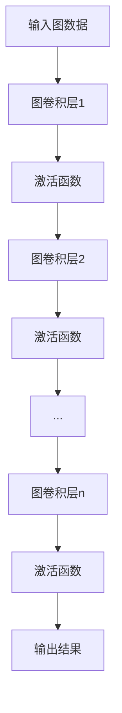

# 图卷积网络(GCN)原理与代码实战案例讲解

## 1.背景介绍

### 1.1 图数据的重要性

在现实世界中,存在着大量的数据可以用图的形式来表示和建模。例如社交网络、蛋白质互作网络、交通网络、知识图谱等,这些数据都可以被抽象为节点和边的形式。与传统的结构化数据(如表格)和非结构化数据(如文本、图像)不同,图数据能够自然地捕获实体之间的复杂关系和拓扑结构信息。

图数据广泛存在于各个领域,对于科学研究和商业应用都具有重要意义。比如在社交网络中,图可以表示用户之间的好友关系;在生物信息学中,图可以表示蛋白质之间的相互作用;在交通领域,图可以表示道路网络。因此,能够高效地处理和分析图数据对于许多领域都是至关重要的。

### 1.2 图数据挑战

然而,由于图数据的特殊性质,传统的机器学习算法并不能直接应用于图数据的处理和分析。主要的挑战包括:

1. **非欧几里德数据**:图数据是非欧几里德结构,无法直接应用在欧几里得空间中设计的机器学习模型,如卷积神经网络(CNN)等。
2. **可变尺寸**:图的节点数和边的数量是可变的,这与大多数机器学习模型所需的固定尺寸输入数据格格不入。
3. **组合泛化**:机器学习模型需要能够很好地推广到新的、从未见过的图结构,这对于图数据来说是一个巨大的挑战。

为了解决这些挑战,研究人员提出了专门针对图数据的机器学习模型,其中最著名和最成功的就是图卷积网络(Graph Convolutional Network, GCN)。

## 2.核心概念与联系

### 2.1 图神经网络概述

图神经网络(Graph Neural Network, GNN)是一种将深度学习模型推广到图数据上的有效方法。它能够直接处理图结构数据,并学习节点之间的关系和表示。GNN的基本思想是将节点的特征向量与其邻居节点的特征向量进行聚合,从而获得新的节点表示。通过多层聚合操作,GNN可以捕获图中节点的局部和全局拓扑结构信息。

图卷积网络(GCN)是GNN家族中最简单、最流行的一种变体。它借鉴了卷积神经网络(CNN)在处理网格结构数据(如图像)中的成功,将卷积操作推广到了非欧几里得数据(如图)上。

### 2.2 GCN基本概念

GCN的核心思想是通过聚合节点及其邻居节点的特征向量来更新节点的表示。具体来说,GCN包含以下几个关键概念:

1. **节点特征向量(Node Feature Vector)**: 每个节点都有一个对应的特征向量,用于描述该节点的属性。
2. **邻接矩阵(Adjacency Matrix)**: 用于表示图中节点之间的连接关系。
3. **图卷积(Graph Convolution)**: 在GCN中,卷积操作是通过聚合每个节点及其邻居节点的特征向量来实现的。
4. **层级传播(Layer-wise Propagation)**: GCN通过多层卷积操作,逐层更新和传播节点表示,捕获图中的局部和全局拓扑结构信息。

GCN的优势在于它能够直接处理任意结构的图数据,并学习节点的低维向量表示,这些向量表示能够很好地捕获图中节点的结构信息和语义信息。GCN已被广泛应用于节点分类、链接预测、图嵌入等各种图数据挖掘任务中。

### 2.3 GCN与CNN的联系

尽管GCN和CNN在处理的数据结构上存在差异(CNN处理的是欧几里得数据如图像,而GCN处理的是非欧几里得数据如图),但它们在本质上都是通过聚合局部邻域信息来更新中心节点/像素的表示。

具体来说,CNN中的卷积操作是在像素及其局部邻域上进行的,通过滤波器权重与邻域像素值的加权求和来获得新的像素值。而GCN中的图卷积操作则是在节点及其邻居节点上进行的,通过聚合中心节点及其邻居节点的特征向量来获得新的节点表示。

因此,从这个角度来看,GCN可以被视为CNN在非欧几里得数据(图)上的推广和扩展。这种联系不仅有助于我们从CNN的成功中获得启发,也为将CNN中的一些成熟技术(如残差连接、注意力机制等)引入GCN提供了思路。

## 3.核心算法原理具体操作步骤

### 3.1 图卷积网络架构

一个典型的图卷积网络(GCN)由多层图卷积层组成,每一层的输出都会作为下一层的输入。GCN的基本架构如下所示:

每一层的图卷积操作都可以看作是一种特殊的空间卷积,它在图的拓扑结构上对节点特征进行聚合和更新。具体来说,第l层的图卷积操作可以表示为:

$$H^{(l+1)} = \sigma\left(\tilde{D}^{-\frac{1}{2}}\tilde{A}\tilde{D}^{-\frac{1}{2}}H^{(l)}W^{(l)}\right)$$

其中:

- $H^{(l)}$是第l层的节点特征矩阵,每一行对应一个节点的特征向量。
- $\tilde{A} = A + I_N$是图的邻接矩阵$A$加上单位矩阵$I_N$,这样可以确保节点自身的特征也会被考虑。
- $\tilde{D}$是$\tilde{A}$的度矩阵(Degree Matrix),用于归一化。
- $W^{(l)}$是第l层的可训练权重矩阵。
- $\sigma$是非线性激活函数,如ReLU。

这个公式描述了GCN在每一层是如何通过聚合邻居节点的特征来更新中心节点的表示的。通过多层卷积操作,GCN可以逐步捕获图中节点的局部和全局拓扑结构信息。

### 3.2 层级传播规则

在GCN中,节点表示是通过层级传播的方式逐层更新和传播的。具体来说,在第l层,每个节点的表示$h_i^{(l)}$是通过聚合其自身的表示$h_i^{(l-1)}$以及邻居节点的表示$h_j^{(l-1)}$来获得的,即:

$$h_i^{(l)} = \sigma\left(\sum_{j\in\mathcal{N}(i)\cup\{i\}}c_{ij}W^{(l)}h_j^{(l-1)}\right)$$

其中:

- $\mathcal{N}(i)$表示节点$i$的邻居节点集合。
- $c_{ij}$是一个归一化系数,用于平衡不同节点的邻居数量。
- $W^{(l)}$是第l层的可训练权重矩阵。
- $\sigma$是非线性激活函数。

通过这种层级传播机制,GCN可以逐步整合图中节点的局部和全局拓扑结构信息,最终获得节点的低维向量表示。

### 3.3 GCN训练过程

GCN的训练过程与传统的神经网络模型类似,通过反向传播算法优化模型参数。具体步骤如下:

1. **输入数据**: 将图数据(包括节点特征矩阵$X$和邻接矩阵$A$)输入到GCN模型中。
2. **前向传播**: 根据GCN的层级传播规则,逐层计算节点的表示$H^{(l)}$,直到获得最终的输出$H^{(L)}$。
3. **计算损失**: 根据任务目标(如节点分类、链接预测等),计算输出$H^{(L)}$与真实标签之间的损失函数$\mathcal{L}$。
4. **反向传播**: 通过反向传播算法,计算损失函数$\mathcal{L}$相对于各层权重矩阵$W^{(l)}$的梯度。
5. **权重更新**: 使用优化算法(如梯度下降)根据计算得到的梯度,更新各层权重矩阵$W^{(l)}$。
6. **重复步骤2-5**: 重复前向传播、计算损失、反向传播和权重更新的过程,直到模型收敛或达到最大迭代次数。

通过上述训练过程,GCN可以学习到能够很好地捕获图拓扑结构信息的节点表示,从而完成下游任务(如节点分类、链接预测等)。

## 4.数学模型和公式详细讲解举例说明

在上一节中,我们介绍了GCN的基本原理和核心算法步骤。现在,让我们深入探讨GCN中使用的数学模型和公式,并通过具体示例来加深理解。

### 4.1 图卷积公式推导

回顾一下GCN中图卷积操作的核心公式:

$$H^{(l+1)} = \sigma\left(\tilde{D}^{-\frac{1}{2}}\tilde{A}\tilde{D}^{-\frac{1}{2}}H^{(l)}W^{(l)}\right)$$

这个公式是如何推导出来的呢?我们从最基本的思想开始推导。

在GCN中,我们希望通过聚合每个节点及其邻居节点的特征来更新该节点的表示。具体来说,对于节点$i$,我们可以将其特征向量$h_i^{(l)}$更新为:

$$h_i^{(l+1)} = \sigma\left(\sum_{j\in\mathcal{N}(i)\cup\{i\}}c_{ij}W^{(l)}h_j^{(l)}\right)$$

其中:

- $\mathcal{N}(i)$表示节点$i$的邻居节点集合。
- $c_{ij}$是一个归一化系数,用于平衡不同节点的邻居数量。
- $W^{(l)}$是第l层的可训练权重矩阵。
- $\sigma$是非线性激活函数。

为了将上式写成矩阵形式,我们引入邻接矩阵$A$和度矩阵$D$。具体来说,令$A_{ij} = 1$表示节点$i$和$j$之间有边相连,否则$A_{ij} = 0$。度矩阵$D$是一个对角矩阵,其中$D_{ii} = \sum_jA_{ij}$,表示节点$i$的度数(邻居数量)。

接下来,我们定义归一化邻接矩阵$\tilde{A} = D^{-\frac{1}{2}}AD^{-\frac{1}{2}}$。这种归一化方式可以防止梯度在训练过程中发散,提高模型的稳定性和收敛速度。

将上述元素代入矩阵形式,我们可以得到:

$$H^{(l+1)} = \sigma\left(\tilde{A}H^{(l)}W^{(l)}\right)$$

然而,这种形式仍然存在一个问题:它没有考虑到节点自身的特征。为了解决这个问题,我们引入自环(Self-Loop),即在邻接矩阵$A$中加上单位矩阵$I_N$,得到$\tilde{A} = A + I_N$。这样,每个节点不仅会聚合邻居节点的特征,还会考虑自身的特征。

将自环引入后,我们就得到了最终的图卷积公式:

$$H^{(l+1)} = \sigma\left(\tilde{D}^{-\frac{1}{2}}\tilde{A}\tilde{D}^{-\frac{1}{2}}H^{(l)}W^{(l)}\right)$$

其中,$\tilde{D}$是$\tilde{A}$的度矩阵,用于进一步归一化。

通过上述推导,我们可以看到,G