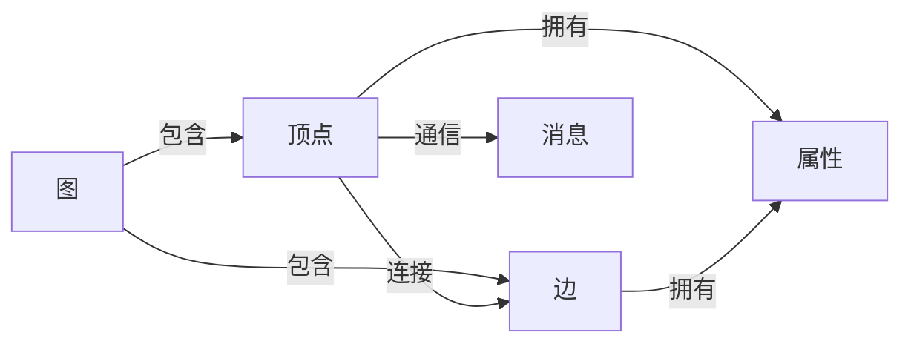

## 1.背景介绍

在处理大规模图形数据时，传统的数据处理方法往往无法满足需求。图计算引擎作为一种专门处理图形数据的高效工具，应运而生。

图计算引擎是一种专门为处理图形数据而设计的计算框架。它可以高效地处理大规模的图形数据，提供强大的并行计算能力，帮助用户解决复杂的图形计算问题。

## 2.核心概念与联系

图计算引擎的核心概念包括图（Graph）、顶点（Vertex）、边（Edge）、属性（Property）和消息（Message）。

- **图（Graph）**：图是由顶点和边组成的数据结构，可以用来表示实体之间的关系。
- **顶点（Vertex）**：顶点是图的基本组成单位，表示实体。
- **边（Edge）**：边连接顶点，表示实体之间的关系。
- **属性（Property）**：顶点和边都可以拥有属性，用来存储与实体或关系相关的信息。
- **消息（Message）**：在图计算过程中，顶点之间通过消息进行通信。

这些概念之间的关系可以用以下的 Mermaid 流程图表示：



## 3.核心算法原理具体操作步骤

图计算引擎的核心算法是基于消息传递的迭代计算模型。其基本操作步骤如下：

1. **初始化**：为每个顶点设置初始值。
2. **迭代计算**：在每一轮迭代中，每个顶点都会收到其邻居顶点发送的消息，根据收到的消息和自身的状态，计算新的状态值，并将新的状态值发送给其邻居顶点。
3. **终止条件**：当满足某个终止条件（例如，达到最大迭代次数，或所有顶点的状态值都不再改变）时，停止迭代。

## 4.数学模型和公式详细讲解举例说明

图计算的数学模型主要基于图论。在图论中，图可以表示为 $G = (V, E)$，其中 $V$ 是顶点集，$E$ 是边集。

图计算的一个重要任务是计算顶点的状态值。这个过程可以表示为一个函数 $f$，对于每个顶点 $v \in V$，有：

$$
v_{new} = f(v, M(v))
$$

其中 $v_{new}$ 是顶点 $v$ 的新状态值，$M(v)$ 是顶点 $v$ 收到的所有消息的集合。

## 5.项目实践：代码实例和详细解释说明

下面以一个简单的图计算项目为例，介绍如何使用图计算引擎实现 PageRank 算法。

首先，我们需要定义图的结构和初始状态。在这个例子中，图的顶点表示网页，边表示网页之间的链接，顶点的状态值表示网页的 PageRank 值。

```python
# 定义图的结构
G = Graph()

# 添加顶点和边
G.add_vertex('A')
G.add_vertex('B')
G.add_vertex('C')
G.add_edge('A', 'B')
G.add_edge('B', 'C')
G.add_edge('C', 'A')

# 设置初始状态
for v in G.vertices:
    v.value = 1.0 / len(G.vertices)
```

接下来，我们定义迭代计算的过程。在每一轮迭代中，每个顶点都会将其状态值平均分配给其邻居顶点。

```python
# 定义迭代计算过程
for i in range(MAX_ITER):
    # 发送消息
    for v in G.vertices:
        msg = v.value / len(v.neighbors)
        for neighbor in v.neighbors:
            neighbor.receive(msg)

    # 更新状态
    for v in G.vertices:
        v.value = sum(v.messages)

    # 清空消息
    for v in G.vertices:
        v.messages.clear()
```

最后，我们可以输出每个顶点的 PageRank 值。

```python
# 输出结果
for v in G.vertices:
    print(f'{v.id}: {v.value}')
```

## 6.实际应用场景

图计算引擎在许多实际应用中都发挥了重要作用。例如，社交网络分析、推荐系统、网络科学、生物信息学、物理学等领域都有广泛的应用。

## 7.工具和资源推荐

目前，有许多优秀的图计算引擎可以供大家选择，例如 Apache Giraph、Google Pregel、GraphX 等。这些工具都提供了丰富的功能和良好的性能，可以帮助你更好地进行图计算。

## 8.总结：未来发展趋势与挑战

随着大数据和人工智能的发展，图计算的应用越来越广泛，未来有着巨大的发展潜力。然而，图计算也面临着一些挑战，例如如何处理大规模的图数据，如何提高计算效率，如何设计更好的算法等。

## 9.附录：常见问题与解答

1. **问题**：图计算引擎和传统的数据库有什么区别？
   **答案**：图计算引擎是专门为处理图形数据而设计的计算框架，提供了强大的并行计算能力和丰富的图形计算算法，而传统的数据库更多的是用来存储和查询数据。

2. **问题**：图计算引擎适用于哪些场景？
   **答案**：图计算引擎适用于处理大规模的图形数据，常见的应用场景包括社交网络分析、推荐系统、网络科学、生物信息学、物理学等。

3. **问题**：如何选择合适的图计算引擎？
   **答案**：选择图计算引擎时，可以考虑以下几个因素：支持的功能、性能、易用性、社区支持等。

作者：禅与计算机程序设计艺术 / Zen and the Art of Computer Programming