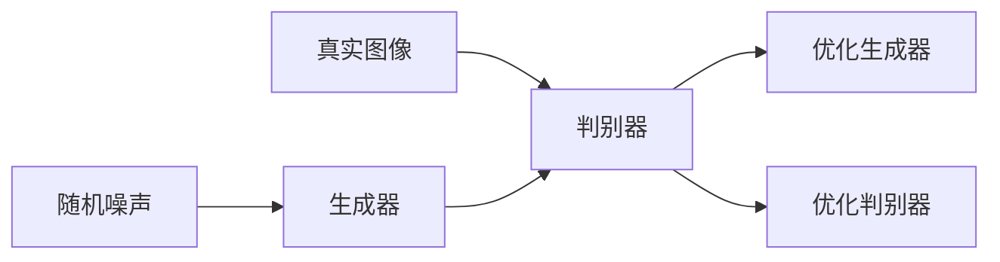

# 基于生成对抗网络的动态漫画风格图像转换研究

## 1. 背景介绍
随着人工智能技术的飞速发展，图像处理领域已经取得了令人瞩目的成就。特别是生成对抗网络（GANs）的出现，极大地推动了图像生成、风格迁移等研究的进展。动态漫画风格图像转换作为一种新兴的艺术形式，它不仅能够为用户提供个性化的漫画创作工具，还能在电影、游戏和虚拟现实等领域有着广泛的应用前景。

## 2. 核心概念与联系
生成对抗网络（GANs）由生成器（Generator）和判别器（Discriminator）两部分组成。生成器负责生成图像，而判别器则负责区分图像是真实的还是由生成器生成的。通过这种对抗的方式，生成器和判别器不断地进行优化，最终生成器能够生成高质量的图像。

## 3. 核心算法原理具体操作步骤
GANs的训练过程可以分为以下几个步骤：
1. 随机生成噪声数据。
2. 生成器根据噪声数据生成图像。
3. 判别器评估真实图像和生成图像。
4. 生成器和判别器根据判别结果进行优化。



## 4. 数学模型和公式详细讲解举例说明
GANs的核心是通过最小化最大化问题来训练生成器和判别器，即：

$$
\min_G \max_D V(D, G) = \mathbb{E}_{x\sim p_{data}(x)}[\log D(x)] + \mathbb{E}_{z\sim p_z(z)}[\log(1 - D(G(z)))]
$$

其中，$G$ 表示生成器，$D$ 表示判别器，$p_{data}$ 是真实数据的分布，$p_z$ 是生成器输入的噪声分布。

## 5. 项目实践：代码实例和详细解释说明
以下是一个简单的GANs代码示例，使用Python和TensorFlow实现：

```python
import tensorflow as tf

# 生成器网络结构
def generator(z, reuse=None):
    with tf.variable_scope('gen', reuse=reuse):
        # 网络结构代码
        pass

# 判别器网络结构
def discriminator(X, reuse=None):
    with tf.variable_scope('dis', reuse=reuse):
        # 网络结构代码
        pass

# 定义输入占位符
z = tf.placeholder(tf.float32, shape=[None, 100])
X = tf.placeholder(tf.float32, shape=[None, 28, 28, 1])

# 生成器和判别器模型
G = generator(z)
D_output_real, D_logits_real = discriminator(X)
D_output_fake, D_logits_fake = discriminator(G, reuse=True)

# 损失函数和优化器代码
# ...

# 训练代码
# ...
```

## 6. 实际应用场景
动态漫画风格图像转换在以下场景中有着广泛的应用：
- 个性化漫画创作
- 动画电影的制作
- 游戏角色设计
- 虚拟现实环境的构建

## 7. 工具和资源推荐
- TensorFlow：一个开源的机器学习框架，适合进行GANs的研究和开发。
- PyTorch：另一个流行的开源机器学习库，易于使用且灵活。
- NVIDIA CUDA：用于GPU加速的并行计算平台和编程模型，可以显著提高GANs的训练速度。

## 8. 总结：未来发展趋势与挑战
动态漫画风格图像转换作为一种新兴技术，它的发展趋势是向着更高的图像质量、更快的转换速度和更广泛的应用场景发展。然而，这一领域仍然面临着如何提高生成图像的真实性、降低训练成本和避免模式崩溃等挑战。

## 9. 附录：常见问题与解答
Q1: GANs训练过程中的模式崩溃是什么？
A1: 模式崩溃是指在GANs训练过程中，生成器开始生成非常相似或完全相同的输出，导致多样性丧失。

Q2: 如何评价生成图像的质量？
A2: 通常使用Inception Score（IS）或Fréchet Inception Distance（FID）等指标来评价生成图像的质量。

作者：禅与计算机程序设计艺术 / Zen and the Art of Computer Programming