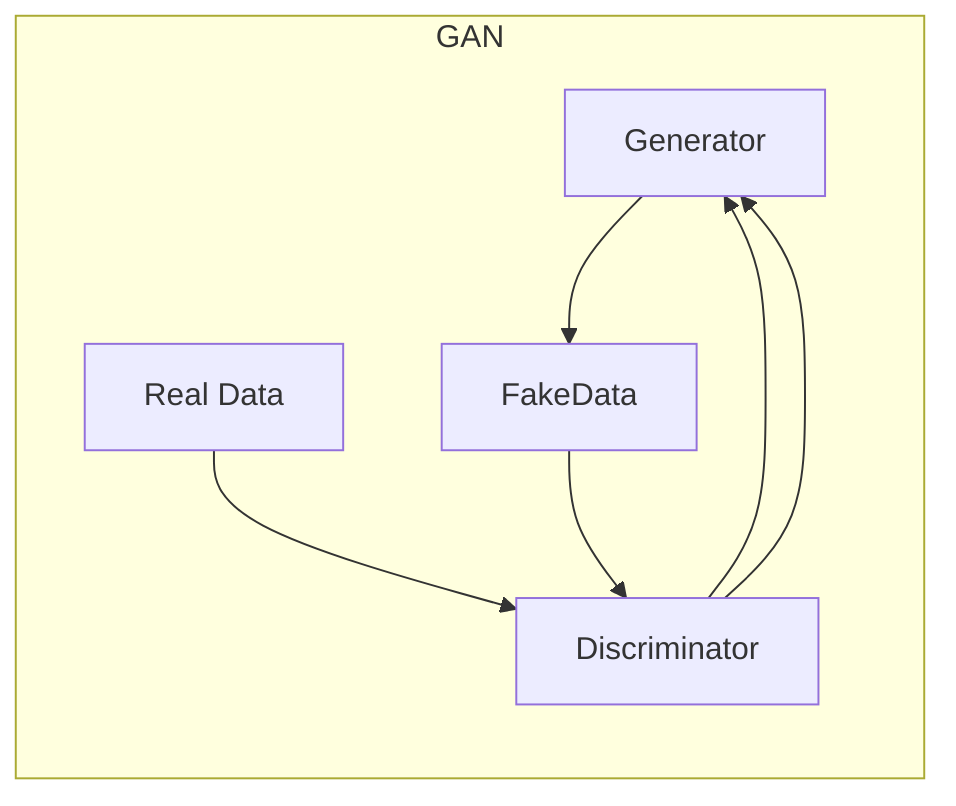
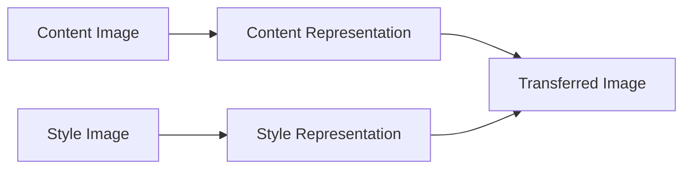
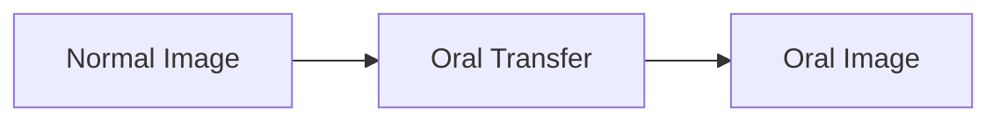
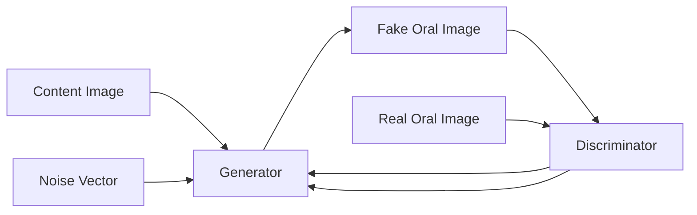

# 基于生成对抗网络的口语化图片表达风格迁移技术

## 1.背景介绍

### 1.1 图像风格迁移的重要性

在当今视觉计算和多媒体应用的时代,图像处理技术扮演着越来越重要的角色。图像风格迁移是一种将现有图像的风格迁移到另一幅图像上的技术,广泛应用于图像编辑、视觉增强、艺术创作等领域。传统的图像风格迁移方法通常需要大量的人工干预和专业技能,效率低下且成本高昂。

随着深度学习技术的不断发展,基于生成对抗网络(Generative Adversarial Networks, GANs)的图像风格迁移技术应运而生,为自动化、高效的风格迁移提供了新的解决方案。该技术能够自动捕获图像的内容和风格特征,并将它们合成出新的图像,极大地提高了图像处理的效率和质量。

### 1.2 口语化图片表达的需求

在社交媒体、在线教育等领域,口语化的图片表达方式越来越受欢迎。与正式的文字描述相比,口语化的图片表达更加生动形象、亲和力强,能够吸引用户的注意力并增强内容的感染力。然而,手工制作口语化图片需要耗费大量的人力和时间,效率低下。

基于生成对抗网络的口语化图片表达风格迁移技术,能够自动将普通图片转换为口语化风格,满足了这一迫切需求。该技术通过学习口语化图片的特征,将其迁移到目标图像上,生成新的口语化图片表达,大大提高了制作效率。

## 2.核心概念与联系  

### 2.1 生成对抗网络(GANs)

生成对抗网络是一种由Generator(生成器)和Discriminator(判别器)组成的深度神经网络架构。生成器的目标是生成逼真的数据(如图像),而判别器则旨在区分生成的数据和真实数据。两者相互对抗,不断优化,最终达到生成器生成的数据无法被判别器识别为假的状态。



### 2.2 风格迁移

风格迁移是指将一幅图像的风格迁移到另一幅图像上的过程。通常包括两个步骤:

1. 内容表示:提取图像的内容特征,保留目标图像的内容信息。
2. 风格表示:提取风格参考图像的风格特征,并将其应用到目标图像上。



### 2.3 口语化图片表达

口语化图片表达是指使用口语化的文字、符号或图案来表达图片内容,让图片更加生动、形象、亲和力强。常见的口语化图片表达形式包括:

- 使用口语化的文字注释或对白
- 添加表情符号、手绘元素等
- 采用卡通画风或漫画风格



通过将这三个概念结合,我们可以利用生成对抗网络实现自动的口语化图片表达风格迁移,将普通图片转换为富有个性化、口语化风格的图片表达。

## 3.核心算法原理具体操作步骤

基于生成对抗网络的口语化图片表达风格迁移技术的核心算法原理可以概括为以下几个步骤:

### 3.1 数据准备

首先需要准备两类数据集:

1. **内容图像数据集**:包含需要进行风格迁移的普通图像。
2. **风格参考数据集**:包含具有口语化风格的图像,用于提取风格特征。

这两类数据集需要经过预处理,如裁剪、调整大小等,以满足模型的输入要求。

### 3.2 提取内容特征和风格特征

使用预训练的卷积神经网络(如VGG)作为特征提取器,从内容图像和风格参考图像中分别提取内容特征和风格特征。

内容特征通常来自网络的较高层,能够很好地表示图像的语义内容信息。而风格特征则来自网络的较低层,能够捕获图像的纹理、颜色、笔触等风格信息。

### 3.3 构建生成对抗网络

构建生成对抗网络架构,包括生成器(Generator)和判别器(Discriminator)两个子网络:

1. **生成器(Generator)**: 输入为内容图像和噪声向量,输出为风格迁移后的图像。生成器的目标是生成逼真的口语化风格图像,以欺骗判别器。
2. **判别器(Discriminator)**: 输入为真实的口语化风格图像或生成器生成的图像,输出为真实/假的概率分数。判别器的目标是正确区分真实图像和生成图像。

生成器和判别器相互对抗,不断优化,最终达到生成器生成的图像无法被判别器识别为假的状态。



### 3.4 训练生成对抗网络

在训练过程中,生成器和判别器交替优化,互相对抗:

1. **训练判别器**:固定生成器的参数,使用真实的口语化风格图像和生成器生成的假图像训练判别器,目标是最大化判别器正确分类真实/假图像的能力。
2. **训练生成器**:固定判别器的参数,使用内容图像和噪声向量训练生成器,目标是最小化判别器识别生成图像为假的能力,即生成更加逼真的口语化风格图像。

通过多次迭代,生成器和判别器不断提高,最终达到生成器生成的图像无法被判别器识别为假的状态。

### 3.5 风格迁移和口语化表达

在训练完成后,我们可以利用训练好的生成器进行实际的风格迁移和口语化表达:

1. 输入目标内容图像和噪声向量到生成器。
2. 生成器将内容图像的内容特征与提取的口语化风格特征相结合,生成新的口语化风格图像。
3. 输出的图像即为经过风格迁移和口语化表达处理后的结果。

通过这种方式,我们可以自动、高效地将普通图像转换为富有个性化、口语化风格的图像表达。

## 4.数学模型和公式详细讲解举例说明

在基于生成对抗网络的口语化图片表达风格迁移技术中,数学模型和公式扮演着重要的角色,用于量化内容特征、风格特征,并将它们融合到生成的图像中。

### 4.1 内容损失

内容损失是用于保留目标图像内容信息的损失函数,通常采用预训练的卷积神经网络(如VGG)提取特征,计算目标图像和生成图像在相应层的特征差异:

$$L_{content}(p, x, g) = \frac{1}{2} \sum_{i,j} (F_{ij}^l(x) - F_{ij}^l(g))^2$$

其中:
- $p$: 风格参考图像
- $x$: 目标内容图像
- $g$: 生成的图像
- $F_{ij}^l(x)$: 图像$x$在第$l$层的特征图上的$(i,j)$位置的激活值

通过最小化内容损失,可以确保生成图像保留了目标内容图像的内容信息。

### 4.2 风格损失

风格损失是用于迁移风格参考图像的风格特征到生成图像的损失函数,通常基于格拉姆矩阵(Gram Matrix)计算:

$$L_{style}(p, g) = \sum_l w_l E_l$$

$$E_l = \frac{1}{4N_l^2M_l^2} \sum_{i,j} (G_{ij}^l - A_{ij}^l)^2$$

其中:
- $p$: 风格参考图像
- $g$: 生成的图像
- $G_{ij}^l$: 风格参考图像$p$在第$l$层的格拉姆矩阵
- $A_{ij}^l$: 生成图像$g$在第$l$层的格拉姆矩阵
- $N_l$: 第$l$层特征图的高度
- $M_l$: 第$l$层特征图的宽度
- $w_l$: 第$l$层的权重系数

格拉姆矩阵能够捕获图像的纹理、颜色、笔触等风格信息,通过最小化风格损失,可以将风格参考图像的风格特征迁移到生成图像上。

### 4.3 对抗损失

对抗损失是生成对抗网络中生成器和判别器相互对抗的损失函数,用于生成逼真的图像并提高判别器的判别能力。

对于生成器,目标是最小化判别器识别生成图像为假的能力:

$$L_{G} = \mathbb{E}_{z \sim p_z(z)}[log(1 - D(G(z)))]$$

其中:
- $z$: 噪声向量
- $p_z(z)$: 噪声向量的分布
- $G(z)$: 生成器生成的图像
- $D(G(z))$: 判别器对生成图像的真实性评分

对于判别器,目标是最大化正确分类真实图像和生成图像的能力:

$$L_{D} = \mathbb{E}_{x \sim p_{data}(x)}[log(D(x))] + \mathbb{E}_{z \sim p_z(z)}[log(1 - D(G(z)))]$$

其中:
- $x$: 真实图像
- $p_{data}(x)$: 真实图像的分布

通过交替优化生成器和判别器,最终达到生成器生成的图像无法被判别器识别为假的状态,从而实现高质量的风格迁移和口语化表达。

### 4.4 总体损失函数

将上述三个损失函数结合,我们可以得到总体损失函数:

$$L_{total}(p, x, g) = \alpha L_{content}(p, x, g) + \beta L_{style}(p, g) + \gamma L_{G}$$

其中:
- $\alpha$、$\beta$、$\gamma$: 分别为内容损失、风格损失和对抗损失的权重系数,用于平衡三者的贡献。

在训练过程中,我们需要同时最小化总体损失函数,以实现内容保留、风格迁移和生成逼真图像的目标。

通过优化这一总体损失函数,我们可以成功地将目标内容图像的内容特征与风格参考图像的口语化风格特征相结合,生成出新的具有口语化表达风格的图像。

## 5.项目实践:代码实例和详细解释说明

为了更好地理解基于生成对抗网络的口语化图片表达风格迁移技术,我们将提供一个实际的项目实践示例,包括代码实现和详细解释。

### 5.1 环境配置

首先,我们需要配置Python开发环境,安装必要的库和依赖项:

```bash
# 创建虚拟环境
python -m venv venv
source venv/bin/activate

# 安装依赖库
pip install torch torchvision
pip install matplotlib
pip install Pillow
```

### 5.2 数据准备

我们将使用两个数据集:

1. **内容图像数据集**:包含需要进行风格迁移的普通图像,如风景照片、人物肖像等。
2. **风格参考数据集**:包含具有口语化风格的图像,如手绘漫画、表情符号等。

这两个数据集需要进行预处理,如裁剪、调整大小等