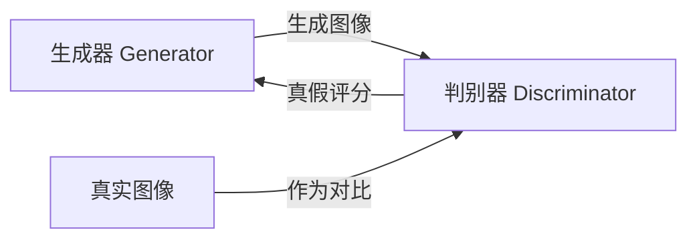
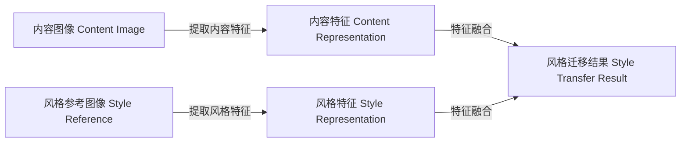
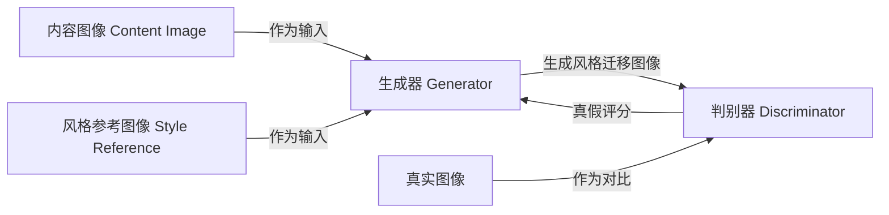
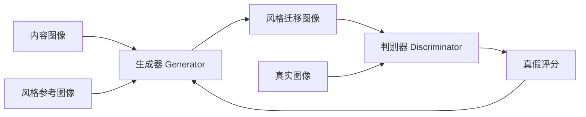

# 基于生成对抗网络的图像风格迁移在广告设计中的应用

## 1.背景介绍

### 1.1 图像风格迁移的概念

图像风格迁移是一种将一种图像的风格迁移到另一种图像上的技术。它可以将一幅艺术画作的风格应用到一张照片上,或者将一张照片的风格应用到另一张照片上。这种技术在计算机视觉和图像处理领域有着广泛的应用,如数字艺术创作、图像增强、视频处理等。

### 1.2 广告设计中的应用价值 

在广告设计领域,图像风格迁移技术可以为广告创意注入新的活力。通过将特定的艺术风格或独特的视觉效果应用到产品图像上,可以吸引消费者的注意力,增强品牌识别度,并传达独特的品牌个性。此外,图像风格迁移还可以用于个性化广告设计,根据不同目标受众的喜好调整图像风格,提高广告的有效性。

### 1.3 生成对抗网络在图像风格迁移中的作用

生成对抗网络(Generative Adversarial Networks, GANs)是一种强大的深度学习模型,它可以通过对抗训练生成逼真的图像。在图像风格迁移任务中,GANs可以学习图像内容和风格的表示,并生成新的图像,将源图像的内容与目标风格相结合。相比于传统的基于优化的风格迁移方法,基于GANs的方法可以产生更加自然、细腻的结果,并具有更好的可扩展性。

## 2.核心概念与联系

### 2.1 生成对抗网络(GANs)

生成对抗网络是一种由生成器(Generator)和判别器(Discriminator)组成的深度学习架构。生成器的目标是生成逼真的样本数据(如图像),以欺骗判别器;而判别器的目标是区分生成器生成的样本和真实数据。通过这种对抗训练过程,生成器和判别器相互博弈,最终使生成器能够生成逼真的数据。



### 2.2 风格迁移的核心思想

风格迁移的核心思想是将一幅图像的内容(Content)与另一种风格(Style)相结合。具体来说,就是从内容图像中提取内容特征,从风格参考图像中提取风格特征,然后将这两种特征融合,生成一幅新的图像,使其保留了内容图像的内容,同时具有风格参考图像的风格。



### 2.3 GANs在风格迁移中的应用

在基于GANs的图像风格迁移方法中,生成器的目标是生成具有目标风格的图像,而判别器的目标是区分生成的图像和真实图像。通过对抗训练,生成器可以学习如何将内容图像的内容与风格参考图像的风格相结合,从而生成风格迁移的结果图像。



这种基于GANs的方法相比传统的基于优化的方法,可以产生更加自然、细腻的风格迁移结果,并具有更好的可扩展性和灵活性。

## 3.核心算法原理具体操作步骤

基于生成对抗网络的图像风格迁移算法通常包括以下几个主要步骤:

### 3.1 数据准备

首先需要准备好内容图像和风格参考图像。内容图像是我们希望保留其内容的图像,而风格参考图像则提供了我们希望迁移的风格。

### 3.2 网络架构设计

设计生成器和判别器的网络架构。生成器通常采用编码器-解码器结构,用于生成风格迁移后的图像。判别器则用于区分生成的图像和真实图像。



### 3.3 特征提取

从内容图像中提取内容特征,从风格参考图像中提取风格特征。这通常使用预训练的卷积神经网络(如VGG)来完成。

### 3.4 特征融合

将内容特征和风格特征融合,作为生成器的输入,生成风格迁移后的图像。

### 3.5 对抗训练

对生成器和判别器进行对抗训练。生成器的目标是生成逼真的风格迁移图像,以欺骗判别器;判别器的目标是区分生成的图像和真实图像。通过这种对抗训练过程,生成器可以不断提高生成图像的质量。

### 3.6 损失函数设计

设计合适的损失函数,包括对抗损失、内容损失和风格损失等,以指导生成器生成具有目标内容和风格的图像。

### 3.7 模型训练和优化

使用优化算法(如Adam)对生成器和判别器进行训练,最小化损失函数,直到模型收敛。

### 3.8 风格迁移结果生成

使用训练好的生成器,将内容图像和风格参考图像输入,生成风格迁移后的结果图像。

## 4.数学模型和公式详细讲解举例说明

在基于生成对抗网络的图像风格迁移算法中,通常会使用以下数学模型和公式:

### 4.1 对抗损失

对抗损失是生成对抗网络的核心损失函数,用于指导生成器生成逼真的图像,并指导判别器区分真实图像和生成图像。常用的对抗损失包括:

1. 最小二乘损失(Least Squares Loss):

$$L_{adv}(G, D) = \frac{1}{2}\mathbb{E}_{x\sim p_{data}(x)}[(D(x) - 1)^2] + \frac{1}{2}\mathbb{E}_{z\sim p_z(z)}[(D(G(z)))^2]$$

其中,$x$是真实图像,$z$是噪声向量,$G$是生成器,$D$是判别器。

2. 交叉熵损失(Cross Entropy Loss):

$$L_{adv}(G, D) = \mathbb{E}_{x\sim p_{data}(x)}[\log D(x)] + \mathbb{E}_{z\sim p_z(z)}[\log(1 - D(G(z)))]$$

### 4.2 内容损失

内容损失用于保持生成图像的内容与内容图像相似。通常使用预训练的卷积神经网络(如VGG)提取特征,然后计算生成图像特征和内容图像特征之间的均方差:

$$L_{content}(G) = \frac{1}{N}\sum_{i,j}(F_{ij}^{content} - F_{ij}^{G})^2$$

其中,$F^{content}$是内容图像的特征图,$F^G$是生成图像的特征图,$N$是特征图的大小。

### 4.3 风格损失

风格损失用于使生成图像的风格与风格参考图像相似。它通过计算两个图像的格拉姆矩阵(Gram Matrix)之间的均方差来衡量风格差异:

$$L_{style}(G) = \sum_{l=1}^L\frac{1}{N_l^2M_l^2}\sum_{i,j}\left(G_{ij}^l - A_{ij}^l\right)^2$$

其中,$G^l$是生成图像的第$l$层特征图的格拉姆矩阵,$A^l$是风格参考图像的第$l$层特征图的格拉姆矩阵,$N_l$和$M_l$分别是特征图的高度和宽度。

### 4.4 总体损失函数

综合以上三个损失函数,我们可以得到风格迁移任务的总体损失函数:

$$L(G, D) = \alpha L_{adv}(G, D) + \beta L_{content}(G) + \gamma L_{style}(G)$$

其中,$\alpha$,$\beta$和$\gamma$是用于平衡三个损失函数的权重系数。

通过最小化这个总体损失函数,生成器可以学习生成具有目标内容和风格的图像,同时判别器也可以提高区分真实图像和生成图像的能力。

让我们通过一个具体的例子来说明这些公式的应用:

假设我们有一张内容图像$x$和一张风格参考图像$y$,我们希望将$y$的风格迁移到$x$上,生成新的图像$G(x, y)$。

1. 首先,我们使用预训练的VGG网络提取$x$和$G(x, y)$的内容特征$F^{content}$和$F^G$,计算内容损失:

$$L_{content}(G) = \frac{1}{N}\sum_{i,j}(F_{ij}^{content} - F_{ij}^{G})^2$$

2. 然后,我们提取$y$和$G(x, y)$的格拉姆矩阵$A^l$和$G^l$,计算风格损失:

$$L_{style}(G) = \sum_{l=1}^L\frac{1}{N_l^2M_l^2}\sum_{i,j}\left(G_{ij}^l - A_{ij}^l\right)^2$$

3. 对于对抗损失,我们使用判别器$D$来区分真实图像$x$和生成图像$G(x, y)$,计算最小二乘损失:

$$L_{adv}(G, D) = \frac{1}{2}\mathbb{E}_{x\sim p_{data}(x)}[(D(x) - 1)^2] + \frac{1}{2}\mathbb{E}_{z\sim p_z(z)}[(D(G(z)))^2]$$

4. 最后,我们将三个损失函数加权求和,得到总体损失函数:

$$L(G, D) = \alpha L_{adv}(G, D) + \beta L_{content}(G) + \gamma L_{style}(G)$$

通过最小化这个总体损失函数,生成器$G$可以学习生成具有$x$的内容和$y$的风格的图像$G(x, y)$,同时判别器$D$也可以提高区分真实图像和生成图像的能力。

## 5.项目实践:代码实例和详细解释说明

在这一部分,我们将提供一个基于PyTorch实现的基于生成对抗网络的图像风格迁移项目的代码示例,并对关键部分进行详细解释。

### 5.1 导入所需库

```python
import torch
import torch.nn as nn
import torchvision.models as models
import torchvision.transforms as transforms
from PIL import Image
import matplotlib.pyplot as plt
```

### 5.2 定义网络架构

#### 5.2.1 生成器

生成器采用编码器-残差块-解码器的结构,用于生成风格迁移后的图像。

```python
class Generator(nn.Module):
    def __init__(self):
        super(Generator, self).__init__()
        # 编码器
        self.encoder = nn.Sequential(
            nn.Conv2d(3, 64, kernel_size=3, stride=1, padding=1),
            nn.ReLU(inplace=True),
            nn.Conv2d(64, 64, kernel_size=3, stride=2, padding=1),
            nn.ReLU(inplace=True),
            # ...
        )
        # 残差块
        self.res_blocks = nn.Sequential(
            ResidualBlock(64),
            ResidualBlock(64),
            # ...
        )
        # 解码器
        self.decoder = nn.Sequential(
            nn.ConvTranspose2d(64, 64, kernel_size=3, stride=2, padding=1, output_padding=1),
            nn.ReLU(inplace=True),
            nn.ConvTranspose2d(64, 3, kernel_size=3, stride=1, padding=1),
            nn.Tanh()
        )

    def forward(self, x):
        encoded = self.encoder(x)
        res = self.res_blocks(encoded)
        decoded = self.decoder(res)
        return decoded
```

#### 5.2.2 判别器

判别器采用卷积神经