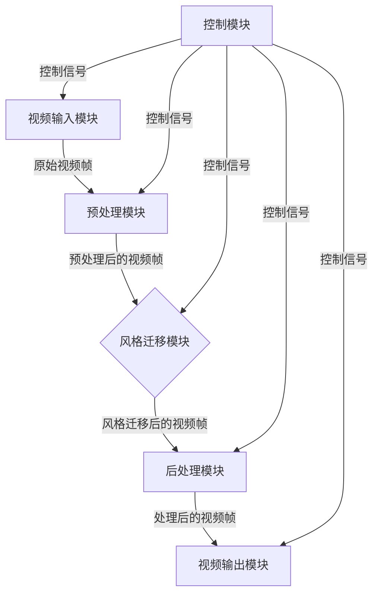

# 基于生成对抗网络的实时视频风格迁移系统设计

## 1. 背景介绍

### 1.1 视频风格迁移的概念

视频风格迁移是一种将特定艺术风格应用于视频流的技术,使原始视频获得新的视觉效果。这种技术通过分析参考风格图像的特征,并将其迁移到输入视频帧上,从而实现视频风格的转换。视频风格迁移可以为视频添加独特的艺术表现力,广泛应用于电影、广告、社交媒体等领域,为视觉内容增添创意和吸引力。

### 1.2 传统方法的局限性

早期的视频风格迁移方法主要基于手工特征提取和滤波操作,存在着效率低下、质量参差不齐的问题。随着深度学习技术的发展,基于卷积神经网络(CNN)的方法逐渐成为视频风格迁移的主流方向。然而,大多数现有方法都是针对静态图像设计的,直接应用于视频会导致时间一致性差、运算成本高等问题。

### 1.3 生成对抗网络(GAN)的优势

生成对抗网络(Generative Adversarial Networks, GAN)是一种基于对抗训练的生成模型,由生成器和判别器两个神经网络组成。生成器旨在生成逼真的样本,而判别器则试图区分生成的样本和真实样本。通过生成器和判别器的互相对抗,模型可以学习到数据的真实分布,从而生成高质量的输出。GAN在图像生成、风格迁移等任务中展现出了卓越的性能。

### 1.4 实时视频风格迁移的挑战

实现实时视频风格迁移面临着诸多挑战:

1. **时间一致性**: 需要确保相邻帧之间的风格迁移结果具有良好的时间一致性,避免视觉上的抖动和闪烁。
2. **计算效率**: 要满足实时处理的要求,系统必须具有高效的计算能力,以在有限的时间内处理大量视频帧。
3. **内存消耗**: 由于视频数据量庞大,有效管理内存资源以避免内存溢出是一个关键问题。
4. **视觉质量**: 最终的风格迁移结果应该保持良好的视觉质量,包括清晰度、细节保留等方面。

## 2. 核心概念与联系

### 2.1 生成对抗网络(GAN)

生成对抗网络(GAN)是一种基于对抗训练的生成模型,由生成器(Generator)和判别器(Discriminator)两个神经网络组成。生成器旨在生成逼真的样本,而判别器则试图区分生成的样本和真实样本。通过生成器和判别器的互相对抗,模型可以学习到数据的真实分布,从而生成高质量的输出。

GAN的训练过程可以看作是一个极小极大博弈问题,生成器和判别器相互对抗,最终达到一种平衡状态(Nash均衡)。生成器试图最大化判别器被欺骗的概率,而判别器则试图最大化正确识别真实样本和生成样本的概率。

GAN在图像生成、风格迁移等任务中展现出了卓越的性能,成为深度学习领域的一个重要研究方向。

### 2.2 视频风格迁移

视频风格迁移是一种将特定艺术风格应用于视频流的技术,使原始视频获得新的视觉效果。这种技术通过分析参考风格图像的特征,并将其迁移到输入视频帧上,从而实现视频风格的转换。

视频风格迁移需要解决两个关键问题:

1. **风格表示**: 如何有效地表示和提取参考风格图像的特征,以便将其迁移到视频帧上。
2. **时间一致性**: 如何确保相邻帧之间的风格迁移结果具有良好的时间一致性,避免视觉上的抖动和闪烁。

基于GAN的视频风格迁移方法通常采用生成对抗训练的思路,利用生成器网络将输入视频帧和参考风格图像的特征融合,生成风格迁移后的视频帧,并使用判别器网络来评估生成结果的质量,进而优化生成器网络。

### 2.3 实时处理

实时处理是指系统能够在有限的时间内处理大量的数据,并及时产生输出结果。在视频风格迁移任务中,实时处理意味着系统需要在视频播放的同时,对每一帧进行风格迁移处理,并将处理后的帧及时输出,从而实现流畅的视频播放。

实现实时视频风格迁移需要解决以下挑战:

1. **计算效率**: 系统必须具有高效的计算能力,以在有限的时间内处理大量视频帧。
2. **内存管理**: 由于视频数据量庞大,有效管理内存资源以避免内存溢出是一个关键问题。
3. **延迟控制**: 系统需要控制处理延迟,确保输出帧与原始帧之间的时间差不会导致视觉上的不连贯。

### 2.4 系统架构概览

基于生成对抗网络的实时视频风格迁移系统通常由以下几个主要组件组成:

1. **视频输入模块**: 负责从视频源获取原始视频帧数据。
2. **预处理模块**: 对输入的视频帧进行必要的预处理操作,如缩放、归一化等。
3. **风格迁移模块**: 包含基于GAN的生成器和判别器网络,用于将参考风格图像的特征迁移到输入视频帧上。
4. **后处理模块**: 对风格迁移后的视频帧进行必要的后处理操作,如反归一化、格式转换等。
5. **视频输出模块**: 将处理后的视频帧输出到显示设备或存储介质。
6. **控制模块**: 协调各个模块的工作,管理数据流、内存资源,并确保系统的实时性能。

这些模块通过高效的数据流水线和并行计算策略相互协作,实现端到端的实时视频风格迁移处理。

## 3. 核心算法原理具体操作步骤

基于生成对抗网络的实时视频风格迁移系统的核心算法原理可以分为以下几个步骤:

### 3.1 风格表示

首先需要提取参考风格图像的特征,以便将其迁移到输入视频帧上。常用的方法是使用预训练的卷积神经网络(如VGG网络)提取图像的特征表示。

具体步骤如下:

1. 将参考风格图像输入到预训练的卷积神经网络中。
2. 在网络的不同层次上提取特征图(feature maps)。
3. 计算特征图的格拉姆矩阵(Gram Matrix),作为风格表示。

格拉姆矩阵能够捕捉特征图之间的相关性,从而编码风格信息。给定一个特征图 $F \in \mathbb{R}^{C \times H \times W}$,其格拉姆矩阵 $G \in \mathbb{R}^{C \times C}$ 定义为:

$$
G_{c,c'}=\sum_{h=1}^{H}\sum_{w=1}^{W}F_{c,h,w}F_{c',h,w}
$$

其中 $C$ 表示特征图的通道数,而 $H$ 和 $W$ 分别表示特征图的高度和宽度。

### 3.2 生成器网络

生成器网络的目标是将输入视频帧和参考风格图像的特征融合,生成风格迁移后的视频帧。常用的生成器网络架构包括编码器-解码器(Encoder-Decoder)结构和U-Net结构。

编码器-解码器结构:

1. 编码器将输入视频帧编码为特征表示。
2. 将编码后的特征与参考风格图像的特征融合。
3. 解码器将融合后的特征解码为风格迁移后的视频帧。

U-Net结构在编码器-解码器的基础上增加了跳跃连接(Skip Connections),以保留更多的细节信息。

生成器网络的关键在于特征融合策略,常见的方法包括:

- 特征拼接(Feature Concatenation)
- 特征加权求和(Feature Weighted Sum)
- 自适应实例归一化(Adaptive Instance Normalization)

### 3.3 判别器网络

判别器网络的目标是评估生成器网络生成的风格迁移结果的质量,并提供反馈信号用于优化生成器网络。

判别器网络通常采用分类器结构,输入为真实视频帧或生成的风格迁移帧,输出为真实/伪造的概率分数。

在训练过程中,判别器网络试图最大化正确识别真实样本和生成样本的概率,而生成器网络则试图最大化判别器被欺骗的概率。通过生成器和判别器的互相对抗,模型可以学习到数据的真实分布,从而生成高质量的输出。

### 3.4 时间一致性

为了确保相邻帧之间的风格迁移结果具有良好的时间一致性,避免视觉上的抖动和闪烁,常采用以下策略:

1. **光流估计**: 利用光流算法估计相邻帧之间的运动信息,并在生成器网络中引入光流约束,强制相邻帧之间的变化符合运动模式。
2. **时间损失函数**: 在生成器网络的损失函数中引入时间一致性项,惩罚相邻帧之间的差异过大。
3. **递归架构**: 采用递归神经网络架构,将前一时间步的隐藏状态作为当前时间步的输入,从而捕捉时间依赖关系。

### 3.5 实时处理策略

为了实现实时视频风格迁移,需要采取以下策略:

1. **GPU加速**: 利用GPU的并行计算能力,加速神经网络的推理过程。
2. **模型压缩**: 通过模型压缩技术(如剪枝、量化等)减小模型的计算复杂度和内存占用。
3. **异步数据处理**: 采用异步数据处理策略,将视频帧解码、预处理、风格迁移、后处理等步骤分配到不同的线程或进程中,实现并行处理。
4. **延迟控制**: 通过缓冲机制和调度策略,控制处理延迟,确保输出帧与原始帧之间的时间差不会导致视觉上的不连贯。

### 3.6 训练过程

基于生成对抗网络的实时视频风格迁移系统通常采用以下训练过程:

1. **数据准备**: 准备包含多种场景和运动模式的视频数据集,以及参考风格图像。
2. **预训练**: 分别预训练生成器网络和判别器网络,以获得初始模型参数。
3. **对抗训练**: 将预训练的生成器网络和判别器网络结合,进行对抗训练。生成器网络试图生成能够欺骗判别器网络的风格迁移结果,而判别器网络则试图正确区分真实样本和生成样本。
4. **损失函数**: 除了标准的对抗损失之外,还可以引入其他损失项,如内容损失、风格损失、时间一致性损失等,以优化模型的不同方面。
5. **优化算法**: 常用的优化算法包括随机梯度下降(SGD)、Adam等。
6. **模型评估**: 在验证集上评估模型的性能,包括视觉质量、时间一致性、计算效率等指标。
7. **模型微调**: 根据评估结果,对模型进行进一步的微调和优化。

通过反复的对抗训练和模型优化,系统可以学习到高质量的风格迁移映射,并满足实时处理的要求。

## 4. 数学模型和公式详细讲解举例说明

在基于生成