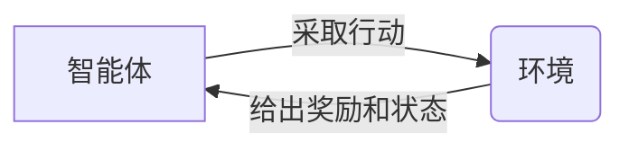

# 增强学习：原理与代码实例讲解

## 1. 背景介绍

增强学习（Reinforcement Learning, RL）是机器学习的一个重要分支，它在游戏、机器人控制、自动驾驶等领域展现出了巨大的潜力。与监督学习和无监督学习不同，增强学习关注如何基于环境给出的奖励或惩罚来训练模型做出决策。本文将深入探讨增强学习的核心概念、算法原理，并通过代码实例带领读者理解其背后的数学模型，最后探讨其在实际应用中的场景和未来的发展趋势。

## 2. 核心概念与联系

在增强学习中，智能体（Agent）通过与环境（Environment）的交互来学习最优策略（Policy）。智能体在某一状态（State）下采取行动（Action），环境根据行动给出下一个状态和奖励（Reward）。智能体的目标是最大化累积奖励，即回报（Return）。这个过程可以用一个马尔可夫决策过程（Markov Decision Process, MDP）来描述。



## 3. 核心算法原理具体操作步骤

增强学习的核心算法可以分为基于值的方法（Value-Based）、基于策略的方法（Policy-Based）和模型驱动的方法（Model-Based）。基于值的方法，如Q学习（Q-Learning），关注于学习状态-行动对的价值函数（Value Function）。基于策略的方法，如策略梯度（Policy Gradient），直接学习策略函数。模型驱动的方法则试图学习环境的模型以进行预测和规划。

## 4. 数学模型和公式详细讲解举例说明

以Q学习为例，其核心公式为贝尔曼方程（Bellman Equation）：

$$ Q(s, a) = R(s, a) + \gamma \max_{a'} Q(s', a') $$

其中，$Q(s, a)$ 是在状态$s$下采取行动$a$的价值，$R(s, a)$ 是即时奖励，$\gamma$ 是折扣因子，$s'$ 是下一个状态，$a'$ 是在状态$s'$下可能采取的行动。

## 5. 项目实践：代码实例和详细解释说明

我们将通过一个简单的迷宫游戏来展示Q学习的代码实现。智能体需要找到从起点到终点的最短路径。

```python
# 代码示例
import numpy as np

# 初始化Q表
Q = np.zeros((状态数量, 行动数量))

# Q学习算法
for episode in range(总回合数):
    state = 初始化状态
    while not 游戏结束:
        action = 选择行动(state, Q)
        next_state, reward = 环境反馈(state, action)
        Q[state, action] = Q[state, action] + 学习率 * (reward + 折扣因子 * np.max(Q[next_state]) - Q[state, action])
        state = next_state
```

## 6. 实际应用场景

增强学习已被应用于多个领域，包括但不限于自动驾驶汽车、推荐系统、金融交易和机器人控制。在这些应用中，增强学习帮助智能体在复杂的环境中做出决策。

## 7. 工具和资源推荐

- OpenAI Gym：一个用于开发和比较增强学习算法的工具包。
- TensorFlow Agents：一个基于TensorFlow的增强学习库。
- PyTorch：一个提供强大的自动微分系统的深度学习框架，适用于策略梯度方法。

## 8. 总结：未来发展趋势与挑战

增强学习的未来发展趋势包括算法的进一步优化、多智能体系统的研究以及与深度学习的结合。挑战包括样本效率的提高、稳定性和泛化能力的增强。

## 9. 附录：常见问题与解答

- Q: 增强学习和深度学习的关系是什么？
- A: 增强学习可以结合深度学习构成深度增强学习，用于处理高维输入空间的问题。

- Q: 增强学习如何选择行动？
- A: 通常使用$\epsilon$-贪婪策略，在大部分时间选择最优行动，有一定概率随机选择行动以探索环境。

作者：禅与计算机程序设计艺术 / Zen and the Art of Computer Programming