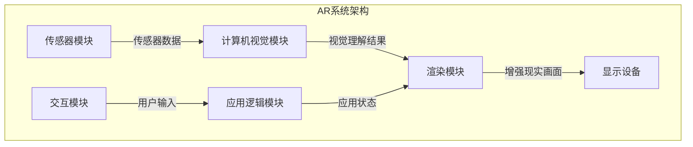

# 增强现实 (Augmented Reality)

## 1. 背景介绍

增强现实(Augmented Reality, AR)是一种将虚拟信息与现实世界相融合的技术。它通过摄像头捕捉现实场景,并在其上叠加相关的虚拟对象(如3D模型、文字、图像等),从而为用户提供一种增强的现实体验。与虚拟现实(Virtual Reality, VR)不同,AR并不是完全沉浸在虚拟环境中,而是将虚拟元素与真实世界融合在一起。

AR技术的发展可以追溯到20世纪60年代,当时一位计算机科学家提出了"Ultimate Display"的概念,描述了一种能够无缝融合现实和虚拟世界的显示系统。随后,AR技术在军事、工业和医疗等领域得到了初步应用。直到近年来,随着移动设备和传感器技术的快速发展,AR才真正走向大众市场,在游戏、导航、购物等领域得到了广泛应用。

### 1.1 AR技术的优势

相比于VR技术,AR具有以下优势:

1. **无需特殊硬件**:AR应用可以在普通的智能手机或平板电脑上运行,无需昂贵的VR头显设备。
2. **保持现实世界联系**:用户可以同时看到并与现实世界互动,避免了VR带来的孤立感。
3. **提高工作效率**:在工业、医疗等领域,AR可以为工作人员提供实时指导和信息支持,提高工作效率。
4. **增强体验**:AR可以为现实世界增添趣味性和互动性,为用户带来全新的体验。

### 1.2 AR技术的挑战

尽管AR技术前景广阔,但也面临一些挑战:

1. **注册和跟踪**:准确地将虚拟对象与现实场景对齐是AR系统的核心挑战之一。
2. **用户交互**:设计直观、自然的用户交互方式,使AR应用易于使用。
3. **功耗和延迟**:在移动设备上实现高质量的AR体验,需要解决功耗和延迟问题。
4. **隐私和安全**:AR技术可能会带来一些隐私和安全问题,需要加强相关法规和技术保障。

## 2. 核心概念与联系

### 2.1 视觉内容理解

视觉内容理解是AR系统的基础,它包括以下几个核心概念:

1. **图像识别**:通过计算机视觉算法识别图像中的对象、文字、人脸等内容。
2. **场景重建**:根据相机捕捉的图像或视频,重建出周围3D环境的模型。
3. **运动跟踪**:跟踪相机在3D空间中的位置和姿态变化。

这些技术为AR系统提供了对现实世界的理解,是虚拟内容与现实世界精确融合的基础。

### 2.2 渲染和可视化

将虚拟内容正确地渲染到现实场景中,是AR系统的另一个核心任务,涉及以下概念:

1. **图形渲染**:高效地渲染3D模型、图像和文字等虚拟内容。
2. **光照估计**:估计现实环境中的光照条件,使虚拟对象的光照效果与现实场景相匹配。
3. **遮挡处理**:正确处理虚拟对象与现实物体之间的遮挡关系。

这些技术确保了虚拟内容在视觉上与现实世界无缝融合,提供了逼真的增强现实体验。

### 2.3 交互技术

为了实现自然、直观的用户交互,AR系统需要集成多种交互技术,包括:

1. **手势识别**:通过计算机视觉算法识别用户的手势,作为控制AR应用的输入方式。
2. **语音交互**:利用语音识别和合成技术,实现与AR应用的语音交互。
3. **眼动跟踪**:跟踪用户的视线焦点,用于选择虚拟对象或控制AR界面。

良好的交互设计可以提高AR应用的易用性和沉浸感,增强用户体验。

### 2.4 系统架构

典型的AR系统架构包括以下几个主要组件:

1. **传感器模块**:包括相机、陀螺仪、加速度计等传感器,用于捕捉现实世界的数据。
2. **计算机视觉模块**:负责图像识别、场景重建和运动跟踪等视觉内容理解任务。
3. **渲染模块**:将虚拟内容与现实场景融合,生成最终的增强现实画面。
4. **交互模块**:处理用户的输入,如手势、语音、眼动等,并控制AR应用的行为。
5. **应用逻辑模块**:实现AR应用的核心功能和业务逻辑。

这些组件通过良好的设计和集成,共同构建出高效、流畅的AR系统。



## 3. 核心算法原理具体操作步骤

### 3.1 图像识别算法

图像识别是AR系统视觉内容理解的基础,常用的算法包括:

1. **特征提取与匹配**:
   - 步骤1:使用算法(如SIFT、ORB等)提取图像的关键点和描述符。
   - 步骤2:在目标图像和参考图像之间匹配描述符,找到对应的关键点对。
   - 步骤3:使用RANSAC等方法剔除错误匹配,得到正确的匹配对。

2. **卷积神经网络**:
   - 步骤1:准备标注好的训练数据集。
   - 步骤2:设计合适的卷积神经网络结构,如VGGNet、ResNet等。
   - 步骤3:使用训练数据集训练网络模型。
   - 步骤4:对新图像输入训练好的模型,获得对象识别结果。

### 3.2 场景重建算法

场景重建是将相机捕捉的图像或视频数据转换为3D场景模型的过程,常用算法包括:

1. **基于特征点的重建**:
   - 步骤1:提取图像序列中的特征点,并在图像间建立匹配关系。
   - 步骤2:利用特征点匹配结果,计算相机运动和3D点云。
   - 步骤3:使用多视图立体重建或补丁扩展等方法,生成密集的3D模型。

2. **深度学习重建**:
   - 步骤1:准备包含RGB图像和对应深度图的训练数据集。
   - 步骤2:设计基于编码器-解码器结构的深度神经网络。
   - 步骤3:使用训练数据集训练网络模型。
   - 步骤4:对新的RGB图像输入训练好的模型,获得对应的深度图。
   - 步骤5:利用深度图和相机参数,重建出3D场景模型。

### 3.3 运动跟踪算法

运动跟踪是确定相机在3D空间中的位置和姿态的过程,常用算法包括:

1. **基于特征点的运动跟踪**:
   - 步骤1:提取当前图像和参考图像中的特征点。
   - 步骤2:在两组特征点之间建立匹配关系。
   - 步骤3:利用匹配关系,计算相机的运动变换矩阵。

2. **基于模型的运动跟踪**:
   - 步骤1:建立3D场景模型。
   - 步骤2:在当前图像中检测模型的2D投影。
   - 步骤3:利用2D-3D对应关系,计算相机的位姿。

3. **基于滤波的运动跟踪**:
   - 步骤1:利用惯性测量单元(IMU)获取相机的初始位姿。
   - 步骤2:使用卡尔曼滤波或粒子滤波等算法,融合图像和IMU数据。
   - 步骤3:获得平滑、精确的相机位姿估计。

## 4. 数学模型和公式详细讲解举例说明

### 4.1 相机模型

在AR系统中,相机模型是将3D世界投影到2D图像平面的数学描述,常用的模型是针孔相机模型。

针孔相机模型可以用以下公式表示:

$$
\begin{bmatrix}
u \\
v \\
1
\end{bmatrix} = 
\begin{bmatrix}
f_x & 0 & c_x \\
0 & f_y & c_y \\
0 & 0 & 1
\end{bmatrix}
\begin{bmatrix}
X / Z \\
Y / Z \\
1
\end{bmatrix}
$$

其中:

- $(u, v)$是像素坐标
- $(X, Y, Z)$是3D点在相机坐标系下的坐标
- $(f_x, f_y)$是相机的焦距
- $(c_x, c_y)$是主点坐标

通过已知的内参数$(f_x, f_y, c_x, c_y)$和外参数(相机位姿),我们可以将3D点投影到2D图像平面上,或者从2D图像点反解析出对应的3D射线。

### 4.2 透视 n 点算法 (PnP)

透视 n 点算法是计算机视觉中一种重要的算法,用于从2D-3D对应点求解相机的位姿。它的数学模型如下:

已知:

- $n$个3D点 $\{P_i\}$ 在世界坐标系下的坐标
- 这些3D点在图像平面上的投影点 $\{p_i\}$
- 相机的内参数矩阵 $K$

求解:

- 相机的旋转矩阵 $R$
- 相机的平移向量 $t$

可以建立以下方程组:

$$
p_i = K[R|t]P_i, \quad i = 1, 2, \ldots, n
$$

通过非线性优化算法(如高斯牛顿法)求解 $R$ 和 $t$,使得重投影误差最小化:

$$
\min_{\substack{R, t}} \sum_{i=1}^n \left\|p_i - K[R|t]P_i\right\|^2
$$

透视 n 点算法广泛应用于AR系统的运动跟踪、3D重建等任务中。

### 4.3 Bundle Adjustment

捆绑调整(Bundle Adjustment, BA)是一种同时优化3D点云和相机位姿的非线性最小二乘算法,在AR系统的3D重建过程中扮演着关键角色。

给定:

- $m$个3D点 $\{P_j\}$
- $n$个相机位姿 $\{R_i, t_i\}$
- 每个3D点在各相机图像上的观测 $\{p_{ij}\}$

目标是最小化所有观测的重投影误差:

$$
\min_{\substack{P_j, R_i, t_i}} \sum_{i=1}^n \sum_{j=1}^m \left\|p_{ij} - K_i[R_i|t_i]P_j\right\|^2
$$

通过高斯牛顿或者拥挤矩阵(Stochastic Gradient Descent)等优化方法,可以同时优化3D点云和相机位姿,获得精确的3D重建结果。

Bundle Adjustment算法虽然计算量较大,但能够显著提高3D重建的精度,是AR系统中不可或缺的核心算法。

## 5. 项目实践:代码实例和详细解释说明

以下是一个基于OpenCV的简单AR示例,演示如何在相机预览中叠加虚拟3D立方体。

### 5.1 环境准备

1. 安装OpenCV库(版本 >= 3.0)
2. 准备一个标记图像(如chessboard.png)

### 5.2 代码实现

```python
import cv2
import numpy as np

# 加载标记图像
marker_img = cv2.imread('chessboard.png')
marker_gray = cv2.cvtColor(marker_img, cv2.COLOR_BGR2GRAY)

# 定义3D立方体的8个顶点
cube_points = np.float32([[0, 0, 0], [0, 0, 1], [0, 1, 0], [0, 1, 1],
                           [1,