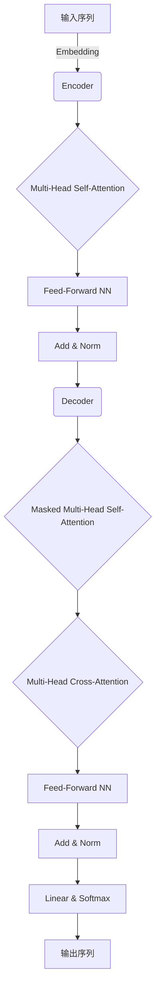
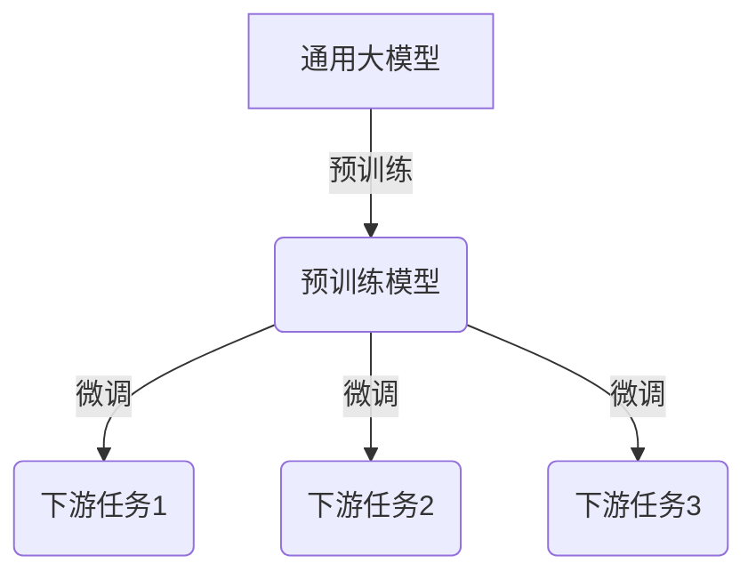

# 多模态大模型：技术原理与实战 其他部署方法介绍

## 1. 背景介绍

### 1.1 人工智能的发展历程

人工智能(Artificial Intelligence, AI)是一门研究如何使机器模拟人类智能行为的科学与技术。自20世纪50年代诞生以来,人工智能经历了几个重要的发展阶段。

- 早期阶段(1950s-1960s):专家系统、博弈论等领域取得初步进展。
- 知识迁移阶段(1970s-1980s):发展知识表示、推理等技术,实现特定领域的智能系统。
- 统计学习阶段(1990s-2000s):机器学习、神经网络等技术逐渐成熟,推动了语音识别、图像识别等应用。
- 深度学习阶段(2010s-至今):深度神经网络在大数据和算力支持下取得突破性进展,推动了计算机视觉、自然语言处理等领域的发展。

### 1.2 大模型的兴起

随着算力、数据和模型规模的不断扩大,大模型(Large Model)应运而生。大模型指具有数十亿甚至上万亿参数的深度神经网络模型,能够在海量数据上进行预训练,捕捉丰富的语义和知识表示。

大模型的代表有:

- GPT系列(Generative Pre-trained Transformer):OpenAI开发的自回归语言模型,擅长生成式任务。
- BERT系列(Bidirectional Encoder Representations from Transformers):Google开发的双向编码语言模型,擅长理解式任务。
- ViT(Vision Transformer):将Transformer应用于计算机视觉领域的模型。
- Stable Diffusion:基于潜在扩散模型(Latent Diffusion Model)的文本到图像生成模型。

大模型展现出了强大的泛化能力和迁移学习潜力,在自然语言处理、计算机视觉等领域取得了突破性进展。

### 1.3 多模态大模型的兴起

传统的人工智能模型通常专注于单一模态,如文本或图像。但人类认知是多模态的,我们通过视觉、听觉、语言等多种渠道感知和理解世界。为了更好地模拟人类智能,多模态人工智能(Multimodal AI)应运而生。

多模态大模型(Multimodal Large Model)是指能够同时处理多种模态输入(如文本、图像、视频、音频等)并生成多模态输出的大规模神经网络模型。它们通过在海量多模态数据上预训练,学习跨模态的表示和关联,从而实现更强大的理解和生成能力。

代表性的多模态大模型包括:

- CLIP(Contrastive Language-Image Pre-training):OpenAI开发的视觉-语言双模态模型,能够进行图像-文本对比和零样本分类。
- DALL-E:OpenAI开发的文本到图像生成模型,可以根据自然语言描述生成高质量图像。
- Imagen:Google开发的文本到图像生成模型,生成质量超越DALL-E。
- Flamingo:DeepMind开发的通用多模态模型,可处理视觉、语言、音频等多种模态。
- GPT-4:OpenAI即将发布的新一代大语言模型,预计将具备多模态能力。

多模态大模型正在推动人工智能向更加通用和智能的方向发展,有望在机器人、虚拟现实、人机交互等领域发挥重要作用。

## 2. 核心概念与联系

### 2.1 Transformer

Transformer是多模态大模型的核心架构,它是一种基于自注意力机制(Self-Attention)的序列到序列(Seq2Seq)模型。主要组成部分包括:

- 编码器(Encoder):将输入序列(如文本、图像等)映射为高维向量表示。
- 解码器(Decoder):根据编码器的输出和前一时刻的输出,生成目标序列。
- 多头自注意力机制(Multi-Head Self-Attention):允许模型捕捉输入序列中任意两个位置之间的依赖关系。
- 前馈神经网络(Feed-Forward Neural Network):对注意力输出进行非线性变换,提取更高级的特征。

Transformer通过自注意力机制捕捉长程依赖关系,并通过残差连接(Residual Connection)和层归一化(Layer Normalization)提高训练稳定性,在机器翻译、语言模型等任务上取得了卓越表现。

### 2.2 注意力机制

注意力机制(Attention Mechanism)是Transformer的核心,它允许模型动态地聚焦于输入序列的不同部分,捕捉长程依赖关系。

给定查询(Query)向量 $\vec{q}$、键(Key)向量集合 $\vec{K}=\{\vec{k_1}, \vec{k_2}, \ldots, \vec{k_n}\}$ 和值(Value)向量集合 $\vec{V}=\{\vec{v_1}, \vec{v_2}, \ldots, \vec{v_n}\}$,注意力机制计算如下:

$$\text{Attention}(\vec{q}, \vec{K}, \vec{V}) = \text{softmax}\left(\frac{\vec{q}\vec{K}^T}{\sqrt{d_k}}\right)\vec{V}$$

其中 $d_k$ 为缩放因子,用于防止点积过大导致梯度消失。

多头注意力机制(Multi-Head Attention)将注意力机制并行运行多次,然后将结果拼接,从而允许模型关注不同的位置关系。

$$\text{MultiHead}(\vec{Q}, \vec{K}, \vec{V}) = \text{Concat}(\text{head}_1, \ldots, \text{head}_h)W^O$$
$$\text{where } \text{head}_i = \text{Attention}(\vec{Q}W_i^Q, \vec{K}W_i^K, \vec{V}W_i^V)$$

注意力机制赋予了Transformer强大的建模能力,使其能够有效地处理长序列和捕捉全局依赖关系。

### 2.3 预训练与微调

预训练(Pre-training)和微调(Fine-tuning)是训练大模型的常用范式。

**预训练**是在大规模无监督数据上训练模型,使其学习通用的表示和知识。常见的预训练目标包括:

- 蒙版语言模型(Masked Language Modeling):预测被蒙版的词。
- 下一句预测(Next Sentence Prediction):判断两个句子是否相邻。
- 对比学习(Contrastive Learning):最大化相似样本的相似度,最小化不相似样本的相似度。

**微调**是在有监督的下游任务数据上,基于预训练模型进行进一步训练,使模型适应特定任务。微调通常只需调整少量参数,就能获得良好的性能提升。

预训练和微调的有效结合,使得大模型能够在特定任务上发挥出色表现,同时通过知识迁移减少了从头训练的数据需求。

### 2.4 多模态融合

多模态大模型需要有效地融合不同模态的信息,捕捉跨模态的关联。常见的多模态融合方法包括:

1. **早期融合**:在底层将不同模态的输入拼接,然后送入单一编码器进行建模。
2. **晚期融合**:分别对每种模态进行编码,然后在高层将编码后的表示进行融合。
3. **交互融合**:在不同层次交替进行模态间的交互,实现动态融合。

此外,还可以利用注意力机制直接建模不同模态之间的依赖关系,例如视觉-语言注意力。

多模态融合是多模态大模型的核心挑战之一,需要合理设计融合策略,充分利用各模态的互补信息,提高模型的表示能力和泛化性能。

## 3. 核心算法原理具体操作步骤

### 3.1 Transformer编码器

Transformer编码器的核心是多头自注意力机制和前馈神经网络,用于将输入序列编码为高维向量表示。具体操作步骤如下:

1. **输入embedding**:将输入序列(如文本或图像)映射为embedding向量序列。
2. **位置编码**:为embedding向量添加位置信息,使模型能够捕捉序列顺序。
3. **多头自注意力**:
    - 将Query、Key和Value投影到不同的子空间。
    - 计算Query与所有Key的点积,应用Softmax得到注意力分数。
    - 将注意力分数与Value加权求和,得到注意力输出。
    - 对多个注意力头的输出进行拼接。
4. **残差连接与层归一化**:将注意力输出与输入相加,并进行层归一化,以提高训练稳定性。
5. **前馈神经网络**:对归一化后的向量应用两层全连接网络,提取更高级的特征表示。
6. **残差连接与层归一化**:将前馈网络输出与输入相加,并进行层归一化。
7. **堆叠编码器层**:重复上述步骤,堆叠多个编码器层,形成深层表示。

编码器的输出向量序列捕捉了输入序列的语义和上下文信息,可用于后续的解码或其他下游任务。

### 3.2 Transformer解码器

Transformer解码器在编码器的基础上,增加了掩码多头自注意力和编码器-解码器注意力机制,用于生成目标序列。具体操作步骤如下:

1. **输入embedding和位置编码**:将输入序列映射为embedding向量序列,并添加位置编码。
2. **掩码多头自注意力**:
    - 对输入序列进行自注意力,但遮蔽未来位置的信息(因为生成时无法看到未来信息)。
    - 将注意力输出与输入相加,并进行层归一化。
3. **编码器-解码器注意力**:
    - 将解码器的输出与编码器的输出进行注意力计算。
    - 将注意力输出与输入相加,并进行层归一化。
4. **前馈神经网络**:对归一化后的向量应用两层全连接网络,提取更高级的特征表示。
5. **残差连接与层归一化**:将前馈网络输出与输入相加,并进行层归一化。
6. **堆叠解码器层**:重复上述步骤,堆叠多个解码器层,形成深层表示。
7. **线性层和Softmax**:将最终的解码器输出通过线性层和Softmax,得到下一个词的概率分布。
8. **贪婪搜索或束搜索**:根据概率分布,选择概率最大的词作为输出,重复上述步骤生成完整序列。

解码器的输出序列是根据编码器的上下文表示和前一时刻的输出生成的,可用于机器翻译、文本生成等任务。

### 3.3 视觉-语言预训练

视觉-语言预训练(Vision-Language Pre-training)是训练多模态大模型的一种重要方式,它在大规模图像-文本对数据上对模型进行预训练,使其学习视觉和语言的联合表示。常见的预训练目标包括:

1. **蒙版语言模型(Masked Language Modeling)**:预测被蒙版的文本词。
2. **图像文本对比(Image-Text Contrastive)**:最大化相似图像-文本对的相似度,最小化不相似对的相似度。
3. **图像文本对编码(Image-Text Encoding)**:将图像和文本编码为统一的向量表示。
4. **图像文本对生成(Image-Text Generation)**:根据图像生成对应的文本描述,或根据文本生成对应的图像。

以CLIP(Contrastive Language-Image Pre-training)为例,它的预训练过程包括:

1. **图像编码器**:将图像编码为视觉特征向量序列。
2. **文本编码器**:将文本编码为文本特征向量序列。
3. **视觉-语