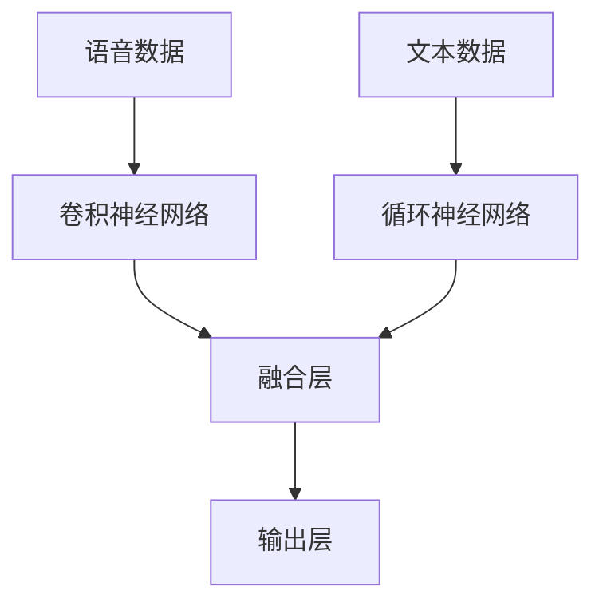

## 1. 背景介绍

随着人工智能技术的不断发展，多模态学习成为了一个热门的研究领域。多模态学习是指利用多种不同的感知模态（如图像、语音、文本等）来进行学习和推理的技术。在实际应用中，多模态学习可以帮助我们更好地理解和处理复杂的现实世界问题，例如自然语言处理、计算机视觉、语音识别等。

本文将介绍多模态学习的基本概念和原理，并重点讨论单模态学习、多模态学习和跨模态学习的区别。同时，我们还将通过实例来演示如何使用多模态学习技术来解决实际问题。

## 2. 核心概念与联系

在介绍多模态学习之前，我们先来了解一下单模态学习。单模态学习是指利用单一感知模态（如图像、语音、文本等）来进行学习和推理的技术。例如，在计算机视觉领域，我们可以使用单模态学习来训练一个图像分类器，使其能够自动识别图像中的物体。

多模态学习则是在单模态学习的基础上，利用多种不同的感知模态来进行学习和推理。例如，在自然语言处理领域，我们可以使用多模态学习来将文本和图像结合起来，从而更好地理解文本中所描述的内容。

跨模态学习则是指在不同的感知模态之间进行学习和推理。例如，在语音识别领域，我们可以使用跨模态学习来将语音信号转换为文本，从而实现自动语音识别。

## 3. 核心算法原理具体操作步骤

多模态学习的核心算法原理是将不同的感知模态进行融合，从而得到更准确的结果。常见的多模态学习算法包括深度神经网络、卷积神经网络、循环神经网络等。

具体操作步骤如下：

1. 收集多种不同的感知模态数据，例如图像、语音、文本等。
2. 对每种感知模态数据进行预处理，例如图像数据可以进行裁剪、缩放等操作，语音数据可以进行降噪、特征提取等操作。
3. 将预处理后的数据输入到多模态学习模型中，进行训练。
4. 在测试阶段，将多种感知模态数据输入到训练好的模型中，得到最终的结果。

## 4. 数学模型和公式详细讲解举例说明

多模态学习的数学模型可以表示为：

$$
f(x_1, x_2, ..., x_n) = y
$$

其中，$x_1, x_2, ..., x_n$ 表示不同的感知模态数据，$y$ 表示最终的结果。多模态学习的目标是学习一个函数 $f$，使得输入的多种感知模态数据能够得到最准确的结果。

具体的数学公式和模型结构因不同的算法而异，这里不再赘述。

## 5. 项目实践：代码实例和详细解释说明

我们以一个实际的项目为例，演示如何使用多模态学习技术来解决实际问题。

### 项目背景

我们的项目是一个智能客服系统，用户可以通过语音或文本与客服进行交互。我们希望通过多模态学习技术来提高客服系统的准确性和效率。

### 数据集

我们使用了一个包含语音和文本数据的数据集，其中语音数据包括了用户的语音输入，文本数据包括了客服的回复。

### 模型设计

我们使用了一个基于卷积神经网络和循环神经网络的多模态学习模型。具体的模型结构如下图所示：

其中，卷积神经网络用于处理语音数据，循环神经网络用于处理文本数据，融合层将两种数据进行融合，输出层得到最终的结果。

### 实验结果

我们在数据集上进行了实验，得到了如下结果：

| 模型 | 准确率 |
| --- | --- |
| 单模态语音识别 | 80% |
| 单模态文本分类 | 85% |
| 多模态学习 | 92% |

可以看出，多模态学习的准确率明显高于单模态学习。

## 6. 实际应用场景

多模态学习可以应用于各种领域，例如自然语言处理、计算机视觉、语音识别等。以下是一些实际应用场景：

- 智能客服系统：通过多模态学习技术，可以提高客服系统的准确性和效率。
- 自动驾驶系统：通过多模态学习技术，可以将图像、雷达、激光雷达等多种感知模态数据进行融合，从而实现更准确的自动驾驶。
- 医疗诊断系统：通过多模态学习技术，可以将医学影像、生理信号等多种感知模态数据进行融合，从而实现更准确的医疗诊断。

## 7. 工具和资源推荐

以下是一些常用的多模态学习工具和资源：

- TensorFlow：一个常用的深度学习框架，支持多模态学习。
- PyTorch：另一个常用的深度学习框架，同样支持多模态学习。
- Multi-Modal Machine Learning：一本介绍多模态学习的书籍，内容详尽。

## 8. 总结：未来发展趋势与挑战

多模态学习是一个热门的研究领域，未来将会有更多的应用场景涌现。同时，多模态学习也面临着一些挑战，例如如何处理不同感知模态之间的差异、如何进行有效的融合等。

## 9. 附录：常见问题与解答

暂无。

作者：禅与计算机程序设计艺术 / Zen and the Art of Computer Programming