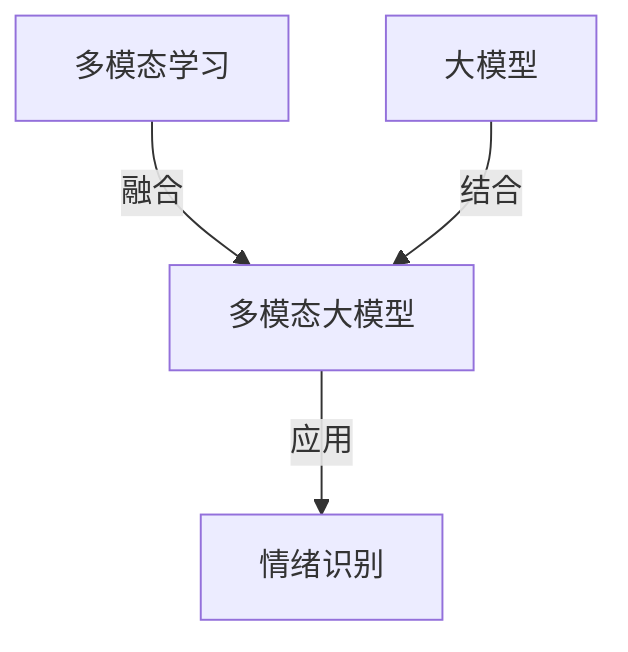
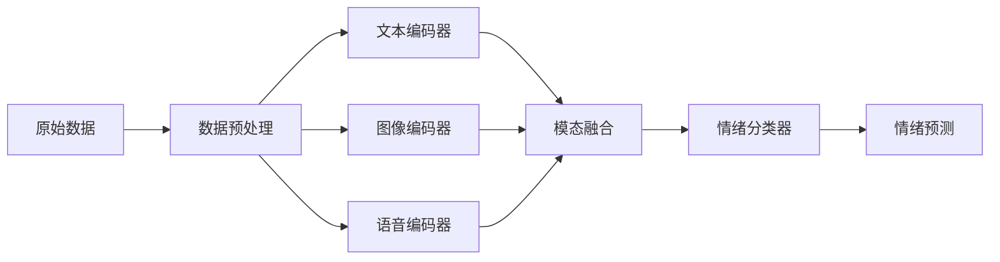

# 多模态大模型：技术原理与实战 多模态大模型在情绪识别领域的应用

## 1.背景介绍

### 1.1 情绪识别的重要性

情绪识别是人工智能领域中一个极具挑战的任务,它旨在自动检测和识别人类的情绪状态。准确的情绪识别对于构建人机交互系统、提供个性化服务以及理解人类行为至关重要。在诸多应用场景中,如客户服务、心理健康、教育、娱乐等,情绪识别扮演着关键角色。

### 1.2 传统方法的局限性

传统的情绪识别方法主要依赖于单一模态数据,如文本、语音或面部表情。然而,人类情绪往往是多模态的,单一模态数据难以全面捕捉情绪的丰富信息。此外,这些方法通常需要手工设计特征,且难以处理复杂的情况。

### 1.3 多模态大模型的优势

近年来,多模态大模型凭借其强大的表示能力和泛化性能,为情绪识别任务带来了新的契机。这些模型能够同时处理多种模态数据,如文本、图像、语音等,并自动学习数据中隐藏的特征模式。多模态大模型展现出卓越的性能,为情绪识别提供了更准确、更鲁棒的解决方案。

## 2.核心概念与联系

### 2.1 多模态学习

多模态学习旨在从不同模态的数据中学习知识表示,并利用这些表示完成各种任务。它涉及多个模态之间的交互和融合,以捕获数据的内在关联。在情绪识别中,多模态学习可以同时利用文本、语音、面部表情等模态,提高情绪检测的准确性。

### 2.2 大模型

大模型指具有数十亿甚至上万亿参数的深度神经网络模型。这些模型通过在大规模数据集上进行预训练,学习到丰富的知识表示。由于其强大的表示能力和泛化性能,大模型在自然语言处理、计算机视觉等多个领域展现出卓越的性能。

### 2.3 多模态大模型

多模态大模型是将多模态学习与大模型相结合的创新方法。它们能够同时处理多种模态数据,并利用大量参数和预训练技术学习到强大的跨模态表示。这些表示能够捕捉数据中的丰富语义信息,为下游任务(如情绪识别)提供有力支持。



## 3.核心算法原理具体操作步骤

多模态大模型在情绪识别任务中的核心算法原理可以概括为以下几个关键步骤:

### 3.1 数据预处理

首先需要对不同模态的原始数据进行预处理,以便模型能够有效地处理。对于文本数据,可以使用标记化、填充等技术将其转换为模型可以接受的形式。对于图像数据,可以进行缩放、归一化等操作。对于语音数据,可以提取梅尔频率倒谱系数(MFCC)等特征。

### 3.2 模态编码

接下来,将预处理后的数据输入到相应的编码器中,用于提取每个模态的特征表示。常见的编码器包括:

- 文本编码器:如BERT、RoBERTa等自然语言预训练模型
- 图像编码器:如VGG、ResNet等卷积神经网络
- 语音编码器:如TDNN、LSTM等序列模型

这些编码器通过自注意力机制或卷积操作,学习到各模态的高级语义表示。

### 3.3 模态融合

为了捕捉不同模态之间的相互作用,需要将各模态的特征表示进行融合。常见的融合策略包括:

- 特征拼接:将不同模态的特征向量拼接在一起
- 外积融合:对不同模态的特征向量进行外积运算
- 注意力融合:使用自注意力机制动态地融合不同模态的特征

融合后的表示能够捕捉模态间的相关性,为下游任务提供更丰富的信息。

### 3.4 情绪分类

最后,将融合后的多模态表示输入到分类器中,得到情绪类别的预测结果。分类器可以是全连接层、注意力池化层等。在训练阶段,通过最小化分类损失函数(如交叉熵损失)来优化模型参数。



## 4.数学模型和公式详细讲解举例说明

在多模态大模型中,数学模型和公式扮演着重要角色,用于描述模型的结构和计算过程。以下是一些核心公式及其详细解释:

### 4.1 自注意力机制

自注意力机制是transformer模型中的关键组件,它能够捕捉输入序列中元素之间的长程依赖关系。对于查询向量 $\boldsymbol{q}$、键向量 $\boldsymbol{K}$ 和值向量 $\boldsymbol{V}$,自注意力的计算公式如下:

$$\mathrm{Attention}(\boldsymbol{Q}, \boldsymbol{K}, \boldsymbol{V}) = \mathrm{softmax}\left(\frac{\boldsymbol{Q}\boldsymbol{K}^\top}{\sqrt{d_k}}\right)\boldsymbol{V}$$

其中,$ \boldsymbol{Q} $、$ \boldsymbol{K} $和 $\boldsymbol{V}$ 分别是查询、键和值的矩阵表示, $d_k$ 是键向量的维度。自注意力机制通过计算查询与键的相似性,动态地为值向量分配注意力权重,从而捕捉输入序列中的重要信息。

### 4.2 外积融合

外积融合是一种有效的多模态融合策略,它能够捕捉不同模态之间的交互关系。给定两个模态的特征向量 $\boldsymbol{x}_1$ 和 $\boldsymbol{x}_2$,外积融合的计算公式为:

$$\boldsymbol{z} = \boldsymbol{x}_1 \otimes \boldsymbol{x}_2$$

其中, $\otimes$ 表示外积运算。外积融合的结果 $\boldsymbol{z}$ 是一个矩阵,它包含了两个模态之间所有元素的乘积组合。通过对这个矩阵进行进一步处理,如池化或投影,可以得到融合后的多模态表示。

### 4.3 交叉熵损失函数

在情绪分类任务中,常用的损失函数是交叉熵损失。假设有 $N$ 个样本,每个样本有 $C$ 个情绪类别,真实标签为 $\boldsymbol{y} = (y_1, y_2, \ldots, y_N)$,模型预测的概率分布为 $\boldsymbol{\hat{y}} = (\hat{y}_1, \hat{y}_2, \ldots, \hat{y}_N)$,则交叉熵损失函数定义为:

$$\mathcal{L}(\boldsymbol{y}, \boldsymbol{\hat{y}}) = -\frac{1}{N}\sum_{i=1}^N\sum_{c=1}^C y_{ic}\log\hat{y}_{ic}$$

其中, $y_{ic}$ 表示第 $i$ 个样本属于第 $c$ 类的真实标签(0或1), $\hat{y}_{ic}$ 表示模型预测的第 $i$ 个样本属于第 $c$ 类的概率。在训练过程中,通过最小化这个损失函数,可以使模型的预测结果逐渐接近真实标签。

以上公式展示了多模态大模型中一些核心的数学模型和计算过程。通过这些公式,模型能够有效地融合不同模态的信息,并学习到强大的跨模态表示,从而提高情绪识别的准确性。

## 5.项目实践:代码实例和详细解释说明

为了更好地理解多模态大模型在情绪识别任务中的应用,我们将提供一个基于PyTorch的代码实例,并对其进行详细解释。

### 5.1 数据准备

首先,我们需要准备包含文本、图像和语音的多模态数据集。为简单起见,这里我们使用一个小型的情绪数据集IEMOCAP。数据集包含对话视频,我们可以从中提取文本转录、面部图像和语音特征。

```python
from datasets import load_dataset

dataset = load_dataset("craic/iemocap_utterance_dataset")
```

### 5.2 模态编码器

接下来,我们定义用于编码不同模态数据的编码器。

```python
import torch.nn as nn

class TextEncoder(nn.Module):
    def __init__(self, embed_dim, hidden_dim, num_layers):
        super().__init__()
        self.embedding = nn.Embedding(vocab_size, embed_dim)
        self.rnn = nn.LSTM(embed_dim, hidden_dim, num_layers, batch_first=True)

    def forward(self, text):
        embedded = self.embedding(text)
        _, (hidden, _) = self.rnn(embedded)
        return hidden[-1]

class ImageEncoder(nn.Module):
    def __init__(self):
        super().__init__()
        self.conv = nn.Sequential(
            nn.Conv2d(3, 32, kernel_size=3, padding=1),
            nn.ReLU(),
            nn.MaxPool2d(2, 2),
            nn.Conv2d(32, 64, kernel_size=3, padding=1),
            nn.ReLU(),
            nn.MaxPool2d(2, 2),
        )
        self.fc = nn.Linear(64 * 8 * 8, 512)

    def forward(self, images):
        x = self.conv(images)
        x = x.view(x.size(0), -1)
        x = self.fc(x)
        return x

class AudioEncoder(nn.Module):
    def __init__(self, input_dim, hidden_dim, num_layers):
        super().__init__()
        self.rnn = nn.LSTM(input_dim, hidden_dim, num_layers, batch_first=True)

    def forward(self, audio):
        _, (hidden, _) = self.rnn(audio)
        return hidden[-1]
```

在这个示例中,我们使用LSTM作为文本编码器,卷积神经网络作为图像编码器,另一个LSTM作为语音编码器。这些编码器将输入的文本、图像和语音数据转换为对应的特征向量表示。

### 5.3 模态融合和情绪分类

接下来,我们定义用于融合多模态特征并进行情绪分类的模块。

```python
class MultimodalFusion(nn.Module):
    def __init__(self, text_dim, image_dim, audio_dim, fusion_dim, num_classes):
        super().__init__()
        self.text_fc = nn.Linear(text_dim, fusion_dim)
        self.image_fc = nn.Linear(image_dim, fusion_dim)
        self.audio_fc = nn.Linear(audio_dim, fusion_dim)
        self.fusion = nn.Linear(fusion_dim * 3, fusion_dim)
        self.classifier = nn.Linear(fusion_dim, num_classes)

    def forward(self, text_feat, image_feat, audio_feat):
        text_feat = self.text_fc(text_feat)
        image_feat = self.image_fc(image_feat)
        audio_feat = self.audio_fc(audio_feat)
        fused_feat = torch.cat([text_feat, image_feat, audio_feat], dim=-1)
        fused_feat = self.fusion(fused_feat)
        logits = self.classifier(fused_feat)
        return logits
```

在这个示例中,我们使用特征拼接的方式进行模态融合。首先,将每个模态的特征向量投影到相同的维度,然后将它们拼接在一起。接着,通过一个全连接层对拼接后的特征进行融合,最后使用另一个全连接层作为分类器,输出情绪类别的预测结果。

### 5.4 模型训练和评估

最后,我们构建完整的多模态模型,并进行训练和评估。

```python
import torch.optim as optim

text_encoder = TextEncoder(embed_dim, hidden_dim, num_layers)
image_encoder = ImageEncoder()
audio_encoder = AudioEncoder(input_dim, hidden_dim, num_layers)
fusion_model = MultimodalFusion(text_dim, image_dim, audio_dim, fusion_dim, num_classes)

criterion = nn.CrossEntropyLoss()
optimizer = optim.Adam(list(text_encoder.parameters